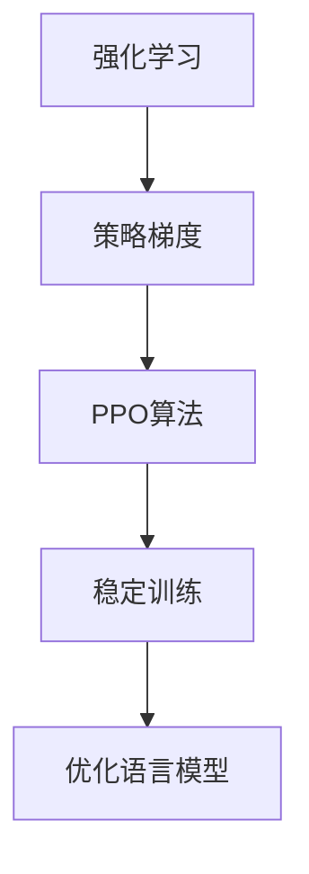

# 大规模语言模型从理论到实践 近端策略优化

## 1.背景介绍

### 1.1 人工智能的崛起

人工智能(AI)在过去几十年中取得了长足的进步,尤其是在自然语言处理(NLP)领域。大规模语言模型的出现,使得机器能够更好地理解和生成自然语言,极大地推动了人工智能的发展。

### 1.2 大规模语言模型的重要性

大规模语言模型通过在海量文本数据上训练,学习到了丰富的语言知识和上下文信息。这使得它们能够生成流畅、连贯的自然语言输出,并在各种自然语言处理任务中表现出色,如机器翻译、问答系统、文本摘要等。

### 1.3 近端策略优化的兴起

尽管大规模语言模型取得了巨大成功,但它们在生成长文本时仍然存在一些问题,如前后不连贯、缺乏逻辑等。为了解决这些问题,近端策略优化(Proximal Policy Optimization, PPO)应运而生。

## 2.核心概念与联系

### 2.1 强化学习与策略梯度

PPO源于强化学习领域,其核心思想是通过策略梯度方法来优化智能体的策略函数,使其在给定环境中获得最大的期望回报。

### 2.2 PPO算法

PPO算法是一种改进的策略梯度方法,它通过限制新旧策略之间的差异来实现更稳定的训练过程。具体来说,PPO在每一次更新时,都会约束新策略与旧策略之间的比值,使其落在一个合理的范围内。



### 2.3 PPO在语言模型中的应用

将PPO应用于语言模型的训练过程中,可以使生成的文本更加连贯、逻辑性更强。具体来说,我们将语言模型视为一个智能体,其环境是已生成的文本,动作是选择下一个单词。通过优化策略函数,语言模型可以学习到生成高质量文本的策略。

## 3.核心算法原理具体操作步骤

### 3.1 PPO算法流程

1. 初始化策略函数 $\pi_\theta(a|s)$ 和值函数 $V_\phi(s)$,其中 $\theta$ 和 $\phi$ 分别表示策略网络和值网络的参数。
2. 在环境中采集一批轨迹数据 $\{(s_t, a_t, r_t)\}$。
3. 计算每个时间步的优势估计值 $\hat{A}_t$,通常使用广义优势估计(GAE)方法。
4. 更新策略网络参数 $\theta$:
   - 计算新旧策略之间的比值: $r_t(\theta) = \frac{\pi_\theta(a_t|s_t)}{\pi_{\theta_{old}}(a_t|s_t)}$
   - 计算近端策略目标函数: $L^{CLIP}(\theta) = \hat{E}_t[\min(r_t(\theta)\hat{A}_t, \text{clip}(r_t(\theta), 1-\epsilon, 1+\epsilon)\hat{A}_t)]$
   - 使用策略梯度方法更新 $\theta$,最大化 $L^{CLIP}(\theta)$
5. 更新值网络参数 $\phi$,最小化 $\hat{E}_t[(V_\phi(s_t) - V_{\text{target}}(s_t))^2]$,其中 $V_{\text{target}}$ 是通过 $\hat{A}_t$ 和折扣回报计算得到的目标值。
6. 重复步骤2-5,直到策略收敛。

### 3.2 PPO超参数

PPO算法中有几个重要的超参数需要设置:

- $\epsilon$: 限制新旧策略比值的范围,通常取值在 [0.1, 0.3]。
- $\lambda$: GAE的截断参数,控制偏差和方差的权衡。
- 学习率: 策略网络和值网络的学习率。
-批大小: 每次更新时使用的轨迹数据量。
- epoch数: 每次更新时,对相同批数据的迭代次数。

## 4.数学模型和公式详细讲解举例说明

### 4.1 策略梯度定理

策略梯度方法的核心是策略梯度定理,它给出了最大化期望回报的策略梯度:

$$\nabla_\theta J(\theta) = \mathbb{E}_{\pi_\theta}[\nabla_\theta \log \pi_\theta(a|s)Q^{\pi_\theta}(s, a)]$$

其中 $Q^{\pi_\theta}(s, a)$ 是在策略 $\pi_\theta$ 下的状态-动作值函数。这个梯度可以通过蒙特卡罗方法来估计。

### 4.2 广义优势估计(GAE)

GAE是一种估计优势函数 $A^\pi(s, a) = Q^\pi(s, a) - V^\pi(s)$ 的方法,它通过引入一个参数 $\lambda$ 来权衡偏差和方差:

$$\hat{A}_t = \sum_{l=0}^{\infty}(\gamma\lambda)^l\delta_{t+l}^V$$

其中 $\delta_t^V = r_t + \gamma V(s_{t+1}) - V(s_t)$ 是时间差分误差,用于估计优势函数。当 $\lambda=0$ 时,GAE等价于一步时间差分;当 $\lambda=1$ 时,GAE等价于蒙特卡罗估计。

### 4.3 PPO目标函数

PPO算法的目标函数是:

$$L^{CLIP}(\theta) = \hat{E}_t[\min(r_t(\theta)\hat{A}_t, \text{clip}(r_t(\theta), 1-\epsilon, 1+\epsilon)\hat{A}_t)]$$

其中 $r_t(\theta) = \frac{\pi_\theta(a_t|s_t)}{\pi_{\theta_{old}}(a_t|s_t)}$ 是新旧策略之间的比值。通过 clip 操作,PPO限制了新旧策略之间的差异,从而实现了更稳定的训练过程。

## 5.项目实践:代码实例和详细解释说明

以下是一个使用PyTorch实现的PPO算法示例,用于训练一个语言模型生成文本。

```python
import torch
import torch.nn as nn
from torch.distributions import Categorical

# 定义策略网络
class PolicyNet(nn.Module):
    def __init__(self, vocab_size, hidden_size):
        super(PolicyNet, self).__init__()
        self.embedding = nn.Embedding(vocab_size, hidden_size)
        self.lstm = nn.LSTM(hidden_size, hidden_size)
        self.fc = nn.Linear(hidden_size, vocab_size)

    def forward(self, x, hidden):
        x = self.embedding(x)
        x, hidden = self.lstm(x, hidden)
        x = self.fc(x)
        return x, hidden

# 定义值网络
class ValueNet(nn.Module):
    def __init__(self, vocab_size, hidden_size):
        super(ValueNet, self).__init__()
        self.embedding = nn.Embedding(vocab_size, hidden_size)
        self.lstm = nn.LSTM(hidden_size, hidden_size)
        self.fc = nn.Linear(hidden_size, 1)

    def forward(self, x, hidden):
        x = self.embedding(x)
        x, hidden = self.lstm(x, hidden)
        x = self.fc(x)
        return x, hidden

# PPO算法实现
def ppo_train(policy_net, value_net, env, num_epochs, batch_size, epsilon=0.2, gamma=0.99, lam=0.95):
    policy_optimizer = torch.optim.Adam(policy_net.parameters())
    value_optimizer = torch.optim.Adam(value_net.parameters())

    for epoch in range(num_epochs):
        trajectories = []
        hidden = (torch.zeros(1, 1, 64), torch.zeros(1, 1, 64))

        # 采集轨迹数据
        for _ in range(batch_size):
            states, actions, rewards, values, log_probs = [], [], [], [], []
            state = env.reset()
            done = False

            while not done:
                state_tensor = torch.tensor(state).unsqueeze(0).unsqueeze(0)
                policy_output, hidden = policy_net(state_tensor, hidden)
                value, _ = value_net(state_tensor, hidden)
                action_dist = Categorical(logits=policy_output.squeeze(0))
                action = action_dist.sample()
                log_prob = action_dist.log_prob(action)

                next_state, reward, done, _ = env.step(action.item())

                states.append(state)
                actions.append(action)
                rewards.append(reward)
                values.append(value.squeeze(0))
                log_probs.append(log_prob)

                state = next_state

            trajectories.append((states, actions, rewards, values, log_probs))

        # 计算优势估计值
        advantages = []
        for states, _, rewards, values, _ in trajectories:
            returns = []
            advantage = 0
            for t in reversed(range(len(rewards))):
                reward = rewards[t]
                value = values[t]
                returns.append(reward + gamma * advantage)
                advantage = reward + gamma * value.detach() - value.detach()
                advantage = lam * gamma * advantage
            returns = returns[::-1]
            advantages.extend(returns[:-1])

        # 更新策略网络
        policy_losses = []
        for states, actions, _, _, log_probs in trajectories:
            policy_loss = 0
            for state, action, log_prob, advantage in zip(states, actions, log_probs, advantages):
                state_tensor = torch.tensor(state).unsqueeze(0).unsqueeze(0)
                policy_output, _ = policy_net(state_tensor, hidden)
                action_dist = Categorical(logits=policy_output.squeeze(0))
                new_log_prob = action_dist.log_prob(action)
                ratio = (new_log_prob - log_prob).exp()
                clipped_ratio = torch.clamp(ratio, 1 - epsilon, 1 + epsilon)
                policy_loss += -torch.min(ratio * advantage, clipped_ratio * advantage).mean()
            policy_losses.append(policy_loss)
        policy_loss = sum(policy_losses) / len(policy_losses)
        policy_optimizer.zero_grad()
        policy_loss.backward()
        policy_optimizer.step()

        # 更新值网络
        value_losses = []
        for states, _, rewards, _, _ in trajectories:
            returns = []
            return_so_far = 0
            for reward in reversed(rewards):
                return_so_far = reward + gamma * return_so_far
                returns.append(return_so_far)
            returns = returns[::-1]
            value_loss = 0
            for state, return_value in zip(states, returns):
                state_tensor = torch.tensor(state).unsqueeze(0).unsqueeze(0)
                value, _ = value_net(state_tensor, hidden)
                value_loss += (value.squeeze(0) - return_value) ** 2
            value_losses.append(value_loss)
        value_loss = sum(value_losses) / len(value_losses)
        value_optimizer.zero_grad()
        value_loss.backward()
        value_optimizer.step()

# 初始化环境和网络
env = TextGenerationEnv(...)
policy_net = PolicyNet(vocab_size, hidden_size)
value_net = ValueNet(vocab_size, hidden_size)

# 训练模型
ppo_train(policy_net, value_net, env, num_epochs=10, batch_size=32)
```

在这个示例中,我们定义了策略网络和值网络,分别用于生成文本和估计状态值函数。PPO算法的核心部分在 `ppo_train` 函数中实现。

首先,我们采集一批轨迹数据,包括状态、动作、回报、状态值和对数概率。然后,我们使用广义优势估计(GAE)计算每个时间步的优势估计值。

接下来,我们更新策略网络。我们计算新旧策略之间的比值,并使用 PPO 目标函数进行优化。通过 clip 操作,我们限制了新旧策略之间的差异,从而实现了更稳定的训练过程。

最后,我们更新值网络。我们计算每个状态的期望回报,并将其与值网络的输出进行比较,最小化均方误差。

通过这种方式,我们可以使用 PPO 算法训练一个大规模语言模型,使其能够生成更加连贯、逻辑性更强的文本。

## 6.实际应用场景

PPO在语言模型领域有着广泛的应用前景,包括但不限于:

### 6.1 对话系统

对话系统需要生成自然、连贯的响应,以更好地与用户交互。使用 PPO 训练的语言模型可以提高对话质量,使对话更加流畅、有逻辑。

### 6.2 文本生成

无论是新闻报道、小说创作还是广告文案,都需要生成高质量的文本。PPO 可以帮助语言模型生成更加连贯、逻辑性更强的长文本。

### 6.3 机器翻译

机器翻译系统需要生成目标语言的流畅句子。使用 PPO 优化的语言模型可以提高翻译质量,减少语法错