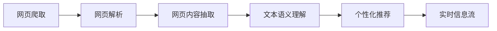

# 大语言模型应用指南：网页实时浏览

## 1.背景介绍

近年来,随着深度学习技术的飞速发展,大语言模型(Large Language Models,LLMs)在自然语言处理领域取得了突破性的进展。LLMs 通过在海量文本数据上进行无监督预训练,能够学习到丰富的语言知识和语义表示,在机器翻译、文本摘要、问答系统等多个任务上取得了优异的表现。

而随着 LLMs 的不断发展和完善,它们在更多实际应用场景中得到应用,其中一个重要的方向就是利用 LLMs 对网页内容进行实时分析和处理。通过对网页文本、图片、视频等多模态信息的理解和抽取,LLMs 可以帮助我们更高效地获取网页中的关键信息,改善浏览体验。本文将重点探讨如何利用大语言模型实现网页实时浏览的功能,分享相关的算法原理、工程实践经验,并展望其未来的发展趋势与挑战。

### 1.1 大语言模型的发展历程
#### 1.1.1 Transformer 的提出
#### 1.1.2 GPT 系列模型
#### 1.1.3 BERT 及其变体

### 1.2 大语言模型的关键特点
#### 1.2.1 强大的语言理解和生成能力
#### 1.2.2 少样本学习能力
#### 1.2.3 多任务迁移学习能力

### 1.3 网页实时浏览的需求与挑战
#### 1.3.1 海量异构网页数据
#### 1.3.2 实时性要求
#### 1.3.3 个性化需求

## 2.核心概念与联系

要实现利用大语言模型进行网页实时浏览,需要理解以下几个核心概念:

### 2.1 网页解析与信息提取
网页是由 HTML、CSS、JavaScript 等构成的结构化文档。网页解析就是从原始的网页源码中提取出有用的文本、链接、图片等信息,转化为结构化的数据表示。常见的网页解析方法包括:
- 基于规则的方法:通过编写正则表达式等规则,匹配并提取目标信息
- 基于 DOM 树的方法:将 HTML 解析为 DOM 树,通过遍历 DOM 节点提取信息
- 基于机器学习的方法:训练分类器识别不同类别的网页元素

### 2.2 网页内容理解与抽取
网页内容理解是指从网页中提取的原始文本数据出发,利用自然语言处理技术分析其语义内容,包括:
- 命名实体识别:识别出人名、地名、机构名等特定类型的实体词
- 关键词提取:提取出最能表达网页主题的关键词
- 文本摘要:生成简洁的文本摘要,概括网页的核心内容
- 情感分析:判断网页文本所表达的情感倾向,如积极、消极等

### 2.3 个性化信息流推荐
个性化信息流推荐是根据用户的兴趣特征,从海量的网页库中筛选出用户可能感兴趣的内容,构建个性化的信息流,提高用户的浏览效率。常见的个性化推荐算法包括:
- 协同过滤:基于用户或物品的相似性,为用户推荐相似用户喜欢的物品
- 基于内容的推荐:根据物品的内容特征,推荐与用户历史喜好相似的物品
- 组合推荐:结合协同过滤和基于内容的推荐,同时利用用户行为和物品内容信息

下图展示了网页实时浏览的核心模块与流程:



## 3.核心算法原理具体操作步骤

接下来,我们详细介绍利用大语言模型实现网页实时浏览的核心算法原理和具体操作步骤。

### 3.1 基于规则的网页解析算法
基于规则的网页解析通过编写一系列的正则表达式匹配规则,提取网页中的目标信息。以提取网页中的文章标题为例:

1. 定义正则表达式规则,如 `<h1>(.*?)</h1>` 匹配 h1 标签内的文本内容
2. 利用正则表达式对网页 HTML 源码进行匹配
3. 提取出匹配的目标字符串作为文章标题

优点是实现简单、解析速度快,缺点是对网页结构变化敏感,泛化能力差。

### 3.2 基于 DOM 树的网页解析算法
DOM(Document Object Model)是 HTML 源码解析后得到的一棵树形结构,每个 HTML 标签都是 DOM 树上的一个节点。基于 DOM 树的网页解析步骤如下:

1. 利用 HTML 解析器如 jsoup,将 HTML 源码解析为 DOM 树
2. 从根节点出发,通过深度优先或广度优先搜索遍历 DOM 树
3. 根据预定义的提取规则,如提取 `<p>` 标签下的文本作为正文,提取目标信息
4. 对提取的目标信息进行后处理,如去除冗余标签、空白字符等

相比正则表达式匹配,基于 DOM 树的方法更加健壮,不易受网页小的结构变化的影响。

### 3.3 命名实体识别算法
命名实体识别(Named Entity Recognition,NER)是从文本中识别出人名、地名、机构名、时间日期等特定类型实体词的任务。传统的 NER 方法多为基于规则或机器学习的方法,如条件随机场(CRF)。而利用预训练的大语言模型如 BERT,可以实现更加准确、鲁棒的 NER。

基于 BERT 的 NER 算法步骤如下:

1. 在大规模语料上预训练 BERT 模型,学习通用的语言表示
2. 在 NER 数据集上 fine-tune BERT 模型,学习 NER 任务的分类器
3. 对目标网页文本进行预处理,如分句、分词等
4. 将处理后的文本输入到 fine-tuned 的 BERT 模型中,提取每个词的特征表示
5. 利用学习到的 NER 分类器预测每个词的实体标签
6. 对预测结果进行后处理,如修正实体边界、过滤噪声实体等

### 3.4 文本摘要算法
文本摘要任务是从冗长的文本中提取或生成简短的摘要,同时保留原文的主要信息。基于大语言模型的抽取式摘要和生成式摘要都取得了不错的效果。

以生成式摘要为例,利用 GPT 模型的生成能力,可以训练一个摘要生成器:

1. 在大规模语料上预训练 GPT 模型
2. 在摘要数据集上 fine-tune GPT 模型,学习从文章生成摘要的能力
3. 对目标网页正文进行预处理,如分句、截断等
4. 将处理后的正文输入到 fine-tuned 的 GPT 模型中,解码生成摘要
5. 对生成的摘要进行后处理,如去除重复语句,控制摘要长度等

### 3.5 个性化推荐算法
个性化推荐算法可以根据用户的历史浏览行为、搜索词等,从海量的网页库中筛选出用户可能感兴趣的网页。以协同过滤算法为例:

1. 收集用户的浏览、点击、收藏等行为数据,构建用户-物品评分矩阵
2. 利用用户或物品的相似性度量,计算用户或物品的相似性矩阵
3. 根据相似性矩阵,计算用户对未评分物品的预测评分
4. 为每个用户生成 Top-N 推荐列表,其中包含预测评分最高的 N 个物品

## 4.数学模型和公式详细讲解举例说明

本节我们通过一个具体的数学模型——word2vec,来说明大语言模型中词嵌入的学习原理。

Word2vec 是一种经典的神经网络词嵌入模型,可以学习单词的低维稠密向量表示,词向量之间的距离可以反映单词之间的语义相似性。Word2vec 模型主要包含两种架构:CBOW(Continuous Bag-of-Words)和 Skip-gram。

以 CBOW 为例,其目标是根据中心词 $w_t$ 的上下文单词 $w_{t-2},w_{t-1},w_{t+1},w_{t+2}$ 来预测中心词。假设词表大小为 $V$,词向量维度为 $d$,CBOW 模型的主要参数有:

- 输入词矩阵 $W_{V×d}$:每一行是一个 $d$ 维的词向量
- 输出词矩阵 $W′_{d×V}$:每一列是一个 $d$ 维的词向量

对于一个长度为 $T$ 的文本序列,CBOW 模型的前向传播过程为:

1. 输入层:将上下文单词 $w_{t-2},w_{t-1},w_{t+1},w_{t+2}$ 的 one-hot 向量表示(维度为 $V$)映射为词向量(维度为 $d$),词向量可以通过查询输入词矩阵 $W$ 得到

$$e=W^{\top}x$$

其中 $x$ 为上下文单词的 one-hot 向量,$e$ 为对应的词向量。

2. 投影层:将上下文单词的词向量求平均,得到中心词的投影向量 $h$(维度为 $d$)

$$h=\frac{1}{2c}\sum_{i=1}^{2c}e_i$$

其中 $c$ 为上下文窗口大小。

3. 输出层:将中心词的投影向量 $h$ 通过矩阵 $W′$ 映射为输出向量 $y$(维度为 $V$),再通过 softmax 函数转化为中心词的概率分布

$$y=W′^{\top}h$$
$$p(w_t|w_{t-2},w_{t-1},w_{t+1},w_{t+2})=\text{softmax}(y)$$

其中 softmax 函数定义为:

$$\text{softmax}(y_i)=\frac{e^{y_i}}{\sum_{j=1}^V e^{y_j}}$$

CBOW 模型的目标是最大化中心词 $w_t$ 的条件概率,因此损失函数定义为:

$$\mathcal{L}=-\log p(w_t|w_{t-2},w_{t-1},w_{t+1},w_{t+2})$$

通过随机梯度下降等优化算法最小化损失函数,不断更新词向量矩阵 $W$ 和 $W′$,最终得到高质量的词嵌入表示。

## 5.项目实践：代码实例和详细解释说明

下面我们通过一个简单的 Python 代码实例,演示如何利用预训练的 BERT 模型进行命名实体识别。

首先安装所需的库:
```python
!pip install transformers torch
```

加载预训练的 BERT 模型和分词器:
```python
from transformers import BertTokenizer, BertForTokenClassification
import torch

model = BertForTokenClassification.from_pretrained('bert-base-cased', num_labels=5)
tokenizer = BertTokenizer.from_pretrained('bert-base-cased')
```

其中 `num_labels` 设置为 5,代表要识别的实体类型数(含 O)。

定义要识别的目标文本和标签映射:
```python
text = "Bill Gates is the founder of Microsoft."
label_map = {0: 'O', 1: 'B-PER', 2: 'I-PER', 3: 'B-ORG', 4: 'I-ORG'}
```

对目标文本进行预处理,转化为 BERT 模型接受的输入格式:
```python
tokens = tokenizer.tokenize(text)
token_ids = tokenizer.convert_tokens_to_ids(tokens)
input_ids = torch.tensor([tokenizer.encode(text, add_special_tokens=True)])
```

将输入送入 BERT 模型,得到每个词的预测标签:
```python
with torch.no_grad():
    outputs = model(input_ids)
    predictions = outputs[0].argmax(-1)

predicted_labels = [label_map[label_id] for label_id in predictions[0].tolist()]
```

最后对预测结果进行后处理,得到识别出的命名实体:
```python
print(list(zip(tokens, predicted_labels)))

entities = []