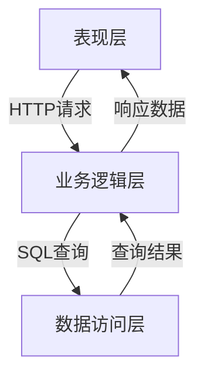

# 学校信息管理系统详细设计与具体代码实现

## 1.背景介绍

### 1.1 学校信息管理系统概述

在当今信息化时代,学校信息管理系统(School Information Management System,SIMS)已经成为现代化学校管理的重要工具。SIMS是一种基于计算机网络技术,集成了学校各项业务管理功能的综合信息系统。它涵盖了学生信息管理、教职工信息管理、教务管理、科研管理、资产管理、财务管理等多个模块,为学校的日常运营和决策提供了有力支持。

### 1.2 系统建设的必要性

传统的纸质档案管理方式已经无法满足现代化学校管理的需求,存在着信息孤岛、数据冗余、工作效率低下等诸多弊端。建设SIMS可以实现学校各部门数据的共享和集成,提高工作效率,为领导决策提供数据支持,促进学校现代化管理水平的提升。

### 1.3 系统设计与实现的挑战

SIMS的设计和实现需要解决以下几个关键挑战:

1. 系统架构设计
2. 数据库设计与数据集成
3. 用户界面设计
4. 系统安全与权限管理
5. 并发访问控制
6. 灵活的系统扩展性

## 2.核心概念与联系

### 2.1 三层架构

SIMS通常采用经典的三层架构模式,即表现层(Presentation Layer)、业务逻辑层(Business Logic Layer)和数据访问层(Data Access Layer)。



- **表现层**:负责与用户交互,接收用户请求并显示处理结果,通常采用Web界面或移动应用界面。
- **业务逻辑层**:处理具体的业务逻辑,如学生信息管理、成绩管理等,作为系统的核心部分。
- **数据访问层**:负责与数据库进行交互,执行数据查询、插入、更新和删除操作。

### 2.2 系统模块划分

SIMS通常包括以下几个核心模块:

- **学生信息管理模块**:维护学生的基本信息、学籍信息、成绩信息等。
- **教职工信息管理模块**:维护教师和职工的基本信息、职称信息、工资信息等。
- **教务管理模块**:管理课程安排、教学计划、考试安排、选课等事务。
- **科研管理模块**:管理科研项目、论文发表、专利申请等信息。
- **资产管理模块**:管理学校的固定资产、实验室设备等。
- **财务管理模块**:管理学校的收支情况、报销申请等。

### 2.3 数据库设计

SIMS需要设计一个关系型数据库,用于存储各种业务数据。数据库通常包括以下几个核心表:

- 学生表
- 教师表
- 课程表
- 成绩表
- 资产表
- 财务表

这些表之间存在着各种关联关系,如学生与成绩的一对多关系、教师与课程的多对多关系等。合理的数据库设计是系统正常运行的基础。

## 3.核心算法原理具体操作步骤  

### 3.1 用户认证算法

用户认证是SIMS的基础功能,它保证了系统的安全性。常用的用户认证算法有:

1. **密码哈希算法**

   $$
   hash = H(password \| salt)
   $$

   其中$H$是单向哈希函数(如SHA-256),$salt$是随机生成的字符串,用于防止彩虹表攻击。

2. **基于Token的认证**

   ```mermaid
   sequenceDiagram
      participant C as 客户端
      participant S as 服务器
      C->>S: 用户名密码
      S-->>C: 访问令牌Token
      C->>S: 携带Token访问
      S-->>C: 响应数据
   ```

   服务器验证用户名密码后,生成一个有效期的Token返回给客户端,客户端后续请求需携带Token进行身份验证。

### 3.2 并发控制算法

多个用户同时访问系统时,需要保证数据的一致性。常用的并发控制算法有:

1. **乐观并发控制** 

   在更新数据时,检查数据是否被其他事务修改,如果没有则更新,否则返回错误。适合读操作多于写操作的场景。

2. **悲观并发控制**

   在读取数据时,对数据加锁,直到事务结束后释放锁。适合写操作多于读操作的场景。

### 3.3 查询优化算法

为了提高查询效率,需要对SQL查询进行优化,常用的算法有:

1. **索引优化**

   为经常作为查询条件的列创建索引,提高查询速度。

2. **分页查询**

   ```sql
   SELECT * FROM table
   ORDER BY id
   LIMIT start, count;
   ```

   对于大量数据的查询,采用分页查询,每次只返回一部分数据,提高响应速度。

3. **缓存查询结果**

   对于不常变化的数据,可以将查询结果缓存,避免重复查询数据库。

## 4.数学模型和公式详细讲解举例说明

### 4.1 学生成绩计算模型

学生的最终成绩通常由平时分、期中考试分和期末考试分组成,可以用加权平均的方式计算:

$$
\begin{aligned}
finalScore &= usualScore \times w_1 + midtermScore \times w_2 + finalExamScore \times w_3\\
&\text{其中 } w_1 + w_2 + w_3 = 1
\end{aligned}
$$

其中$w_1,w_2,w_3$分别为平时分、期中分和期末分的权重系数,可由教师根据实际情况设置。

### 4.2 资产折旧计算模型

对于学校的固定资产,需要计算其折旧费用。常用的折旧计算模型有:

1. **直线折旧法**

   $$
   D = \frac{C - S}{n}
   $$

   其中$D$为年折旧额,$C$为资产原值,$S$为资产残值,$n$为预计使用年限。

2. **双倍余额递减法**

   $$
   D_n = 2 \times \frac{C}{n} \times \left( 1 - \frac{n-1}{n} \right)^{n-1}
   $$

   其中$D_n$为第$n$年的折旧额,$C$为资产原值,$n$为预计使用年限。

根据实际情况,可选择合适的折旧计算模型。

## 5.项目实践:代码实例和详细解释说明

### 5.1 用户认证模块

以下是基于Token的用户认证模块的实现示例(使用Python的Flask框架):

```python
from flask import Flask, request, jsonify
import jwt
import datetime

app = Flask(__name__)
app.config['SECRET_KEY'] = 'your_secret_key'

# 模拟用户数据
users = {
    'admin': 'password'
}

# 生成Token
def generate_token(username):
    payload = {
        'username': username,
        'exp': datetime.datetime.utcnow() + datetime.timedelta(hours=1)
    }
    token = jwt.encode(payload, app.config['SECRET_KEY'], algorithm='HS256')
    return token

# 验证Token
def verify_token(token):
    try:
        payload = jwt.decode(token, app.config['SECRET_KEY'], algorithms=['HS256'])
        username = payload['username']
        return username
    except jwt.ExpiredSignatureError:
        return 'Token expired'
    except jwt.InvalidTokenError:
        return 'Invalid token'

# 登录接口
@app.route('/login', methods=['POST'])
def login():
    data = request.get_json()
    username = data['username']
    password = data['password']
    if username in users and users[username] == password:
        token = generate_token(username)
        return jsonify({'token': token})
    else:
        return jsonify({'error': 'Invalid username or password'}), 401

# 受保护的接口
@app.route('/protected', methods=['GET'])
def protected():
    token = request.headers.get('Authorization')
    if not token:
        return jsonify({'error': 'Token missing'}), 401
    username = verify_token(token)
    if isinstance(username, str):
        return jsonify({'message': f'Welcome, {username}!'})
    else:
        return jsonify({'error': username}), 401

if __name__ == '__main__':
    app.run(debug=True)
```

在这个示例中,我们定义了`generate_token`函数用于生成JWT令牌,`verify_token`函数用于验证令牌的有效性。`/login`接口接收用户名和密码,如果验证通过则返回一个JWT令牌。`/protected`接口是一个受保护的接口,需要在请求头中携带有效的JWT令牌才能访问。

### 5.2 成绩管理模块

以下是学生成绩管理模块的实现示例(使用Java的Spring框架):

```java
import org.springframework.beans.factory.annotation.Autowired;
import org.springframework.stereotype.Service;

@Service
public class GradeService {

    @Autowired
    private StudentRepository studentRepository;

    @Autowired
    private CourseRepository courseRepository;

    @Autowired
    private GradeRepository gradeRepository;

    public void calculateFinalGrade(Long studentId, Long courseId) {
        Student student = studentRepository.findById(studentId).orElseThrow(() -> new EntityNotFoundException("Student not found"));
        Course course = courseRepository.findById(courseId).orElseThrow(() -> new EntityNotFoundException("Course not found"));

        double usualScore = /* 获取平时分数 */;
        double midtermScore = /* 获取期中考试分数 */;
        double finalExamScore = /* 获取期末考试分数 */;

        double w1 = 0.2; // 平时分权重
        double w2 = 0.3; // 期中考试分权重
        double w3 = 0.5; // 期末考试分权重

        double finalScore = usualScore * w1 + midtermScore * w2 + finalExamScore * w3;

        Grade grade = new Grade();
        grade.setStudent(student);
        grade.setCourse(course);
        grade.setFinalScore(finalScore);

        gradeRepository.save(grade);
    }
}
```

在这个示例中,我们定义了一个`GradeService`类,其中的`calculateFinalGrade`方法用于计算学生的最终成绩。首先,它从数据库中获取学生和课程的信息。然后,根据设定的权重系数,计算最终成绩。最后,将最终成绩保存到数据库中。

## 6.实际应用场景

SIMS在实际应用中发挥着重要作用,可以为学校的各个部门提供信息化支持,提高工作效率和管理水平。以下是一些典型的应用场景:

### 6.1 学生管理

通过SIMS,可以方便地管理学生的基本信息、学籍信息、成绩信息等,并为学生提供在线选课、查询成绩等服务。

### 6.2 教务管理

SIMS可以用于安排课程、制定教学计划、管理考试安排等,为教学工作提供支持。

### 6.3 科研管理

科研人员可以使用SIMS来管理科研项目、论文发表、专利申请等信息,提高科研工作的效率。

### 6.4 资产管理

SIMS可以对学校的固定资产、实验室设备等进行管理,包括资产入库、调拨、报废等流程,实现资产的精细化管理。

### 6.5 财务管理

SIMS可以用于管理学校的收支情况、报销申请等,为财务决策提供数据支持。

## 7.工具和资源推荐

在SIMS的开发和部署过程中,可以使用以下工具和资源:

### 7.1 开发工具

- **IDE**: IntelliJ IDEA、Eclipse、Visual Studio Code等
- **版本控制**: Git、SVN
- **构建工具**: Maven、Gradle
- **测试框架**: JUnit、Selenium

### 7.2 框架和库

- **Web框架**: Spring(Java)、Flask(Python)、Laravel(PHP)
- **ORM框架**: Hibernate(Java)、SQLAlchemy(Python)、Eloquent(PHP)
- **前端框架**: React、Vue、Angular

### 7.3 数据库

- **关系型数据库**: MySQL、PostgreSQL、Oracle
- **NoSQL数据库**: MongoDB、Redis

### 7.4 部署环境

- **应用服务器**: Tomcat、Nginx
- **容器化**: Docker、Kubernetes
- **云平台**: AWS、Azure、阿里云

### 7.5 在线资源

- **官方文档**
- **技术博客**
- **开源项目**
- **在线课程**
- **技术社区**

## 8.总结:未来发展趋势与挑战

### 8.1 发展趋势

- **云计算和大数据**: