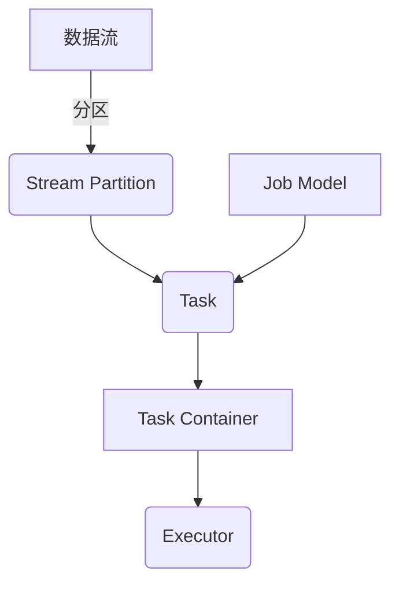
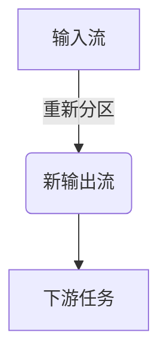

# 性能调优：榨取Samza的最大潜能

## 1.背景介绍

### 1.1 Apache Samza简介

Apache Samza是一个分布式流处理系统,由LinkedIn公司开发并捐赠给Apache软件基金会。它基于Apache Kafka构建,旨在提供一个易于使用且可扩展的解决方案,用于处理来自各种数据源的实时数据流。

### 1.2 Samza的应用场景

Samza被广泛应用于各种领域,包括:

- 实时数据分析
- 物联网数据处理
- 在线广告系统
- 金融交易监控
- 社交网络活动流分析

### 1.3 性能优化的重要性

随着数据量的不断增长和实时处理需求的提高,优化Samza的性能变得至关重要。高效利用资源不仅可以降低运营成本,还能确保系统的可靠性和低延迟响应。因此,深入了解Samza的内部工作原理并采取恰当的优化措施,对于获得卓越的系统性能至关重要。

## 2.核心概念与联系

### 2.1 Samza的核心组件

Samza由以下几个核心组件组成:

- **流分区(Stream Partition)**: 数据流被分成多个分区,每个分区由一个任务处理。
- **任务(Task)**: 处理流分区中数据的工作单元。
- **任务容器(Task Container)**: 运行任务的执行环境。
- **作业模型(Job Model)**: 定义了流处理管道的拓扑结构。
- **执行器(Executor)**: 在集群中运行任务容器的进程。



### 2.2 Samza与Kafka的关系

Samza与Kafka的关系密不可分。Kafka作为分布式流平台,为Samza提供了可靠的数据源和sink。Samza从Kafka中消费数据,并将处理后的结果写回Kafka或其他系统。这种设计使得Samza能够无缝集成到现有的Kafka生态系统中。

### 2.3 流处理的关键概念

在讨论Samza性能优化之前,我们需要了解一些流处理的关键概念:

- **吞吐量(Throughput)**: 指系统在单位时间内能够处理的数据量。
- **延迟(Latency)**: 指数据从进入系统到被处理的时间差。
- **容错性(Fault Tolerance)**: 系统在发生故障时能够继续运行的能力。
- **可扩展性(Scalability)**: 系统能够根据需求扩展资源以处理更大的工作负载。

## 3.核心算法原理具体操作步骤

### 3.1 任务并行化

Samza的核心算法之一是任务并行化。每个流分区由一个任务处理,因此通过增加任务的数量,可以提高整体的吞吐量。Samza采用了一种称为"重新分区(repartitioning)"的技术,它允许将一个流的分区数量增加或减少。

重新分区的具体步骤如下:

1. 创建一个新的输出流,其分区数量与所需的并行度相同。
2. 将输入流的数据读取并根据指定的键(key)对数据进行重新分区。
3. 将重新分区后的数据写入新的输出流。
4. 使用新的输出流作为下游任务的输入。

通过这种方式,Samza可以灵活地调整并行度,从而满足不同的吞吐量需求。



### 3.2 有状态处理

除了简单的数据转换,Samza还支持有状态的流处理。这意味着任务可以维护内部状态,并基于该状态对数据进行计算。例如,在实时计算会话窗口时,任务需要跟踪会话的开始和结束时间。

Samza使用RocksDB作为本地状态存储,并提供了一个称为"ChangeLog"的功能来确保状态的持久性和容错性。ChangeLog将状态更改记录到Kafka中,以便在发生故障时能够从最新的检查点恢复。

### 3.3 容错与恢复

Samza的容错和恢复机制建立在以下几个关键点之上:

1. **重新处理**: 当任务失败时,Samza会自动重新启动该任务,并从最近的检查点恢复状态。
2. **检查点(Checkpointing)**: 任务会定期将其状态写入检查点,以便在发生故障时能够从该点恢复。
3. **重新分区**: 如果某个执行器失败,Samza会将该执行器上的任务重新分配给其他执行器。
4. **重新启动**: 如果整个作业失败,Samza会自动重新启动该作业。

这些机制确保了Samza在发生故障时能够快速恢复,并且不会丢失已处理的数据。

## 4.数学模型和公式详细讲解举例说明

### 4.1 小文件问题

在处理大量小文件时,Samza可能会遇到性能瓶颈。这是因为每个小文件都需要进行一次磁盘I/O操作,而磁盘I/O通常是系统的性能瓶颈之一。

为了解决这个问题,我们可以采用文件合并(file compaction)的技术。文件合并的目标是将多个小文件合并成一个大文件,从而减少磁盘I/O操作的次数。

假设我们有 $n$ 个小文件,每个文件的大小为 $s_i$ ($i=1,2,...,n$),合并后的大文件的大小为 $S$。我们定义文件合并的效率为:

$$\eta = \frac{S}{\sum_{i=1}^{n}s_i}$$

理想情况下,我们希望 $\eta$ 尽可能接近1,这意味着合并后的文件大小与原始文件总大小相近。然而,由于合并过程中需要写入元数据等额外信息,因此实际情况下 $\eta$ 通常小于1。

我们可以通过调整合并策略来优化 $\eta$ 的值。例如,我们可以设置一个阈值 $t$,当文件大小小于 $t$ 时,才将其合并到大文件中。这样可以避免过多的小文件合并操作,从而提高效率。

### 4.2 数据倾斜

数据倾斜(data skew)是指数据在不同的分区或任务之间分布不均匀的情况。这可能导致某些任务承担了过多的工作负载,而其他任务则相对空闲,从而影响整体的吞吐量和延迟。

为了解决数据倾斜问题,我们可以采用重新分区(repartitioning)技术。重新分区的目标是将数据均匀地分布到不同的分区中,从而平衡任务的工作负载。

假设我们有 $m$ 个任务,每个任务处理 $n_i$ ($i=1,2,...,m$)条记录。我们定义数据倾斜的程度为:

$$\sigma = \frac{\max\limits_{1\leq i\leq m}n_i}{\frac{1}{m}\sum_{i=1}^{m}n_i}$$

$\sigma$ 的值越大,说明数据倾斜的程度越严重。理想情况下,我们希望 $\sigma$ 尽可能接近1,这意味着所有任务的工作负载均衡。

为了优化 $\sigma$ 的值,我们可以调整重新分区的策略。例如,我们可以根据记录的键(key)对数据进行散列,并将具有相同散列值的记录分配到同一个分区中。这样可以确保具有相似键值的记录被分配到同一个任务中处理,从而减少数据倾斜的程度。

## 5.项目实践:代码实例和详细解释说明

### 5.1 重新分区示例

下面是一个使用Samza进行重新分区的示例代码:

```java
import org.apache.samza.system.IncomingMessageEnvelope;
import org.apache.samza.task.InitableTask;
import org.apache.samza.task.MessageCollector;
import org.apache.samza.task.StreamTask;
import org.apache.samza.task.TaskCoordinator;

public class RepartitionTask implements StreamTask, InitableTask {
    private MessageCollector<String, String> collector;

    @Override
    public void init(Context context, TaskCoordinator coordinator) {
        collector = coordinator.getMessageCollector(context.getTaskInstanceId());
    }

    @Override
    public void process(IncomingMessageEnvelope envelope, MessageCollector collector, TaskCoordinator coordinator) {
        String key = envelope.getMessage().getKey();
        String value = envelope.getMessage().getMessage();

        // 根据键进行重新分区
        int partition = Math.abs(key.hashCode()) % collector.getNumPartitions();
        collector.send(partition, envelope.getMessage());
    }
}
```

在这个示例中,我们定义了一个 `RepartitionTask` 类,它实现了 `StreamTask` 和 `InitableTask` 接口。在 `init` 方法中,我们获取了一个 `MessageCollector` 实例,用于发送重新分区后的消息。

在 `process` 方法中,我们首先从输入消息中获取键(key)和值(value)。然后,我们根据键的哈希值计算出目标分区的编号。最后,我们使用 `MessageCollector` 将消息发送到目标分区。

通过这种方式,我们可以将具有相似键值的消息分配到同一个分区中,从而实现重新分区的目的。

### 5.2 有状态处理示例

下面是一个使用Samza进行有状态处理的示例代码:

```java
import org.apache.samza.context.Context;
import org.apache.samza.storage.kv.Entry;
import org.apache.samza.storage.kv.KeyValueStore;
import org.apache.samza.system.IncomingMessageEnvelope;
import org.apache.samza.task.InitableTask;
import org.apache.samza.task.MessageCollector;
import org.apache.samza.task.StreamTask;
import org.apache.samza.task.TaskCoordinator;

public class SessionWindowTask implements StreamTask, InitableTask {
    private KeyValueStore<String, SessionWindow> store;
    private MessageCollector<String, String> collector;

    @Override
    public void init(Context context, TaskCoordinator coordinator) {
        store = coordinator.getStore("session-window-store");
        collector = coordinator.getMessageCollector(context.getTaskInstanceId());
    }

    @Override
    public void process(IncomingMessageEnvelope envelope, MessageCollector collector, TaskCoordinator coordinator) {
        String key = envelope.getMessage().getKey();
        String value = envelope.getMessage().getMessage();

        // 获取或创建会话窗口
        SessionWindow window = store.get(key);
        if (window == null) {
            window = new SessionWindow();
            store.put(key, window);
        }

        // 更新会话窗口
        window.update(value);

        // 如果会话结束,输出结果
        if (window.isExpired()) {
            collector.send(new OutgoingMessageEnvelope(new KeyedMessage<>(key, window.getResult())));
            store.delete(key);
        }
    }
}
```

在这个示例中,我们定义了一个 `SessionWindowTask` 类,用于计算会话窗口。我们使用 Samza 提供的 `KeyValueStore` 来存储每个会话的状态。

在 `init` 方法中,我们获取了一个 `KeyValueStore` 实例和一个 `MessageCollector` 实例。

在 `process` 方法中,我们首先从输入消息中获取键(key)和值(value)。然后,我们从 `KeyValueStore` 中获取或创建与该键相关联的 `SessionWindow` 对象。接下来,我们使用输入值更新 `SessionWindow` 对象的状态。如果会话结束,我们将结果输出到下游,并从 `KeyValueStore` 中删除该会话的状态。

通过这种方式,我们可以维护每个会话的状态,并在会话结束时输出计算结果。

## 6.实际应用场景

### 6.1 实时数据分析

Samza 可以用于实时数据分析,例如网站流量分析、用户行为分析等。在这些场景中,Samza 可以从 Kafka 中消费实时数据,进行各种转换和计算,并将结果输出到下游系统,如数据库或监控系统。

### 6.2 物联网数据处理

随着物联网设备的不断增加,处理来自这些设备的大量数据流成为一个挑战。Samza 可以用于处理物联网数据,例如传感器数据、设备状态数据等。它可以对这些数据进行实时过滤、聚合和转换,并将结果输出到下游系统进行进一步分析或存储。

### 6.3 在线广告系统

在在线广告系统中