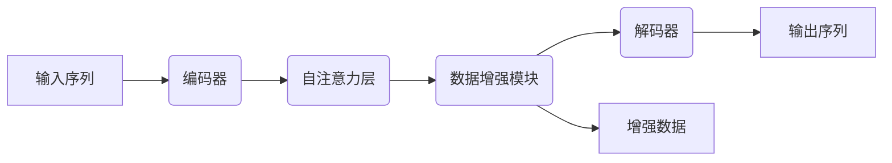

# 数据增强XTransformer:如何为NLP任务赋能?

## 1.背景介绍

### 1.1 自然语言处理的重要性

在当今的数字时代,自然语言处理(NLP)技术在各个领域扮演着越来越重要的角色。无论是智能助手、机器翻译、情感分析还是文本生成,NLP都为我们提供了强大的工具来理解和处理人类语言。随着人工智能的快速发展,NLP已经成为各大科技公司和研究机构的核心关注点之一。

### 1.2 数据增强的必要性

尽管NLP模型的性能不断提高,但它们的表现仍然受到训练数据质量和数量的限制。高质量的标注数据往往昂贵且耗时,而低质量的数据则会导致模型性能下降。为了缓解这一问题,数据增强(Data Augmentation)技术应运而生。

数据增强是一种通过对现有数据进行变换或生成新数据的方式来扩充训练数据集的技术。它可以提高模型的泛化能力,增强其对噪声和变化的鲁棒性,从而提高模型的整体性能。

### 1.3 Transformer模型的兴起

自2017年Transformer模型被提出以来,它迅速成为NLP领域的主流模型架构。Transformer借助自注意力(Self-Attention)机制,能够更好地捕捉长距离依赖关系,从而在许多NLP任务上取得了卓越的表现。

然而,训练高质量的Transformer模型需要大量的计算资源和训练数据。因此,如何有效地利用数据增强技术为Transformer模型赋能,成为了一个值得关注的研究课题。

## 2.核心概念与联系

### 2.1 Transformer模型

Transformer是一种基于自注意力机制的序列到序列(Seq2Seq)模型,广泛应用于机器翻译、文本生成、阅读理解等NLP任务。它的核心组件包括编码器(Encoder)和解码器(Decoder),通过多头自注意力(Multi-Head Self-Attention)和前馈神经网络(Feed-Forward Neural Network)来捕捉输入序列中的长距离依赖关系。


### 2.2 数据增强技术

数据增强技术可以分为两大类:基于规则的增强和基于模型的增强。

1. **基于规则的增强**:通过一些预定义的规则对原始数据进行变换,如随机插入、删除、交换或替换单词等。这种方法简单高效,但可能无法捕捉到更复杂的语义和语法变化。

2. **基于模型的增强**:利用预训练语言模型生成新的语义相关数据,如通过掩码语言模型(Masked Language Model)或条件生成模型生成新的句子或段落。这种方法可以产生更加多样和高质量的增强数据,但计算成本较高。

### 2.3 XTransformer

XTransformer是一种新型的Transformer架构,专门设计用于数据增强。它将数据增强模块集成到Transformer的编码器和解码器中,实现了端到端的数据增强和模型训练。XTransformer的核心思想是利用自注意力机制捕捉输入数据的语义和语法特征,然后基于这些特征生成新的相关数据,从而扩充训练集。



通过将数据增强模块集成到Transformer中,XTransformer可以在训练过程中动态生成增强数据,从而提高模型的泛化能力和鲁棒性。同时,由于数据增强过程是端到端的,XTransformer还可以避免传统数据增强方法中的误差传播问题。

## 3.核心算法原理具体操作步骤

XTransformer的核心算法原理可以分为以下几个步骤:

### 3.1 编码器自注意力

首先,输入序列通过Transformer的编码器进行编码,利用多头自注意力机制捕捉输入序列中的语义和语法特征。编码器的输出表示为 $H^{enc}$。

$$H^{enc} = Encoder(X)$$

其中,X是输入序列。

### 3.2 数据增强模块

接下来,编码器的输出 $H^{enc}$ 被送入数据增强模块。该模块包含一个掩码语言模型(Masked Language Model),用于生成新的相关数据。

具体操作步骤如下:

1. 从输入序列 X 中随机选择一些词位置,并将这些位置的词替换为特殊的掩码标记 [MASK]。
2. 将带有掩码的序列 $X^{masked}$ 输入到掩码语言模型中,预测被掩码位置的词。
3. 将预测的词插入到原始序列中,生成新的增强序列 $X^{aug}$。

数据增强模块的输出表示为 $H^{aug}$。

$$H^{aug} = DataAugModule(H^{enc})$$

### 3.3 解码器自注意力

最后,编码器的输出 $H^{enc}$ 和数据增强模块的输出 $H^{aug}$ 被连接起来,作为解码器的输入。解码器利用自注意力机制生成最终的输出序列 Y。

$$Y = Decoder(H^{enc}, H^{aug})$$

通过上述步骤,XTransformer可以在训练过程中动态生成增强数据,并利用这些数据来提高模型的性能。

## 4.数学模型和公式详细讲解举例说明

在XTransformer中,数据增强模块的核心是掩码语言模型(Masked Language Model, MLM)。MLM的目标是根据上下文预测被掩码的词。

### 4.1 掩码语言模型

给定一个输入序列 $X = (x_1, x_2, \dots, x_n)$,我们随机选择一些词位置,并将这些位置的词替换为特殊的掩码标记 [MASK],得到带有掩码的序列 $X^{masked}$。

MLM的目标是最大化被掩码位置的词的条件概率:

$$\mathcal{L}_{MLM} = -\mathbb{E}_{X, X^{masked}} \left[ \sum_{i \in \text{masked}} \log P(x_i | X^{masked}) \right]$$

其中,masked表示被掩码的词位置集合。

为了预测被掩码的词,MLM会首先将 $X^{masked}$ 输入到Transformer的编码器中,得到上下文表示 $H^{enc}$。然后,MLM会基于 $H^{enc}$ 计算每个被掩码位置的词的概率分布:

$$P(x_i | X^{masked}) = \text{softmax}(W_o H^{enc}_i + b_o)$$

其中, $W_o$ 和 $b_o$ 分别是输出层的权重和偏置。

通过最大化 $\mathcal{L}_{MLM}$,MLM可以学习到捕捉上下文语义的能力,从而能够预测被掩码的词。

### 4.2 数据增强示例

假设我们有一个输入序列 "The cat sat on the mat."。我们随机选择两个位置进行掩码,得到:

"The [MASK] sat on the [MASK]."

我们将这个带有掩码的序列输入到MLM中,MLM会预测被掩码位置的词。假设MLM预测的结果是:

"The cat sat on the floor."

那么,我们就得到了一个新的增强序列 "The cat sat on the floor."。通过这种方式,XTransformer可以动态生成相关的增强数据,从而提高模型的泛化能力。

## 5.项目实践:代码实例和详细解释说明

下面是一个使用PyTorch实现XTransformer的简化示例代码:

```python
import torch
import torch.nn as nn

# 定义Transformer编码器
class TransformerEncoder(nn.Module):
    def __init__(self, d_model, nhead, num_layers):
        super().__init__()
        self.layers = nn.ModuleList([nn.TransformerEncoderLayer(d_model, nhead) for _ in range(num_layers)])

    def forward(self, src):
        enc_output = src
        for layer in self.layers:
            enc_output = layer(enc_output)
        return enc_output

# 定义掩码语言模型
class MaskedLanguageModel(nn.Module):
    def __init__(self, d_model, vocab_size):
        super().__init__()
        self.linear = nn.Linear(d_model, vocab_size)

    def forward(self, enc_output, masked_pos):
        masked_output = enc_output[masked_pos]
        logits = self.linear(masked_output)
        return logits

# 定义Transformer解码器
class TransformerDecoder(nn.Module):
    def __init__(self, d_model, nhead, num_layers):
        super().__init__()
        self.layers = nn.ModuleList([nn.TransformerDecoderLayer(d_model, nhead) for _ in range(num_layers)])

    def forward(self, tgt, memory):
        dec_output = tgt
        for layer in self.layers:
            dec_output = layer(dec_output, memory)
        return dec_output

# 定义XTransformer模型
class XTransformer(nn.Module):
    def __init__(self, d_model, nhead, num_encoder_layers, num_decoder_layers, vocab_size):
        super().__init__()
        self.encoder = TransformerEncoder(d_model, nhead, num_encoder_layers)
        self.mlm = MaskedLanguageModel(d_model, vocab_size)
        self.decoder = TransformerDecoder(d_model, nhead, num_decoder_layers)

    def forward(self, src, tgt, masked_pos):
        enc_output = self.encoder(src)
        mlm_logits = self.mlm(enc_output, masked_pos)
        dec_output = self.decoder(tgt, enc_output)
        return dec_output, mlm_logits
```

在这个示例中,我们定义了四个主要组件:

1. `TransformerEncoder`:实现Transformer的编码器,用于编码输入序列。
2. `MaskedLanguageModel`:实现掩码语言模型,用于预测被掩码的词。
3. `TransformerDecoder`:实现Transformer的解码器,用于生成输出序列。
4. `XTransformer`:集成了编码器、掩码语言模型和解码器,实现了XTransformer的端到端架构。

在`forward`函数中,我们首先将输入序列`src`输入到编码器中,得到编码器的输出`enc_output`。然后,我们将`enc_output`和被掩码位置`masked_pos`输入到掩码语言模型中,得到预测的词的logits `mlm_logits`。最后,我们将`enc_output`和目标序列`tgt`输入到解码器中,得到解码器的输出`dec_output`。

通过这种方式,XTransformer可以在训练过程中动态生成增强数据,并利用这些数据来提高模型的性能。

## 6.实际应用场景

XTransformer可以应用于各种NLP任务,如机器翻译、文本生成、阅读理解等。下面是一些具体的应用场景:

### 6.1 机器翻译

在机器翻译任务中,XTransformer可以用于生成更多样化的训练数据,从而提高翻译模型的泛化能力。例如,我们可以使用XTransformer生成同义句对或语义相关的句子对,作为额外的训练数据。这种方式可以帮助模型学习到更丰富的语义和语法知识,从而提高翻译质量。

### 6.2 文本生成

在文本生成任务中,XTransformer可以用于生成更多样化和高质量的文本。例如,我们可以使用XTransformer生成新的句子或段落,作为种子数据输入到文本生成模型中。这种方式可以帮助模型学习到更丰富的语言模式,从而生成更加流畅和多样化的文本。

### 6.3 阅读理解

在阅读理解任务中,XTransformer可以用于生成更多样化的问题和上下文对。例如,我们可以使用XTransformer生成新的问题或上下文,作为额外的训练数据。这种方式可以帮助模型学习到更丰富的语义和推理能力,从而提高阅读理解的准确性。

### 6.4 其他应用场景

除了上述应用场景外,XTransformer还可以应用于情感分析、命名实体识别、关系抽取等其他NLP任务。只要任务需要大量高质量的训练数据,XTransformer就可以发挥作用,通过生成增强数据来提高模型的性能。