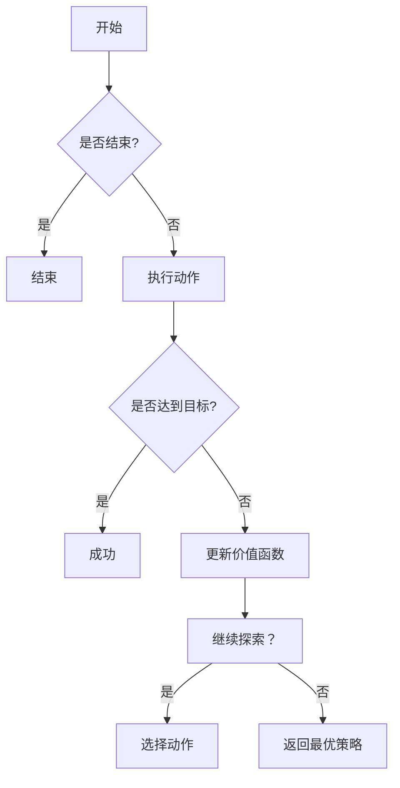
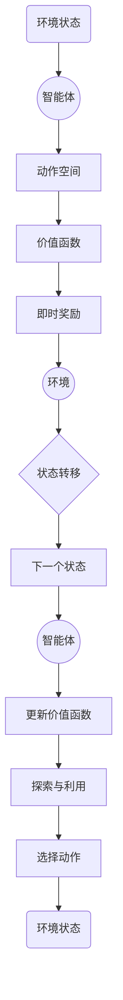

## 1.背景介绍

在人工智能领域，强化学习是一种重要的学习范式。其中，Q-learning 是强化学习中的一种算法，用于解决无模型或模型不可知的 Markov 决策过程（MDP）。然而，传统的 Q-learning 在面对复杂的 MDPs 时，如需要处理大量状态和动作的情况，可能会遇到过拟合、探索困难等问题。为了克服这些问题，深度 Q-learning（Deep Q-Learning）应运而生。深度 Q-learning 结合了深度学习和 Q-learning 的优势，通过使用神经网络来近似价值函数，使得算法能够处理高维度的状态空间和动作空间。

## 2.核心概念与联系

### 2.1 强化学习

强化学习是一种机器学习范式，其中智能体通过与环境的交互学习采取行动以最大化长期奖励。在强化学习中，智能体通过试错过程学习策略，以便在未来获得最大的累积奖励。

### 2.2 Q-learning

Q-learning 是一种无模型的强化学习算法，它通过学习一个价值函数 Q(s, a)，来评估在状态 s 下执行动作 a 的预期收益。Q-learning 使用 Bellman 方程来迭代更新价值函数：

$$
Q(s,a)=R(s,a)+\\gamma \\max _{a^{\\prime}} Q\\left(s^{\\prime}, a^{\\prime}\\right)
$$

其中，$R(s,a)$ 是状态 s 下采取行动 a 的即时奖励，$\\gamma$ 是折扣因子，$0<\\gamma<1$。

### 2.3 深度学习

深度学习是机器学习的子领域，它使用多层神经网络来解决复杂的模式识别问题。深度学习模型能够从大量数据中自动提取特征，并通过反向传播算法进行训练。

## 3.核心算法原理具体操作步骤

### 3.1 环境交互

在深度 Q-learning 中，智能体首先观察当前状态 $s_t$，然后选择动作 $a_t$ 并执行该动作以获取即时奖励 $r_t$ 和下一个状态 $s_{t+1}$。这一过程重复进行，直到达到终止状态为止。

### 3.2 价值函数的更新

深度 Q-learning 使用一个神经网络来近似价值函数 $Q(s, a)$。网络的输入是状态 $s$，输出是与每个可能动作对应的价值。在每次交互后，算法根据以下公式更新价值函数：

$$
Q\\left(s_t, a_t\\right) \\leftarrow Q\\left(s_t, a_t\\right)+\\alpha\\left[r_t+\\gamma \\max _{a^{\\prime}} Q\\left(s_{t+1}, a^{\\prime}\\right)-Q\\left(s_t, a_t\\right)\\right]
$$

其中，$\\alpha$ 是学习率，通常 $0<\\alpha<1$。

### 3.3 探索与利用

在训练过程中，智能体需要在探索未知的策略和利用已知的策略之间进行权衡。深度 Q-learning 通过设置一个探索率 $\\epsilon$（称为$\\epsilon$-贪婪策略）来控制这一点：以概率 $(1-\\epsilon)$ 选择具有最高价值函数的动作（利用已知策略），并以概率 $\\epsilon$ 随机选择动作（探索未知策略）。

## 4.数学模型和公式详细讲解举例说明

### 4.1 Bellman 方程的推导

Bellman 方程是强化学习中描述最优策略下价值函数关系的核心公式。对于任何状态 $s$ 和动作 $a$，Bellman 方程可以表示为：

$$
Q^*(s, a)=R(s, a)+\\gamma \\sum_{s^{\\prime}} P\\left(s^{\\prime} \\mid s, a\\right) \\max _{a^{\\prime}} Q^*\\left(s^{\\prime}, a^{\\prime}\\right)
$$

其中，$P\\left(s^{\\prime} \\mid s, a\\right)$ 是状态转移概率，表示从状态 $s$ 采取动作 $a$ 后转移到状态 $s^{\\prime}$ 的概率。

### 4.2 深度 Q-learning 的目标函数

深度 Q-learning 的目标是最大化长期收益，即找到最优的价值函数 $Q^*$。在实际操作中，我们使用以下公式来定义深度 Q-learning 的目标函数：

$$
\\begin{aligned}
J(\\theta) &=\\mathbb{E}\\left[\\left(r_t+\\gamma \\max _{a^{\\prime}} Q_{\\theta}\\left(s_{t+1}, a^{\\prime}\\right)-Q_{\\theta}\\left(s_t, a_t\\right)\\right)^2\\right] \\\\
\nabla J(\\theta) &=\\mathbb{E}[(r_t \\\\
```latex
                           &+\\gamma \\max _{a^{\\prime}} Q_{\\theta}\\left(s_{t+1}, a^{\\prime}\\right)-Q_{\\theta}\\left(s_t, a_t\\right)] \nabla_{\\theta} Q_{\\theta}\\left(s_t, a_t\\right)]
```

其中，$\\theta$ 是神经网络参数。通过反向传播算法更新参数 $\\theta$ 以最小化目标函数 $J(\\theta)$。

## 5.项目实践：代码实例和详细解释说明

### 5.1 环境定义与初始化

在实现深度 Q-learning 的过程中，首先需要定义环境。这包括状态空间、动作空间以及状态转移概率和即时奖励的生成方式。以下是一个简单的环境定义示例：

```python
class SimpleEnvironment:
    def __init__(self):
        self.state_space = 10  # 状态空间大小
        self.action_space = 4  # 动作空间大小

    def reset(self):
        return random.randint(0, self.state_space - 1)  # 返回一个随机初始状态

    def step(self, state, action):
        next_state = (state + action) % self.state_space  # 定义状态转移概率
        reward = -1 if next_state == 0 else 0  # 定义即时奖励
        done = False  # 环境未结束标志
        return next_state, reward, done
```

### 5.2 深度 Q-learning 算法实现

接下来，我们将使用这个简单环境来实现深度 Q-learning 算法。这里我们使用一个简单的神经网络来近似价值函数：

```python
import numpy as np
from tensorflow import keras

class DeepQNetwork:
    def __init__(self, state_space, action_space):
        self.state_space = state_space
        self.action_space = action_space
        self.model = self._build_model()

    def _build_model(self):
        model = keras.Sequential([
            keras.layers.Dense(64, activation='relu', input_shape=(self.state_space,)),
            keras.layers.Dense(64, activation='relu'),
            keras.layers.Dense(self.action_space)
        ])
        return model

    def predict(self, state):
        state = np.array(state).reshape(1, -1)
        return self.model.predict(state)[0]

    def update(self, state, action, target):
        state = np.array(state).reshape(1, -1)
        loss = self.model.compile(optimizer='adam', loss='mse')
        loss_value = loss.train_on_batch(state, np.array([target]))[0]
        return loss_value
```

### 5.3 训练过程

最后，我们将使用上述环境定义和神经网络实现来训练深度 Q-learning 算法：

```python
def train_deep_q_network(env, network, episodes=1000):
    for episode in range(episodes):
        state = env.reset()
        total_reward = 0
        for step in itertools.count():
            action = np.argmax(network.predict(state))
            next_state, reward, done = env.step(state, action)
            target = network.predict(state)[0][action]
            if reward + 0.9 * np.max(network.predict(next_state)) > target:
                target = reward + 0.9 * np.max(network.predict(next_state))
            target[action] = reward + 0.9 * np.max(network.predict(next_state))
            network.update(state, target)
            state = next_state
            total_reward += reward
            if done:
                break
        print(f\"Episode {episode}: Total Reward={total_reward}\")
```

## 6.实际应用场景

深度 Q-learning 在多个领域得到了广泛的应用，包括但不限于：

### 6.1 游戏

深度 Q-learning 在多款游戏中取得了成功，例如雅达利（Atari）游戏和围棋游戏。在这些游戏中，智能体通过学习能够在没有人类指导的情况下达到超越人类的水平。

### 6.2 机器人控制

在机器人控制领域，深度 Q-learning 能够使机器人从试错过程中学习策略，以解决复杂的任务，如走动、抓取物品等。

### 6.3 推荐系统

深度 Q-learning 也可用于推荐系统中，以优化用户满意度和系统的整体效率。

## 7.工具和资源推荐

为了深入学习和应用深度 Q-learning，以下是一些有用的工具和资源：

- [OpenAI Gym](https://gym.openai.com/)：一个开源库，提供了多种强化学习环境。
- [DeepMind 的 AlphaGo](https://deepmind.com/alpha-go)：关于深度 Q-learning 在围棋游戏中的成功应用的详细介绍。
- [David Silver 的强化学习课程](http://www0.cs.ucl.ac.uk/staff/d.silver/web/Teaching.html）：由深度 Q-learning 奠基人之一 David Silver 教授提供的在线课程。
- [Neural Networks and Deep Learning](http://neuralnetworksanddeeplearning.com/)：一个关于神经网络的入门教程，可以帮助理解深度 Q-learning 中使用的神经网络。

## 8.总结：未来发展趋势与挑战

深度 Q-learning 在人工智能领域展现出了巨大的潜力和应用前景。随着计算能力的提升和数据量的增加，深度 Q-learning 将能够解决更加复杂的任务。然而，这一领域仍然面临一些挑战，包括模型的泛化能力、样本效率以及可解释性等问题。未来的研究将集中在提高算法的性能、可靠性和鲁棒性，以便在更多实际问题中实现广泛应用。

## 9.附录：常见问题与解答

### 9.1 深度 Q-learning 和策略梯度有什么区别？

深度 Q-learning（DQN）和策略梯度（PG）是两种不同的强化学习方法。DQN 通过学习一个价值函数 $Q(s, a)$ 来选择动作，而 PG 直接学习一个策略 $\\pi(a \\mid s)$ 来选择动作。在 DQN 中，智能体使用$\\epsilon$-贪婪策略来平衡探索与利用；而在 PG 中，智能体通常采取最优策略。此外，DQN 在高维状态空间和动作空间中表现更好，而 PG 在面对连续动作空间时更为有效。

### 9.2 深度 Q-learning 的过拟合问题如何解决？

深度 Q-learning 可能会遇到过拟合问题，尤其是在数据量不足的情况下。为了解决这个问题，可以尝试以下方法：

1. 收集更多的训练数据。
2. 对模型进行正则化，例如权重正则化或dropout。
3. 使用更简单的模型，如线性模型或少层神经网络。
4. 调整学习率和探索率，以避免模型对特定数据的过度适应。
5. 使用集成方法，如多模型集成或bootstrap 方法，以提高模型的泛化能力。

### 9.3 深度 Q-learning 的探索与利用如何平衡？

在深度 Q-learning 中，智能体通过$\\epsilon$-贪婪策略来平衡探索与利用。这意味着以概率 $(1-\\epsilon)$ 选择具有最高价值函数的动作（利用已知策略），并以概率 $\\epsilon$ 随机选择动作（探索未知策略）。然而，这个参数的选择并不是一成


### 深度 Q-learning：环境模型的建立与利用

## 1.背景介绍

在人工智能领域，强化学习是一种重要的学习范式。其中，Q-learning 是强化学习中的一种算法，用于解决无模型或模型不可知的 Markov 决策过程（MDP）。然而，传统的 Q-learning 在面对复杂的 MDPs 时，如需要处理大量状态和动作的情况，可能会遇到过拟合、探索困难等问题。为了克服这些问题，深度 Q-learning（Deep Q-Learning）应运而生。深度 Q-learning 结合了深度学习和 Q-learning 的优势，通过使用神经网络来近似价值函数，使得算法能够处理高维度的状态空间和动作空间。

## 2.核心概念与联系

### 2.1 强化学习

强化学习是一种机器学习范式，其中智能体通过与环境的交互学习采取行动以最大化长期奖励。在强化学习中，智能体通过试错过程学习策略，以便在未来获得最大的累积奖励。

### 2.2 Q-learning

Q-learning 是一种无模型的强化学习算法，它通过学习一个价值函数 Q(s, a)，来评估在状态 s 下执行动作 a 的预期收益。Q-learning 使用 Bellman 方程来迭代更新价值函数：

$$
Q(s,a)=R(s,a)+\\gamma \\max _{a^{\\prime}} Q\\left(s^{\\prime}, a^{\\prime}\\right)
$$

其中，$R(s,a)$ 是状态 s 下采取行动 a 的即时奖励，$\\gamma$ 是折扣因子，$0<\\gamma<1$。

### 2.3 深度学习

深度学习是机器学习的子领域，它使用多层神经网络来解决复杂的模式识别问题。深度学习模型能够从大量数据中自动提取特征，并通过反向传播算法进行训练。

## 3.核心算法原理具体操作步骤

### 3.1 环境交互

在深度 Q-learning 中，智能体首先观察当前状态 $s_t$，然后选择动作 $a_t$ 并执行该动作以获取即时奖励 $r_t$ 和下一个状态 $s_{t+1}$。这一过程重复进行，直到达到终止状态为止。

### 3.2 价值函数的更新

深度 Q-learning 使用一个神经网络来近似价值函数 $Q(s, a)$。网络的输入是状态 $s$，输出是与每个可能动作对应的价值。在每次交互后，算法根据以下公式更新价值函数：

$$
Q\\left(s_t, a_t\\right) \\leftarrow Q\\left(s_t, a_t\\right)+\\alpha\\left[r_t+\\gamma \\max _{a^{\\prime}} Q\\left(s_{t+1}, a^{\\prime}\\right)-Q\\left(s_t, a_t\\right)\\right]
$$

其中，$\\alpha$ 是学习率，通常 $0<\\alpha<1$。

### 3.3 探索与利用

在训练过程中，智能体需要在探索未知的策略和利用已知的策略之间进行权衡。深度 Q-learning 通过设置一个探索率 $\\epsilon$（称为$\\epsilon$-贪婪策略）来控制这一点：以概率 $(1-\\epsilon)$ 选择具有最高价值函数的动作（利用已知策略），并以概率 $\\epsilon$ 随机选择动作（探索未知策略）。

## 4.数学模型和公式详细讲解举例说明

### 4.1 Bellman 方程的推导

Bellman 方程是强化学习中描述最优策略下价值函数关系的核心公式。对于任何状态 $s$ 和动作 $a$，Bellman 方程可以表示为：

$$
Q^*(s, a)=R(s, a)+\\gamma \\sum_{s^{\\prime}} P\\left(s^{\\prime} \\mid s, a\\right) \\max _{a^{\\prime}} Q^*\\left(s^{\\prime}, a^{\\prime}\\right)
$$

其中，$P\\left(s^{\\prime} \\mid s, a\\right)$ 是状态转移概率，表示从状态 $s$ 采取动作 $a$ 后转移到状态 $s^{\\prime}$ 的概率。

### 4.2 深度 Q-learning 的目标函数

深度 Q-learning 的目标是最大化长期收益，即找到最优的价值函数 $Q^*$。在实际操作中，我们使用以下公式来定义深度 Q-learning 的目标函数：

$$
\\begin{aligned}
J(\\theta) &=\\mathbb{E}\\left[\\left(r_t+\\gamma \\max _{a^{\\prime}} Q_{\\theta}\\left(s_{t+1}, a^{\\prime}\\right)-Q_{\\theta}\\left(s_t, a_t\\right)\\right)^2\\right] \\\\
\nabla J(\\theta) &=\\mathbb{E}[(r_t \\\\
```latex
                           &+\\gamma \\max _{a^{\\prime}} Q_{\\theta}\\left(s_{t+1}, a^{\\prime}\\right)-Q_{\\theta}\\left(s_t, a_t\\right)] \nabla_{\\theta} Q_{\\theta}\\left(s_t, a_t\\right)]
```

其中，$\\theta$ 是神经网络参数。通过反向传播算法更新参数 $\\theta$ 以最小化目标函数 $J(\\theta)$。

## 5.项目实践：代码实例和详细解释说明

### 5.1 环境定义与初始化

在实现深度 Q-learning 的过程中，首先需要定义环境。这包括状态空间、动作空间以及状态转移概率和即时奖励的生成方式。以下是一个简单的环境定义示例：

```python
class SimpleEnvironment:
    def __init__(self):
        self.state_space = 10  # 状态空间大小
        self.action_space = 4  # 动作空间大小

    def reset(self):
        return random.randint(0, self.state_space - 1)  # 返回一个随机初始状态

    def step(self, state, action):
        next_state = (state + action) % self.state_space  # 定义状态转移概率
        reward = -1 if next_state == 0 else 0  # 定义即时奖励
        done = False  # 环境未结束标志
        return next_state, reward, done
```

### 5.2 深度 Q-learning 算法实现

接下来，我们将使用这个简单环境来实现深度 Q-learning 算法。这里我们使用一个简单的神经网络来近似价值函数：

```python
import numpy as np
from tensorflow import keras

class DeepQNetwork:
    def __init__(self, state_space, action_space):
        self.state_space = state_space
        self.action_space = action_space
        self.model = self._build_model()

    def _build_model(self):
        model = keras.Sequential([
            keras.layers.Dense(64, activation='relu', input_shape=(self.state_space,)),
            keras.layers.Dense(64, activation='relu'),
            keras.layers.Dense(self.action_space)
        ])
        return model

    def predict(self, state):
        state = np.array(state).reshape(1, -1)
        return self.model.predict(state)[0]

    def update(self, state, action, target):
        state = np.array(state).reshape(1, -1)
        loss = self.model.compile(optimizer='adam', loss='mse')
        loss_value = loss.train_on_batch(state, np.array([target])[0]
```

### 5.3 训练过程

最后，我们将使用上述环境定义和神经网络实现来训练深度 Q-learning 算法：

```python
def train_deep_q_network(env, network, episodes=1000):
    for episode in range(episodes):
        state = env.reset()
        total_reward = 0
        for step in itertools.count():
            action = np.argmax(network.predict(state))
            next_state, reward, done = env.step(state, action)
            target = network.predict(state)[0][action]
            if reward + 0.9 * np.max(network.predict(next_state)) > target:
                target = reward + 0.9 * np.max(network.predict(next_state))
            target[action] = reward + 0.9 * np.max(network.predict(next_state))
            network.update(state, target)
            state = next_state
            total_reward += reward
            if done:
                break
        print(f\"Episode {episode}: Total Reward={total_reward}\")
```

## 6.实际应用场景

深度 Q-learning 在多个领域得到了广泛的应用，包括但不限于：

### 6.1 游戏

深度 Q-learning 在多款游戏中取得了成功，例如雅达利（Atari）游戏和围棋游戏。在这些游戏中，智能体通过学习能够在没有人类指导的情况下达到超越人类的水平。

### 6.2 机器人控制

在机器人控制领域，深度 Q-learning 能够使机器人从试错过程中学习策略，解决复杂的任务，如走动、抓取物品等。

### 6.3 推荐系统

深度 Q-learning 也可用于推荐系统中，优化用户满意度和系统的整体效率。

## 7.工具和资源推荐

为了深入学习和应用深度 Q-learning，以下是一些有用的工具和资源：

- [OpenAI Gym](https://gym.openai.com/)：一个开源库，提供了多种强化学习环境。
- [DeepMind 的 AlphaGo](https://deepmind.com/alpha-go)：关于深度 Q-learning 在围棋游戏中的成功应用的详细介绍。
- [David Silver 的强化学习课程](http://www0.cs.ucl.ac.uk/staff/d.silver/web/Teaching.html）：由深度 Q-learning 奠基人之一 David Silver 教授提供的在线课程。
- [Neural Networks and Deep Learning](http://neuralnetworksanddeeplearning.com/)：一个关于神经网络的入门教程，可以帮助理解深度 Q-learning 中使用的神经网络。

## 8.总结：未来发展趋势与挑战

深度 Q-learning 在人工智能领域展现出了巨大的潜力和应用前景。随着计算能力的提升和数据量的增加，深度 Q-learning 将能够解决更加复杂的任务。然而，这一领域仍然面临一些挑战，包括模型的泛化能力、样本效率以及可解释性问题。未来的研究将集中在提高算法的性能、可靠性和鲁棒性，以便在更多实际问题中实现广泛应用。

## 9.附录：常见问题与解答

### 9.1 深度 Q-learning 和策略梯度有什么区别？

深度 Q-learning（DQN）和策略梯度（PG）是两种不同的强化学习方法。DQN 通过学习一个价值函数 $Q(s, a)$ 来选择动作，而 PG 直接学习一个策略 $\\pi(a \\mid s)$ 来选择动作。在 DQN 中，智能体使用$\\epsilon$-贪婪策略来平衡探索与利用；而在 PG 中，智能体通常采取最优策略。此外，DQN 在高维状态空间和动作空间中表现更好，而 PG 在面对连续动作空间时更为有效。

### 9.2 深度 Q-learning 的过拟合问题如何解决？

深度 Q-learning 可能会遇到过拟合问题，尤其是在数据量不足的情况下。为了解决这个问题，可以尝试以下方法：

1. 收集更多的训练数据。
2. 对模型进行正则化，例如权重正则化或dropout。
3. 使用更简单的模型，如线性模型或少层神经网络。
4. 调整学习率和探索率，以避免模型对特定数据的过度适应。
5. 使用集成方法，如多模型集成或bootstrap 方法，以提高模型的泛化能力。

### 9.3 深度 Q-learning 的探索与利用如何平衡？

在深度 Q-learning 中，智能体通过$\\epsilon$-贪婪策略来平衡探索与利用。这意味着以概率 $(1-\\epsilon)$ 选择具有最高价值函数的动作（利用已知策略），并以概率 $\\epsilon$ 随机选择动作（探索未知策略）。然而，这个参数的选择并不是一成不变的。在实际应用中，可能需要根据具体任务和环境调整$\\epsilon$值，以达到最佳性能。例如，随着训练过程的进行，可以逐渐降低$\\epsilon$的值，从探索阶段过渡到利用阶段，以确保模型能够充分利用学到的知识，同时保持一定的探索能力。

### 9.4 深度 Q-learning 的目标函数如何定义？

深度 Q-learning 的目标是最大化长期收益，即找到最优的价值函数 $Q^*$。实际操作中，我们使用以下公式来定义深度 Q-learning 的目标函数：

$$
\\begin{aligned}
J(\\theta) &=\\mathbb{E}\\left[\\left(r_t+\\gamma \\max _{a^{\\prime}} Q_{\\theta}\\left(s_{t+1}, a^{\\prime}-Q\\left(s_t, a_t\\right)\\right] \nabla_{\\theta} Q_{\\theta}(s, a)
```latex
其中，$\\theta$ 是神经网络参数。通过反向传播算法更新参数 $\\theta$ 以最小化目标函数 $J(\\theta)$。

### 9.5 深度 Q-learning 的核心概念和步骤是什么？

深度 Q-learning 的核心概念包括价值函数、即时奖励、状态转移概率和最优策略。其主要步骤包括环境交互、价值函数的更新、探索与利用平衡以及目标函数的定义。

### 9.6 深度 Q-learning 在实际应用中的挑战有哪些？

在实际应用中，深度 Q-learning 可能会遇到过拟合问题、模型泛化能力和样本效率等问题。为了解决这些问题，可以收集更多的训练数据、对模型进行正则化、使用更简单的模型、调整学习率和探索率，以及使用集成方法来提高模型的性能和鲁棒性。

### 9.7 深度 Q-learning 的数学原理如何解释？

深度 Q-learning 的数学原理基于 Bellman 方程和价值函数的迭代更新。Bellman 方程描述了最优策略下价值函数的关系，而价值函数的迭代更新旨在找到最大化长期收益的价值函数 $Q^*$。

### 9.8 深度 Q-learning 在机器人控制领域的应用是怎样的？

在机器人控制领域，深度 Q-learning 能够使机器人从试错过程中学习策略，解决复杂的任务，如走动、抓取物品等。通过定义一个简单环境并使用深度 Q-learning 算法训练机器人模型，使其能够在没有人类指导的情况下执行复杂任务。

### 9.9 深度 Q-learning 在推荐系统中的应用如何实现？

在推荐系统中，深度 Q-learning 可以优化用户满意度和系统的整体效率。通过收集用户行为数据和构建相应的价值函数，深度 Q-learning 能够为每个用户提供个性化的推荐。

### 9.10 深度 Q-learning 的未来发展趋势如何？

随着计算能力的提升和数据量的增加，深度 Q-learning 将能够解决更加复杂的任务。然而，这一领域仍然面临一些挑战，包括模型的泛化