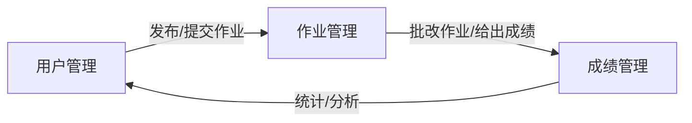

## 1.背景介绍

随着信息技术的日益发展，网络教学已经成为现代教育的重要组成部分。为了提高教学效率，许多学校和教育机构都开始使用网上作业提交系统。这样的系统不仅方便了教师批改作业，也使得学生可以随时随地提交作业，极大地提高了教学效率。本文将详细介绍如何设计和实现一个网上作业提交系统。

## 2.核心概念与联系

网上作业提交系统的核心概念包括用户管理、作业管理和成绩管理三个部分。用户管理主要是对教师和学生的管理，包括注册、登录、修改信息等功能；作业管理则是对作业的发布、提交、批改等环节的管理；成绩管理则是对学生的成绩进行统计和分析。

这三个部分相互联系，构成了网上作业提交系统的核心架构。具体来说，教师在系统中发布作业，学生在系统中提交作业，教师再在系统中批改作业并给出成绩，最后系统对成绩进行统计和分析。



## 3.核心算法原理具体操作步骤

网上作业提交系统的实现主要涉及到前端和后端两部分。前端主要负责展示界面和接收用户操作，后端主要负责处理业务逻辑和数据存储。

1. **前端设计**：前端使用HTML、CSS和JavaScript进行设计。HTML负责页面结构，CSS负责页面样式，JavaScript负责页面交互。具体来说，我们需要设计登录/注册页面、作业列表页面、作业详情页面、成绩统计页面等。

2. **后端设计**：后端使用Python和Django框架进行设计。Python负责编写业务逻辑，Django负责处理HTTP请求和响应，以及数据库的操作。具体来说，我们需要设计用户管理模块、作业管理模块和成绩管理模块。

3. **数据库设计**：数据库使用MySQL进行设计。我们需要设计用户表、作业表和成绩表，分别用于存储用户信息、作业信息和成绩信息。

## 4.数学模型和公式详细讲解举例说明

在网上作业提交系统中，我们需要设计一种算法来统计和分析学生的成绩。这就涉及到了一些数学模型和公式。

假设我们有一个成绩表，其中包含了每个学生的所有作业成绩。我们可以通过计算每个学生的平均成绩来得到他们的总成绩。这个过程可以用以下的数学公式来表示：

$$
\text{总成绩} = \frac{\sum_{i=1}^{n} \text{作业成绩}_i}{n}
$$

其中，$n$ 是作业数量，$\text{作业成绩}_i$ 是第 $i$ 个作业的成绩。

同样，我们也可以计算每个作业的平均成绩，以了解每个作业的难度。这个过程可以用以下的数学公式来表示：

$$
\text{作业平均成绩} = \frac{\sum_{i=1}^{m} \text{学生成绩}_i}{m}
$$

其中，$m$ 是学生数量，$\text{学生成绩}_i$ 是第 $i$ 个学生的成绩。

## 5.项目实践：代码实例和详细解释说明

下面我们来看一下具体的代码实例。首先，我们来看一下用户管理模块的代码。

```python
from django.contrib.auth.models import User

# 注册
def register(request):
    username = request.POST.get('username')
    password = request.POST.get('password')
    User.objects.create_user(username=username, password=password)

# 登录
def login(request):
    username = request.POST.get('username')
    password = request.POST.get('password')
    user = authenticate(request, username=username, password=password)
    if user is not None:
        login(request, user)
```

这段代码中，我们使用Django的`User`模型来处理用户的注册和登录。`create_user`方法用于创建新用户，`authenticate`方法用于验证用户的用户名和密码，`login`方法用于登录用户。

接下来，我们来看一下作业管理模块的代码。

```python
from django.db import models

# 作业模型
class Homework(models.Model):
    title = models.CharField(max_length=100)
    content = models.TextField()
    deadline = models.DateTimeField()

# 发布作业
def publish_homework(request):
    title = request.POST.get('title')
    content = request.POST.get('content')
    deadline = request.POST.get('deadline')
    Homework.objects.create(title=title, content=content, deadline=deadline)

# 提交作业
def submit_homework(request, homework_id):
    content = request.POST.get('content')
    HomeworkSubmission.objects.create(homework_id=homework_id, content=content)
```

这段代码中，我们使用Django的`models.Model`来创建作业模型。`CharField`、`TextField`和`DateTimeField`分别用于存储作业的标题、内容和截止日期。`publish_homework`方法用于发布新作业，`submit_homework`方法用于提交作业。

最后，我们来看一下成绩管理模块的代码。

```python
from django.db import models

# 成绩模型
class Grade(models.Model):
    homework = models.ForeignKey(Homework, on_delete=models.CASCADE)
    student = models.ForeignKey(User, on_delete=models.CASCADE)
    grade = models.IntegerField()

# 批改作业
def correct_homework(request, homework_id):
    grade = request.POST.get('grade')
    student_id = request.POST.get('student_id')
    Grade.objects.create(homework_id=homework_id, student_id=student_id, grade=grade)
```

这段代码中，我们使用Django的`models.Model`来创建成绩模型。`ForeignKey`用于存储作业和学生的外键，`IntegerField`用于存储成绩。`correct_homework`方法用于批改作业。

## 6.实际应用场景

网上作业提交系统可以广泛应用于各种教育场景。例如，大学可以使用这个系统来管理学生的作业，使得教师可以更方便地发布和批改作业；在线教育平台可以使用这个系统来提供作业服务，使得学生可以随时随地提交作业；培训机构可以使用这个系统来跟踪学生的学习进度，使得教师可以更好地了解学生的学习情况。

## 7.工具和资源推荐

在开发网上作业提交系统时，我们主要使用了以下工具和资源：

1. **Python**：Python是一种简单易学的编程语言，非常适合开发网站后端。

2. **Django**：Django是一个开源的Python web框架，提供了许多强大的功能，如用户认证、数据库操作等。

3. **MySQL**：MySQL是一个开源的关系数据库管理系统，非常适合存储网站的数据。

4. **HTML/CSS/JavaScript**：这三种语言是网页开发的基础，分别用于定义网页的结构、样式和交互。

5. **Bootstrap**：Bootstrap是一个开源的前端框架，提供了许多预定义的样式和组件，可以快速构建美观的网页。

## 8.总结：未来发展趋势与挑战

随着信息技术的发展，网上作业提交系统将会越来越普遍。然而，这也带来了一些挑战。例如，如何保护学生的隐私，如何防止作业抄袭，如何提高系统的稳定性和可用性等。这些问题需要我们在未来的研究和开发中去解决。

## 9.附录：常见问题与解答

1. **Q: 如何防止学生抄袭作业？**

   A: 我们可以通过一些技术手段来防止学生抄袭作业。例如，我们可以使用文本相似度检测算法来检测学生的作业是否抄袭；我们也可以使用验证码来防止机器自动提交作业。

2. **Q: 如何提高系统的稳定性和可用性？**

   A: 我们可以通过一些方法来提高系统的稳定性和可用性。例如，我们可以使用负载均衡来分散服务器的压力；我们也可以使用数据备份和恢复来防止数据丢失。

3. **Q: 如何保护学生的隐私？**

   A: 我们可以通过一些方法来保护学生的隐私。例如，我们可以使用HTTPS来加密数据传输；我们也可以使用用户权限管理来限制数据的访问。

作者：禅与计算机程序设计艺术 / Zen and the Art of Computer Programming