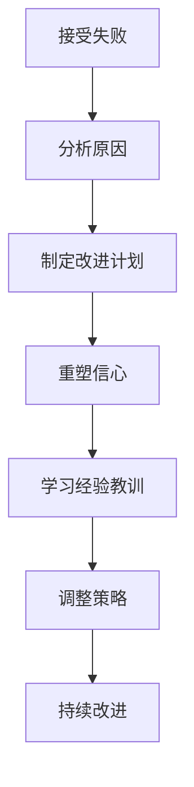

# 领导者如何引导团队面对失败？

## 1.背景介绍

### 1.1 失败的必然性

在当今瞬息万变的商业环境中,失败是无法避免的。无论是创新的尝试、新产品的推出,还是组织的转型升级,都存在着失败的风险。面对失败,许多团队会感到沮丧、士气低落,甚至陷入自我怀疑的困境。因此,如何正确地引导团队面对失败,化解负面情绪,重拾信心,是每一位领导者都必须掌握的关键能力。

### 1.2 失败的价值

尽管失败带来了痛苦和挫折,但它同时也蕴含着宝贵的经验教训。通过反思失败的原因,我们可以发现自身的不足,并采取相应的改进措施。同时,失败也能锻炼团队的韧性和应对挑战的能力,为未来的成功奠定基础。因此,正确看待失败,并从中汲取经验教训,是团队成长和进步的关键。

## 2.核心概念与联系

### 2.1 失败的定义

在探讨如何面对失败之前,我们首先需要明确什么是失败。失败可以被定义为未能实现预期目标或期望结果的情况。它可能源于各种原因,如策略制定不当、执行不力、外部环境变化等。无论原因如何,失败都会给团队带来负面影响,如士气低落、信心受损等。

### 2.2 面对失败的重要性

面对失败并非一件容易的事情,但它对于团队的发展至关重要。正确地面对失败不仅能帮助团队克服负面情绪,还能促进团队反思、学习和成长。同时,它也能增强团队的韧性和应对挑战的能力,为未来的成功奠定基础。

### 2.3 领导力在面对失败中的作用

领导者在引导团队面对失败的过程中扮演着关键角色。他们需要展现出同理心、勇气和决心,为团队树立正面的榜样。同时,领导者还需要采取适当的策略和措施,帮助团队克服失败带来的负面影响,重拾信心和动力。

## 3.核心算法原理具体操作步骤

在引导团队面对失败的过程中,领导者可以遵循以下核心步骤:



### 3.1 接受失败

首先,领导者需要接受失败的事实,并鼓励团队成员做出同样的反应。否认或回避失败只会延缓问题的解决,并可能导致更大的损失。相反,接受失败是解决问题的第一步。

### 3.2 分析原因

接下来,领导者需要与团队一起分析失败的原因。这个过程需要客观、全面和透明,以确保找到根本原因。分析过程中,应该鼓励团队成员坦率地表达意见,并避免相互指责或推卸责任。

### 3.3 制定改进计划

在找到失败原因后,领导者需要与团队一起制定改进计划。该计划应该包括具体的行动步骤、责任分工和时间表,以确保问题得到有效解决。同时,领导者还需要为改进计划提供必要的资源和支持。

### 3.4 重塑信心

失败往往会对团队的信心产生负面影响。因此,领导者需要采取措施重塑团队的信心。这可以通过肯定团队的努力、强调过去的成就,以及阐明未来的机遇等方式来实现。同时,领导者还需要展现出坚定的决心和乐观的态度,为团队树立榜样。

### 3.5 学习经验教训

虽然失败带来了痛苦,但它同时也蕴含着宝贵的经验教训。领导者需要鼓励团队成员反思失败的原因,并从中汲取教训。这些教训不仅可以帮助团队避免重蹈覆辙,还能为未来的成功奠定基础。

### 3.6 调整策略

在吸取了失败教训后,领导者需要与团队一起调整未来的策略。这可能涉及到目标的调整、资源的重新分配,或者流程的优化等方面。调整策略的目的是为了更好地应对未来的挑战,并提高成功的机会。

### 3.7 持续改进

面对失败是一个持续的过程,而非一蹴而就。领导者需要与团队保持紧密的沟通和协作,持续监控改进计划的执行情况,并根据需要进行调整和优化。同时,领导者还需要鼓励团队保持开放的心态,积极寻求新的机遇和创新的方式。

## 4.数学模型和公式详细讲解举例说明

在引导团队面对失败的过程中,我们可以借助一些数学模型和公式来量化和优化决策过程。

### 4.1 决策树模型

决策树模型是一种常用的决策支持工具,它可以帮助我们可视化不同决策选择及其相应的结果。在面对失败时,我们可以使用决策树模型来评估不同的应对策略,并选择最优方案。

假设我们面临一个失败情况,需要决定是否继续当前项目。我们可以构建一个决策树,其中包括三个可能的选择:继续、暂停或终止项目。每个选择都会导致不同的结果,如继续会带来额外的成本和风险,但也可能实现预期目标;暂停则可以暂时减少损失,但可能会错失机会;而终止则意味着彻底放弃,但也避免了进一步的投入。

通过分析每个选择的成本、风险和收益,我们可以计算出每个选择的期望值,并选择期望值最高的选择作为最优决策。具体的计算过程如下:

$$
\begin{aligned}
EV(继续) &= P(成功) \times 收益 - P(失败) \times 成本 \\
EV(暂停) &= P(重启成功) \times 收益 - P(重启失败) \times 成本 - 暂停成本 \\
EV(终止) &= -终止成本
\end{aligned}
$$

其中,EV表示期望值,P表示概率。我们可以根据历史数据和专家判断来估计每个选择的成功概率和相应的收益或成本。

通过比较三个选择的期望值,我们可以选择期望值最高的选择作为最优决策。需要注意的是,这个模型只是一个简化的示例,在实际应用中,我们可能需要考虑更多的因素和约束条件。

### 4.2 蒙特卡罗模拟

在制定改进计划时,我们往往需要评估不同方案的风险和收益。蒙特卡罗模拟是一种常用的风险分析工具,它可以通过重复随机抽样来模拟不确定性的影响。

假设我们需要决定是否投资一个新项目。该项目的收益取决于多个不确定因素,如市场需求、竞争对手的行为、原材料价格等。我们可以使用蒙特卡罗模拟来评估该项目的风险和收益。

具体步骤如下:

1. 确定影响项目收益的关键变量,如销售额、成本等。
2. 为每个变量指定一个概率分布,如正态分布、均匀分布等,以反映其不确定性。
3. 通过随机抽样,从每个变量的概率分布中抽取一个值。
4. 使用抽取的值计算项目的净现值或内部收益率等指标。
5. 重复步骤3和4多次,例如10000次。
6. 分析所有模拟结果的分布,确定项目的风险和收益水平。

通过蒙特卡罗模拟,我们可以获得项目收益的概率分布,从而更好地评估风险和收益。例如,如果模拟结果显示有80%的概率净现值为正,那么该项目的风险相对较低。相反,如果大部分模拟结果的净现值为负,那么该项目的风险就较高。

根据风险和收益的评估结果,我们可以做出是否投资该项目的决策。同时,我们还可以通过调整输入变量的概率分布来测试不同情景下的风险和收益,从而优化决策。

## 5.项目实践:代码实例和详细解释说明

在实际项目中,我们可以使用编程语言来实现上述数学模型和算法,以支持决策过程。以下是一个使用Python实现决策树模型的示例:

```python
import numpy as np

# 定义决策树节点
class DecisionNode:
    def __init__(self, name, cost, utility):
        self.name = name
        self.cost = cost
        self.utility = utility
        self.children = []

    def add_child(self, node):
        self.children.append(node)

    def expected_value(self):
        total_value = 0
        for child in self.children:
            probability = child.utility / sum(n.utility for n in self.children)
            child_value = child.expected_value() * probability
            total_value += child_value
        return total_value - self.cost

# 创建决策树
root = DecisionNode("根节点", 0, 0)

continue_node = DecisionNode("继续", 1000, 0.6)
pause_node = DecisionNode("暂停", 500, 0.3)
terminate_node = DecisionNode("终止", 200, 0.1)

success_node = DecisionNode("成功", 0, 10000)
failure_node = DecisionNode("失败", 0, -5000)

continue_node.add_child(success_node)
continue_node.add_child(failure_node)

restart_success_node = DecisionNode("重启成功", 0, 8000)
restart_failure_node = DecisionNode("重启失败", 0, -3000)

pause_node.add_child(restart_success_node)
pause_node.add_child(restart_failure_node)

root.add_child(continue_node)
root.add_child(pause_node)
root.add_child(terminate_node)

# 计算每个选择的期望值
continue_ev = continue_node.expected_value()
pause_ev = pause_node.expected_value()
terminate_ev = terminate_node.expected_value()

print(f"继续的期望值: {continue_ev}")
print(f"暂停的期望值: {pause_ev}")
print(f"终止的期望值: {terminate_ev}")

# 选择期望值最高的选择
best_choice = max(continue_ev, pause_ev, terminate_ev)
if best_choice == continue_ev:
    print("最优决策是继续")
elif best_choice == pause_ev:
    print("最优决策是暂停")
else:
    print("最优决策是终止")
```

在这个示例中,我们首先定义了一个`DecisionNode`类来表示决策树中的节点。每个节点都有一个名称、成本和效用值。`add_child`方法用于添加子节点,而`expected_value`方法则计算该节点的期望值。

接下来,我们创建了一个决策树,其中包括三个选择:继续、暂停和终止。每个选择都有相应的成本和效用值。继续选择有两个子节点,分别表示成功和失败的情况。暂停选择也有两个子节点,分别表示重启成功和重启失败的情况。

最后,我们计算每个选择的期望值,并选择期望值最高的选择作为最优决策。

这只是一个简单的示例,在实际应用中,您可能需要根据具体情况调整代码,例如添加更多的决策选择、考虑更多的约束条件等。同时,您还可以使用其他编程语言或库来实现这些算法,如R、MATLAB或专门的决策分析软件。

## 6.实际应用场景

引导团队面对失败的技能在各个领域都有广泛的应用,以下是一些典型的场景:

### 6.1 产品开发

在产品开发过程中,失败是难以避免的。新产品可能无法满足市场需求、存在设计缺陷或技术问题等。在这种情况下,领导者需要引导团队正视失败,分析原因,并制定改进计划。同时,他们还需要重塑团队的信心,鼓励团队继续创新和尝试。

### 6.2 组织转型

当组织进行转型升级时,往往会面临各种挑战和阻力。转型计划可能执行不力、员工抗拒变革等,都可能导致失败。领导者需要帮助团队理解转型的必要性,并引导他们从失败中吸