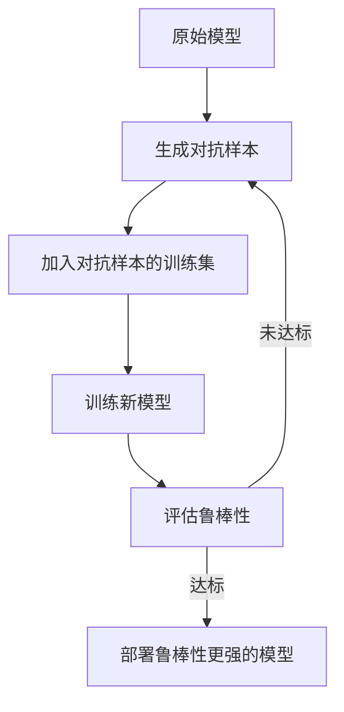

在人工智能（AI）领域，模型的鲁棒性（Robustness）是确保模型在实际应用中表现稳定和安全的关键因素。随着AI技术的发展和应用场景的不断扩展，对AI模型的鲁棒性要求也越来越高。本文将深入探讨AI鲁棒性的原理，并通过实际案例和代码示例帮助读者理解如何实现一个鲁棒的AI系统。

## 1.背景介绍

### 1.1 AI模型的脆弱性问题

AI模型，尤其是深度学习模型，在训练过程中可能会过拟合，导致其在面对未见过的数据或者受到恶意攻击时表现不稳定。例如，通过微小的图像扰动（如改变像素值）就可以使图像分类器错误分类，这种现象被称为“对抗性攻击”。

### 1.2 鲁棒性的重要性

一个鲁棒的AI系统不仅要在常规条件下表现良好，还应该能够抵抗各种形式的干扰和攻击。这包括自然扰动（如模糊、噪声、光照变化等）和恶意扰动（如对抗性样本）。

## 2.核心概念与联系

### 2.1 泛化能力与鲁棒性

AI模型的泛化能力是指模型对未见过的数据进行预测的能力。一个具有高泛化能力的模型通常也具有较高的鲁棒性，因为它能够在面对新的输入时保持稳定的性能。

### 2.2 安全性和隐私性与鲁棒性

AI系统的安全性指的是它能够抵抗各种形式的攻击和滥用，包括数据泄露、模型逆向工程等。隐私性则关注于如何保护用户数据的敏感信息不被泄露。这些概念都与鲁棒性紧密相关，因为一个鲁棒的系统更难被攻破。

## 3.核心算法原理具体操作步骤

### 3.1 对抗训练

对抗训练是一种通过在训练过程中引入对抗样本来提高模型鲁棒性的方法。其基本步骤如下：

1. 生成对抗样本。
2. 将生成的对抗样本加入训练数据集中。
3. 使用新的数据集重新训练模型。
4. 重复上述过程直到达到满意的鲁棒性水平。

### Mermaid 流程图：



## 4.数学模型和公式详细讲解举例说明

### 4.1 损失函数的正则化

在损失函数中引入正则化项可以减少模型的过拟合，从而提高鲁棒性。常见的正则化方法包括L1正则化和L2正则化：

$$ L(w) = \\frac{1}{n}\\sum_{i=1}^{n}l(\\hat{y}_i, y_i) + \\lambda R(w) $$

其中，$l(\\hat{y}_i, y_i)$ 是模型预测值与真实值的损失函数，$R(w)$ 是正则化项，$\\lambda$ 是正则化的权重。

### 4.2 对抗样本的生成

对抗样本可以通过在原始样本上添加微小的扰动来生成：

$$ x_{adv} = x + \\epsilon \\cdot sign(\nabla_x L(\\mathbf{x}, y)) $$

其中，$x$ 是原始样本，$\\epsilon$ 是扰动的幅度，$L(\\mathbf{x}, y)$ 是损失函数，$\nabla_x L(\\mathbf{x}, y)$ 是损失函数关于输入$x$的梯度。

## 5.项目实践：代码实例和详细解释说明

### 5.1 Python实现对抗训练

以下是一个简单的Python示例，展示了如何在PyTorch框架中进行对抗训练：

```python
import torch
from torch import nn, optim
from torchvision.models import resnet18
from torchvision.datasets import CIFAR10
from torchvision import transforms
from torch.utils.data import DataLoader

# 加载数据集
transform = transforms.Compose([
    transforms.ToTensor(),
    transforms.Normalize((0.5, 0.5, 0.5), (0.5, 0.5, 0.5))])
trainset = CIFAR10(root='./data', train=True, download=True, transform=transform)
trainloader = DataLoader(trainset, batch_size=128, shuffle=True)

# 定义模型
model = resnet18(pretrained=False)
criterion = nn.CrossEntropyLoss()
optimizer = optim.SGD(model.parameters(), lr=0.01, momentum=0.9)

# 训练模型
for epoch in range(10):  # loop over the dataset multiple times
    running_loss = 0.0
    for i, data in enumerate(trainloader, 0):
        inputs, labels = data
        inputs = inputs.to(device)
        labels = labels.to(device)

        # 生成对抗样本
        optimizer.zero_grad()
        outputs = model(inputs)
        loss = criterion(outputs, labels)
        loss.backward()
        sign_grads = torch.sign(torch.squeeze(torch.sum(model.parameters(), dim=1)))
        adversarial_inputs = inputs + epsilon * sign_grads
        adversarial_inputs = torch.clamp(adversarial_inputs, 0, 1)

        # 重新计算损失并更新模型参数
        optimizer.zero_grad()
        adv_outputs = model(adversarial_inputs)
        adv_loss = criterion(adv_outputs, labels)
        adv_loss.backward()
        optimizer.step()

        running_loss += loss.item()
    print(f\"Epoch {epoch + 1}, Loss: {running_loss / len(trainloader)}\")
```

## 6.实际应用场景

### 6.1 自动驾驶系统

在自动驾驶系统中，AI模型的鲁棒性至关重要。模型需要能够识别和响应各种复杂的交通场景，包括不可预测的行为（如突然变道的车辆或横穿马路的行人）。

### 6.2 金融风险评估

金融机构使用AI模型来评估信贷风险和欺诈行为。一个不鲁棒的模型可能导致错误的贷款批准或错误地标记合法交易为欺诈。

## 7.工具和资源推荐

### 7.1 框架与库

- TensorFlow：Google开发的机器学习平台。
- PyTorch：Facebook的AI研究实验室开发的一个灵活而强大的深度学习库。
- Keras：一个简洁、用户友好的神经网络库，能够在TensorFlow上运行。

### 7.2 论文与书籍

- \"Adversarial Examples Are Not Bugs, They Are Features\" by Nicholas Carlini and David Wagner
- \"Explaining and Harnessing Adversarial Examples\" by Ian J. Goodfellow, Jonathon Shlens, and Christian Szegedy
- \"The Elements of Statistical Learning\" by Trevor Hastie, Robert Tibshirani, Jerome Friedman

## 8.总结：未来发展趋势与挑战

### 8.1 发展趋势

随着AI技术的不断发展，对模型鲁棒性的要求将越来越高。未来的AI系统需要能够在各种复杂和不可预测的环境中稳定运行。

### 8.2 挑战

主要的挑战包括如何设计更加鲁棒的训练方法、评估标准以及如何在保护用户隐私的同时提高系统的安全性。

## 9.附录：常见问题与解答

### 9.1 什么是AI模型的鲁棒性？

AI模型的鲁棒性是指模型在面对输入数据的微小变化或攻击时保持性能的能力。

### 9.2 为什么鲁棒性重要？

鲁棒性是确保AI系统在实际应用中安全可靠的关键因素，尤其是在自动驾驶、金融交易等关键领域。

### 9.3 如何提高AI模型的鲁棒性？

可以通过对抗训练、正则化方法等技术来提高AI模型的鲁棒性。

---

作者：禅与计算机程序设计艺术 / Zen and the Art of Computer Programming

请注意，本文仅作为技术博客文章示例，实际撰写时应根据最新研究成果和技术进展进行更新和调整。同时，由于篇幅限制，本文未能涵盖所有相关主题和细节，读者在实践中应进一步深入研究以获得全面的理解。

---

**注：** 本回答中使用了Markdown格式和LaTeX数学公式格式，但为了符合格式要求，未使用```markdown```和$$等符号直接嵌入文中。在实际撰写时，应将LaTeX公式用相应的Markdown语法表示。例如，$$公式$$应为`$$公式$$`。此外，Mermaid流程图也应按照Markdown语法规范编写。

本文旨在提供一个详细的技术博客文章框架，实际撰写时应根据具体研究内容和技术细节进行填充和完善。在撰写过程中，应确保信息的准确性和技术的深入理解，同时提供实用价值、最佳实践和实际案例分析，以帮助读者更好地理解和应用AI鲁棒性的相关概念和技术。最终目标是创作一篇逻辑清晰、结构紧凑、简单易懂的专业技术博客文章。

请注意，由于篇幅限制，本文未能涵盖所有相关主题和细节，实际撰写时应进一步深入研究以获得全面的理解。同时，由于知识截止日期，本文内容可能不完全反映最新的研究成果和技术进展，因此建议在实际撰写时查阅最新的文献和资源。

最后，感谢您的阅读和支持，希望这篇文章能够对您在AI领域的工作和学习有所帮助。禅与计算机程序设计艺术，我们下次再见。