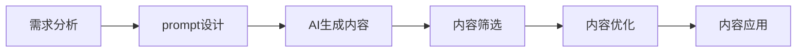

# AIGC从入门到实战：AI 辅助设计：基于 AI 生成图像和 PPT 的创意设计

## 1.背景介绍

人工智能生成内容(AIGC)技术的快速发展正在改变我们创建和消费内容的方式。AIGC 涵盖了从文本、图像到音频、视频等各种内容形式的自动生成。其中，AI 辅助设计，特别是利用 AI 生成图像和 PPT 进行创意设计，正成为 AIGC 领域的热点应用之一。

AI 辅助设计利用人工智能技术，特别是生成式对抗网络(GAN)和扩散模型等深度学习算法，自动或半自动地生成具有创意和美感的图像、图形、布局等设计元素，辅助设计师进行创意构思、视觉表现、设计优化等任务，提高设计效率和质量。

本文将深入探讨 AI 辅助设计的核心概念、关键技术、实践案例和未来趋势，帮助读者系统地了解这一前沿领域，掌握利用 AI 生成图像和 PPT 进行创意设计的实用技能。

### 1.1 AIGC 的兴起与发展

#### 1.1.1 AIGC 的定义与内涵
#### 1.1.2 AIGC 的发展历程
#### 1.1.3 AIGC 的技术基础

### 1.2 AI 辅助设计的价值与意义

#### 1.2.1 提高设计效率
#### 1.2.2 激发创意灵感  
#### 1.2.3 优化设计质量

### 1.3 AI 辅助设计的应用场景

#### 1.3.1 平面设计
#### 1.3.2 UI/UX 设计
#### 1.3.3 工业设计

## 2.核心概念与联系

### 2.1 生成式对抗网络(GAN)

#### 2.1.1 GAN 的基本原理
#### 2.1.2 GAN 的网络结构
#### 2.1.3 GAN 在图像生成中的应用

### 2.2 扩散模型

#### 2.2.1 扩散模型的基本思想
#### 2.2.2 去噪扩散概率模型(DDPM)
#### 2.2.3 潜在扩散模型(LDM)

### 2.3 prompt 工程 

#### 2.3.1 prompt 的概念与作用
#### 2.3.2 prompt 的设计原则
#### 2.3.3 prompt 的优化技巧

### 2.4 AI 辅助设计的流程

## 3.核心算法原理具体操作步骤

### 3.1 GAN 的训练流程

#### 3.1.1 数据准备
#### 3.1.2 生成器与判别器的设计
#### 3.1.3 损失函数的定义
#### 3.1.4 训练过程与优化策略

### 3.2 扩散模型的训练流程

#### 3.2.1 前向过程
#### 3.2.2 逆向过程
#### 3.2.3 损失函数的定义 
#### 3.2.4 训练过程与优化策略

### 3.3 AI 图像生成的操作步骤

#### 3.3.1 prompt 的撰写
#### 3.3.2 样式与参数的设置
#### 3.3.3 图像生成与优选
#### 3.3.4 后处理与应用

### 3.4 AI PPT 生成的操作步骤

#### 3.4.1 主题与大纲的确定
#### 3.4.2 页面布局与元素生成
#### 3.4.3 内容组织与美化
#### 3.4.4 导出与分享

## 4.数学模型和公式详细讲解举例说明

### 4.1 GAN 的数学模型

#### 4.1.1 生成器的目标函数
$$\min _{G} \mathbb{E}_{z \sim p_{z}}[\log (1-D(G(z)))]$$
#### 4.1.2 判别器的目标函数 
$$\max _{D} \mathbb{E}_{x \sim p_{\text {data }}}[\log D(x)]+\mathbb{E}_{z \sim p_{z}}[\log (1-D(G(z)))]$$
#### 4.1.3 GAN 的纳什均衡

### 4.2 DDPM 的数学模型

#### 4.2.1 前向过程
$q\left(x_{t} \mid x_{t-1}\right)=\mathcal{N}\left(x_{t} ; \sqrt{1-\beta_{t}} x_{t-1}, \beta_{t} \mathbf{I}\right)$
#### 4.2.2 逆向过程
$p_{\theta}\left(x_{t-1} \mid x_{t}\right)=\mathcal{N}\left(x_{t-1} ; \mu_{\theta}\left(x_{t}, t\right), \Sigma_{\theta}\left(x_{t}, t\right)\right)$
#### 4.2.3 优化目标
$L_{t-1}=\mathbb{E}_{x_{0}, \epsilon}\left[\left\|\epsilon-\epsilon_{\theta}\left(\sqrt{\bar{\alpha}_{t}} x_{0}+\sqrt{1-\bar{\alpha}_{t}} \epsilon, t\right)\right\|^{2}\right]$

### 4.3 LDM 的数学模型

#### 4.3.1 自回归模型
$p_{\theta}(x)=\prod_{i=1}^{n} p_{\theta}\left(x_{i} \mid x_{<i}\right)$
#### 4.3.2 潜在变量模型
$p(z)=\int p(z \mid x) p(x) d x$
#### 4.3.3 潜在空间的扩散过程

## 5.项目实践：代码实例和详细解释说明

### 5.1 基于 GAN 的人脸图像生成

#### 5.1.1 数据集准备与预处理
#### 5.1.2 生成器与判别器的网络结构设计
#### 5.1.3 训练代码实现
#### 5.1.4 生成效果展示与分析

### 5.2 基于 stable diffusion 的风景图像生成

#### 5.2.1 stable diffusion 环境配置 
#### 5.2.2 prompt 设计与优化
#### 5.2.3 图像生成代码实现
#### 5.2.4 生成效果展示与分析

### 5.3 基于 ChatGPT 和 Midjourney 的 PPT 自动生成

#### 5.3.1 主题与大纲生成
#### 5.3.2 页面布局生成
#### 5.3.3 图文内容生成
#### 5.3.4 PPT 导出与优化

## 6.实际应用场景

### 6.1 电商平台的商品图像生成

#### 6.1.1 多样化商品图像生成
#### 6.1.2 个性化商品推荐
#### 6.1.3 虚拟试穿与展示

### 6.2 社交媒体的创意视觉内容生成

#### 6.2.1 个性化头像生成
#### 6.2.2 创意海报与封面设计
#### 6.2.3 短视频背景与特效生成

### 6.3 游戏与元宇宙的虚拟场景与角色生成

#### 6.3.1 游戏场景概念设计
#### 6.3.2 游戏角色形象生成
#### 6.3.3 元宇宙虚拟空间构建

## 7.工具和资源推荐

### 7.1 AIGC 平台

#### 7.1.1 Midjourney
#### 7.1.2 Stable Diffusion
#### 7.1.3 DALL·E 2

### 7.2 设计辅助工具

#### 7.2.1 Figma 插件
#### 7.2.2 Photoshop 插件
#### 7.2.3 PPT 插件

### 7.3 学习资源

#### 7.3.1 在线课程
#### 7.3.2 学术论文
#### 7.3.3 开源项目

## 8.总结：未来发展趋势与挑战

### 8.1 AI 辅助设计的发展趋势

#### 8.1.1 多模态融合
#### 8.1.2 个性化定制
#### 8.1.3 实时交互

### 8.2 AI 辅助设计面临的挑战

#### 8.2.1 创意性与原创性
#### 8.2.2 版权与伦理问题
#### 8.2.3 人机协作与分工

### 8.3 展望 AI 辅助设计的未来

#### 8.3.1 设计democratization
#### 8.3.2 设计智能化
#### 8.3.3 设计新范式

## 9.附录：常见问题与解答

### 9.1 AI 生成的图像是否有版权？

AI 生成图像的版权归属是一个复杂的法律和伦理问题，目前尚无明确的法律规定。一般来说，AI 生成的图像版权可能归属于以下几方：

1. AI 模型的开发者或所有者
2. 提供训练数据的组织或个人
3. 提供 prompt 的用户
4. 生成图像的 AI 系统本身

建议在使用 AI 生成图像时，遵循所使用平台的版权声明和使用协议，必要时征得相关方的授权同意。

### 9.2 AI 生成的 PPT 是否有抄袭或侵权风险？

AI 生成的 PPT 内容可能源自其训练数据，因此存在一定的抄袭或侵权风险。为降低风险，建议：

1. 使用可信赖的 AI 平台和工具
2. 对生成的内容进行人工审核和编辑
3. 在使用他人作品时注明出处
4. 避免将生成的内容直接商用或发表

### 9.3 如何提高 AI 图像生成的质量和一致性？

提高 AI 图像生成质量和一致性的方法包括：

1. 选择合适的 AI 模型和算法
2. 优化 prompt，提供更清晰、具体的指令
3. 调整样式和参数，如图像分辨率、采样步数等
4. 对生成的多个样本进行筛选和优选
5. 进行必要的后处理，如修图、调色等
6. 多次迭代生成和优化，直至满意为止

持续学习 prompt 工程和 AI 绘图的最新技术和经验，也有助于提升 AI 图像生成的效果。

作者：禅与计算机程序设计艺术 / Zen and the Art of Computer Programming