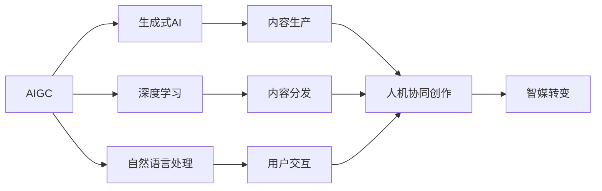

# AIGC从入门到实战：AIGC 在传媒行业的创新场景—人机协同创作，推动传媒向智媒转变

## 1. 背景介绍
### 1.1 AIGC的兴起与发展
#### 1.1.1 AIGC的定义与内涵
#### 1.1.2 AIGC技术的发展历程
#### 1.1.3 AIGC在各行各业的应用现状

### 1.2 传媒行业的数字化转型
#### 1.2.1 传统媒体面临的挑战
#### 1.2.2 新媒体的崛起与影响
#### 1.2.3 传媒行业数字化转型的必要性

### 1.3 AIGC在传媒行业的应用前景
#### 1.3.1 AIGC助力内容生产
#### 1.3.2 AIGC优化用户体验
#### 1.3.3 AIGC推动传媒行业智能化升级

## 2. 核心概念与联系
### 2.1 AIGC的核心概念
#### 2.1.1 生成式AI
#### 2.1.2 深度学习
#### 2.1.3 自然语言处理

### 2.2 AIGC与传媒行业的关联
#### 2.2.1 内容生产
#### 2.2.2 内容分发
#### 2.2.3 用户交互

### 2.3 人机协同创作的内涵
#### 2.3.1 人机协同的定义
#### 2.3.2 人机协同创作的优势
#### 2.3.3 人机协同创作的实现路径



## 3. 核心算法原理具体操作步骤
### 3.1 Transformer模型
#### 3.1.1 Transformer的网络结构
#### 3.1.2 Self-Attention机制
#### 3.1.3 位置编码

### 3.2 GPT系列模型
#### 3.2.1 GPT模型的发展历程
#### 3.2.2 GPT模型的训练方法
#### 3.2.3 GPT模型的应用场景

### 3.3 DALL-E模型
#### 3.3.1 DALL-E模型的原理
#### 3.3.2 DALL-E模型的训练数据
#### 3.3.3 DALL-E模型的生成效果

## 4. 数学模型和公式详细讲解举例说明
### 4.1 Transformer的数学原理
#### 4.1.1 Self-Attention的计算公式
给定一个输入序列 $X=(x_1,x_2,...,x_n)$，Self-Attention的计算过程如下：

1. 计算Query矩阵 $Q$，Key矩阵 $K$ 和 Value矩阵 $V$：
$$
\begin{aligned}
Q &= XW^Q \\
K &= XW^K \\
V &= XW^V
\end{aligned}
$$
其中，$W^Q, W^K, W^V$ 是可学习的权重矩阵。

2. 计算Attention权重矩阵 $A$：
$$
A = \text{softmax}(\frac{QK^T}{\sqrt{d_k}})
$$
其中，$d_k$ 是Key向量的维度。

3. 计算Attention输出 $Z$：
$$
Z = AV
$$

#### 4.1.2 位置编码的计算公式
对于位置 $pos$ 和维度 $i$，位置编码 $PE_{(pos,2i)}$ 和 $PE_{(pos,2i+1)}$ 的计算公式如下：
$$
\begin{aligned}
PE_{(pos,2i)} &= \sin(pos/10000^{2i/d_{model}}) \\
PE_{(pos,2i+1)} &= \cos(pos/10000^{2i/d_{model}})
\end{aligned}
$$
其中，$d_{model}$ 是模型的维度。

### 4.2 GPT模型的数学原理
#### 4.2.1 语言模型的概率计算
给定一个文本序列 $X=(x_1,x_2,...,x_n)$，语言模型的目标是计算序列的概率 $P(X)$：
$$
P(X) = \prod_{i=1}^n P(x_i|x_1,x_2,...,x_{i-1})
$$

#### 4.2.2 Transformer Decoder的计算过程
GPT模型使用Transformer Decoder作为主要组件，其计算过程如下：

1. 对输入序列进行Embedding和位置编码：
$$
H^0 = \text{Embedding}(X) + \text{PositionalEncoding}(X)
$$

2. 通过多个Transformer Decoder层进行计算：
$$
H^l = \text{TransformerDecoder}(H^{l-1}), l=1,2,...,L
$$

3. 对最后一层的输出进行线性变换和Softmax，得到下一个词的概率分布：
$$
P(x_i|x_1,x_2,...,x_{i-1}) = \text{softmax}(H^L_iW + b)
$$

### 4.3 DALL-E模型的数学原理
#### 4.3.1 VAE的概率图模型
DALL-E模型使用VAE（变分自编码器）作为生成模型，其概率图模型如下：

其中，$Z$ 是隐变量，$X$ 是观测变量。

#### 4.3.2 ELBO损失函数
VAE的训练目标是最大化ELBO（Evidence Lower Bound）：
$$
\text{ELBO} = \mathbb{E}_{q_{\phi}(Z|X)}[\log p_{\theta}(X|Z)] - D_{KL}(q_{\phi}(Z|X)||p(Z))
$$
其中，$q_{\phi}(Z|X)$ 是近似后验分布，$p_{\theta}(X|Z)$ 是解码器，$p(Z)$ 是先验分布，$D_{KL}$ 是KL散度。

## 5. 项目实践：代码实例和详细解释说明
### 5.1 使用GPT-2模型生成新闻文章
```python
import torch
from transformers import GPT2LMHeadModel, GPT2Tokenizer

# 加载预训练的GPT-2模型和Tokenizer
model = GPT2LMHeadModel.from_pretrained('gpt2')
tokenizer = GPT2Tokenizer.from_pretrained('gpt2')

# 设置生成参数
max_length = 500
num_return_sequences = 3
prompt = "In recent news,"

# 对提示词进行编码
input_ids = tokenizer.encode(prompt, return_tensors='pt')

# 生成文本
output = model.generate(input_ids, 
                        max_length=max_length,
                        num_return_sequences=num_return_sequences,
                        no_repeat_ngram_size=2,
                        early_stopping=True)

# 解码并打印生成的文本
for i in range(num_return_sequences):
    generated_text = tokenizer.decode(output[i], skip_special_tokens=True)
    print(f"Generated Text {i+1}:\n{generated_text}\n")
```

以上代码使用预训练的GPT-2模型，根据给定的提示词"In recent news,"生成3篇新闻文章。主要步骤如下：

1. 加载预训练的GPT-2模型和Tokenizer。
2. 设置生成参数，包括最大长度、生成序列数量和提示词。
3. 对提示词进行编码，转换为模型可接受的输入格式。
4. 调用模型的generate方法生成文本，设置相关参数以控制生成过程。
5. 解码生成的文本，并打印输出结果。

### 5.2 使用DALL-E模型生成图像
```python
import torch
from dall_e import map_pixels, unmap_pixels, load_model

# 加载预训练的DALL-E模型
model = load_model("https://cdn.openai.com/dall-e/encoder.pkl", 
                   "https://cdn.openai.com/dall-e/decoder.pkl")

# 设置生成参数
text = "a red cat sitting on a bench"
num_images = 4

# 对文本进行编码
text_tokens = tokenize_text(text)
text_tokens = torch.tensor(text_tokens).unsqueeze(0).to(device)

# 生成图像
z = torch.randn(num_images, model.latent_dim).to(device)
z = model.encoder(z, text_tokens)
x_hat = model.decoder(z)
x_hat = torch.clamp(x_hat, -0.5, 0.5)
images = unmap_pixels(x_hat)

# 显示生成的图像
for i, image in enumerate(images):
    plt.subplot(1, num_images, i+1)
    plt.imshow(image)
    plt.axis('off')
plt.show()
```

以上代码使用预训练的DALL-E模型，根据给定的文本描述"a red cat sitting on a bench"生成4张相关图像。主要步骤如下：

1. 加载预训练的DALL-E编码器和解码器模型。
2. 设置生成参数，包括文本描述和生成图像数量。
3. 对文本进行编码，转换为模型可接受的输入格式。
4. 随机采样隐空间向量，并使用编码器将其与文本编码进行融合。
5. 使用解码器将融合后的隐空间向量解码为图像。
6. 对生成的图像进行后处理，并显示结果。

## 6. 实际应用场景
### 6.1 新闻自动生成
AIGC技术可以根据给定的关键词、主题或事件自动生成新闻文章，提高新闻生产效率，缓解记者的工作压力。生成的新闻文章可以作为初稿，再由人工进行编辑和修改，实现人机协同创作。

### 6.2 个性化内容推荐
AIGC技术可以根据用户的兴趣爱好、历史行为等数据，自动生成个性化的内容推荐，如新闻、视频、广告等。个性化推荐可以提高用户的满意度和忠诚度，增强用户粘性。

### 6.3 智能写作助手
AIGC技术可以作为智能写作助手，为作者提供写作灵感、素材、结构等方面的建议和辅助。例如，自动生成文章大纲、关键词扩展、句子优化等。智能写作助手可以提高写作效率和质量，降低创作门槛。

### 6.4 虚拟主播/记者
AIGC技术可以生成逼真的虚拟人物形象，并配以自然的语音和表情，充当虚拟主播或记者。虚拟主播/记者可以自动生成新闻播报、天气预报、体育赛事解说等内容，24小时不间断工作，节省人力成本。

### 6.5 智能客服
AIGC技术可以生成智能客服，自动回答用户的常见问题，提供相关的信息和服务。智能客服可以通过文本、语音、图像等多种方式与用户交互，提供全天候的客户支持，提升用户体验。

## 7. 工具和资源推荐
### 7.1 开源框架
- TensorFlow: https://www.tensorflow.org/
- PyTorch: https://pytorch.org/
- Keras: https://keras.io/
- Hugging Face Transformers: https://huggingface.co/transformers/

### 7.2 预训练模型
- GPT-2: https://openai.com/blog/better-language-models/
- GPT-3: https://openai.com/blog/openai-api/
- BERT: https://github.com/google-research/bert
- DALL-E: https://openai.com/blog/dall-e/

### 7.3 数据集
- Common Crawl: https://commoncrawl.org/
- Wikipedia: https://www.wikipedia.org/
- ImageNet: http://www.image-net.org/
- COCO: https://cocodataset.org/

### 7.4 学习资源
- 吴恩达的深度学习课程: https://www.coursera.org/specializations/deep-learning
- 李沐的动手学深度学习: https://zh.d2l.ai/
- fast.ai的实用深度学习课程: https://course.fast.ai/
- OpenAI的GPT系列论文: https://openai.com/blog/tags/gpt/

## 8. 总结：未来发展趋势与挑战
### 8.1 AIGC技术的发展趋势
- 模型的规模和性能不断提升
- 多模态融合成为主流方向
- 人机协同创作模式日益深化
- 个性化和交互性不断增强

### 8.2 AIGC在传媒行业的应用前景
- 提高内容生产效率和质量
- 实现内容的智能分发和推荐
- 创新内容呈现和交互形式
- 重塑传媒行业的商业模式

### 8.3 AIGC技术面临的挑战
- 算法的可解释性和可控性
- 生成内容的真实性和可信度
- 知识产权和伦