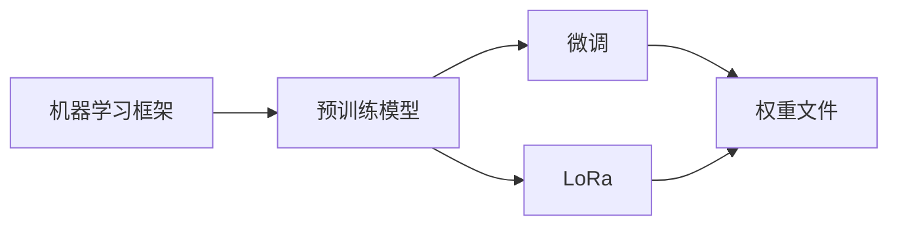

# AIGC从入门到实战：安装权重文件和 LoRa 模型文件

## 1.背景介绍

人工智能生成内容(AIGC)技术正在迅速发展,为各行各业带来革命性的变革。作为一名AI开发者或爱好者,掌握AIGC模型的部署和使用至关重要。本文将深入探讨如何安装权重文件和LoRa模型文件,帮助你快速上手AIGC开发。

### 1.1 AIGC的兴起与应用前景

AIGC利用深度学习算法,通过训练海量数据,生成与人类创作难以区分的图像、文本、音频、视频等内容。它在内容创作、游戏开发、虚拟助手、教育培训等领域展现出巨大潜力。

### 1.2 模型权重与LoRa的重要性

AIGC模型的核心是训练得到的模型参数,即权重文件。不同的权重对应不同的生成效果。LoRa(Low-Rank Adaptation)是一种参数高效微调技术,可以在保留原模型性能的同时,用少量参数对模型进行定制化调优,极大提升了AIGC的灵活性。

### 1.3 安装配置的技术挑战

安装权重文件和LoRa涉及复杂的环境配置、兼容性处理、模型格式转换等。稍有不慎就会导致模型加载失败,影响开发进度。本文将逐一攻克这些技术难点,让你轻松上手。

## 2.核心概念与联系

在深入安装细节前,我们先来了解一些核心概念:

### 2.1 机器学习框架

主流的机器学习框架有PyTorch、TensorFlow、Keras等。它们提供了构建和训练模型的基础设施。掌握至少一种框架是开展AIGC工作的前提。

### 2.2 预训练模型

预训练模型是在大规模数据上训练得到的通用模型,包含了丰富的特征表示能力。常见的如GPT系列语言模型、Stable Diffusion图像生成模型等。它们是进一步微调的基础。

### 2.3 微调与LoRa

微调(Fine-tuning)是在特定任务数据上,调整预训练模型参数,使其更好地适应任务的过程。传统微调需要更新全部或大部分参数。LoRa则通过引入低秩分解矩阵,用少量参数捕捉任务信息,大幅提高微调效率。

### 2.4 权重格式

不同框架的模型权重有不同的存储格式,如PyTorch的.pt/.pth、TensorFlow的.ckpt等。在使用时需要进行匹配和转换。

下面是这些概念间的关系示意图:



## 3.核心算法原理具体操作步骤

### 3.1 传统微调步骤

1. 加载预训练模型权重
2. 替换模型的输出层,匹配任务类别数
3. 选择优化器和损失函数
4. 在任务数据上进行训练,更新全部或大部分模型参数
5. 保存微调后的权重文件

### 3.2 LoRa微调步骤 

1. 加载预训练模型权重
2. 在每个需要调优的层后插入LoRa层
3. 冻结预训练模型参数,只更新LoRa层参数
4. 选择优化器和损失函数
5. 在任务数据上进行训练
6. 保存LoRa权重文件

LoRa层结构如下:

$$W_{lora} = W + AB^T$$

其中$W$是原始权重矩阵,$A$和$B$是低秩分解矩阵。训练时只更新$A$和$B$。

## 4.数学模型和公式详细讲解举例说明

### 4.1 LoRa的矩阵分解

设原始权重矩阵$W \in \mathbb{R}^{d \times k}$,LoRa引入两个小矩阵$A \in \mathbb{R}^{d \times r}$和$B \in \mathbb{R}^{k \times r}$,其中$r \ll min(d,k)$。则LoRa权重为:

$$W_{lora} = W + AB^T$$

$r$的取值控制了LoRa权重的秩,$r$越小,可训练参数越少。通常$r$取值在1到32之间。

举例说明,假设:
- 原始权重矩阵$W$形状为$100 \times 50$,共5000个参数。
- 取$r=10$,则$A$形状为$100 \times 10$,$B$形状为$50 \times 10$,LoRa总参数量为1500。
- 参数压缩比为$1500/5000=0.3$,即减少了70%的参数。

### 4.2 LoRa前向传播

设输入$x \in \mathbb{R}^{b \times d}$,其中$b$为批大小。则LoRa层输出为:

$$h_{lora}(x) = x(W + AB^T) = xW + (xA)B^T$$

LoRa前向传播只需先计算$xA$,再右乘$B^T$,避免了大矩阵乘法,计算高效。

## 5.项目实践：代码实例和详细解释说明

下面以PyTorch为例,展示LoRa层的代码实现:

```python
class LoRALayer(nn.Module):
    def __init__(self, in_features, out_features, r=8):
        super().__init__()
        self.r = r
        self.lora_A = nn.Parameter(torch.zeros(in_features, r))
        self.lora_B = nn.Parameter(torch.zeros(out_features, r))
        self.scaling = self.r / 8

    def forward(self, x):
        t = x @ self.lora_A
        t = t * self.scaling
        return t @ self.lora_B.T
```

主要说明:
- `__init__`方法定义了LoRa层的超参数,包括输入输出维度和秩$r$。`lora_A`和`lora_B`是可训练参数。
- `forward`方法实现了LoRa前向传播。先计算$xA$,再缩放,最后右乘$B^T$。
- `scaling`参数用于控制LoRa输出的尺度,避免过大的更新幅度。

在实际使用时,我们将LoRa层插入到预训练模型中:

```python
class MyModel(nn.Module):
    def __init__(self, pretrained_model, r=8):
        super().__init__()
        self.pretrained = pretrained_model
        self.lora = LoRALayer(pretrained_model.config.hidden_size, pretrained_model.config.hidden_size, r)

    def forward(self, x):
        outputs = self.pretrained(x)
        hidden_states = outputs.last_hidden_state
        hidden_states = hidden_states + self.lora(hidden_states)
        return hidden_states
```

这里我们在预训练模型的最后一层后添加了LoRa层。前向传播时,LoRa的输出与原始隐藏状态相加,得到调优后的特征表示。

## 6.实际应用场景

LoRa在AIGC领域有广泛应用:

### 6.1 个性化对话生成

将LoRa应用于对话生成模型如ChatGPT,可以在少量个性化语料上微调,生成具有特定风格、知识背景的回复,满足垂直领域需求。

### 6.2 定制化图像生成

利用LoRa微调扩散模型如Stable Diffusion,可以快速适应特定主题、艺术风格的图像生成任务,如二次元、写实风景等。

### 6.3 音频处理

LoRa可用于语音合成、音频分类等任务,在保留预训练模型性能的同时,快速适应说话人、音色、语言等特征。

## 7.工具和资源推荐

- PyTorch官方教程: https://pytorch.org/tutorials/
- Hugging Face Transformers文档: https://huggingface.co/docs/transformers/
- LoRA官方实现: https://github.com/microsoft/LoRA 
- Stable Diffusion LoRA训练脚本: https://github.com/cloneofsimo/lora
- 微调框架AdaLora: https://github.com/zhuoni9718/AdaLora

## 8.总结：未来发展趋势与挑战

LoRa作为一种参数高效的微调方法,极大推动了AIGC的发展。展望未来,LoRa有望与其他技术相结合,进一步提升性能和效率:

- LoRa + 知识蒸馏:利用蒸馏技术压缩LoRa微调后的模型,实现参数量和推理速度的双重优化。
- LoRa + 强化学习:将LoRa与强化学习结合,实现模型在线调优,自适应用户反馈。
- LoRa + 联邦学习:利用联邦学习框架,实现LoRa在分布式数据上的训练,保护用户隐私。

同时,LoRa也面临一些挑战:

- 超参数选择:LoRa的性能对秩 $r$ 等超参数敏感,需要进行反复调试。自动化搜索是未来重点研究方向。
- 模型泛化:如何保证LoRa微调后的模型在样本外数据上的泛化能力,避免过拟合,仍需深入探索。
- 负面影响:LoRa生成的内容可能具有偏见、违法等风险,需要加强伦理规范和内容审核。

总之,LoRa为AIGC注入了新的活力,相信通过不断的理论创新和工程实践,LoRa将助力AIGC在更广阔的场景中释放潜力,造福人类社会。

## 9.附录：常见问题与解答

### Q1: LoRa支持哪些机器学习框架?

目前主流的PyTorch、TensorFlow、Keras等框架都有LoRa的实现,可以方便地集成到现有项目中。

### Q2: LoRa适用于哪些类型的模型?

LoRa对Transformer结构的模型如GPT、BERT、ViT等效果最佳。对于CNN、RNN等结构,LoRa的性能提升相对有限。

### Q3: LoRa权重文件可以直接部署吗?

不可以。LoRa权重文件只保存了增量参数,使用时需要先加载预训练模型权重,再叠加LoRa权重,才能得到完整的微调后模型。

### Q4: LoRa微调需要多少数据量?

LoRa的数据效率很高,一般只需几十到几百条任务相关数据就可以取得不错的效果。当然,数据量越大,模型性能越稳定。

### Q5: LoRa对计算资源有什么要求?

得益于参数量的大幅减少,LoRa的训练和推理对算力、显存的要求远低于传统微调,一般的消费级GPU就可以完成。

作者：禅与计算机程序设计艺术 / Zen and the Art of Computer Programming