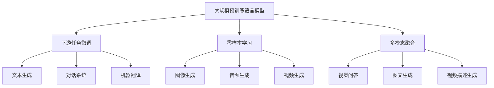

# AIGC从入门到实战：超强的"文科状元"

## 1. 背景介绍
### 1.1 AIGC的兴起
#### 1.1.1 人工智能的发展历程
#### 1.1.2 AIGC的概念与特点
#### 1.1.3 AIGC的应用前景

### 1.2 AIGC的重要性
#### 1.2.1 AIGC在内容生产领域的价值
#### 1.2.2 AIGC对传统行业的影响
#### 1.2.3 AIGC在未来社会中的地位

## 2. 核心概念与联系
### 2.1 AIGC的核心概念
#### 2.1.1 生成式AI
#### 2.1.2 自然语言处理
#### 2.1.3 计算机视觉
#### 2.1.4 深度学习

### 2.2 AIGC的技术架构
#### 2.2.1 Transformer模型
#### 2.2.2 对抗生成网络(GAN)
#### 2.2.3 扩散模型(Diffusion Model)

### 2.3 AIGC的关键技术
#### 2.3.1 预训练语言模型
#### 2.3.2 迁移学习
#### 2.3.3 多模态融合
#### 2.3.4 强化学习

### 2.4 AIGC技术架构图


## 3. 核心算法原理具体操作步骤
### 3.1 Transformer模型
#### 3.1.1 自注意力机制
#### 3.1.2 多头注意力
#### 3.1.3 位置编码
#### 3.1.4 前馈神经网络
#### 3.1.5 残差连接与Layer Normalization

### 3.2 对抗生成网络(GAN)  
#### 3.2.1 生成器与判别器
#### 3.2.2 损失函数设计
#### 3.2.3 训练过程优化

### 3.3 扩散模型(Diffusion Model)
#### 3.3.1 前向扩散过程
#### 3.3.2 反向去噪过程  
#### 3.3.3 条件扩散模型

## 4. 数学模型和公式详细讲解举例说明
### 4.1 Transformer的数学原理
#### 4.1.1 自注意力机制的数学表示
$Attention(Q,K,V) = softmax(\frac{QK^T}{\sqrt{d_k}})V$
其中$Q$是查询矩阵，$K$是键矩阵，$V$是值矩阵，$d_k$是$K$的维度。

#### 4.1.2 多头注意力的数学表示  
$$
\begin{aligned}
MultiHead(Q,K,V) &= Concat(head_1,...,head_h)W^O \\
head_i &= Attention(QW_i^Q, KW_i^K, VW_i^V)
\end{aligned}
$$
其中$W_i^Q \in \mathbb{R}^{d_{model} \times d_k}$，$W_i^K \in \mathbb{R}^{d_{model} \times d_k}$，$W_i^V \in \mathbb{R}^{d_{model} \times d_v}$，$W^O \in \mathbb{R}^{hd_v \times d_{model}}$。

#### 4.1.3 位置编码的数学表示
$$
\begin{aligned}
PE_{(pos,2i)} &= sin(pos / 10000^{2i/d_{model}}) \\  
PE_{(pos,2i+1)} &= cos(pos / 10000^{2i/d_{model}})
\end{aligned}
$$
其中$pos$是位置，$i$是维度，$d_{model}$是词嵌入维度。

### 4.2 GAN的数学原理
#### 4.2.1 GAN的目标函数
$$\min_G \max_D V(D,G) = \mathbb{E}_{x \sim p_{data}(x)}[logD(x)] + \mathbb{E}_{z \sim p_z(z)}[log(1-D(G(z)))]$$
其中$G$是生成器，$D$是判别器，$p_{data}$是真实数据分布，$p_z$是随机噪声分布。

#### 4.2.2 WGAN的目标函数
$$\min_G \max_{D \in \mathcal{D}} \mathbb{E}_{x \sim \mathbb{P}_r}[D(x)] - \mathbb{E}_{x \sim \mathbb{P}_g}[D(x)]$$
其中$\mathcal{D}$是判别器函数的集合，$\mathbb{P}_r$是真实数据分布，$\mathbb{P}_g$是生成数据分布。

### 4.3 扩散模型的数学原理 
#### 4.3.1 前向扩散过程
$$q(x_t|x_{t-1}) = \mathcal{N}(x_t; \sqrt{1-\beta_t} x_{t-1}, \beta_t \mathbf{I})$$
其中$\beta_t$是扩散率，$\mathbf{I}$是单位矩阵。

#### 4.3.2 反向去噪过程
$$p_\theta(x_{t-1}|x_t) = \mathcal{N}(x_{t-1}; \mu_\theta(x_t, t), \Sigma_\theta(x_t, t))$$  
其中$\mu_\theta$和$\Sigma_\theta$是神经网络预测的均值和方差。

## 5. 项目实践：代码实例和详细解释说明
### 5.1 使用Hugging Face的Transformers库进行文本生成
```python
from transformers import GPT2LMHeadModel, GPT2Tokenizer

model = GPT2LMHeadModel.from_pretrained('gpt2')
tokenizer = GPT2Tokenizer.from_pretrained('gpt2')

prompt = "Artificial intelligence will"
input_ids = tokenizer.encode(prompt, return_tensors='pt')

output = model.generate(input_ids, max_length=100, num_return_sequences=1)
generated_text = tokenizer.decode(output[0], skip_special_tokens=True)

print(generated_text)
```
上述代码使用了预训练的GPT-2模型，通过给定的提示词"Artificial intelligence will"生成了一段文本。`generate`函数可以控制生成文本的最大长度、生成序列的数量等参数。

### 5.2 使用PyTorch实现GAN生成手写数字图像
```python
import torch
import torch.nn as nn
import torchvision.datasets as dsets
import torchvision.transforms as transforms
from torch.autograd import Variable

# 生成器
class Generator(nn.Module):
    def __init__(self, input_size, hidden_size, output_size):
        super(Generator, self).__init__()
        self.fc1 = nn.Linear(input_size, hidden_size)
        self.fc2 = nn.Linear(hidden_size, hidden_size)
        self.fc3 = nn.Linear(hidden_size, output_size)
        self.relu = nn.ReLU()
        self.tanh = nn.Tanh()

    def forward(self, x):
        out = self.fc1(x)
        out = self.relu(out)
        out = self.fc2(out)
        out = self.relu(out)
        out = self.fc3(out)
        out = self.tanh(out)
        return out

# 判别器 
class Discriminator(nn.Module):
    def __init__(self, input_size, hidden_size, output_size):
        super(Discriminator, self).__init__()
        self.fc1 = nn.Linear(input_size, hidden_size)
        self.fc2 = nn.Linear(hidden_size, hidden_size)
        self.fc3 = nn.Linear(hidden_size, output_size)
        self.relu = nn.ReLU()
        self.sigmoid = nn.Sigmoid()

    def forward(self, x):
        out = self.fc1(x)
        out = self.relu(out)
        out = self.fc2(out)  
        out = self.relu(out)
        out = self.fc3(out)
        out = self.sigmoid(out)
        return out

# 超参数设置
batch_size = 64
num_epochs = 200
learning_rate = 0.0002

# 加载MNIST数据集
train_dataset = dsets.MNIST(root='./data', 
                            train=True, 
                            transform=transforms.ToTensor(),
                            download=True)

# 数据加载器
train_loader = torch.utils.data.DataLoader(dataset=train_dataset, 
                                           batch_size=batch_size, 
                                           shuffle=True)

# 创建生成器和判别器
input_size = 100
hidden_size = 256  
output_size = 784
G = Generator(input_size, hidden_size, output_size)
D = Discriminator(output_size, hidden_size, 1)

# 定义损失函数和优化器
criterion = nn.BCELoss()
g_optimizer = torch.optim.Adam(G.parameters(), lr=learning_rate)
d_optimizer = torch.optim.Adam(D.parameters(), lr=learning_rate)

# 训练
for epoch in range(num_epochs):
    for i, (images, _) in enumerate(train_loader):
        # 构建真实和虚假标签
        real_labels = Variable(torch.ones(images.size(0), 1))
        fake_labels = Variable(torch.zeros(images.size(0), 1))
        
        # 训练判别器
        images = images.reshape(images.size(0), -1)
        real_outputs = D(images)
        d_real_loss = criterion(real_outputs, real_labels)
        
        noise = Variable(torch.randn(images.size(0), input_size))
        fake_images = G(noise)
        fake_outputs = D(fake_images) 
        d_fake_loss = criterion(fake_outputs, fake_labels)
        
        d_loss = d_real_loss + d_fake_loss
        d_optimizer.zero_grad()
        d_loss.backward()
        d_optimizer.step()
        
        # 训练生成器
        noise = Variable(torch.randn(images.size(0), input_size))
        fake_images = G(noise)
        outputs = D(fake_images)
        g_loss = criterion(outputs, real_labels)
        
        g_optimizer.zero_grad()
        g_loss.backward()
        g_optimizer.step()
```
上述代码实现了一个基本的GAN模型，用于生成手写数字图像。生成器和判别器都是由全连接层构成的神经网络。训练过程中，判别器尝试区分真实图像和生成图像，生成器尝试欺骗判别器。通过不断的对抗训练，生成器最终可以生成逼真的手写数字图像。

## 6. 实际应用场景
### 6.1 智能写作助手
#### 6.1.1 自动生成文章
#### 6.1.2 创意写作灵感
#### 6.1.3 个性化文章推荐

### 6.2 虚拟客服与智能对话  
#### 6.2.1 客户问题自动应答
#### 6.2.2 个性化服务推荐
#### 6.2.3 情感分析与情绪识别

### 6.3 游戏与娱乐
#### 6.3.1 游戏NPC对话生成
#### 6.3.2 剧情与任务自动生成
#### 6.3.3 虚拟主播与直播互动 

### 6.4 教育与培训
#### 6.4.1 智能题库生成
#### 6.4.2 个性化学习路径规划
#### 6.4.3 虚拟教学助理

### 6.5 设计与创意
#### 6.5.1 Logo与海报设计
#### 6.5.2 产品设计与创新
#### 6.5.3 广告文案生成

## 7. 工具和资源推荐
### 7.1 开源框架与库
#### 7.1.1 Hugging Face Transformers
#### 7.1.2 OpenAI GPT系列模型
#### 7.1.3 DALL·E与Stable Diffusion
#### 7.1.4 PaddlePaddle与PaddleGAN

### 7.2 数据集与预训练模型  
#### 7.2.1 Common Crawl数据集
#### 7.2.2 ImageNet与COCO数据集
#### 7.2.3 GPT-3与BERT预训练模型
#### 7.2.4 CLIP与DALL·E预训练模型

### 7.3 云平台与API服务
#### 7.3.1 OpenAI API
#### 7.3.2 微软Azure认知服务  
#### 7.3.3 百度AI开放平台
#### 7.3.4 阿里云AI中台

## 8. 总结：未来发展趋势与挑战
### 8.1 AIGC的未来发展方向
#### 8.1.1 多模态融合与协同
#### 8.1.2 个性化与交互性增强
#### 8.1.3 小样本学习与快速适应

### 8.2 AIGC面临的挑战  
#### 8.2.1 伦理与安全问题
#### 8.2.2 版权与知识产权
#### 8.2.3 数据偏见与公平性
#### 8.2.4 可解释性与可控性

### 8.3 AIGC的社会影响
#### 8.3.1 就业结构转型
####