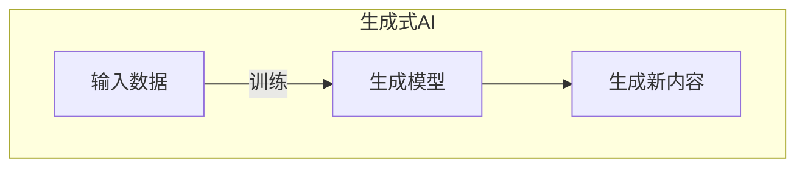
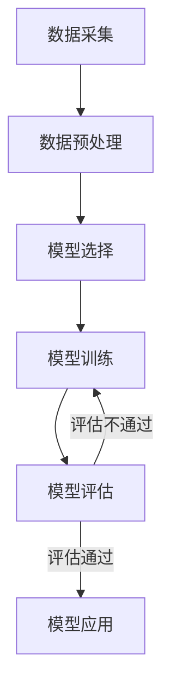
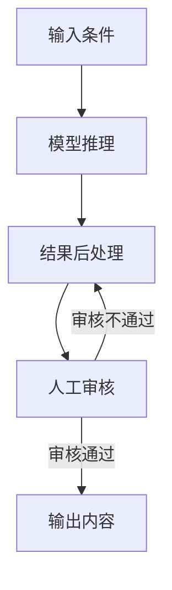
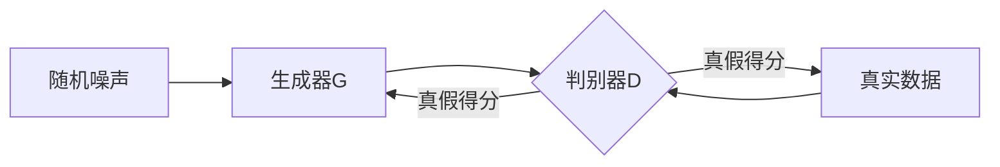
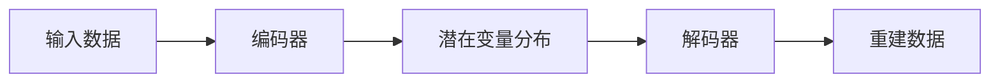

# AIGC未来展望：AI将如何改变内容创作

## 1.背景介绍

### 1.1 内容创作的重要性

在当今时代,内容创作无疑已成为一项关键的生产力。无论是营销、教育、娱乐还是其他领域,高质量的内容都是吸引受众、传播信息、实现价值的关键。然而,创作优秀内容需要大量的时间、精力和创造力投入,这对于个人和企业来说都是一个巨大的挑战。

### 1.2 人工智能在内容创作中的作用

随着人工智能(AI)技术的不断发展,AI生成内容(AIGC)应运而生,为内容创作带来了全新的可能性。AIGC利用机器学习、自然语言处理等技术,可以基于大量数据训练生成模型,从而自动创作出文字、图像、视频、音频等多种形式的内容。

### 1.3 AIGC的优势

相比人工创作,AIGC具有以下优势:

- 高效率:AI可以在短时间内生成大量内容
- 低成本:减少了人力投入
- 个性化:可根据用户需求定制内容
- 多样性:生成的内容种类丰富

AIGC的出现无疑将彻底改变内容创作的游戏规则。

## 2.核心概念与联系

### 2.1 生成式人工智能

生成式人工智能(Generative AI)是指能够生成新内容的AI系统,例如文本生成、图像生成、音频合成等。这些系统通过学习大量现有数据,捕捉其中的模式和规律,从而生成全新的、看似"创造性"的内容。

生成式AI的核心是生成模型,常见的有:

- 变分自编码器(VAE)
- 生成对抗网络(GAN) 
- transformer
- 扩散模型

这些模型利用深度学习技术从数据中提取特征,并将其重新组合生成新内容。



### 2.2 AIGC与内容创作

AIGC将生成式AI应用于内容创作领域,通过训练生成模型从海量现有内容中学习,再结合特定需求生成全新的内容。这种方式大大提高了内容生产效率,降低了创作成本。

目前,AIGC主要应用于以下几个领域:

- 文本生成:文章、故事、诗歌、对话等
- 图像生成:插画、图标、海报、人物肖像等
- 视频生成:短视频、动画、影视特效等
- 音频生成:配音、音乐、音效等

未来,AIGC还可能渗透到游戏、虚拟现实等更多领域。

## 3.核心算法原理具体操作步骤  

### 3.1 生成模型训练

生成模型的训练过程一般包括以下步骤:

1. **数据采集**:收集大量与所需内容相关的数据,如文本语料、图像等。
2. **数据预处理**:对原始数据进行清洗、标注、编码等预处理,以适应模型输入格式。
3. **模型选择**:根据任务需求选择合适的生成模型结构,如Transformer、GAN等。
4. **模型训练**:使用预处理后的数据训练生成模型,通过不断迭代优化模型参数。
5. **模型评估**:在保留数据集上评估模型性能,确保生成质量满足要求。



### 3.2 内容生成

经过训练的生成模型可用于内容生成,具体步骤如下:

1. **输入条件**:根据需求提供生成条件,如主题关键词、样本内容等。
2. **模型推理**:将输入条件输入到训练好的生成模型,模型基于学习到的知识生成新内容。
3. **结果后处理**:对生成结果进行必要的后处理,如文本校对、图像增强等,以提高质量。
4. **人工审核**:人工审核生成内容,剔除不当内容,并根据需要进行修改完善。
5. **输出内容**:将审核通过的内容正式输出,用于实际应用场景。



通过以上步骤,AIGC系统可高效、低成本地生成大量内容,但其质量和适用性仍有赖于训练数据、模型结构和人工把控。

## 4.数学模型和公式详细讲解举例说明

### 4.1 生成对抗网络(GAN)

GAN是一种常用的生成模型,由生成器(Generator)和判别器(Discriminator)两个神经网络组成。生成器从随机噪声中生成假样本,判别器则判断输入是真实样本还是生成样本。两者相互对抗、不断学习,最终使生成器能生成出逼真的样本。

GAN的目标函数为:

$$\min_G \max_D V(D,G) = \mathbb{E}_{x\sim p_{data}(x)}[\log D(x)] + \mathbb{E}_{z\sim p_z(z)}[\log(1-D(G(z)))]$$

其中:
- $G$为生成器
- $D$为判别器 
- $p_{data}$为真实数据分布
- $p_z$为噪声分布
- $z$为随机噪声向量

GAN架构如下:



GAN通过让生成器和判别器相互对抗、互相学习,最终使生成器生成的假样本无法被判别器识别,从而达到生成逼真样本的目的。

### 4.2 变分自编码器(VAE)

VAE是一种常用的生成模型,由编码器(Encoder)和解码器(Decoder)两个神经网络组成。编码器将输入数据编码为潜在变量的概率分布,解码器则从该分布中采样,重建原始数据。

VAE的目标函数为:

$$\mathcal{L}(\theta,\phi;x) = \mathbb{E}_{q_\phi(z|x)}[\log p_\theta(x|z)] - \beta D_{KL}(q_\phi(z|x)||p(z))$$

其中:
- $\theta$为解码器参数
- $\phi$为编码器参数
- $q_\phi(z|x)$为编码器输出的潜变量分布
- $p_\theta(x|z)$为解码器重建数据的概率
- $p(z)$为潜变量的先验分布
- $D_{KL}$为KL散度,用于约束潜变量分布接近先验分布
- $\beta$为超参数,控制重建质量与潜变量分布的权衡

VAE架构如下:



通过最大化目标函数,VAE可以学习到输入数据的潜在表示,并从中生成新数据。VAE常用于图像、视频等连续数据的生成。

上述是两种常见生成模型的数学原理,在实际应用中,研究人员还提出了许多改进和新模型,以提升生成质量和效率。这些模型正是AIGC内容生成的核心算法基础。

## 5.项目实践:代码实例和详细解释说明

为了更好地理解AIGC的实现原理,我们以文本生成为例,使用PyTorch构建一个简单的序列到序列(Seq2Seq)模型,实现给定文本前缀自动续写的功能。

### 5.1 数据准备

首先,我们需要准备训练数据集。这里我们使用一个包含10万条英文新闻文本的数据集。

```python
import torch
from torchtext.datasets import NewsCommentaryDataset

# 加载数据集
train_dataset, valid_dataset, test_dataset = NewsCommentaryDataset(root='./data')

# 构建词表
from torchtext.vocab import build_vocab_from_iterator

def yield_tokens(data_iter):
    for text in data_iter:
        yield text.split()

train_iter = yield_tokens(train_dataset)
vocab = build_vocab_from_iterator(train_iter, specials=['<unk>', '<pad>', '<bos>', '<eos>'])
vocab.set_default_index(vocab['<unk>'])
```

### 5.2 模型构建

接下来,我们定义Seq2Seq模型的编码器(Encoder)和解码器(Decoder)。

```python
import torch.nn as nn

class Encoder(nn.Module):
    def __init__(self, input_dim, emb_dim, hid_dim, n_layers, dropout):
        ...
        
    def forward(self, src):
        ...
        return outputs, hidden
        
class Decoder(nn.Module):
    def __init__(self, output_dim, emb_dim, hid_dim, n_layers, dropout):
        ...
        
    def forward(self, input, hidden, encoder_outputs):
        ...
        return prediction, decoder_hidden
        
class Seq2Seq(nn.Module):
    def __init__(self, encoder, decoder, device):
        super().__init__()
        self.encoder = encoder
        self.decoder = decoder
        self.device = device
        
    def forward(self, src, trg, teacher_forcing_ratio=0.5):
        ...
        return outputs
```

### 5.3 模型训练

定义训练循环,使用教师强制(Teacher Forcing)训练Seq2Seq模型。

```python
import torch.optim as optim
import random

device = torch.device('cuda' if torch.cuda.is_available() else 'cpu')
model = Seq2Seq(encoder, decoder, device).to(device)
optimizer = optim.Adam(model.parameters())
criterion = nn.CrossEntropyLoss(ignore_index=vocab['<pad>'])

for epoch in range(num_epochs):
    for batch in train_iter:
        ...
        optimizer.step()
        
    print(f'Epoch: {epoch+1}, Loss: {epoch_loss/len(train_iter)}')
```

### 5.4 模型推理

训练完成后,我们可以使用模型进行文本续写。

```python
def generate(model, src, max_len=100, sos_idx=vocab['<bos>'], eos_idx=vocab['<eos>']):
    src = src.to(device)
    src_len = src.size(0)
    trg = torch.ones(1, 1).fill_(sos_idx).type(torch.long).to(device)
    
    for i in range(max_len):
        output = model(src, trg)
        output = output[:, -1]
        output_idx = output.argmax().item()
        trg = torch.cat((trg, torch.tensor([[output_idx]], device=device)), dim=1)
        if output_idx == eos_idx:
            break
            
    trg = trg[0, 1:]
    return ' '.join([vocab.get_itos()[idx] for idx in trg])

prefix = "The new AI model"
print(f"Input: {prefix}")
output = generate(model, vocab(prefix.split()))
print(f"Output: {output}")
```

上述代码展示了如何使用PyTorch构建一个简单的Seq2Seq模型进行文本生成。在实际应用中,我们还需要使用更复杂的模型结构(如Transformer)、更大的数据集和更多的训练技巧来提升生成质量。但基本原理是相似的。

通过这个实例,我们可以更好地理解AIGC系统的工作机制,为将来应用和改进奠定基础。

## 6.实际应用场景

AIGC技术在诸多领域都有广泛的应用前景,以下是一些典型场景:

### 6.1 营销内容生成

营销内容创作一直是一项耗时耗力的工作。借助AIGC,企业可以快速生成大量营销文案、社交媒体帖子、广告视频等,极大提高营销效率。

### 6.2 新闻报道自动化

新闻媒体可以使用AIGC根据数据自动生成新闻报道,如体育赛事新闻、财经报道等,缓解人力成本压力。

### 6.3 教育资源生成

AIGC可用于生成教学视频、练习题目、教学案例等教育资源,为教师和学生提供更多个性化学习内容。

### 6.4 创意内容生成

在娱乐领域,AIGC可助力创作小说、电影剧本、歌词等创意内容,为艺术家提供灵感