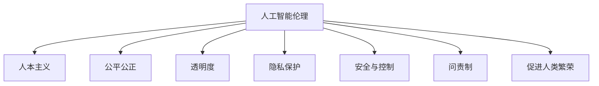
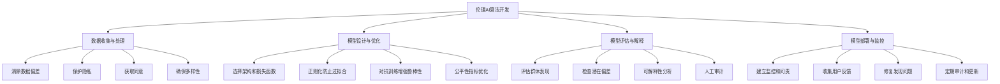

# AI人工智能 Agent：在人工智能伦理上的考量

## 1.背景介绍

### 1.1 人工智能的崛起

人工智能(Artificial Intelligence,AI)技术在过去几十年里取得了长足的进步,已经渗透到我们生活的方方面面。从语音助手到自动驾驶汽车,从推荐系统到医疗诊断,AI正在彻底改变着人类的生产和生活方式。

随着深度学习、强化学习等技术的不断突破,AI系统的能力不断提升,已经在很多领域展现出超越人类的水平。人工智能代理(AI Agent)是指具备一定自主性、可以感知环境、做出决策并在环境中采取行动的智能体系统。

### 1.2 人工智能伦理的重要性

伴随着AI技术的快速发展,人工智能伦理(AI Ethics)问题也日益受到重视。人工智能系统越来越深入地介入人类社会的各个层面,如果缺乏适当的伦理约束,可能会带来一系列风险和挑战,例如:

- 算法偏差导致的不公平对待
- 隐私和数据安全问题
- 人工智能系统的不可解释性
- 人工智能对就业市场的冲击
- 人工智能武器的潜在危险
- 超级智能与人类主权的关系

因此,在开发和部署AI系统时,我们必须认真考虑伦理因素,努力使AI的发展符合人类价值观,造福人类社会。

## 2.核心概念与联系

### 2.1 人工智能伦理的核心原则

虽然不同机构和学者对人工智能伦理的具体原则有不同的表述,但其核心思想大致如下:

1. **人本主义(Human-Centricity)**: AI系统应当以人类的利益为中心,尊重人性尊严,维护人权。

2. **公平公正(Fairness)**: AI系统在决策时应该公平对待每个个体,不存在不当歧视。

3. **透明度(Transparency)**: AI系统的决策过程应当具有可解释性,接受监督和问责。  

4. **隐私保护(Privacy Protection)**: AI系统在处理个人数据时应当充分保护个人隐私。

5. **安全与控制(Safety and Control)**: AI系统应当具有可靠性和安全性,并保持在人类的有效控制之下。

6. **问责制(Accountability)**: AI系统的开发者和使用者应当对系统的行为和影响负责。

7. **促进人类繁荣(Human Prosperity)**: AI的发展应当造福全人类,促进人类社会的可持续发展。



### 2.2 人工智能伦理与其他学科的关系

人工智能伦理是一门交叉学科,与计算机科学、机器学习、心理学、哲学、法学、社会学等多个领域密切相关:

- 计算机科学和机器学习提供了人工智能系统的技术基础
- 心理学和认知科学有助于理解人类智能的本质
- 伦理学和价值理论为制定AI伦理准则提供了理论支撑
- 法律和政策研究为AI监管提供依据
- 社会学研究AI对社会的影响

人工智能伦理需要多学科的知识和智慧,才能更好地引导AI的发展方向,规避潜在风险,造福人类。

## 3.核心算法原理具体操作步骤  

虽然人工智能伦理本身并不直接涉及具体的算法,但在设计和开发AI系统时,我们需要将伦理考量融入到算法和系统的各个环节。以机器学习为例,可以从以下几个方面着手:

### 3.1 数据收集与处理

训练数据的质量对机器学习模型的公平性和准确性有着重大影响。因此,在数据收集和标注阶段,我们需要:

1. **消除数据中的偏差和噪音**
2. **保护个人隐私**
3. **获取数据的知情同意**
4. **确保数据的多样性和包容性**

### 3.2 模型设计与优化

在设计和训练机器学习模型时,需要注意以下几点:

1. **选择合适的模型架构和损失函数**
2. **加入正则化项,避免过拟合**
3. **采用对抗训练等方法,增强模型的鲁棒性**
4. **引入公平性指标,作为优化目标之一**

### 3.3 模型评估与解释

训练完成后,需要对模型进行全面评估,包括:

1. **评估模型在不同群体上的表现**
2. **检查模型是否存在潜在的偏差**  
3. **使用可解释性技术,分析模型的决策过程**
4. **进行人工审计,发现模型的潜在风险**

### 3.4 模型部署与监控 

将模型投入实际使用后,还需要持续监控其行为,并根据需要进行调整:

1. **建立模型监控和问责机制**
2. **收集用户反馈,了解模型在实际场景中的表现**
3. **及时修复发现的问题,提高模型的可靠性**
4. **定期审计和更新模型,适应环境的变化**



## 4.数学模型和公式详细讲解举例说明

在机器学习中,公平性是一个重要的研究课题。研究人员提出了多种数学定义和量化指标,用于衡量模型的公平性水平。下面介绍几种常用的公平性指标:

### 4.1 统计学群体公平性(Statistical Parity)

统计学群体公平性要求模型对不同的敏感属性群体(如性别、种族等)的决策概率相同。形式化定义如下:

$$P(\hat{Y}=1|S=0) = P(\hat{Y}=1|S=1)$$

其中$\hat{Y}$表示模型的预测输出,$S$表示敏感属性。该指标可以用于检测模型是否对某些群体存在整体偏差。

但统计学群体公平性并不能完全消除不公平,因为即使整体概率相等,个体之间的差异仍可能很大。

### 4.2 校准公平性(Calibration)

校准公平性要求模型对不同群体的预测概率具有同等的准确性。形式化定义为:

$$P(Y=1|\hat{P}=p,S=0) = P(Y=1|\hat{P}=p,S=1)$$

其中$Y$表示真实标签,$\hat{P}$表示模型预测的概率,$S$表示敏感属性。校准公平性更关注模型预测概率的可靠性。

### 4.3 个体公平性(Individual Fairness)

个体公平性要求对于相似的个体,模型的预测结果应当相似。形式化定义为:

$$d(\hat{Y}(X),\hat{Y}(X')) \leq l(d(X,X'))$$

其中$d$是一个度量距离的函数,$l$是一个单调可微函数。个体公平性关注的是个体之间的相对公平性。

### 4.4 公平风险缓解(Fair Risk Mitigation)

在一些高风险场景(如司法判决、贷款审批等),我们希望模型对于有利结果的错误率在不同群体之间保持一致。这种要求可以用公平风险缓解来定义:

$$P(\hat{Y}=0|Y=1,S=0) = P(\hat{Y}=0|Y=1,S=1)$$

即对有利结果(Y=1)的漏报错误率在不同群体之间保持一致。

不同的公平性指标针对的是不同的公平需求,在实际应用中需要根据具体场景选择合适的指标。此外,公平性通常需要在准确性、隐私等其他目标之间进行权衡。

## 5.项目实践：代码实例和详细解释说明

以下是一个使用Python和scikit-learn库实现统计学群体公平性的示例代码:

```python
from sklearn.linear_model import LogisticRegression
from aif360.datasets import BinaryLabelDataset
from aif360.metrics import StatisticalParityDifference

# 加载数据
dataset = BinaryLabelDataset(df, label_names=['income'], favorable_classes=['>50K'],
                             protected_attribute_names=['sex'])

# 划分训练测试集
dataset_train, dataset_test = dataset.split([0.7], shuffle=True)

# 训练模型
model = LogisticRegression(solver='liblinear')
model.fit(dataset_train.features, dataset_train.labels.ravel())

# 计算统计学群体公平性指标
metric_test = StatisticalParityDifference(privileged_groups=[{'sex': 1}],
                                          unprivileged_groups=[{'sex': 0}])
stat_par_diff = metric_test.compute(dataset_test)

print("Statistical Parity Difference = %f" % stat_par_diff.value)
```

这段代码使用了AI Fairness 360工具包中的数据集和指标函数。

1. 首先加载一个二元标签数据集,其中'income'是标签列,'sex'是敏感属性列。
2. 将数据集划分为训练集和测试集。
3. 使用Logistic回归训练一个模型。
4. 计算测试集上的统计学群体公平性指标`StatisticalParityDifference`。

该指标的值在0到1之间,值越接近0表示公平性越好。可以看到,我们很容易地将公平性指标集成到机器学习流程中。

除了统计学群体公平性,AI Fairness 360还提供了其他公平性指标的实现,以及一些用于缓解不公平的算法。开发者可以根据需求选择合适的工具。

## 6.实际应用场景

人工智能伦理不仅仅是理论层面的探讨,已经在许多实际应用场景中得到了重视和落实。下面列举一些典型案例:

### 6.1 招聘和人力资源

一些公司在招聘和职员评估时,开始使用AI系统辅助决策,以期提高效率和公平性。但如果训练数据存在偏差,AI系统可能会加剧对某些群体的不公平对待。

为了解决这一问题,亚马逊等公司在AI招聘系统中加入了消除偏差的算法,确保不会因为申请人的性别、种族等因素而受到歧视。

### 6.2 金融信贷

在贷款审批、信用评分等金融场景中,AI系统的决策往往会对个人的经济利益产生重大影响。如果模型存在偏见,可能会导致某些群体被拒绝贷款或被评定较低信用分数的情况。

为此,一些银行和金融机构开始引入公平性算法,并对模型进行审计,以确保其决策的公平性。同时也有一些初创公司专注于开发公平的信贷AI产品。

### 6.3 刑事司法

在一些国家和地区,法院开始使用AI风险评估工具,预测被告的重新犯罪风险,作为量刑的参考依据。但这些工具如果存在种族偏见,可能会加剧对少数族裔的不公正对待。

为了应对这一挑战,司法部门需要对AI风险评估工具进行全面审计,消除潜在的偏差,并确保其决策的透明度和可解释性。

### 6.4 医疗诊断

AI辅助诊断系统有望提高医疗资源的利用效率,但如果模型对某些患者群体存在偏差,可能会导致错误诊断和治疗不当。研