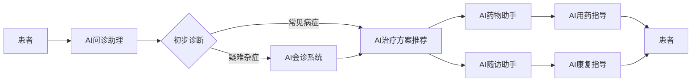

# AI人工智能代理工作流 AI Agent WorkFlow：在医疗保健中的应用

## 1. 背景介绍

### 1.1 人工智能在医疗保健领域的应用现状

人工智能(Artificial Intelligence, AI)技术在医疗保健领域的应用日益广泛。AI可以帮助医生更快速、准确地诊断疾病,优化治疗方案,预测疾病风险,改善患者体验等。目前,AI在医学影像、病理分析、药物研发、精准医疗、智能助理等方面已经取得了显著进展。

### 1.2 医疗AI面临的挑战

尽管AI在医疗领域大有可为,但仍面临着诸多挑战:

- 数据隐私与安全问题
- 模型的可解释性和透明度不足
- 缺乏大规模高质量的医疗数据集
- 不同医疗机构间数据标准不一致,难以互联互通
- AI系统的临床应用尚需更多验证

### 1.3 AI Agent工作流的提出

为了更好地将AI技术应用于医疗实践,研究者提出了AI Agent工作流的概念。它旨在构建一个灵活、可扩展、高效的智能化医疗服务框架,协调多个AI模型,优化资源配置,简化人机交互,最终为患者提供个性化、全流程的智慧医疗服务。

## 2. 核心概念与联系

### 2.1 AI Agent的定义

AI Agent是一种具备感知、决策、执行能力的智能体,能根据环境状态自主采取行动,完成特定任务。在医疗领域,AI Agent可以是聊天机器人、智能助手、临床决策支持系统等形式,协助医生诊疗,为患者提供指导。

### 2.2 工作流的定义

工作流(Workflow)是一系列有序的活动或任务,用于实现特定业务目标。它定义了任务执行的逻辑顺序、分支条件、所需资源等。工作流管理系统负责工作流的建模、执行、监控和优化。

### 2.3 AI Agent工作流

AI Agent工作流将AI Agent的自主智能与工作流的过程管理相结合,实现医疗服务全流程的智能化。其核心思想是将就诊过程抽象为一系列任务,由不同类型的AI Agent协同完成。通过工作流引擎动态调度和编排AI Agent,可以灵活应对复杂多变的医疗场景。

下图展示了AI Agent工作流的总体架构:



## 3. 核心算法原理具体操作步骤

### 3.1 知识图谱构建

- 医疗领域本体定义
- 医疗概念实体抽取
- 实体关系抽取
- 知识融合与链接
- 知识存储与查询

### 3.2 自然语言处理

- 医学文本分词
- 医学命名实体识别
- 医患对话意图理解
- 医学QA问答
- 医学文本摘要

### 3.3 多模态学习

- 医学影像+文本多模态表示学习
- 医学影像+文本多模态融合
- 多模态疾病风险预测
- 多模态临床决策支持

### 3.4 因果推理

- 因果图模型构建
- 反事实推理
- 个性化因果效应估计
- treatment effect estimation

### 3.5 强化学习

- 基于强化学习的治疗策略优化
- 基于强化学习的临床路径规划
- 多智能体协作机制学习

## 4. 数学模型和公式详细讲解举例说明

### 4.1 知识图谱表示学习

TransE是一种常用的知识图谱表示学习算法,可将实体和关系嵌入到同一个低维空间。给定一个三元组$(h,r,t)$,TransE的目标是:

$$\mathbf{h} + \mathbf{r} \approx \mathbf{t}$$

其中$\mathbf{h},\mathbf{r},\mathbf{t} \in \mathbb{R}^d$分别是头实体、关系、尾实体的嵌入向量。TransE通过最小化能量函数$f_r(h,t)$来学习嵌入表示:

$$f_r(h,t) = \lVert \mathbf{h} + \mathbf{r} - \mathbf{t} \rVert_2^2$$

例如,在医疗知识图谱中,给定三元组(阿司匹林,治疗,头痛),TransE学习到的嵌入向量应满足:

$$\mathbf{v}_{\text{阿司匹林}} + \mathbf{v}_{\text{治疗}} \approx \mathbf{v}_{\text{头痛}}$$

### 4.2 医学命名实体识别

BiLSTM-CRF是一种常用的医学命名实体识别模型。设输入句子token序列为$\mathbf{x}=(x_1,\dots,x_n)$,BiLSTM逐token编码为隐藏状态序列$\mathbf{h}=(h_1,\dots,h_n)$:

$$h_i=[\overrightarrow{h_i};\overleftarrow{h_i}]$$

其中$\overrightarrow{h_i}$和$\overleftarrow{h_i}$分别是前向和后向LSTM在位置$i$的隐藏状态。

CRF层在BiLSTM之上建模标签之间的转移和依赖关系。设标签序列为$\mathbf{y}=(y_1,\dots,y_n)$,CRF层的得分函数为:

$$s(\mathbf{x},\mathbf{y})=\sum_{i=1}^n A_{y_i,y_{i+1}}+\sum_{i=1}^n P_{i,y_i}$$

其中$A$是转移矩阵,$A_{i,j}$表示从标签$i$转移到标签$j$的得分。$P$是发射矩阵,$P_{i,y_i}$表示token $x_i$对应标签$y_i$的得分。

模型训练时最大化条件对数似然:

$$\log p(\mathbf{y}|\mathbf{x}) = s(\mathbf{x},\mathbf{y}) - \log\sum_{\mathbf{y}'\in \mathcal{Y}_\mathbf{x}}\exp(s(\mathbf{x},\mathbf{y}'))$$

其中$\mathcal{Y}_\mathbf{x}$是句子$\mathbf{x}$的所有可能标签序列集合。

预测时采用Viterbi解码:

$$\mathbf{y}^* = \arg\max_{\mathbf{y}\in \mathcal{Y}_\mathbf{x}} s(\mathbf{x},\mathbf{y})$$

例如,对于输入医学文本"患者服用阿司匹林治疗头痛",BiLSTM-CRF模型可以识别出实体"阿司匹林"和"头痛",标记为"Drug"和"Disease"类型。

## 5. 项目实践：代码实例和详细解释说明

下面是一个利用PyTorch实现的BiLSTM-CRF用于医学命名实体识别的示例代码:

```python
import torch
import torch.nn as nn

class BiLSTM_CRF(nn.Module):
    def __init__(self, vocab_size, tag_to_ix, embedding_dim, hidden_dim):
        super(BiLSTM_CRF, self).__init__()
        self.embedding_dim = embedding_dim
        self.hidden_dim = hidden_dim
        self.vocab_size = vocab_size
        self.tag_to_ix = tag_to_ix
        self.tagset_size = len(tag_to_ix)
        
        self.word_embeds = nn.Embedding(vocab_size, embedding_dim)
        self.lstm = nn.LSTM(embedding_dim, hidden_dim // 2, num_layers=1, bidirectional=True)
        self.hidden2tag = nn.Linear(hidden_dim, self.tagset_size)
        self.transitions = nn.Parameter(torch.randn(self.tagset_size, self.tagset_size))
        self.transitions.data[tag_to_ix[START_TAG], :] = -10000
        self.transitions.data[:, tag_to_ix[STOP_TAG]] = -10000
        
    def forward(self, sentence):  
        embeds = self.word_embeds(sentence)
        lstm_out, _ = self.lstm(embeds.view(len(sentence), 1, -1))
        lstm_out = lstm_out.view(len(sentence), self.hidden_dim)
        lstm_feats = self.hidden2tag(lstm_out)
        return lstm_feats
      
    def _score_sentence(self, feats, tags):
        score = torch.zeros(1)
        tags = torch.cat([torch.tensor([self.tag_to_ix[START_TAG]], dtype=torch.long), tags])
        for i, feat in enumerate(feats):
            score = score + self.transitions[tags[i + 1], tags[i]] + feat[tags[i + 1]]
        score = score + self.transitions[self.tag_to_ix[STOP_TAG], tags[-1]]
        return score

    def _viterbi_decode(self, feats):
        backpointers = []
        init_vvars = torch.full((1, self.tagset_size), -10000.)
        init_vvars[0][self.tag_to_ix[START_TAG]] = 0
        forward_var = init_vvars
        for feat in feats:
            bptrs_t = []  
            viterbivars_t = [] 
            for next_tag in range(self.tagset_size):
                next_tag_var = forward_var + self.transitions[next_tag]
                best_tag_id = argmax(next_tag_var)
                bptrs_t.append(best_tag_id)
                viterbivars_t.append(next_tag_var[0][best_tag_id].view(1))
            forward_var = (torch.cat(viterbivars_t) + feat).view(1, -1)
            backpointers.append(bptrs_t)
        terminal_var = forward_var + self.transitions[self.tag_to_ix[STOP_TAG]]
        best_tag_id = argmax(terminal_var)
        path_score = terminal_var[0][best_tag_id]
        best_path = [best_tag_id]
        for bptrs_t in reversed(backpointers):
            best_tag_id = bptrs_t[best_tag_id]
            best_path.append(best_tag_id)
        start = best_path.pop()
        assert start == self.tag_to_ix[START_TAG] 
        best_path.reverse()
        return path_score, best_path

    def neg_log_likelihood(self, sentence, tags):
        feats = self._get_lstm_features(sentence)
        forward_score = self._forward_alg(feats)
        gold_score = self._score_sentence(feats, tags)
        return forward_score - gold_score

    def forward(self, sentence):  
        lstm_feats = self._get_lstm_features(sentence)
        score, tag_seq = self._viterbi_decode(lstm_feats)
        return score, tag_seq
```

代码说明:

- `__init__`方法定义了BiLSTM-CRF模型的架构,包括词嵌入层、双向LSTM层、全连接层以及转移矩阵。
- `_score_sentence`方法根据特征序列和标签序列计算非归一化分数。
- `_viterbi_decode`方法使用Viterbi算法解码得到最优标签序列。
- `neg_log_likelihood`方法计算给定句子和标签的负对数似然损失。
- `forward`方法对给定句子进行推断,返回最优路径分数和标签序列。

上述代码实现了BiLSTM-CRF模型的基本框架,可以用于医学命名实体识别任务。在实际应用中,还需要准备训练数据、定义损失函数和优化算法、设置超参数、进行训练和评估等步骤。

## 6. 实际应用场景

### 6.1 智能导诊

患者通过与AI问诊助理对话,描述自己的症状。AI Agent通过自然语言理解和医学知识推理,初步判断患者病情,为其推荐合适的科室和医生。

### 6.2 辅助诊断

医生在诊疗过程中,可以利用AI辅助诊断系统。例如,医生上传患者的医学影像,AI Agent通过深度学习算法分析影像特征,给出疾病诊断建议,辅助医生做出更准确的诊断。

### 6.3 治疗方案优化

根据患者的病情特点和既往病史,AI Agent从医疗知识图谱中推理出多种可行的治疗方案,并通过因果推理预估不同方案的疗效和风险,帮助医生制定个性化治疗策略。

### 6.4 智能药物推荐

AI Agent分析患者的基因组、用药历史、过敏史等信息,结合药物知识库,为患者推荐安全有效的药物。对于复杂用药方案,AI Agent还可以识别药物间相互作用,