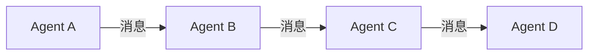

# AI人工智能代理工作流 AI Agent WorkFlow：在物流与供应链中的应用

## 1.背景介绍
### 1.1 物流与供应链行业面临的挑战
物流与供应链行业是现代经济的重要组成部分,涉及原材料采购、产品生产、仓储配送、销售等多个环节。随着全球化进程加快,供应链日益复杂,企业面临着成本控制、效率提升、风险管理等诸多挑战。传统的物流与供应链管理模式已难以适应市场变化,亟需引入新技术和创新方法。

### 1.2 人工智能在物流供应链中的应用前景
人工智能(Artificial Intelligence,AI)作为一种通用目的技术,正在深刻影响和重塑各行各业。将AI技术应用到物流与供应链领域,有望突破行业发展瓶颈,实现智能化、自动化、网络化,从而提高效率、降低成本、优化体验。AI驱动的智慧供应链正成为行业发展的新趋势和新动能。

### 1.3 AI Agent工作流的提出
AI Agent是一种基于人工智能技术构建的自主实体,能够感知环境、分析数据、推理决策、执行任务。将多个AI Agent以工作流的形式进行组织协作,可形成一个智能系统,自动完成复杂的业务流程。本文提出AI Agent工作流这一概念,探讨其在物流供应链场景中的应用模式和实现路径。

## 2.核心概念与联系
### 2.1 AI Agent的定义与特征
- 定义:AI Agent是一种基于人工智能算法构建的自主智能体,具备感知、推理、决策、执行等能力,能够根据设定目标完成特定任务。
- 特征:
  - 自主性:无需人工干预,能够独立运行;
  - 社会性:能与环境及其他Agent交互;
  - 反应性:能根据环境变化做出及时反应;
  - 主动性:主动采取行动完成目标;
  - 适应性:能够学习和适应环境。

### 2.2 工作流的定义与要素
- 定义:工作流(Workflow)是一系列结构化活动的集合,用于完成特定业务目标,强调活动执行的顺序关系。
- 要素:
  - 活动(Activity):工作流中的基本处理单元;
  - 顺序流(Sequence Flow):定义活动间的执行顺序;
  - 网关(Gateway):用于控制活动执行的分支与汇聚;
  - 事件(Event):工作流执行过程中发生的事情;
  - 数据(Data):活动处理的对象。

### 2.3 AI Agent工作流的内涵
AI Agent工作流是指将多个AI Agent组织成工作流形式,协同完成复杂任务的系统。其核心内涵包括:

- 以工作流为载体,定义AI Agent的职责边界与协作关系;
- 每个AI Agent负责工作流中的特定活动,自主完成任务;
- Agent间通过消息传递实现信息共享和行为协调;  
- 整个工作流系统对外提供智能服务,自动应对复杂场景。

下图展示了一个简单的AI Agent工作流示意:



## 3.核心算法原理具体操作步骤
### 3.1 AI Agent的构建
#### 3.1.1 感知模块
感知模块负责接收外界信息,常用技术包括:
- 计算机视觉:图像识别、目标检测等
- 自然语言处理:文本分类、信息抽取等
- 语音识别:语音转文本
- 传感器数据分析:RFID、GPS等

#### 3.1.2 决策模块 
决策模块根据感知信息进行分析推理,给出行动策略,主要采用:
- 规则系统:基于专家知识总结规则
- 机器学习:监督学习、强化学习等
- 深度学习:卷积神经网络、循环神经网络等

#### 3.1.3 执行模块
执行模块负责完成具体任务,可分为:
- 虚拟执行:发送消息、调用API等
- 物理执行:控制机器人运动等

### 3.2 Agent间通信协作
#### 3.2.1 消息机制
常见的Agent间消息传递方式有:
- 点对点:Agent之间直接通信
- 发布-订阅:借助中间件进行消息路由
- 黑板系统:Agent通过共享存储空间交换信息

#### 3.2.2 协作模式
常见的多Agent协作模式包括:
- 层次型:Agent形成树状等级结构
- 分布型:Agent地位平等,松散耦合
- 混合型:中心调度与分布协作相结合

### 3.3 工作流建模与执行
#### 3.3.1 工作流建模
采用标准建模语言如BPMN对业务流程进行描述,定义每个活动由哪个Agent负责执行。

#### 3.3.2 工作流执行 
通过工作流引擎负责活动的调度与监控,常用方法有:
- 解释执行:逐条解释流程定义文件
- 编译执行:将流程定义编译成可执行代码

## 4.数学模型和公式详细讲解举例说明
### 4.1 马尔可夫决策过程
强化学习常用马尔可夫决策过程(MDP)对Agent决策行为建模,其核心要素包括:
- 状态集合 $S$
- 行动集合 $A$
- 状态转移概率 $P(s'|s,a)$
- 奖励函数 $R(s,a)$

Agent的目标是寻找一个最优策略 $\pi^*$,使得期望总奖励最大化:

$$\pi^* = \arg\max_{\pi} E[\sum_{t=0}^{\infty} \gamma^t R(s_t,\pi(s_t))]$$

其中 $\gamma \in [0,1]$ 为折扣因子。求解最优策略的经典算法有值迭代、策略迭代等。

### 4.2 博弈论
多Agent系统可用博弈论分析Agent间的策略互动。以双人零和博弈为例,可定义收益矩阵:

$$
\begin{bmatrix} 
(r_{11},c_{11}) & (r_{12},c_{12}) & \cdots  \\
(r_{21},c_{21}) & (r_{22},c_{22}) & \cdots \\
\vdots & \vdots & \ddots \\
\end{bmatrix}
$$

其中 $r_{ij}$ 表示Agent 1采取策略 $i$ 而Agent 2采取策略 $j$ 时,Agent 1的收益。双方的目标是找到纳什均衡点,即:

$$
\forall y \in S_2, \  r_{i^*j} \geq r_{ij} \\
\forall x \in S_1, \  c_{ij^*} \geq c_{ij^*}
$$

### 4.3 排队论
排队论可用于分析物流系统的库存与运力优化。假设订单到达服从泊松分布,处理时间服从负指数分布,则单服务台排队系统的性能指标如下:

- 平均排队长度:$L_q=\frac{\lambda^2}{\mu(\mu-\lambda)}$
- 平均逗留时间:$W_q=\frac{\lambda}{\mu(\mu-\lambda)}$
- 平均忙期时间:$\frac{1}{\mu-\lambda}$

其中 $\lambda$ 为订单到达率,$\mu$ 为订单处理率。通过求解模型,可确定最优的服务台数量。

## 5.项目实践：代码实例和详细解释说明
下面以Python为例,展示如何构建一个简单的物流调度Agent。该Agent接收订单信息,根据规则分配运力。

```python
class LogisticsAgent:
    """物流调度Agent"""
    
    def __init__(self):
        self.orders = []  # 订单列表
        self.vehicles = {"truck":2, "van":3}  # 车辆库存
        
    def perceive(self, order):
        """感知订单信息"""
        self.orders.append(order)
        
    def decide(self):
        """决策分配运力"""
        for order in self.orders:
            if order["size"] > 1000: 
                vehicle_type = "truck"
            else:
                vehicle_type = "van"
            
            if self.vehicles[vehicle_type] > 0:
                order["vehicle"] = vehicle_type
                self.vehicles[vehicle_type] -= 1
            else:
                order["vehicle"] = None
        
    def act(self):
        """执行运力调度"""
        for order in self.orders:
            if order["vehicle"]:
                print(f"分配{order['vehicle']}运输订单{order['id']}")
            else:
                print(f"缺少车辆,订单{order['id']}延迟")
        self.orders.clear()

agent = LogisticsAgent()

# 模拟订单输入
agent.perceive({"id":1, "size":1200})
agent.perceive({"id":2, "size":800})

agent.decide()
agent.act()
```

代码说明:
- `LogisticsAgent` 类封装了物流调度的感知、决策、执行功能
- `perceive` 方法接收订单信息,存入订单列表
- `decide` 方法根据订单大小,匹配车型,更新车辆库存
- `act` 方法执行具体的车辆调度,并打印结果
- 主程序模拟订单输入,调用Agent的方法进行处理

输出结果:
```
分配truck运输订单1
分配van运输订单2
```

可见,订单1由于尺寸大于1000,分配了卡车运输;订单2分配了厢式货车。这只是一个十分简化的示例,实际系统中,Agent的决策逻辑会更加复杂,考虑车辆位置、时效要求、成本优化等多种因素。通过多个Agent的协同工作,可构建起智能的物流调度系统。

## 6.实际应用场景
AI Agent工作流可应用于物流供应链的多个环节,典型场景包括:

### 6.1 智能仓储
通过搭建叉车机器人Agent、货架管理Agent、库存管理Agent等,协同完成入库、拣选、盘点、补货等仓储作业,提高效率,减少差错。

### 6.2 智慧运输
利用调度Agent、路径规划Agent、车载终端Agent等,优化运输线路、降低物流成本、提升运输时效,实现全程可视化监控。

### 6.3 供应链协同
通过供应商Agent、制造商Agent、分销商Agent、零售商Agent等的信息共享和需求协同,减少信息不对称,实现供应链敏捷响应。 

### 6.4 客户服务
建立客服机器人Agent、订单管理Agent、售后服务Agent等,为客户提供智能化、个性化的信息查询、下单、跟踪、投诉等服务。

## 7.工具和资源推荐
### 7.1 开源框架
- JADE:基于Java的多Agent开发框架
- RASA:构建对话式AI Agent的框架
- TensorFlow:谷歌开源的机器学习库
- PyTorch:Facebook开源的深度学习框架

### 7.2 商业平台
- 亚马逊 AWS:提供机器学习、物联网等服务
- 阿里云:小蜜对话机器人、视觉智能等产品
- IBM Watson:涵盖认知计算、数据分析等功能
- 微软 Azure :包含认知服务、机器学习工作室等

### 7.3 行业组织
- 智慧物流产业联盟
- 中国人工智能学会
- 物流与供应链创新研究中心
- 全球智慧供应链联盟

多方合力,有利于推动AI Agent工作流在物流供应链领域的落地应用。

## 8.总结：未来发展趋势与挑战
### 8.1 发展趋势
- 物联网与AI融合,实现端到端的实时感知
- 区块链赋能,构建可信的供应链协同网络
- 5G、边缘计算发展,支撑实时调度和控制
- 知识图谱、因果推理等新技术应用,赋予Agent更强的认知与决策能力

### 8.2 面临挑战
- 多源异构数据的采集、存储与共享
- 复杂环境下Agent行为的稳定性、可解释性
- 人机协作与权责边界划分
- 技术与业务的融合,流程再造

需要产学研用多方合作,攻克核心技术,创新应用场景,建立标准规范,推动AI Agent工作流成为智慧物流供应链的关键使能技术。

## 9.附录：常见问题与解答
### Q1:AI Agent与传统自动化系统的区别是什么