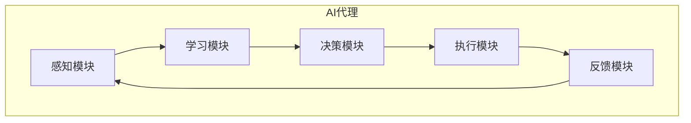

# AI人工智能代理工作流AI Agent WorkFlow：AI代理在股市分析的应用

## 1.背景介绍

### 1.1 股市分析的重要性

股票市场是一个复杂的动态系统,涉及大量的经济因素、政治因素、心理因素等,对整个社会经济发展有着深远影响。准确的股市分析和预测对于投资者、企业和政府制定决策都至关重要。

### 1.2 传统股市分析方法的局限性  

传统的股市分析方法主要依赖人工分析师,通过研究各种基本面、技术面等数据进行分析和预测。但这种方法存在以下局限性:

- 数据量大,人工难以高效处理
- 分析过程主观性强,容易受到偏见影响
- 难以及时捕捉市场变化的微小信号

### 1.3 AI在股市分析中的应用前景

人工智能技术的发展为股市分析提供了新的解决方案。AI代理具有海量数据处理、模式识别、智能决策等能力,能够克服传统方法的不足,为投资者提供更加准确的分析和预测。

## 2.核心概念与联系

### 2.1 AI代理

AI代理(Agent)是一种自主的智能系统,能够感知环境、学习知识、制定计划、执行行动,并根据反馈进行自我调整。在股市分析中,AI代理可以集成多种AI技术,如机器学习、自然语言处理、知识图谱等,形成智能分析决策系统。



### 2.2 机器学习在股市分析中的应用

机器学习是AI代理的核心技术,能够从大量历史数据中自动发现隐藏的规律和模式,用于股价预测、风险评估等任务。常用的机器学习算法包括:

- 监督学习: 线性回归、支持向量机等
- 非监督学习: 聚类分析、关联规则挖掘等  
- 强化学习: 基于代理与环境的交互进行决策优化

### 2.3 自然语言处理在股市分析中的应用

自然语言处理(NLP)技术能够从大量文本资料(如新闻、社交媒体等)中提取有价值的信息,并将其转化为可计算的数据特征,输入到机器学习模型中。常用的NLP技术包括:

- 情感分析: 分析言论的情绪倾向
- 主题建模: 发现潜在的抽象主题
- 知识图谱: 构建结构化的知识库

### 2.4 知识图谱在股市分析中的应用

知识图谱是以图的形式表示各种实体及其关系的知识库。在股市分析中,知识图谱可以融合各种结构化、非结构化数据,建立股市相关的概念、事件、规则之间的联系,为AI代理提供丰富的背景知识和推理能力。

## 3.核心算法原理具体操作步骤  

### 3.1 数据采集与预处理

股市分析需要大量的数据输入,包括历史股价数据、财务数据、新闻资讯等。数据采集可以使用网络爬虫、API接口等技术,对获取的数据进行清洗、规范化、特征提取等预处理,为后续的机器学习算法做好准备。

### 3.2 特征工程

特征工程是将原始数据转化为机器学能够处理的特征向量的过程。常用的特征包括:

- 技术指标: 移动平均线、相对强弱指数等
- 基本面指标: 市盈率、市净率等
- 文本特征: 从新闻等文本中提取的主题、情感等

### 3.3 机器学习模型训练

根据具体的分析任务(如分类、回归、聚类等),选择合适的机器学习算法,使用训练数据对模型进行训练。常用的算法有:

- 分类: 逻辑回归、决策树、支持向量机等
- 回归: 线性回归、随机森林回归等
- 聚类: K-Means、DBSCAN等

模型训练过程中需要进行特征选择、参数调优、交叉验证等,以获得最优模型。

### 3.4 模型评估和调优

使用测试数据对训练好的模型进行评估,根据评估指标(如准确率、F1分数等)判断模型的好坏。如果模型表现不佳,需要回到前面的步骤进行调整,如增加训练数据、改进特征工程、调整算法参数等。

### 3.5 模型集成

由于单一模型难以完美解决所有问题,通常需要集成多个模型的优点,形成更强大的分析系统。常用的集成方法有:

- bagging: 随机森林、梯度提升树等
- boosting: AdaBoost、XGBoost等
- stacking: 将多个模型的输出作为新特征输入元模型

### 3.6 在线预测与决策

将训练好的模型部署到生产环境中,对新的数据进行在线预测和决策。同时需要持续监控模型的表现,一旦发现效果下降,就需要重新训练或调整模型。

## 4.数学模型和公式详细讲解举例说明

### 4.1 线性回归

线性回归是一种常用的监督学习算法,用于预测连续型目标变量。其数学模型为:

$$y = w_0 + w_1x_1 + w_2x_2 + ... + w_nx_n$$

其中$y$为目标变量,$x_i$为特征变量,$w_i$为模型参数。通过最小化损失函数(如均方误差)来求解最优参数$w$:

$$\min \sum_{i=1}^{m}(y_i - (w_0 + w_1x_{i1} + ... + w_nx_{in}))^2$$

线性回归在股市分析中可用于股价趋势预测等任务。

### 4.2 逻辑回归 

逻辑回归是一种常用的分类算法,用于预测离散型目标变量(如二元变量)。其数学模型为:

$$P(Y=1|X) = \frac{1}{1 + e^{-(w_0 + w_1x_1 + ... + w_nx_n)}}$$

其中$P(Y=1|X)$表示给定特征$X$时,目标变量$Y$取值1的概率。通过极大似然估计来求解最优参数$w$:

$$\max \prod_{i=1}^{m}P(y_i|x_i,w)$$

逻辑回归在股市分析中可用于判断股票涨跌等分类任务。

### 4.3 支持向量机

支持向量机(SVM)是一种强大的分类和回归算法,其基本思想是在高维空间中构造最优超平面,将不同类别的样本分开,且与最近样本点的距离最大化。对于线性可分的情况,其模型为:

$$w^Tx + b = 0$$

其中$w$为法向量,$b$为位移项。通过以下优化问题求解:

$$\min \frac{1}{2}||w||^2 \\
s.t. y_i(w^Tx_i + b) \geq 1, i=1,2,...,m$$

对于非线性情况,可以通过核技巧将数据映射到高维空间,从而得到非线性决策边界。SVM在股市分析中可用于判断股票买入卖出等分类任务。

### 4.4 时间序列模型

股价数据本质上是一种时间序列数据,因此可以使用时间序列分析模型进行预测,如ARIMA、GARCH等。以ARIMA模型为例,其数学表达式为:

$$y_t = c + \phi_1y_{t-1} + ... + \phi_py_{t-p} + \theta_1\epsilon_{t-1} + ... + \theta_q\epsilon_{t-q} + \epsilon_t$$

其中$y_t$为时间$t$时的观测值,$\phi_i$和$\theta_j$分别为自回归(AR)和移动平均(MA)的系数,$\epsilon_t$为白噪声项。通过对历史数据进行拟合,可以估计出模型参数,并用于未来值的预测。

## 5.项目实践:代码实例和详细解释说明

以下是一个使用Python和TensorFlow构建股价预测模型的示例代码:

```python
import tensorflow as tf
import pandas as pd
import matplotlib.pyplot as plt

# 加载数据
data = pd.read_csv('stock_data.csv')
data = data.sort_values('Date')

# 数据预处理
scaler = MinMaxScaler()
data['Close'] = scaler.fit_transform(data['Close'].values.reshape(-1,1))

# 构建时间序列数据
X = []
y = []
window_size = 30
for i in range(window_size, len(data)):
    X.append(data['Close'][i-window_size:i])
    y.append(data['Close'][i])
    
X = np.array(X)
y = np.array(y)

# 构建LSTM模型
model = tf.keras.Sequential([
    tf.keras.layers.LSTM(64, input_shape=(window_size,1)),
    tf.keras.layers.Dense(1)
])

# 模型训练
model.compile(optimizer='adam', loss='mse')
model.fit(X, y, epochs=50, batch_size=32)

# 模型预测
test_data = data['Close'][-window_size:].values.reshape(1, window_size, 1)
prediction = model.predict(test_data)
prediction = scaler.inverse_transform(prediction)

# 可视化结果
plt.figure(figsize=(12,6))
plt.plot(data['Close'])
plt.plot(np.arange(len(data)-window_size,len(data),1), prediction, color='r')
plt.show()
```

上述代码使用长短期记忆网络(LSTM)构建了一个股价预测模型。主要步骤包括:

1. 加载并预处理股价数据
2. 构建时间序列输入和输出数据
3. 定义LSTM模型结构
4. 使用训练数据对模型进行训练
5. 在测试数据上进行预测
6. 可视化预测结果

需要注意的是,这只是一个简单的示例,实际应用中需要进行更多的特征工程、模型调优等工作,以提高预测精度。

## 6.实际应用场景

AI代理在股市分析中的应用场景主要包括:

### 6.1 股价预测

利用机器学习模型对未来股价走势进行预测,为投资决策提供依据。常用的模型有LSTM、随机森林等。

### 6.2 交易策略优化

通过强化学习等技术,自动探索最优的交易策略,实现自动化交易。

### 6.3 风险管理

评估投资组合的风险暴露程度,进行风险监控和预警。可以使用监督学习、聚类分析等方法。

### 6.4 内部交易监控

利用异常检测等技术,发现内部人员的不当交易行为,防范内幕交易等违规操作。

### 6.5 投资组合优化

根据风险偏好、收益要求等约束条件,构建最优化的投资组合。可以使用凸优化、进化算法等技术。

### 6.6 情绪分析

分析新闻、社交媒体等文本数据,挖掘市场情绪,作为投资决策的补充信息。

## 7.工具和资源推荐

### 7.1 Python生态

Python已成为数据科学和AI领域事实上的标准,拥有丰富的科学计算、机器学习和可视化库,如NumPy、Pandas、Scikit-Learn、TensorFlow、Matplotlib等。

### 7.2 云计算平台

主流的云计算平台如AWS、Azure、Google Cloud等,提供了强大的计算资源和AI服务,可以快速部署和扩展AI应用。

### 7.3 开源项目

GitHub上有大量优秀的开源AI项目,如TensorFlow、PyTorch、Scikit-Learn等,可以直接使用或在此基础上进行二次开发。

### 7.4 数据资源

可以使用雅虎财经、Alpha Vantage等网站提供的免费金融数据,也可以订阅付费的专业数据服务,如Bloomberg等。

### 7.5 在线学习资源

像Coursera、edX这样的在线学习平台提供了大量优质的AI和数据科学课程,可以系统地学习相关理论和实践技能。

## 8.总结:未来发展趋势与挑战

### 8.1 发展趋势

- 人工智能技术不断创新,如深度学习、强化学习、知识图谱等,将进一步提升股市分析的智能化水平。
- 多模态数据融合分析,将文本、