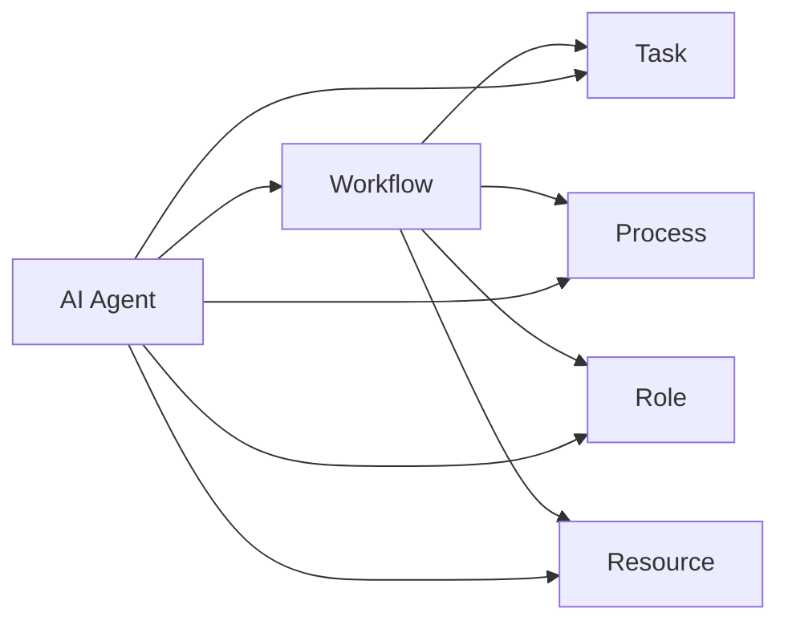

# AI人工智能代理工作流AI Agent WorkFlow：面向未来的AI代理与工作流研究方向

## 1.背景介绍
### 1.1 人工智能的发展历程
#### 1.1.1 早期人工智能
#### 1.1.2 专家系统时代  
#### 1.1.3 机器学习与深度学习崛起
### 1.2 AI代理的概念与发展
#### 1.2.1 AI代理的定义
#### 1.2.2 AI代理的发展历程
#### 1.2.3 AI代理的应用现状
### 1.3 工作流技术的演进
#### 1.3.1 传统工作流技术
#### 1.3.2 智能工作流的兴起 
#### 1.3.3 工作流与AI代理的结合

## 2.核心概念与联系
### 2.1 AI代理的核心概念
#### 2.1.1 自主性
#### 2.1.2 社交能力
#### 2.1.3 反应能力
#### 2.1.4 主动性
### 2.2 工作流的核心概念  
#### 2.2.1 任务
#### 2.2.2 流程
#### 2.2.3 角色
#### 2.2.4 资源
### 2.3 AI代理与工作流的关系
#### 2.3.1 AI代理作为工作流参与者
#### 2.3.2 AI代理驱动工作流执行
#### 2.3.3 工作流协调AI代理协作



## 3.核心算法原理具体操作步骤
### 3.1 多Agent协同算法
#### 3.1.1 集中式协同
#### 3.1.2 分布式协同
#### 3.1.3 混合式协同
### 3.2 工作流建模与优化算法
#### 3.2.1 基于Petri网的建模
#### 3.2.2 基于图的建模
#### 3.2.3 启发式优化算法
### 3.3 AI代理工作流的具体操作步骤
#### 3.3.1 工作流定义与建模
#### 3.3.2 AI代理角色分配
#### 3.3.3 工作流执行与动态调整
#### 3.3.4 工作流监控与异常处理

## 4.数学模型和公式详细讲解举例说明
### 4.1 马尔可夫决策过程(MDP)
MDP可用于对AI代理的决策过程进行建模,其核心元素包括:

- 状态集合$S$
- 动作集合$A$ 
- 转移概率$P(s'|s,a)$
- 奖励函数$R(s,a)$

目标是寻找一个最优策略$\pi^*$使得期望总奖励最大化:

$$\pi^* = \arg\max_\pi E[\sum_{t=0}^{\infty} \gamma^t R(s_t,\pi(s_t))]$$

其中$\gamma \in [0,1]$为折扣因子。

### 4.2 部分可观测马尔可夫决策过程(POMDP)
在很多实际场景中,AI代理无法完全感知环境状态,此时可以使用POMDP进行建模,其核心元素包括:

- 状态集合$S$
- 动作集合$A$
- 观测集合$O$
- 转移概率$P(s'|s,a)$ 
- 观测概率$P(o|s',a)$
- 奖励函数$R(s,a)$
- 初始状态分布$b_0(s)$

求解POMDP的目标是寻找一个最优策略$\pi^*$使得期望总奖励最大化:

$$\pi^* = \arg\max_\pi E[\sum_{t=0}^{\infty} \gamma^t R(s_t,\pi(b_t))]$$

其中$b_t$为$t$时刻的信念状态。

### 4.3 强化学习
强化学习是一种重要的AI代理学习范式,代理通过与环境交互,根据反馈的奖励信号不断优化自身策略。常见算法包括:

- Q-Learning:
$$Q(s,a) \leftarrow Q(s,a) + \alpha[r + \gamma \max_{a'}Q(s',a') - Q(s,a)]$$

- SARSA: 
$$Q(s,a) \leftarrow Q(s,a) + \alpha[r + \gamma Q(s',a') - Q(s,a)]$$

- Policy Gradient:
$$\theta \leftarrow \theta + \alpha \nabla_\theta \log \pi_\theta(a|s)v_t$$

### 4.4 多Agent强化学习
将单Agent强化学习扩展到多Agent场景,需要考虑Agent间的协作与竞争关系,常见算法包括:

- Independent Q-Learning
- Joint Action Learning 
- Opponent Modeling

## 5.项目实践：代码实例和详细解释说明
下面是一个简单的Python实现,展示了如何使用Q-Learning训练AI代理完成网格世界导航任务:

```python
import numpy as np

# 定义网格世界环境
class GridWorld:
    def __init__(self, width, height, start, goal):
        self.width = width
        self.height = height
        self.start = start
        self.goal = goal
        self.agent_pos = start
        
    def reset(self):
        self.agent_pos = self.start
        return self.agent_pos
    
    def step(self, action):
        x, y = self.agent_pos
        if action == 0:  # 上
            x = max(0, x - 1)
        elif action == 1:  # 下
            x = min(self.height - 1, x + 1)
        elif action == 2:  # 左
            y = max(0, y - 1)
        elif action == 3:  # 右
            y = min(self.width - 1, y + 1)
        
        self.agent_pos = (x, y)
        reward = -1
        done = (self.agent_pos == self.goal)
        return self.agent_pos, reward, done

# 定义Q-Learning代理
class QLearningAgent:
    def __init__(self, env, alpha, gamma, epsilon):
        self.env = env
        self.alpha = alpha
        self.gamma = gamma
        self.epsilon = epsilon
        self.Q = np.zeros((env.height, env.width, 4))
        
    def select_action(self, state):
        if np.random.uniform() < self.epsilon:
            return np.random.randint(4)
        else:
            return np.argmax(self.Q[state[0], state[1]])
        
    def update(self, state, action, next_state, reward):
        x, y = state
        next_x, next_y = next_state
        self.Q[x, y, action] += self.alpha * (reward + self.gamma * np.max(self.Q[next_x, next_y]) - self.Q[x, y, action])
        
# 训练代理
env = GridWorld(5, 5, (0, 0), (4, 4))
agent = QLearningAgent(env, alpha=0.1, gamma=0.9, epsilon=0.1)

num_episodes = 1000
for episode in range(num_episodes):
    state = env.reset()
    done = False
    while not done:
        action = agent.select_action(state)
        next_state, reward, done = env.step(action)
        agent.update(state, action, next_state, reward)
        state = next_state

# 测试代理
state = env.reset()
done = False
while not done:
    action = np.argmax(agent.Q[state[0], state[1]])
    state, _, done = env.step(action)
    print(state)
```

代码说明:

1. 定义了一个简单的网格世界环境`GridWorld`,包含状态转移和奖励逻辑
2. 定义了一个Q-Learning代理`QLearningAgent`,包含动作选择和Q值更新
3. 代理通过与环境交互进行训练,不断更新Q表以学习最优策略
4. 训练完成后,测试代理能否成功导航到目标位置

以上只是一个简单示例,实际应用中需要根据具体问题设计状态空间、动作空间和奖励函数,并采用更高效的强化学习算法。将多个这样的AI代理组织协作并与工作流集成,就能实现智能的AI代理工作流系统。

## 6.实际应用场景
AI代理工作流可应用于多个领域,例如:

### 6.1 智能制造
在工业生产中,AI代理可以扮演设备控制、生产调度、质量检测等角色,通过优化资源分配和流程控制提高生产效率。

### 6.2 智慧物流
在物流领域,AI代理可以执行仓储管理、运输调度、路径规划等任务,实现供应链的智能优化。 

### 6.3 智能客服
AI代理可以作为客服代表,通过自然语言交互处理用户咨询,分析用户意图,提供个性化服务。

### 6.4 金融风控
AI代理可应用于贷款审批、反欺诈等金融场景,通过机器学习算法和工作流优化风险管控流程。

### 6.5 智慧医疗
医疗领域的AI代理可以辅助医生进行疾病诊断、用药推荐、医疗流程优化等,提高诊疗效率和质量。

## 7.工具和资源推荐
### 7.1 开源工作流引擎
- Airflow: 由Airbnb开源的工作流管理平台
- Argo: Kubernetes原生工作流引擎
- Cadence: Uber开源的分布式异步工作流引擎
### 7.2 AI代理开发框架
- JADE: Java开发的多Agent系统框架
- RASA: 构建对话式AI代理的开源框架
- Ray: 支持分布式训练和服务的AI框架
### 7.3 知识图谱与本体
- Neo4j: 图数据库,支持复杂关系的存储和查询
- Protege: 本体编辑与知识获取工具
- Jena: 语义网本体操作的开源框架
### 7.4 行业研究报告
- Gartner: 权威的技术趋势与行业分析报告
- 中国信通院: 发布人工智能产业研究报告
- Forrester: 独立技术市场研究与咨询公司

## 8.总结：未来发展趋势与挑战
### 8.1 与区块链技术结合
利用区块链的去中心化、不可篡改等特性,可以为AI代理工作流提供可信的分布式协作机制。
### 8.2 与物联网融合
AI代理可以作为海量物联网设备的"大脑",根据实时数据优化工作流,实现全场景智能。
### 8.3 人机混合智能
AI代理将与人类专家协同工作,发挥各自优势,形成人机混合增强智能,应对复杂任务。
### 8.4 自主学习与进化
AI代理需要具备自主学习能力,根据环境变化动态优化工作流,实现持续进化。
### 8.5 安全与伦理挑战
大规模部署AI代理工作流需要重点关注安全隐患,并设计合理的伦理框架,确保可控可信。

## 9.附录：常见问题与解答
### Q1:如何选择合适的AI代理开发框架?
A1:需要综合考虑功能、性能、成熟度、社区支持等因素。可以通过样例项目进行评估对比,根据实际需求选择合适的框架。

### Q2:AI代理工作流与传统工作流有何区别?
A2:AI代理工作流引入了自主智能的AI代理作为工作流参与者,通过多Agent协同优化工作流执行,具有更强的适应性和鲁棒性。

### Q3:如何平衡AI代理的探索和利用?  
A3:可以采用epsilon-greedy、Upper Confidence Bound等策略动态调整探索和利用的比例。此外,Intrinsic Motivation等内在奖励机制也有助于鼓励探索。

### Q4:如何处理AI代理工作流中的异常情况?
A4:需要在工作流建模阶段充分考虑异常情况,设计相应的异常处理逻辑。在执行阶段,要有完善的监控和日志机制,以便及时发现和处置异常。

### Q5:AI代理工作流如何实现可解释性?
A5:可以利用知识图谱、规则引擎等技术,为AI代理的决策过程提供可解释的推理依据。另外,可视化工作流执行轨迹也有助于提高系统行为的可解释性。

作者：禅与计算机程序设计艺术 / Zen and the Art of Computer Programming