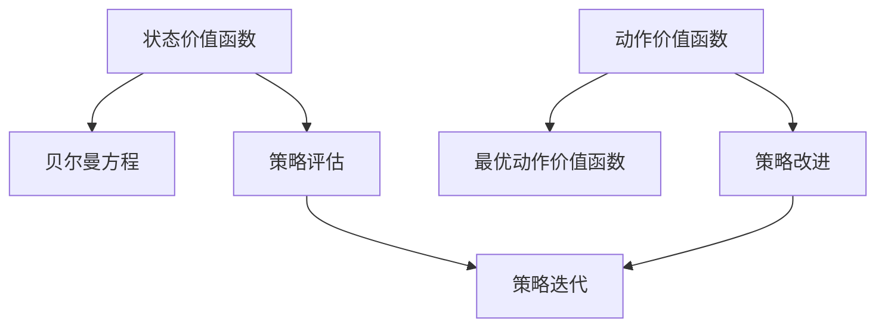

# AI人工智能核心算法原理与代码实例讲解：价值函数

## 1.背景介绍
### 1.1 人工智能发展历程
### 1.2 强化学习的兴起
### 1.3 价值函数在强化学习中的重要性

## 2.核心概念与联系  
### 2.1 状态价值函数
#### 2.1.1 状态价值函数的定义
#### 2.1.2 贝尔曼方程
### 2.2 动作价值函数  
#### 2.2.1 动作价值函数的定义
#### 2.2.2 最优动作价值函数
### 2.3 价值函数与策略的关系
#### 2.3.1 基于价值函数的策略改进
#### 2.3.2 策略评估与策略迭代



## 3.核心算法原理具体操作步骤
### 3.1 动态规划求解价值函数
#### 3.1.1 策略评估
#### 3.1.2 策略改进
#### 3.1.3 策略迭代
### 3.2 蒙特卡洛方法估计价值函数  
#### 3.2.1 首次访问型蒙特卡洛预测
#### 3.2.2 每次访问型蒙特卡洛预测
### 3.3 时序差分学习估计价值函数
#### 3.3.1 Sarsa算法
#### 3.3.2 Q-learning算法

## 4.数学模型和公式详细讲解举例说明
### 4.1 马尔可夫决策过程MDP
#### 4.1.1 MDP的定义与组成
#### 4.1.2 MDP的贝尔曼方程
### 4.2 状态价值函数的数学定义
$$
V_{\pi}(s)=\mathbb{E}_{\pi}[G_t|S_t=s]=\mathbb{E}_{\pi}[\sum_{k=0}^{\infty}\gamma^kr_{t+k+1}|S_t=s]
$$
### 4.3 动作价值函数的数学定义  
$$
Q_{\pi}(s,a)=\mathbb{E}_{\pi}[G_t|S_t=s,A_t=a]=\mathbb{E}_{\pi}[\sum_{k=0}^{\infty}\gamma^kr_{t+k+1}|S_t=s,A_t=a]
$$

## 5.项目实践：代码实例和详细解释说明
### 5.1 基于动态规划的价值迭代算法实现
```python
def value_iteration(env, theta=0.0001, discount_factor=1.0):
    """
    价值迭代算法
    env: OpenAI env
    theta: 收敛阈值 
    discount_factor: 折扣因子
    returns: 最优状态价值函数
    """
    def one_step_lookahead(state, V):
        """
        计算状态s的所有后继状态的价值函数
        """
        A = np.zeros(env.nA)
        for a in range(env.nA):
            for prob, next_state, reward, done in env.P[state][a]:
                A[a] += prob * (reward + discount_factor * V[next_state])
        return A
    
    V = np.zeros(env.nS)
    while True:
        delta = 0
        for s in range(env.nS):
            A = one_step_lookahead(s, V)
            best_action_value = np.max(A)
            delta = max(delta, np.abs(best_action_value - V[s]))
            V[s] = best_action_value        
        if delta < theta:
            break
    
    return V
```

### 5.2 基于蒙特卡洛的状态价值函数估计实现
```python
def mc_prediction_v(env, num_episodes, generate_episode, gamma=1.0):
    """
    使用蒙特卡洛方法估计状态价值函数
    env: OpenAI env
    num_episodes: 采样的幕数
    generate_episode: 给定策略生成episode的函数
    gamma: 折扣因子
    returns: 状态价值函数估计
    """
    # 初始化计数和回报求和
    returns_sum = defaultdict(float)
    returns_count = defaultdict(float)
    
    # 对每个episode进行采样
    for i_episode in range(1, num_episodes + 1):
        # 使用给定策略生成一个episode
        episode = generate_episode(env)
        
        # 计算该episode每个状态的首次出现位置
        states, _, rewards = zip(*episode)
        for i, state in enumerate(states):
            first_occurence_idx = next(j for j,x in enumerate(states[i:]) if x == state)
            G = sum([gamma**k * r for k,r in enumerate(rewards[i+first_occurence_idx:])])
            returns_sum[state] += G
            returns_count[state] += 1.0

    # 计算每个状态的价值函数估计
    V = {k: v / returns_count[k] for k, v in returns_sum.items()}
    return V
```

## 6.实际应用场景
### 6.1 自动驾驶中的决策系统
### 6.2 智能推荐系统
### 6.3 机器人控制
### 6.4 游戏AI

## 7.工具和资源推荐
### 7.1 OpenAI Gym
### 7.2 TensorFlow
### 7.3 PyTorch
### 7.4 Keras
### 7.5 相关书籍与教程推荐

## 8.总结：未来发展趋势与挑战
### 8.1 基于深度学习的价值函数逼近
### 8.2 异步强化学习算法
### 8.3 多智能体强化学习
### 8.4 强化学习的安全性与鲁棒性
### 8.5 强化学习在实际场景中的应用挑战

## 9.附录：常见问题与解答
### 9.1 什么是探索与利用的权衡？
### 9.2 如何处理强化学习中的延迟回报问题？ 
### 9.3 强化学习如何应对状态空间和动作空间过大的问题？
### 9.4 什么是无模型强化学习？
### 9.5 强化学习与监督学习、非监督学习有何区别？

价值函数是强化学习的核心概念之一，它评估在某个状态下执行某个动作的好坏程度。准确估计价值函数对于智能体学习最优策略至关重要。本文深入探讨了价值函数的数学定义、核心算法原理，并给出了Python代码实现。同时，本文还讨论了价值函数在自动驾驶、推荐系统、游戏AI等实际场景中的应用，展望了强化学习技术的未来发展趋势与面临的挑战。

强化学习作为人工智能的一个重要分支，其潜力正在被越来越多的研究者和工程师所认识。价值函数作为强化学习的基石，其理论与应用也在不断发展完善。相信通过学界和业界的共同努力，强化学习必将在实现通用人工智能的道路上发挥越来越重要的作用。

作者：禅与计算机程序设计艺术 / Zen and the Art of Computer Programming