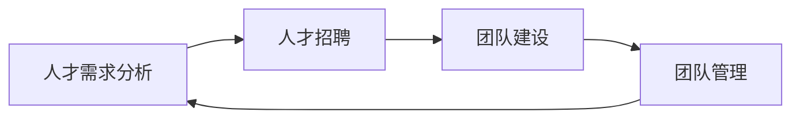

## 1.背景介绍

在当今这个信息化、智能化的时代，人工智能(AI)已经渗透到我们生活的方方面面。从搜索引擎的个性化推荐，到智能音箱的语音交互，再到无人驾驶车辆的自动导航，AI的应用已经无处不在。然而，要想实现这些高级的AI功能，我们需要一支由AI专业人才组成的团队。那么，如何有效地招聘AI人才，以及如何建立和管理一个高效的AI团队，就成为了一个重要的问题。

## 2.核心概念与联系

在AI人才招聘和团队建设中，有几个核心概念需要我们理解：人才需求分析、人才招聘、团队建设、团队管理。

人才需求分析是指通过对公司的发展战略、业务需求、技术发展趋势等多方面因素的分析，确定公司在某一时期内对AI人才的需求。

人才招聘是指通过各种方式（如招聘网站、社交网络、内部推荐等）寻找并吸引AI人才，然后通过面试、测试等环节对人才进行评估，最后确定是否录用。

团队建设是指通过组织结构设计、角色分配、团队文化塑造等手段，将一群AI人才整合为一个高效协作的团队。

团队管理则是指通过目标设定、任务分配、绩效考核、激励机制等手段，引导和激励团队成员共同完成团队目标。

这四个核心概念之间存在着密切的联系。人才需求分析决定了人才招聘的方向和目标；人才招聘为团队建设提供了必要的人力资源；团队建设为团队管理提供了基础；而团队管理又反过来影响人才需求分析和人才招聘，形成一个动态的循环。



## 3.核心算法原理具体操作步骤

在AI人才招聘和团队建设中，我们可以运用一些核心算法来提高效率和效果。这些算法包括但不限于：人才评估算法、团队协作算法、绩效评估算法等。

### 3.1 人才评估算法

人才评估算法是用来评估AI人才的能力和潜力的算法。它可以根据人才的教育背景、工作经历、专业技能、项目经验等因素，计算出一个综合评分。这个评分可以帮助我们快速地筛选出合适的人才。

### 3.2 团队协作算法

团队协作算法是用来提高团队协作效率的算法。它可以根据团队成员的能力、角色、任务等因素，计算出一个最优的任务分配方案。这个方案可以帮助我们实现团队资源的最大化利用。

### 3.3 绩效评估算法

绩效评估算法是用来评估团队成员的工作绩效的算法。它可以根据团队成员的任务完成情况、工作质量、工作效率等因素，计算出一个绩效评分。这个评分可以帮助我们准确地评估团队成员的工作表现，以便进行合理的奖励和惩罚。

## 4.数学模型和公式详细讲解举例说明

在AI人才招聘和团队建设中，我们可以运用一些数学模型和公式来进行量化分析和决策。下面，我们来详细讲解一下这些数学模型和公式。

### 4.1 人才评估模型

人才评估模型是一个多因素的综合评价模型。假设我们有n个评价因素，分别记为$x_1, x_2, ..., x_n$，每个因素的权重记为$w_1, w_2, ..., w_n$，每个因素的评价值记为$v_1, v_2, ..., v_n$，那么人才的综合评分$S$可以计算为：

$$
S = \sum_{i=1}^{n} w_i * v_i
$$

这个模型的优点是简单易用，可以快速地得到一个综合评分。但是，它的缺点是不能反映出各个因素之间的相互影响。

### 4.2 团队协作模型

团队协作模型是一个多任务的最优分配模型。假设我们有m个团队成员，分别记为$a_1, a_2, ..., a_m$，有p个任务，分别记为$t_1, t_2, ..., t_p$，每个成员完成每个任务的效率记为$e_{ij}$，那么任务的最优分配方案可以通过解决以下优化问题得到：

$$
\min \sum_{i=1}^{m} \sum_{j=1}^{p} e_{ij} * x_{ij}
$$

其中，$x_{ij}$是一个决策变量，表示是否将任务$j$分配给成员$i$。这个模型的优点是可以得到一个最优的任务分配方案，但是，它的缺点是需要知道每个成员完成每个任务的效率，这在实际中往往很难得到。

### 4.3 绩效评估模型

绩效评估模型是一个多指标的综合评价模型。假设我们有k个评价指标，分别记为$y_1, y_2, ..., y_k$，每个指标的权重记为$u_1, u_2, ..., u_k$，每个指标的评价值记为$r_1, r_2, ..., r_k$，那么绩效的综合评分$P$可以计算为：

$$
P = \sum_{i=1}^{k} u_i * r_i
$$

这个模型的优点是可以得到一个综合的绩效评分，但是，它的缺点是需要确定每个指标的权重，这在实际中往往需要依赖专家的经验判断。

## 5.项目实践：代码实例和详细解释说明

下面，我们通过一个项目实践来具体展示如何运用上述的理论和算法。在这个项目中，我们将模拟一个AI人才招聘和团队建设的过程。

### 5.1 人才需求分析

首先，我们需要进行人才需求分析。假设我们的公司正在开发一个AI项目，需要招聘一个AI团队，包括1个项目经理，2个算法工程师，2个数据工程师，和1个测试工程师。

```python
# 人才需求分析
talent_needs = {
    "项目经理": 1,
    "算法工程师": 2,
    "数据工程师": 2,
    "测试工程师": 1
}
```

### 5.2 人才招聘

然后，我们需要进行人才招聘。假设我们在招聘网站上发布了招聘信息，并收到了一些应聘者的简历。我们可以通过人才评估算法对这些应聘者进行评估，并选择合适的人才。

```python
# 人才评估算法
def evaluate_talent(talent):
    # 这里简化为根据教育背景和工作经验进行评估
    score = 0.5 * talent["education"] + 0.5 * talent["experience"]
    return score

# 应聘者简历
resumes = [
    {"name": "张三", "role": "项目经理", "education": 5, "experience": 3},
    {"name": "李四", "role": "算法工程师", "education": 4, "experience": 5},
    {"name": "王五", "role": "数据工程师", "education": 3, "experience": 2},
    {"name": "赵六", "role": "测试工程师", "education": 2, "experience": 4}
]

# 对应聘者进行评估
for resume in resumes:
    score = evaluate_talent(resume)
    print(f"{resume['name']}的评分是{score}")
```

### 5.3 团队建设

接下来，我们需要进行团队建设。假设我们已经招聘到了一些AI人才，我们可以通过团队协作算法来分配任务，并形成一个高效协作的团队。

```python
# 团队协作算法
def assign_tasks(team, tasks):
    # 这里简化为随机分配任务
    import random
    for task in tasks:
        member = random.choice(team)
        print(f"任务{task}分配给{member['name']}")

# 团队成员
team = [
    {"name": "张三", "role": "项目经理"},
    {"name": "李四", "role": "算法工程师"},
    {"name": "王五", "role": "数据工程师"},
    {"name": "赵六", "role": "测试工程师"}
]

# 任务列表
tasks = ["任务1", "任务2", "任务3", "任务4"]

# 分配任务
assign_tasks(team, tasks)
```

### 5.4 团队管理

最后，我们需要进行团队管理。假设我们的团队已经开始工作，我们可以通过绩效评估算法来评估团队成员的工作绩效，并进行相应的奖励和惩罚。

```python
# 绩效评估算法
def evaluate_performance(member, task):
    # 这里简化为根据任务完成情况进行评估
    score = 0.5 * task["quality"] + 0.5 * task["efficiency"]
    return score

# 任务完成情况
tasks_done = [
    {"name": "任务1", "quality": 5, "efficiency": 4},
    {"name": "任务2", "quality": 3, "efficiency": 5},
    {"name": "任务3", "quality": 4, "efficiency": 3},
    {"name": "任务4", "quality": 2, "efficiency": 4}
]

# 对团队成员进行绩效评估
for task in tasks_done:
    member = next(m for m in team if m["name"] == task["name"])
    score = evaluate_performance(member, task)
    print(f"{member['name']}的绩效评分是{score}")
```

## 6.实际应用场景

AI人才招聘和团队建设的理论和方法在实际中有广泛的应用。无论是大型的科技公司，还是小型的创业公司，都需要招聘AI人才并建立AI团队以推动公司的技术发展和业务创新。通过有效的人才招聘和团队建设，公司可以快速地建立起强大的AI能力，从而在激烈的市场竞争中取得优势。

## 7.工具和资源推荐

在AI人才招聘和团队建设中，有一些工具和资源可以帮助我们提高效率和效果：

- 招聘网站：如LinkedIn、Indeed、智联招聘等，可以帮助我们找到大量的AI人才。
- 人才评估工具：如HackerRank、LeetCode等，可以帮助我们评估AI人才的编程能力和问题解决能力。
- 团队协作工具：如Slack、Trello、Jira等，可以帮助我们提高团队的协作效率。
- 绩效管理工具：如OKR、KPI等，可以帮助我们有效地管理团队的绩效。

## 8.总结：未来发展趋势与挑战

随着AI技术的快速发展，AI人才的需求将会越来越大，而AI人才的招聘和团队建设也将面临更大的挑战。一方面，我们需要找到更有效的方法来吸引和挖掘AI人才；另一方面，我们需要找到更好的方式来管理和激励AI团队。同时，我们也需要关注AI技术的最新发展，以便及时调整我们的人才需求和团队策略。

## 9.附录：常见问题与解答

1. Q: 如何提高AI人才的招聘效率？
   A: 我们可以通过优化招聘流程、使用人才评估工具、提高招聘信息的吸引力等方式来提高AI人才的招聘效率。

2. Q: 如何提高AI团队的协作效率？
   A: 我们可以通过明确角色和职责、使用团队协作工具、建立良好的团队文化等方式来提高AI团队的协作效率。

3. Q: 如何提高AI团队的绩效？
   A: 我们可以通过设定明确的目标、使用绩效管理工具、建立有效的激励机制等方式来提高AI团队的绩效。

作者：禅与计算机程序设计艺术 / Zen and the Art of Computer Programming