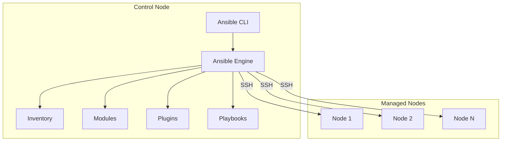

# AI系统Ansible原理与代码实战案例讲解

## 1.背景介绍

### 1.1 什么是Ansible?

Ansible是一种开源的自动化工具,它可以通过简单的语法轻松管理大量计算机节点。Ansible基于Python开发,使用SSH协议与远程节点通信,无需在远程节点上安装任何代理程序,从而简化了部署和管理过程。

### 1.2 Ansible的优势

- **无代理**:不需要在被管理节点上安装任何代理程序,使用现有的SSH连接即可工作。
- **简单易用**:基于YAML语言,具有简单直观的语法,易于编写和阅读。
- **高效并行**:通过并行执行任务,可以加快自动化速度。
- **安全可靠**:使用SSH协议通信,传输过程加密,确保数据安全。
- **幂等性**:任务具有幂等性,即多次执行相同的任务,系统最终将保持相同的状态。
- **支持多种操作系统**:支持Linux、Windows等多种操作系统。

### 1.3 Ansible的应用场景

Ansible广泛应用于IT运维自动化、应用程序部署、配置管理、持续交付等领域。常见的使用场景包括:

- 服务器配置管理
- 应用程序部署
- 云资源管理
- 容器编排
- 网络自动化
- 安全合规性检查

## 2.核心概念与联系

### 2.1 控制节点(Control Node)

控制节点是运行Ansible的机器,负责发送模块到被管理节点并完成任务。控制节点需要安装Ansible软件。

### 2.2 被管理节点(Managed Node)

被管理节点是需要执行任务的远程系统。Ansible通过SSH协议与被管理节点通信,执行相应的任务。

### 2.3 清单(Inventory)

清单是一个INI格式的文件,用于列出被管理节点的信息,包括IP地址、主机名等。Ansible使用清单来识别需要管理的节点。

### 2.4 模块(Module)

模块是Ansible执行任务的基本单元,封装了特定的操作,如管理文件、管理软件包、管理服务等。Ansible附带了大量内置模块,也支持自定义模块。

### 2.5 任务(Task)

任务是模块的调用,用于定义要在被管理节点上执行的操作。任务由模块名称和参数组成。

### 2.6 剧本(Playbook)

剧本是一个YAML格式的文件,包含一个或多个由任务组成的场景。剧本定义了要在被管理节点上执行的一系列任务。

### 2.7 角色(Role)

角色是一种将剧本拆分为可重用文件的方式,用于组织和分发剧本内容。角色包含变量、任务、模板等,可以在多个剧本中重复使用。

### 2.8 核心工作流程

Ansible的核心工作流程如下:

1. 控制节点读取清单文件,获取被管理节点列表。
2. 控制节点通过SSH连接到被管理节点。
3. 控制节点将模块和参数通过SSH传输到被管理节点。
4. 被管理节点执行模块,并将结果返回给控制节点。
5. 控制节点汇总结果并显示输出。

## 3.核心算法原理具体操作步骤

### 3.1 Ansible架构概览

Ansible的架构由以下几个主要组件组成:



1. **Ansible CLI**: 命令行界面,用于执行Ansible命令。
2. **Ansible Engine**: 核心引擎,负责解析剧本、管理连接、执行任务等。
3. **Inventory**: 清单文件,列出被管理节点的信息。
4. **Modules**: 模块集合,提供各种功能的任务单元。
5. **Plugins**: 插件集合,扩展Ansible的功能。
6. **Playbooks**: 剧本文件,定义要在被管理节点上执行的任务序列。
7. **Managed Nodes**: 被管理节点,接收并执行任务。

### 3.2 Ansible工作流程详解

1. **解析清单(Inventory)**

   Ansible首先读取清单文件,获取被管理节点的信息,如主机名、IP地址、SSH凭证等。

2. **建立连接**

   Ansible使用SSH协议与被管理节点建立连接。如果被管理节点需要密码,Ansible将提示输入或使用预先配置的密钥。

3. **传输模块**

   Ansible将要执行的模块及其参数通过SSH传输到被管理节点的临时目录中。

4. **执行模块**

   被管理节点使用Python解释器执行模块,并将结果返回给Ansible。

5. **收集结果**

   Ansible收集每个被管理节点的执行结果,并根据需要进行汇总和格式化输出。

6. **清理临时文件**

   执行完成后,Ansible会从被管理节点上删除临时文件。

### 3.3 并行执行原理

Ansible利用Python的多线程和多进程特性,实现了并行执行任务的能力。具体步骤如下:

1. Ansible根据清单文件中的主机列表,创建一个主机队列。
2. 为每个被管理节点创建一个单独的工作线程或进程。
3. 每个工作线程/进程与对应的被管理节点建立SSH连接。
4. 工作线程/进程并行执行任务,直到所有任务完成。
5. Ansible收集并汇总所有工作线程/进程的结果。

通过并行执行,Ansible可以显著提高自动化效率,尤其在管理大量节点时更加明显。

### 3.4 幂等性实现原理

幂等性是Ansible的一个重要特性,即多次执行相同的任务,系统最终将保持相同的状态。Ansible通过以下机制实现幂等性:

1. **模块设计**

   Ansible的大部分模块在设计时就考虑了幂等性。例如,文件模块在复制文件时,会先检查目标文件是否已存在并与源文件相同。如果相同,则不执行任何操作。

2. **状态检查**

   在执行任务之前,Ansible会检查被管理节点的当前状态。如果已经符合预期状态,则不执行任何操作。

3. **结果注册**

   Ansible允许将任务的执行结果注册为变量。在后续任务中,可以根据这些变量的值来决定是否执行特定操作。

4. **条件语句**

   Ansible支持在任务中使用条件语句,根据特定条件决定是否执行任务。这可以避免不必要的操作。

通过上述机制,Ansible确保了任务的幂等性,从而提高了自动化的可靠性和效率。

## 4.数学模型和公式详细讲解举例说明

在并行执行任务时,Ansible需要合理分配资源,以确保任务能够高效完成。这可以通过建立数学模型来优化。

假设有 $n$ 个被管理节点,每个节点执行任务的时间为 $t_i$ ($i = 1, 2, \ldots, n$)。我们的目标是最小化总执行时间 $T$。

令 $x_i$ 表示第 $i$ 个节点是否被分配执行任务,其中 $x_i = 1$ 表示分配, $x_i = 0$ 表示不分配。我们可以建立以下数学模型:

$$
\begin{aligned}
\min \quad & T \\
\text{s.t.} \quad & T \geq \sum_{i=1}^n x_i t_i \\
& \sum_{i=1}^n x_i = m \\
& x_i \in \{0, 1\}, \quad i = 1, 2, \ldots, n
\end{aligned}
$$

其中,第一个约束条件确保总执行时间 $T$ 不小于所有被分配节点的执行时间之和;第二个约束条件表示被分配的节点数量为 $m$,即可用资源数量。

这是一个经典的整数规划问题,可以使用各种算法求解,如分支定界法、切割平面法等。求解得到的最优解 $x_i^*$ 就是最佳的节点分配方案。

以上数学模型仅为示例,实际情况可能更加复杂,需要考虑更多约束条件,如网络带宽、CPU利用率等。但基本思路是相似的,即通过建立数学模型,并使用优化算法求解,从而实现资源的最佳分配。

## 5.项目实践:代码实例和详细解释说明

### 5.1 安装Ansible

首先,我们需要在控制节点上安装Ansible。以Ubuntu为例:

```bash
sudo apt update
sudo apt install software-properties-common
sudo apt-add-repository --yes --update ppa:ansible/ansible
sudo apt install ansible
```

### 5.2 配置清单

接下来,创建一个清单文件`hosts`,列出被管理节点的信息:

```ini
[webservers]
web1 ansible_host=192.168.1.100
web2 ansible_host=192.168.1.101

[dbservers]
db1 ansible_host=192.168.1.200
```

这里定义了两个组:`webservers`和`dbservers`,分别包含了Web服务器和数据库服务器的IP地址。

### 5.3 编写剧本

创建一个剧本文件`deploy.yml`,用于部署Web应用程序:

```yaml
---
- hosts: webservers
  become: yes
  tasks:
    - name: Install Apache
      apt:
        name: apache2
        state: present

    - name: Copy website files
      copy:
        src: website/
        dest: /var/www/html/

- hosts: dbservers
  become: yes
  tasks:
    - name: Install MySQL
      apt:
        name: mysql-server
        state: present

    - name: Create database
      mysql_db:
        name: myapp
        state: present
```

这个剧本包含两个场景:

1. 在`webservers`组中,安装Apache Web服务器并复制网站文件。
2. 在`dbservers`组中,安装MySQL数据库服务器并创建一个名为`myapp`的数据库。

### 5.4 执行剧本

现在,我们可以使用`ansible-playbook`命令执行剧本:

```bash
ansible-playbook -i hosts deploy.yml
```

Ansible将并行连接到所有被管理节点,并按照剧本中定义的任务进行执行。执行过程中,Ansible会显示每个任务的状态和结果。

### 5.5 使用角色

为了提高代码的可重用性,我们可以将剧本重构为角色。创建一个名为`roles/webserver/tasks/main.yml`的文件:

```yaml
---
- name: Install Apache
  apt:
    name: apache2
    state: present

- name: Copy website files
  copy:
    src: website/
    dest: /var/www/html/
```

然后,修改剧本文件`site.yml`:

```yaml
---
- hosts: webservers
  become: yes
  roles:
    - webserver

- hosts: dbservers
  become: yes
  roles:
    - role: mysql
      vars:
        db_name: myapp
```

在这个剧本中,我们使用了两个角色:`webserver`和`mysql`。`webserver`角色包含了之前定义的任务,而`mysql`角色则需要从其他地方导入。通过使用角色,我们可以更好地组织和维护代码。

## 6.实际应用场景

Ansible在IT运维自动化领域有着广泛的应用,下面是一些常见的场景:

### 6.1 服务器配置管理

使用Ansible可以轻松管理大量服务器的配置,包括安装软件包、配置服务、管理用户等。这有助于确保所有服务器保持一致的状态,降低人为错误的风险。

### 6.2 应用程序部署

通过编写剧本,Ansible可以自动化应用程序的部署过程,包括传输代码、安装依赖项、配置环境变量等。这不仅提高了效率,还确保了部署过程的一致性和可重复性。

### 6.3 云资源管理

Ansible可以与多种云平台(如AWS、Azure、OpenStack等)集成,用于管理云资源,如创建实例、配置网络、管理存储等。这简化了云资源的管理,提高了基础设施的可伸缩性。

### 6.4 容器编排

Ansible可以与Docker、Kubernetes等容器技术集成,实现容器的部署、管理和编排。这使得在多个节点上管理容器化应用程序变得更加简单。

### 6.5