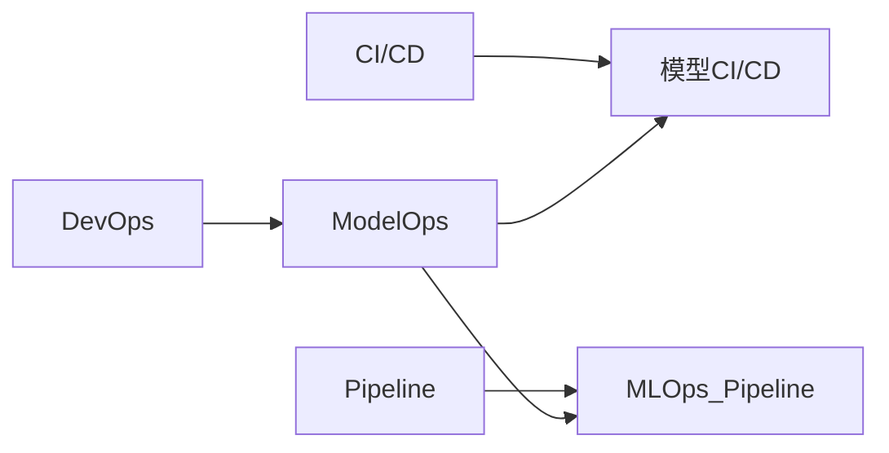

# AI系统ModelOps原理与代码实战案例讲解

## 1.背景介绍
### 1.1 人工智能系统开发面临的挑战
随着人工智能技术的快速发展,越来越多的企业开始将AI系统应用到实际生产环境中。然而,开发和部署一个高质量、高可用的AI系统并非易事。AI系统开发面临着模型训练数据不足、模型性能不稳定、模型部署困难等诸多挑战。

### 1.2 ModelOps的提出
为了应对AI系统开发面临的种种挑战,业界提出了ModelOps(Model Operations)的概念。ModelOps旨在将DevOps的理念引入到机器学习模型的开发、训练、部署、监控的全生命周期管理中,提高AI系统的开发效率和质量。

### 1.3 ModelOps在AI系统开发中的重要意义
ModelOps对于保障AI系统的高质量、高可用性、可解释性等方面具有重要意义。通过引入标准化、自动化的ModelOps流程和工具,可以大幅提升AI系统的开发效率,缩短开发周期,降低开发和维护成本。同时,ModelOps可以帮助保障AI系统的质量,提高模型性能的稳定性和可靠性。

## 2.核心概念与联系
### 2.1 DevOps与ModelOps
- DevOps:开发(Development)与运维(Operations)的融合,强调开发、测试、运维的自动化与协作。
- ModelOps:将DevOps的理念引入机器学习领域,强调模型开发、训练、部署、监控的端到端自动化。
- 二者的关系:ModelOps是DevOps在AI领域的延伸和具体应用。

### 2.2 CI/CD与模型CI/CD
- CI/CD:持续集成(Continuous Integration)和持续交付(Continuous Delivery)。
- 模型CI/CD:将CI/CD应用到机器学习模型的开发流程中。
- 二者的关系:模型CI/CD是CI/CD在ModelOps中的具体实践。

### 2.3 Pipeline与MLOps Pipeline  
- Pipeline:一系列的流程步骤,数据在其中流动并被处理。
- MLOps Pipeline:机器学习模型开发、训练、部署、监控的端到端Pipeline。
- 二者的关系:MLOps Pipeline是Pipeline在ModelOps中的具体应用。

### 2.4 核心概念之间的联系
下图展示了ModelOps的核心概念之间的联系:



## 3.核心算法原理与具体操作步骤
### 3.1 模型版本管理
- 原理:通过版本控制系统(如Git)管理模型代码、配置、数据等。
- 步骤:
  - 将模型相关的代码、配置等提交到代码仓库
  - 通过Tag、Branch等进行版本管理
  - 不同版本的模型可以独立进行训练和部署

### 3.2 自动化模型训练
- 原理:通过自动化流程触发模型训练,减少人工干预。
- 步骤:
  - 监听代码或数据的变更
  - 触发模型训练流程
  - 记录训练日志和产出的模型

### 3.3 自动化模型评估
- 原理:通过标准化的指标和流程自动评估模型性能。
- 步骤:  
  - 使用统一的评估指标(如准确率、召回率等)
  - 评估训练产出的模型
  - 比较不同版本模型的性能差异
  - 自动化生成评估报告

### 3.4 自动化模型部署
- 原理:将模型自动打包、部署到生产环境中。
- 步骤:
  - 将模型转换为标准格式(如ONNX、PMML等) 
  - 自动化打包模型与依赖
  - 将打包后的模型部署到生产环境
  - 配置流量引入,实现灰度发布

### 3.5 自动化模型监控
- 原理:实时监控模型性能指标,及时发现异常。
- 步骤:
  - 埋点收集模型预测数据
  - 计算监控指标(如预测延迟、准确率等)
  - 设置预警阈值,触发告警
  - 对接可视化监控面板

## 4.数学模型和公式详细讲解举例说明
本节我们以一个简单的线性回归模型为例,讲解其中涉及的数学模型和公式。

线性回归模型的一般形式为:
$$y = w^Tx + b$$
其中:
- $x$为输入特征向量
- $y$为预测目标值
- $w$为权重参数向量
- $b$为偏置项

在模型训练阶段,我们的目标是找到最优的权重参数$w$和偏置项$b$,使得模型在训练集上的预测误差最小。通常使用均方误差(Mean Squared Error,MSE)作为损失函数:

$$MSE = \frac{1}{n}\sum_{i=1}^n(y_i - \hat{y}_i)^2$$

其中:
- $n$为训练样本数
- $y_i$为第$i$个样本的真实值
- $\hat{y}_i$为第$i$个样本的预测值

我们可以使用梯度下降法对损失函数进行优化,不断更新模型参数,直到损失函数收敛。参数$w$和$b$的更新公式为:

$$w := w - \alpha \frac{\partial MSE}{\partial w}$$
$$b := b - \alpha \frac{\partial MSE}{\partial b}$$

其中$\alpha$为学习率,控制每次参数更新的步长。

## 5.项目实践：代码实例和详细解释说明
下面我们通过一个简单的Python代码实例,演示如何使用ModelOps的思想进行模型训练和部署。

```python
import joblib
from sklearn.linear_model import LinearRegression
from sklearn.metrics import mean_squared_error

# 加载数据(省略数据处理细节)
X_train, y_train = load_data("train.csv") 
X_test, y_test = load_data("test.csv")

# 模型训练
model = LinearRegression()
model.fit(X_train, y_train)

# 模型评估
y_pred = model.predict(X_test)
mse = mean_squared_error(y_test, y_pred)
print(f"Test MSE: {mse:.3f}")

# 模型保存 
joblib.dump(model, "model.pkl")

# 模型部署
model = joblib.load("model.pkl")
```

代码解释:
1. 加载训练集和测试集数据
2. 初始化线性回归模型,调用`fit()`方法在训练集上进行训练  
3. 在测试集上进行预测,计算MSE评估模型性能
4. 使用joblib将训练好的模型保存到文件 
5. 在部署时从文件加载训练好的模型,进行预测

可以看到,通过ModelOps的思想,我们将模型训练、评估、存储、部署等步骤进行了清晰的拆分和解耦,提高了模型开发的效率和可维护性。在实际的工程实践中,我们可以在此基础上搭建自动化的MLOps Pipeline,进一步提升AI系统的开发和运维效率。

## 6.实际应用场景
ModelOps在工业界有广泛的应用,下面列举几个典型的应用场景:

### 6.1 智能推荐系统
- 背景:电商、视频网站等需要根据用户行为和偏好进行个性化推荐
- 难点:推荐模型需要实时更新,快速响应用户请求
- 解决方案:通过ModelOps实现推荐模型的自动化训练、部署、监控,保障推荐效果和响应速度

### 6.2 智能客服系统
- 背景:企业需要通过智能客服提升服务效率,降低人力成本 
- 难点:客服对话模型需要持续优化,保障对话质量
- 解决方案:通过ModelOps实现对话模型的版本管理、自动评估、灰度发布等,持续提升对话效果

### 6.3 工业质检系统
- 背景:工厂需要利用视觉模型自动检测产品缺陷,提升质检效率
- 难点:质检模型需要适应不同产品和工况,性能要求高  
- 解决方案:通过ModelOps管理不同产品的质检模型,自动触发训练和部署,实时监控质检效果

## 7.工具和资源推荐
### 7.1 开源工具
- MLflow:管理机器学习生命周期,包括实验跟踪、模型注册等
- Kubeflow:基于Kubernetes的机器学习工具集,支持模型训练、部署等
- TensorFlow Extended(TFX):端到端的机器学习平台,提供数据校验、模型分析等功能
- ONNX:开放的神经网络交换格式,用于不同框架间的模型转换和部署

### 7.2 商业平台
- AWS SageMaker:托管的机器学习平台,提供模型构建、训练、部署功能
- Azure Machine Learning:机器学习生命周期管理平台,支持自动化ML Pipeline
- Google Cloud AI Platform:端到端的机器学习平台,提供数据标注、模型训练等服务

### 7.3 学习资源 
- 《Introducing MLOps》:O'Reilly出版的MLOps入门书籍
- ML Ops: Operationalizing Data Science:Coursera上的MLOps课程
- MLOps.community:MLOps社区,提供博客、教程、视频等学习资源

## 8.总结：未来发展趋势与挑战
### 8.1 ModelOps的发展趋势
- 平台化:通过开发ModelOps平台,提供一站式的AI开发和部署环境
- 云原生:与云原生技术(如Kubernetes)深度融合,实现弹性伸缩和高可用
- 智能化:利用AutoML等技术,进一步提高ModelOps的自动化和智能化水平
- 标准化:制定ModelOps标准,促进不同平台和工具间的互操作性

### 8.2 ModelOps面临的挑战
- 复杂性:端到端的ModelOps涉及诸多组件和流程,整体复杂度高
- 专业人才缺乏:需要同时具备机器学习和软件工程技能的复合型人才
- 工具链集成:需要打通不同的机器学习框架和工具,实现无缝集成
- 模型治理:需要从合规、安全、伦理等方面加强对AI模型的管控

## 9.附录：常见问题与解答
### 9.1 ModelOps与传统软件工程有何区别?
传统软件工程侧重代码逻辑的开发和维护,而ModelOps更关注数据和模型的管理。ModelOps需要兼顾数据处理、模型训练、模型评估等环节,具有更强的端到端特性和数据驱动特性。

### 9.2 ModelOps对开发人员的技能要求是什么?
ModelOps要求开发人员具备机器学习和软件工程的双重技能。既要熟悉机器学习的基本原理和常用算法,又要掌握软件工程的最佳实践,如版本控制、自动化测试、CI/CD等。

### 9.3 中小企业如何实施ModelOps?
中小企业在实施ModelOps时,可以先聚焦于最核心的痛点,例如模型版本管理、自动化部署等。同时,可以充分利用开源工具和云平台,减少基础设施的投入。可以先小规模试点,逐步积累经验后再全面推广。

### 9.4 如何评估ModelOps的实施效果?  
可以从以下几个维度评估ModelOps的实施效果:
- 模型开发效率:度量从模型开发到部署的周期、所需人力等
- 模型性能表现:度量模型的各项性能指标,如准确率、延迟等
- 故障响应时间:度量模型出现问题时,修复问题的响应时间
- 资源利用率:度量模型训练和部署的计算资源利用情况

希望这篇文章能够帮助读者全面了解ModelOps的原理和实践,开启ModelOps的探索之旅。ModelOps是一个涉及广泛、发展迅速的领域,需要我们在实践中不断学习和完善。让我们携手共进,共同推动ModelOps的发展和应用!

作者：禅与计算机程序设计艺术 / Zen and the Art of Computer Programming