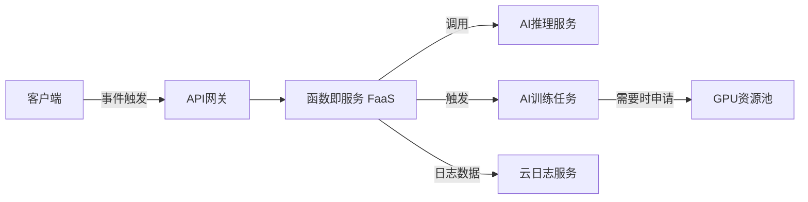

# AI系统Serverless原理与代码实战案例讲解

## 1.背景介绍

### 1.1 Serverless的兴起
近年来,随着云计算技术的快速发展,Serverless架构逐渐成为构建现代应用程序的热门选择。Serverless让开发人员无需关注底层基础设施,专注于核心业务逻辑的开发,大大提高了开发效率。特别是对于AI系统来说,Serverless提供了弹性伸缩、按需付费等优势,非常适合AI工作负载的特点。

### 1.2 AI系统面临的挑战
传统的AI系统开发面临诸多挑战:
- 基础设施管理复杂,需要投入大量人力
- 资源利用率低,造成浪费
- 扩展性差,难以应对突发流量
- 开发部署周期长,影响产品迭代速度

### 1.3 Serverless助力AI系统发展  
Serverless很好地解决了上述AI系统面临的难题。通过Serverless架构,AI系统可以:
- 免运维,开发者聚焦AI算法本身
- 自动弹性伸缩,匹配AI任务负载
- 按需使用,大幅节约成本
- 加速开发部署,缩短产品上线周期

可以说,Serverless正在深刻影响和重塑AI应用的开发模式,推动AI民主化进程。

## 2.核心概念与联系

### 2.1 Serverless的定义
Serverless Computing(无服务器计算)是一种云原生架构范式,其核心思想是"用户无需关注服务器,只需专注核心代码"。狭义上,Serverless仅指代Function as a Service(FaaS),即函数即服务。广义上,Serverless泛指一切托管服务,如托管数据库、消息队列、对象存储等。

### 2.2 Serverless的特点
- 无服务器:用户不用配置和管理服务器
- 事件驱动:通过事件触发函数执行
- 自动伸缩:根据请求数量自动调整资源
- 微服务化:每个函数解决一个独立的问题
- 按使用付费:真正做到按需使用,按量计费

### 2.3 Serverless与AI系统
Serverless与AI系统有天然的契合度:
- AI推理任务通常是事件触发,如用户请求、消息到达等,非常适合FaaS
- AI训练任务对算力需求大,但使用周期短,用Serverless可以弹性调配资源
- AI工作负载具有不可预测性,需要能够快速扩缩容的架构
- AI开发需要快速迭代,Serverless的轻量级部署可以加速AI应用落地

下图展示了一个典型的Serverless AI系统架构:



## 3.核心算法原理具体操作步骤

### 3.1 在线推理服务
对于在线AI推理服务,我们通常采用FaaS架构,将AI模型封装在函数中,通过API网关暴露服务。当有用户请求到达时,会触发函数执行,调用AI模型完成推理。核心步骤如下:

1. 将训练好的AI模型如TensorFlow SavedModel上传到对象存储 
2. 编写推理函数,加载模型并实现预测逻辑
3. 将函数部署到FaaS平台,配置触发器如API网关
4. 用户请求到达API网关,触发函数执行
5. 函数调用AI模型完成推理,返回结果给用户

### 3.2 离线批处理任务
对于离线的AI大规模训练、预测等批处理任务,我们通常采用Serverless工作流服务编排。工作流由一系列函数组成,每个函数负责一个子任务。函数之间通过事件触发机制串联,数据通过云存储等介质共享。核心步骤如下:

1. 定义工作流,拆分各个子任务
2. 为每个子任务编写函数,如数据预处理、模型训练、模型评估等
3. 配置工作流,设置函数间的触发关系和数据传递方式 
4. 触发工作流执行,比如定时触发或事件触发
5. 各任务函数依次执行,完成端到端的AI训练、预测流程

## 4.数学模型和公式详细讲解举例说明

本节我们以一个简单的图像分类任务为例,讲解Serverless AI系统涉及的数学模型和公式。

### 4.1 卷积神经网络
对于图像分类,我们通常采用卷积神经网络(CNN)。CNN的核心是卷积运算和池化运算,可以提取图像的局部特征。假设输入图像为$X$,卷积核为$W$,偏置为$b$,激活函数为$f$,则卷积运算可以表示为:

$$C = f(W*X+b)$$

其中$*$表示卷积操作。常见的激活函数有ReLU:

$$ReLU(x) = max(0,x)$$

池化运算可以压缩特征图尺寸,提高特征的鲁棒性。常见的池化操作有最大池化和平均池化,以最大池化为例:

$$P_{i,j} = max_{m,n}C_{i+m,j+n}$$

其中$(i,j)$为池化窗口的位置,$(m,n)$为池化窗口内的偏移。

### 4.2 交叉熵损失
图像分类属于多分类问题,我们通常采用交叉熵损失函数。设真实标签的one-hot编码为$y$,模型预测概率为$\hat{y}$,则交叉熵损失为:

$$Loss = -\sum_{i=1}^{n}y_i \log(\hat{y}_i)$$

其中$n$为类别数。训练目标是最小化损失函数,常用的优化算法有随机梯度下降(SGD):

$$w := w - \eta \frac{\partial Loss}{\partial w}$$

其中$w$为模型参数,$\eta$为学习率。

## 5.项目实践：代码实例和详细解释说明

下面我们以PyTorch和AWS Lambda为例,演示如何实现Serverless图像分类服务。

### 5.1 模型训练

首先,我们离线训练一个ResNet图像分类模型:

```python
import torch
import torchvision

# 加载CIFAR10数据集
train_dataset = torchvision.datasets.CIFAR10(root='./data', train=True, download=True, transform=transform)
test_dataset = torchvision.datasets.CIFAR10(root='./data', train=False, download=True, transform=transform)

# 定义ResNet模型
model = torchvision.models.resnet18(pretrained=False, num_classes=10)

# 定义损失函数和优化器
criterion = torch.nn.CrossEntropyLoss()
optimizer = torch.optim.SGD(model.parameters(), lr=0.01, momentum=0.9)

# 训练模型
for epoch in range(10):
    train(model, train_loader, criterion, optimizer, epoch)
    test(model, test_loader)
    
# 保存模型
torch.save(model.state_dict(), 'model.pth')
```

### 5.2 推理函数
接下来,我们编写Serverless推理函数,加载训练好的模型,对上传的图片进行分类:

```python
import json
import torch
import torchvision

model = torchvision.models.resnet18(pretrained=False, num_classes=10)
model.load_state_dict(torch.load('model.pth'))
model.eval()

def lambda_handler(event, context):
    # 获取上传的图片
    image_bytes = event['body']
    image = Image.open(io.BytesIO(base64.b64decode(image_bytes)))
    
    # 图片预处理
    transform = transforms.Compose([
        transforms.Resize(224),
        transforms.ToTensor(),
        transforms.Normalize(mean=[0.485, 0.456, 0.406], std=[0.229, 0.224, 0.225])
    ])
    image = transform(image).unsqueeze(0)
    
    # 模型推理
    with torch.no_grad():
        outputs = model(image)
        _, predicted = torch.max(outputs, 1)
        
    # 返回分类结果
    class_names = ['airplane', 'automobile', 'bird', 'cat', 'deer', 'dog', 'frog', 'horse', 'ship', 'truck']  
    result = class_names[predicted.item()]
    
    return {
        'statusCode': 200,
        'body': json.dumps({'result': result})
    }
```

这里我们通过API网关触发Lambda函数,API网关会将用户上传的图片数据以base64编码的形式传入到event参数中。函数解码图片,调用ResNet模型进行预测,并将分类结果返回给用户。

### 5.3 函数部署
最后,我们将推理函数部署到AWS Lambda平台:

```bash
# 安装依赖包
pip install torch torchvision -t ./

# 打包函数代码和依赖
zip -r lambda.zip lambda_function.py model.pth ./torch/ ./torchvision/

# 创建Lambda函数
aws lambda create-function --function-name image-classification \
--zip-file fileb://lambda.zip --handler lambda_function.lambda_handler \
--runtime python3.8 --role arn:aws:iam::account-id:role/lambda-role    

# 为函数创建API网关触发器
aws apigateway create-rest-api --name image-classification-api
aws apigateway get-resources --rest-api-id abcdef123 
aws apigateway put-method --rest-api-id abcdef123 --resource-id 123abc --http-method POST --authorization-type "NONE"
aws apigateway put-integration --rest-api-id abcdef123 --resource-id 123abc --http-method POST --type AWS_PROXY --integration-http-method POST --uri arn:aws:apigateway:us-east-1:lambda:path/2015-03-31/functions/arn:aws:lambda:us-east-1:account-id:function:image-classification/invocations
aws apigateway create-deployment --rest-api-id abcdef123 --stage-name prod
```

至此,我们就成功搭建了一个Serverless的图像分类服务。用户可以通过API网关上传图片,请求会自动触发Lambda函数执行推理,并将结果返回给用户,整个过程无需管理服务器。

## 6.实际应用场景

Serverless AI在实际场景中有非常广泛的应用,下面列举几个典型案例:

### 6.1 智能客服
传统客服需要大量人力,响应速度慢,难以24小时全天候服务。采用Serverless架构,可以搭建智能客服系统:
- 将知识库、聊天历史等数据存储在云数据库中
- 聊天机器人核心逻辑采用FaaS实现,支持自动伸缩
- 语音识别、语义理解、对话管理、语音合成等功能均采用Serverless函数实现
- 对话日志通过云日志服务记录,用于后续分析

### 6.2 个性化推荐
传统推荐系统采用离线批处理,无法实时更新模型和推荐结果。采用Serverless架构,可以实现实时个性化推荐:
- 用户行为数据通过Serverless数据处理服务实时接入
- 采用Serverless工作流服务编排数据处理、特征工程、模型训练、模型评估等步骤
- 推荐服务采用FaaS实现,支持实时在线推理
- 离线的模型训练任务通过Serverless容器服务运行,可按需申请GPU资源

### 6.3 视频内容审核
短视频平台需要对海量用户上传的视频进行内容审核,采用Serverless架构可以高效应对:
- 视频上传到云存储后,自动触发审核流程  
- 视频截帧、音频提取通过Serverless函数实现
- 图像、文本、音频的内容分类、检测通过Serverless AI服务实现
- 审核结果通过消息队列反馈,对违规内容自动进行屏蔽删除

可以看到,Serverless为AI系统提供了一个全新的架构范式,让AI开发更加敏捷高效。

## 7.工具和资源推荐

对于Serverless AI开发,推荐一些常用的工具和资源:

- 无服务器计算平台:AWS Lambda、Google Cloud Functions、阿里云函数计算等
- Serverless工作流服务:AWS Step Functions、阿里云函数工作流等 
- Serverless机器学习平台:Amazon SageMaker、阿里云PAI等
- 机器学习框架:TensorFlow、PyTorch、Scikit-Learn等
- 模型压缩工具:TensorFlow Lite、TorchScript、ONNX等
- Serverless应用开发框架:Serverless Framework、AWS SAM等

此外,一些Serverless AI相关的开源项目也值得关注:
- OpenFaaS