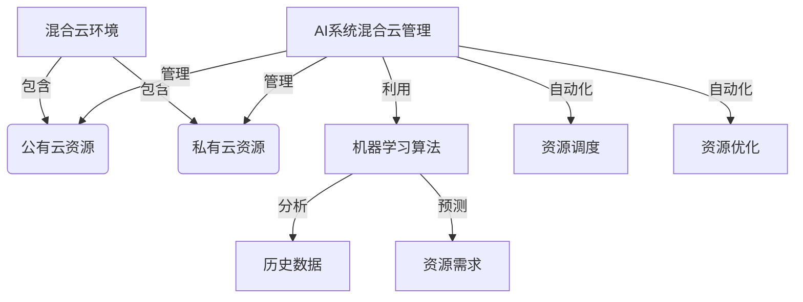
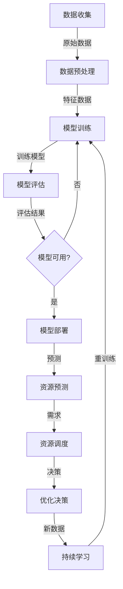

# AI系统混合云管理原理与代码实战案例讲解

## 1.背景介绍

在当今数字化转型的浪潮中,云计算无疑成为了企业 IT 基础设施的关键支柱。然而,由于各种原因,很多企业无法完全迁移到公有云,而是采用混合云战略,将工作负载分布在公有云和私有云之间。混合云架构为企业带来了诸多好处,例如成本优化、灵活性增强、合规性等,但同时也带来了管理和运维的新挑战。

传统的云管理工具通常针对单一云环境,难以跨云统一管理和编排资源。而人工智能(AI)技术的发展为解决这一难题提供了新的契机。AI 系统混合云管理就是将 AI 技术与云管理相结合,实现对异构云资源的智能管理和优化。

## 2.核心概念与联系

### 2.1 混合云

混合云是指将公有云和私有云资源相结合的云计算环境。企业可以根据业务需求,将部分工作负载部署在公有云上,将敏感或关键工作负载部署在私有云上,从而实现成本优化、合规性和安全性的平衡。

### 2.2 云管理

云管理是指对云计算资源进行监控、配置、供应、维护和优化的一系列活动。它包括资源供应、资源监控、自动化、成本优化、安全合规等多个方面。

### 2.3 AI 系统

AI 系统是指利用机器学习、深度学习等人工智能技术构建的智能系统。这些系统可以从大量数据中学习模式,并对新数据进行预测和决策。

### 2.4 AI 系统混合云管理

AI 系统混合云管理是将 AI 技术应用于混合云环境的资源管理中。它利用机器学习算法分析历史数据,预测资源需求,并自动调度和优化资源分配,从而提高资源利用率、降低成本,并简化运维工作。



## 3.核心算法原理具体操作步骤

AI 系统混合云管理的核心算法原理主要包括以下几个步骤:

1. **数据收集**:从混合云环境中收集各种类型的数据,包括资源利用率、应用程序性能、成本等。这些数据将作为机器学习模型的输入。

2. **数据预处理**:对收集的原始数据进行清洗、标准化和特征工程,以准备输入机器学习模型。

3. **模型训练**:使用监督学习或无监督学习算法,在历史数据上训练机器学习模型。常用的算法包括回归、决策树、随机森林、神经网络等。

4. **模型评估**:使用测试数据评估模型的性能,包括准确性、精确度、召回率等指标。如果模型性能不佳,需要调整模型参数或特征工程,重复步骤 3 和 4。

5. **模型部署**:将训练好的模型部署到生产环境中,用于实时预测和决策。

6. **资源预测**:使用部署的模型预测未来的资源需求,包括 CPU、内存、存储、网络带宽等。

7. **资源调度**:根据资源预测结果,自动调度和供应资源,包括启动新实例、关闭空闲实例、扩展或缩减资源等。

8. **优化决策**:除了资源调度,还可以根据模型预测结果做出其他优化决策,例如迁移工作负载、更改实例类型、调整自动扩展策略等。

9. **持续学习**:在生产环境中持续收集新数据,定期重新训练模型,以适应环境的变化。



## 4.数学模型和公式详细讲解举例说明

在 AI 系统混合云管理中,常用的数学模型和公式包括:

### 4.1 线性回归

线性回归是一种常用的监督学习算法,用于预测连续型目标变量。在云资源预测中,可以使用线性回归模型预测 CPU 利用率、内存使用量等指标。

线性回归模型的数学表达式为:

$$y = \theta_0 + \theta_1x_1 + \theta_2x_2 + ... + \theta_nx_n$$

其中 $y$ 是目标变量, $x_1, x_2, ..., x_n$ 是特征变量, $\theta_0, \theta_1, ..., \theta_n$ 是模型参数。

模型参数通过最小化损失函数(如均方误差)来估计:

$$J(\theta) = \frac{1}{2m}\sum_{i=1}^m(h_\theta(x^{(i)}) - y^{(i)})^2$$

其中 $m$ 是训练样本数量, $h_\theta(x^{(i)})$ 是对第 $i$ 个样本的预测值, $y^{(i)}$ 是第 $i$ 个样本的真实值。

### 4.2 决策树

决策树是一种常用的监督学习算法,可以用于分类和回归任务。在云资源预测中,可以使用决策树预测实例类型、自动扩展策略等离散型目标变量。

决策树通过递归地将数据划分为较小的子集,构建一个树状结构。每个内部节点代表一个特征,每个分支代表该特征的一个值,每个叶节点代表一个预测值。

决策树的构建过程可以使用信息增益或基尼指数作为特征选择标准。对于分类任务,信息增益定义为:

$$\text{Gain}(S, A) = \text{Entropy}(S) - \sum_{v \in \text{Values}(A)} \frac{|S_v|}{|S|} \text{Entropy}(S_v)$$

其中 $S$ 是数据集, $A$ 是特征, $\text{Values}(A)$ 是特征 $A$ 的所有可能值, $S_v$ 是 $S$ 中特征 $A$ 取值为 $v$ 的子集, $\text{Entropy}(S)$ 是数据集 $S$ 的信息熵。

### 4.3 随机森林

随机森林是一种集成学习算法,由多个决策树组成。它通过构建多个决策树,并将它们的预测结果进行平均(回归任务)或投票(分类任务),从而提高预测性能。

随机森林的优点包括:

- 不容易过拟合
- 可以处理高维数据
- 可以评估特征重要性

随机森林的预测函数可以表示为:

$$f(x) = \frac{1}{B}\sum_{b=1}^B f_b(x)$$

其中 $B$ 是决策树的数量, $f_b(x)$ 是第 $b$ 棵决策树对输入 $x$ 的预测值。

### 4.4 神经网络

神经网络是一种强大的机器学习模型,可以用于分类、回归、聚类等各种任务。在云资源预测中,可以使用神经网络模型预测各种连续型和离散型目标变量。

一个简单的前馈神经网络可以表示为:

$$y = f_3(W_3^Tf_2(W_2^Tf_1(W_1^Tx + b_1) + b_2) + b_3)$$

其中 $x$ 是输入向量, $y$ 是输出, $W_1, W_2, W_3$ 是权重矩阵, $b_1, b_2, b_3$ 是偏置向量, $f_1, f_2, f_3$ 是激活函数(如 ReLU、Sigmoid 等)。

神经网络通过反向传播算法优化权重和偏置,使损失函数最小化。常用的损失函数包括均方误差、交叉熵等。

## 5.项目实践:代码实例和详细解释说明

以下是一个使用 Python 和 scikit-learn 库实现 AI 系统混合云管理的示例代码:

```python
# 导入所需库
import pandas as pd
from sklearn.linear_model import LinearRegression
from sklearn.tree import DecisionTreeRegressor
from sklearn.ensemble import RandomForestRegressor
from sklearn.model_selection import train_test_split
from sklearn.metrics import mean_squared_error, r2_score

# 加载数据
data = pd.read_csv('cloud_data.csv')
X = data.drop('cpu_utilization', axis=1)
y = data['cpu_utilization']

# 划分训练集和测试集
X_train, X_test, y_train, y_test = train_test_split(X, y, test_size=0.2, random_state=42)

# 线性回归模型
lr = LinearRegression()
lr.fit(X_train, y_train)
y_pred_lr = lr.predict(X_test)
mse_lr = mean_squared_error(y_test, y_pred_lr)
r2_lr = r2_score(y_test, y_pred_lr)
print(f'Linear Regression: MSE={mse_lr:.2f}, R^2={r2_lr:.2f}')

# 决策树回归模型
dt = DecisionTreeRegressor(max_depth=5, random_state=42)
dt.fit(X_train, y_train)
y_pred_dt = dt.predict(X_test)
mse_dt = mean_squared_error(y_test, y_pred_dt)
r2_dt = r2_score(y_test, y_pred_dt)
print(f'Decision Tree: MSE={mse_dt:.2f}, R^2={r2_dt:.2f}')

# 随机森林回归模型
rf = RandomForestRegressor(n_estimators=100, random_state=42)
rf.fit(X_train, y_train)
y_pred_rf = rf.predict(X_test)
mse_rf = mean_squared_error(y_test, y_pred_rf)
r2_rf = r2_score(y_test, y_pred_rf)
print(f'Random Forest: MSE={mse_rf:.2f}, R^2={r2_rf:.2f}')
```

上述代码演示了如何使用线性回归、决策树回归和随机森林回归三种模型来预测 CPU 利用率。代码的主要步骤如下:

1. 导入所需的库和模块。
2. 加载包含云资源数据的 CSV 文件,将 CPU 利用率作为目标变量 `y`,其他特征作为输入变量 `X`。
3. 使用 `train_test_split` 函数将数据划分为训练集和测试集。
4. 创建线性回归模型 `LinearRegression()`、决策树回归模型 `DecisionTreeRegressor()` 和随机森林回归模型 `RandomForestRegressor()`。
5. 在训练集上拟合模型,并在测试集上进行预测。
6. 计算均方误差 (MSE) 和 R 平方值,评估模型性能。

根据模型评估结果,我们可以选择性能最佳的模型,将其部署到生产环境中,用于实时预测 CPU 利用率。然后,根据预测结果,自动调度和优化云资源。

## 6.实际应用场景

AI 系统混合云管理在多个领域都有广泛的应用场景,例如:

### 6.1 自动资源调度

通过预测未来的资源需求,AI 系统可以自动启动或关闭实例,扩展或缩减资源,从而优化资源利用率和成本。这对于具有周期性或突发性资源需求的应用程序(如网络服务、大数据分析等)特别有用。

### 6.2 工作负载迁移

AI 系统可以分析工作负载的特征,并根据成本、性能、合规性等因素,决定将工作负载迁移到公有云还是私有云。这有助于实现成本优化和合规性管理。

### 6.3 自动扩展策略优化

传统的自动扩展策略通常基于静态阈值,难以适应动态变化的工作负载。AI 系统可以根据历史数据和实时指标,动态调整自动扩展策略,提高资源利用效率。

### 6.4 成本优化