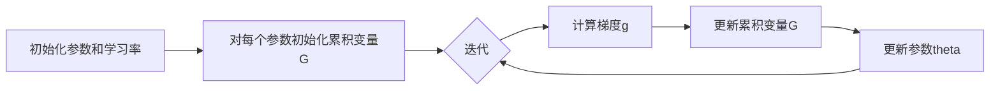

# AdaGrad优化器原理与代码实例讲解

## 1.背景介绍
### 1.1 机器学习中的优化问题
在机器学习中,我们经常需要最小化一个目标函数(也称为损失函数),以找到最优的模型参数。这个过程称为优化(Optimization)。常见的优化算法有梯度下降法(Gradient Descent)、牛顿法(Newton's Method)、拟牛顿法(Quasi-Newton Methods)等。

### 1.2 梯度下降法的局限性
传统的梯度下降法在优化非凸函数时,可能会陷入局部最优,收敛速度慢。此外,它对所有参数使用同一个学习率,这可能并不适用于所有问题。因此,研究者们提出了一些自适应学习率的优化算法,如AdaGrad、RMSProp、Adam等。

### 1.3 AdaGrad优化器的诞生
AdaGrad(Adaptive Gradient)是一种自适应学习率的优化算法,由Duchi等人于2011年提出。它的基本思想是:对于出现频率较低的特征,应该使用较大的学习率;而对于出现频率较高的特征,应该使用较小的学习率。这样可以加速稀疏特征的学习。

## 2.核心概念与联系
### 2.1 学习率
学习率(Learning Rate)是机器学习中的一个重要超参数,它决定了每次参数更新的步长。学习率过大可能导致优化过程不稳定,甚至发散;学习率过小则会导致收敛速度过慢。

### 2.2 梯度
梯度(Gradient)是一个向量,表示目标函数在当前点处沿着各个坐标轴正方向的变化率。在优化过程中,我们希望朝着负梯度的方向更新参数,以最小化目标函数。

### 2.3 自适应学习率
自适应学习率(Adaptive Learning Rate)是指根据优化过程中的信息(如梯度)动态调整学习率的方法。与固定学习率相比,自适应学习率可以加速收敛,并减少对初始学习率的依赖。

### 2.4 稀疏特征
稀疏特征(Sparse Features)是指在特征向量中大部分元素为0,只有少数元素非0的特征。许多实际问题都具有稀疏特征,如文本分类、推荐系统等。

## 3.核心算法原理具体操作步骤
### 3.1 AdaGrad算法流程
AdaGrad的核心思想是:对每个参数维护一个学习率,并根据该维度上历史梯度的平方和来调整学习率。具体步骤如下:

1. 初始化参数$\theta$和学习率$\eta$
2. 对每个参数$\theta_i$,初始化一个累积变量$G_i=0$
3. 在每次迭代中:
   - 计算梯度$g_t=\nabla_\theta J(\theta)$
   - 对每个参数$\theta_i$,更新累积变量$G_{t,i}=G_{t-1,i}+g_{t,i}^2$
   - 对每个参数$\theta_i$,更新参数$\theta_{t,i}=\theta_{t-1,i}-\frac{\eta}{\sqrt{G_{t,i}+\epsilon}} \cdot g_{t,i}$

其中,$\epsilon$是一个小常数(如1e-8),用于防止分母为0。

### 3.2 AdaGrad算法流程图


## 4.数学模型和公式详细讲解举例说明
### 4.1 参数更新公式
AdaGrad的参数更新公式为:

$$\theta_{t,i}=\theta_{t-1,i}-\frac{\eta}{\sqrt{G_{t,i}+\epsilon}} \cdot g_{t,i}$$

其中:
- $\theta_{t,i}$表示第$t$次迭代中第$i$个参数的值
- $\eta$是初始学习率
- $G_{t,i}$是第$i$个参数截止到第$t$次迭代的梯度平方和
- $g_{t,i}$是第$t$次迭代中第$i$个参数的梯度
- $\epsilon$是一个小常数,用于数值稳定性

### 4.2 公式解释
AdaGrad通过除以$\sqrt{G_{t,i}+\epsilon}$来调整每个参数的学习率。直观上看:
- 对于那些频繁出现的特征(即梯度平方和较大),学习率会变小,避免过大的更新
- 对于那些稀疏的特征(即梯度平方和较小),学习率会相对较大,加速学习

### 4.3 示例
假设我们有两个参数$\theta_1$和$\theta_2$,初始学习率$\eta=0.1$。在前三次迭代中,它们的梯度如下:

| 迭代次数 | $g_1$ | $g_2$ |
|----------|-------|-------|
| 1        | 1     | 0.1   |  
| 2        | 0.9   | 0.1   |
| 3        | 1.1   | 0.1   |

则在第3次迭代后,AdaGrad的参数更新过程为:

$G_{3,1}=1^2+0.9^2+1.1^2=2.9$

$G_{3,2}=0.1^2+0.1^2+0.1^2=0.03$

$\theta_{3,1}=\theta_{2,1}-\frac{0.1}{\sqrt{2.9+\epsilon}} \cdot 1.1 \approx \theta_{2,1}-0.064$

$\theta_{3,2}=\theta_{2,2}-\frac{0.1}{\sqrt{0.03+\epsilon}} \cdot 0.1 \approx \theta_{2,2}-0.058$

可以看到,对于梯度平方和较大的$\theta_1$,学习率相对较小;而对于梯度平方和较小的$\theta_2$,学习率相对较大。

## 5.项目实践：代码实例和详细解释说明
下面是一个使用PyTorch实现AdaGrad优化器的示例代码:

```python
import torch

# 定义模型参数
w = torch.randn(10, requires_grad=True)
b = torch.zeros(1, requires_grad=True)

# 定义AdaGrad优化器
optimizer = torch.optim.Adagrad([w, b], lr=0.1)

# 训练循环
for epoch in range(10):
    # 前向传播
    y_pred = torch.matmul(x, w) + b
    loss = criterion(y_pred, y)
    
    # 反向传播
    optimizer.zero_grad()
    loss.backward()
    
    # 更新参数
    optimizer.step()
```

代码解释:
1. 首先定义了两个模型参数`w`和`b`,并设置`requires_grad=True`以启用梯度跟踪。
2. 然后创建了一个AdaGrad优化器`optimizer`,传入参数列表`[w, b]`和学习率`lr=0.1`。
3. 在训练循环中,首先进行前向传播,计算预测值`y_pred`和损失`loss`。
4. 然后调用`optimizer.zero_grad()`清空梯度,再调用`loss.backward()`进行反向传播。
5. 最后调用`optimizer.step()`更新参数。优化器会自动维护每个参数的累积梯度平方和,并根据AdaGrad算法更新参数。

## 6.实际应用场景
AdaGrad优化器在处理稀疏数据时表现出色,因此在以下场景中广泛应用:

### 6.1 文本分类
在文本分类任务中,输入特征通常是词袋模型(Bag-of-Words)或TF-IDF向量,这些特征向量通常是高维且稀疏的。AdaGrad可以自适应地调整每个特征的学习率,加速稀疏特征的学习。

### 6.2 推荐系统
在推荐系统中,用户-物品交互矩阵通常也是稀疏的。AdaGrad可以更好地处理这种稀疏数据,提高推荐质量。

### 6.3 广告点击率预估
在广告点击率预估问题中,特征空间通常也是高维且稀疏的。使用AdaGrad可以加速模型的训练和收敛。

## 7.工具和资源推荐
以下是一些实现和应用AdaGrad优化器的常用工具和资源:

- PyTorch: torch.optim.Adagrad
- TensorFlow: tf.keras.optimizers.Adagrad
- Scikit-learn: sklearn.linear_model.SGDClassifier/SGDRegressor(设置`learning_rate='invscaling'`)
- 原始论文: Adaptive Subgradient Methods for Online Learning and Stochastic Optimization

## 8.总结：未来发展趋势与挑战
AdaGrad是自适应学习率优化器的先驱,它的提出极大地推动了优化算法的发展。但AdaGrad也存在一些局限性:
- 学习率会随着迭代次数的增加而单调递减,可能导致模型过早停止学习
- 仍然需要手动设置初始学习率

为了解决这些问题,研究者们提出了许多AdaGrad的改进版本,如AdaDelta、RMSprop、Adam等。这些算法在不同的场景中表现出色。

未来,自适应优化算法的研究方向可能包括:
- 更智能的学习率调整策略
- 与其他优化技术(如动量、Nesterov加速梯度等)的结合
- 针对特定问题(如深度学习、强化学习等)的优化算法设计

总之,优化算法是机器学习的核心,其发展与机器学习的进步息息相关。AdaGrad作为一个里程碑式的算法,为后续的研究指明了方向。

## 9.附录：常见问题与解答
### 9.1 AdaGrad和梯度下降法的区别是什么?
AdaGrad是一种自适应学习率的优化算法,它根据每个参数的历史梯度调整学习率。而传统的梯度下降法使用固定的学习率,对所有参数一视同仁。

### 9.2 AdaGrad为什么适合处理稀疏数据?
AdaGrad通过除以梯度平方和的平方根来调整学习率。对于稀疏特征,其梯度平方和较小,因此学习率相对较大,可以加速学习。而对于频繁出现的特征,学习率会相对较小,避免过大的更新。

### 9.3 AdaGrad的主要缺点是什么?
AdaGrad的主要缺点是学习率会随着迭代次数的增加而单调递减,可能导致模型过早停止学习。此外,AdaGrad仍然需要手动设置初始学习率。

### 9.4 AdaGrad和Adam的区别是什么?
AdaGrad只根据历史梯度调整学习率,而Adam除了考虑历史梯度外,还引入了动量的概念,可以看作是AdaGrad和动量法的结合。此外,Adam使用了偏差修正,可以缓解AdaGrad学习率过早衰减的问题。

作者：禅与计算机程序设计艺术 / Zen and the Art of Computer Programming