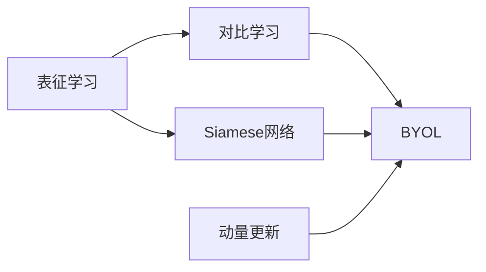
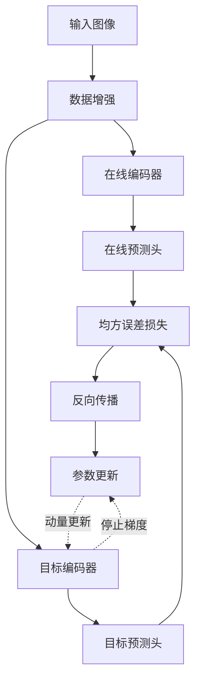

# BYOL原理与代码实例讲解

## 1.背景介绍
近年来,自监督学习(Self-supervised Learning)在计算机视觉、自然语言处理等领域取得了巨大成功。自监督学习旨在从大规模无标注数据中学习有用的表征,从而减少对人工标注数据的依赖。BYOL(Bootstrap Your Own Latent)是2020年提出的一种最新的自监督表征学习方法,在多个下游任务上取得了SOTA的效果,引起了学术界和工业界的广泛关注。

### 1.1 自监督学习的兴起
#### 1.1.1 标注数据的局限性
#### 1.1.2 自监督学习的优势
#### 1.1.3 自监督学习的发展历程

### 1.2 BYOL的诞生
#### 1.2.1 BYOL的创新点
#### 1.2.2 BYOL的优异性能
#### 1.2.3 BYOL的影响力

## 2.核心概念与联系
要理解BYOL算法,首先需要了解几个关键概念:表征学习、对比学习、Siamese网络、动量更新等。本节将对这些概念进行介绍,并阐述它们之间的内在联系。

### 2.1 表征学习
#### 2.1.1 表征的定义
#### 2.1.2 表征学习的目标
#### 2.1.3 表征学习的分类

### 2.2 对比学习 
#### 2.2.1 对比学习的基本思想
#### 2.2.2 正负样本对构建
#### 2.2.3 对比损失函数

### 2.3 Siamese网络
#### 2.3.1 Siamese网络的结构
#### 2.3.2 共享权重机制
#### 2.3.3 Siamese网络的应用

### 2.4 动量更新
#### 2.4.1 指数滑动平均
#### 2.4.2 动量编码器
#### 2.4.3 动量更新的作用

### 2.5 概念之间的联系
#### 2.5.1 BYOL与对比学习的异同
#### 2.5.2 BYOL中的Siamese结构
#### 2.5.3 BYOL的动量更新机制



## 3.核心算法原理与具体操作步骤
本节将详细介绍BYOL算法的核心原理,包括整体框架、正负样本对构建策略、预测头设计、损失函数定义等,并给出算法的具体操作步骤。

### 3.1 BYOL整体框架
#### 3.1.1 在线网络与目标网络
#### 3.1.2 对称结构设计
#### 3.1.3 停止梯度操作

### 3.2 正负样本对构建
#### 3.2.1 图像增强变换 
#### 3.2.2 多视角一致性
#### 3.2.3 避免平凡解

### 3.3 预测头设计
#### 3.3.1 MLP结构
#### 3.3.2 BatchNorm与隐层维度
#### 3.3.3 预测头初始化

### 3.4 损失函数定义
#### 3.4.1 均方误差损失
#### 3.4.2 对称损失计算
#### 3.4.3 损失函数优化目标

### 3.5 算法操作步骤
#### 3.5.1 输入与数据增强
#### 3.5.2 前向传播与特征提取
#### 3.5.3 预测头映射
#### 3.5.4 损失计算与反向传播
#### 3.5.5 参数更新



## 4.数学模型和公式详细讲解举例说明
为了更深入地理解BYOL算法,本节将对其中涉及的关键数学模型和公式进行详细讲解,并给出具体的数值计算举例。

### 4.1 编码器数学模型
#### 4.1.1 ResNet骨干网络
#### 4.1.2 投影头结构
#### 4.1.3 编码器输出计算

### 4.2 预测头数学模型  
#### 4.2.1 MLP结构与激活函数
#### 4.2.2 预测头输出计算
#### 4.2.3 预测头参数初始化

### 4.3 损失函数数学定义
#### 4.3.1 均方误差损失函数
$$ L = \frac{1}{2} \sum_{i=1}^{N} \left \| \bar{q}_{\theta}(z_{\theta}(y^{(i)})) - z_{\xi}(y^{(i)}) \right \|_2^2 + \left \| \bar{q}_{\xi}(z_{\xi}(x^{(i)})) - z_{\theta}(x^{(i)}) \right \|_2^2 $$

其中:
- $\theta$: 在线网络参数
- $\xi$: 目标网络参数 
- $x^{(i)}, y^{(i)}$: 第$i$个样本的两个增强视图
- $z_{\theta}, z_{\xi}$: 在线和目标编码器输出
- $\bar{q}_{\theta}, \bar{q}_{\xi}$: 在线和目标预测头输出

#### 4.3.2 对称损失计算
#### 4.3.3 损失函数优化目标

### 4.4 动量更新公式
#### 4.4.1 指数滑动平均计算
$$ \xi \leftarrow \tau \xi + (1 - \tau) \theta $$

其中:
- $\xi$: 目标网络参数
- $\theta$: 在线网络参数
- $\tau$: 动量系数,控制更新速度

#### 4.4.2 动量系数选择
#### 4.4.3 动量更新的作用与意义

### 4.5 数值计算举例
#### 4.5.1 编码器前向计算
#### 4.5.2 预测头前向计算
#### 4.5.3 损失函数计算
#### 4.5.4 参数梯度计算与更新

## 5.项目实践：代码实例和详细解释说明
为了帮助读者更好地掌握BYOL算法的实现细节,本节将给出PyTorch版本的BYOL代码实例,并对关键代码进行详细解释说明。

### 5.1 编码器实现
#### 5.1.1 ResNet骨干网络定义
#### 5.1.2 投影头定义
#### 5.1.3 前向传播实现

```python
class Encoder(nn.Module):
    def __init__(self, backbone, projection_dim):
        super().__init__()
        self.backbone = backbone
        self.projection = nn.Sequential(
            nn.Linear(backbone.output_dim, projection_dim),
            nn.BatchNorm1d(projection_dim),
            nn.ReLU(),
            nn.Linear(projection_dim, projection_dim)
        )
        
    def forward(self, x):
        x = self.backbone(x)
        x = self.projection(x)
        return x
```

### 5.2 预测头实现  
#### 5.2.1 MLP结构定义
#### 5.2.2 参数初始化
#### 5.2.3 前向传播实现

```python
class PredictionHead(nn.Module):
    def __init__(self, input_dim, hidden_dim, output_dim):
        super().__init__()
        self.mlp = nn.Sequential(
            nn.Linear(input_dim, hidden_dim),
            nn.BatchNorm1d(hidden_dim),
            nn.ReLU(),
            nn.Linear(hidden_dim, output_dim)
        )
        self._init_weights()
        
    def _init_weights(self):
        for m in self.modules():
            if isinstance(m, nn.Linear):
                nn.init.xavier_uniform_(m.weight)
                nn.init.constant_(m.bias, 0)
                
    def forward(self, x):
        return self.mlp(x)
```

### 5.3 损失函数实现
#### 5.3.1 均方误差损失定义 
#### 5.3.2 对称损失计算
#### 5.3.3 损失函数封装

```python
def byol_loss(online_pred, target_proj):
    online_pred = F.normalize(online_pred, dim=-1)
    target_proj = F.normalize(target_proj, dim=-1)
    loss = 2 - 2 * (online_pred * target_proj).sum(dim=-1)
    return loss.mean()
```

### 5.4 训练循环实现
#### 5.4.1 数据增强与加载
#### 5.4.2 编码器与预测头前向传播
#### 5.4.3 损失计算与反向传播
#### 5.4.4 参数更新与动量更新

```python
for images in data_loader:
    # 数据增强
    aug_images = [aug(images) for _ in range(2)]
    
    # 编码器前向传播
    online_proj = online_encoder(aug_images[0]) 
    with torch.no_grad():
        target_proj = target_encoder(aug_images[1])
        
    # 预测头前向传播
    online_pred = online_predictor(online_proj)
    
    # 损失计算
    loss = byol_loss(online_pred, target_proj)
    
    # 反向传播与参数更新
    optimizer.zero_grad()
    loss.backward()
    optimizer.step()
    
    # 动量更新
    update_moving_average(target_encoder, online_encoder, momentum)
```

### 5.5 完整代码实例
#### 5.5.1 BYOL算法PyTorch实现
#### 5.5.2 训练脚本示例
#### 5.5.3 推理部署代码

## 6.实际应用场景
BYOL作为一种强大的自监督表征学习算法,可以应用于多个计算机视觉任务。本节将介绍BYOL在图像分类、目标检测、语义分割等下游任务中的应用案例。

### 6.1 图像分类
#### 6.1.1 线性评估协议
#### 6.1.2 少样本微调
#### 6.1.3 ImageNet分类实验

### 6.2 目标检测
#### 6.2.1 检测器架构 
#### 6.2.2 BYOL预训练权重
#### 6.2.3 COCO检测实验

### 6.3 语义分割
#### 6.3.1 分割网络结构
#### 6.3.2 迁移学习策略 
#### 6.3.3 Cityscapes分割实验

### 6.4 人脸识别
#### 6.4.1 人脸表征提取
#### 6.4.2 度量学习损失
#### 6.4.3 LFW人脸验证实验

### 6.5 医学图像分析
#### 6.5.1 医学图像数据集
#### 6.5.2 疾病诊断与分割
#### 6.5.3 医学图像检索

## 7.工具和资源推荐
为了方便读者进一步学习和应用BYOL算法,本节将推荐一些相关的工具和资源,包括开源代码库、预训练模型、数据集、教程等。

### 7.1 开源代码库
#### 7.1.1 官方PyTorch实现
#### 7.1.2 官方TensorFlow实现
#### 7.1.3 MMSelfSup工具箱

### 7.2 预训练模型
#### 7.2.1 ImageNet预训练权重
#### 7.2.2 Places预训练权重
#### 7.2.3 iNaturalist预训练权重

### 7.3 数据集资源
#### 7.3.1 ImageNet数据集
#### 7.3.2 COCO数据集
#### 7.3.3 Cityscapes数据集

### 7.4 教程与文档
#### 7.4.1 BYOL原论文
#### 7.4.2 BYOL官方博客 
#### 7.4.3 BYOL视频讲解

### 7.5 社区与讨论
#### 7.5.1 GitHub Issues
#### 7.5.2 论文会议讨论
#### 7.5.3 自监督学习社区

## 8.总结：未来发展趋势与挑战
BYOL的提出标志着自监督表征学习的重要进展,为无标注数据的有效利用提供了新的思路。本节将总结BYOL的主要贡献,展望自监督学习的未来发展趋势,并分析当前面临的挑战。

### 8.1 BYOL的主要贡献
#### 8.1.1 摆脱对比学习范式
#### 8.1.2 Siamese结构设计
#### 8.1.3 动量更新机制

### 8.2 自监督学习的发展趋势
#### 8.2.1 更大规模预训练
#### 8.2.2 多模态表征学习
#### 8.2.3 更多下游任务拓展

### 8.3 当前面临的