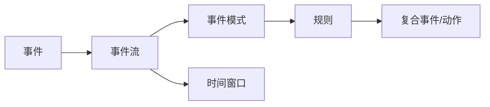
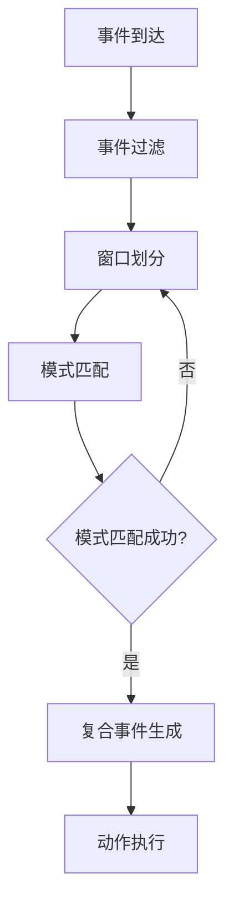
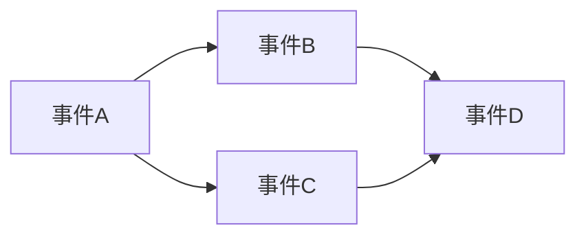

# CEP 原理与代码实例讲解

## 1.背景介绍

在当今大数据时代,企业需要实时处理海量的数据流,从中提取有价值的信息,以支持实时决策和响应。复杂事件处理(Complex Event Processing,CEP)作为一种新兴的事件驱动技术,能够从大量的实时事件流中识别出有意义的事件模式和复杂关系,在金融、物联网、运维监控等领域得到广泛应用。

本文将深入探讨CEP的原理和核心概念,并通过代码实例讲解CEP的具体实现。通过学习本文,读者可以全面掌握CEP技术,了解其应用场景,为实际项目实践打下坚实基础。

## 2.核心概念与联系

要理解CEP,首先需要了解其核心概念:

### 2.1 事件(Event)

事件是CEP处理的基本单元,表示系统内发生的一个状态变化或行为。事件包含时间戳、事件类型、属性等信息。例如,股票交易、温度传感器数据都可以表示为事件。

### 2.2 事件流(Event Stream)

事件流是一系列按时间顺序连续发生的事件序列。CEP需要实时处理事件流,识别事件之间的复杂关系。

### 2.3 事件模式(Event Pattern)

事件模式定义了事件之间的复杂关系和约束条件,用于从事件流中检测出有意义的事件组合。常见的事件模式包括:

- 序列模式(Sequence):按时间先后顺序出现的一组事件
- 组合模式(Combination):同时或一定时间内出现的多个事件
- 选择模式(Selection):从多个事件流中选择特定的事件
- 否定模式(Negation):在一定时间内没有出现特定事件

### 2.4 规则(Rule)

CEP使用规则来定义事件模式和处理逻辑。规则由条件(condition)和动作(action)两部分组成。当条件满足时,触发相应的动作,如生成复合事件、发出警报等。

### 2.5 时间窗口(Time Window) 

时间窗口用于划分事件流,只处理窗口内的事件。常见的时间窗口有滚动窗口、滑动窗口和会话窗口。

下图展示了CEP的核心概念之间的关系:



## 3.核心算法原理具体操作步骤

CEP的核心是根据定义的规则,从事件流中实时检测出复杂事件模式。其基本处理步骤如下:

1. 事件到达:新的事件到达CEP引擎,携带时间戳和属性信息。

2. 事件过滤:根据规则中的过滤条件,判断事件是否需要处理。

3. 窗口划分:根据时间窗口类型,将事件划分到不同的窗口中。

4. 模式匹配:对窗口内的事件按照规则定义的事件模式进行匹配。常用的模式匹配算法有:
   - NFA(非确定有限自动机):将事件模式转换为状态机,通过状态转移来匹配事件。
   - Rete算法:将规则条件分解为条件节点,构建Rete网络,提高条件评估效率。
   - SASE算法:使用堆叠自动机实现序列模式匹配,支持事件选择策略。

5. 复合事件生成:当检测到完整的事件模式时,根据规则定义生成复合事件。

6. 动作执行:触发规则中定义的动作,如更新状态、发送通知等。

下图展示了CEP的处理流程:



## 4.数学模型和公式详细讲解举例说明

CEP涉及的数学模型主要用于事件序列的表示和模式匹配。下面详细讲解几个常用的数学模型。

### 4.1 事件序列的形式化定义

事件序列可以表示为一个三元组 $(T,\prec,E)$,其中:

- $T$ 是时间戳的集合,表示事件发生的时间
- $\prec$ 是 $T$ 上的一个全序关系,表示事件的先后顺序
- $E$ 是事件的集合,每个事件都有对应的时间戳 $t\in T$

例如,一个股票交易事件序列可以表示为:

$$
(\{t_1,t_2,t_3\},\prec,\{e_1,e_2,e_3\})
$$

其中 $t_1 \prec t_2 \prec t_3$,表示事件 $e_1,e_2,e_3$ 的先后顺序。

### 4.2 正则表达式模型

正则表达式可以用于描述事件模式,定义事件之间的复杂关系。常用的正则表达式运算符包括:

- 连接(Concatenation):$AB$ 表示事件A和事件B按先后顺序出现
- 选择(Alternation):$A|B$ 表示事件A或事件B出现
- 克林闭包(Kleene Closure):$A^*$ 表示事件A出现0次或多次

例如,模式 $(A;B);C^*;(D|E)$ 表示:事件A和B按先后顺序出现,然后事件C出现0次或多次,最后事件D或E出现。

### 4.3 时态逻辑模型

时态逻辑用于描述事件之间的时间关系,常用的时态逻辑运算符包括:

- $\square A$:在所有的未来时刻,事件A都成立
- $\lozenge A$:在某个未来时刻,事件A成立
- $A\mathcal{U}B$:事件A一直成立,直到事件B成立

例如,模式 $\square(A\rightarrow\lozenge B)$ 表示:每次事件A出现,都会在其后的某个时刻出现事件B。

### 4.4 图模型

图模型用于表示事件之间的因果关系和复杂拓扑,常用的图模型包括:

- 有向无环图(DAG):用于表示事件之间的因果依赖关系
- Petri网:用于建模事件驱动系统,描述事件之间的并发、同步、冲突等关系

例如,下图展示了一个简单的事件因果DAG:



## 5.项目实践:代码实例和详细解释说明

下面通过一个简单的CEP引擎代码实例,演示CEP的核心功能。该引擎使用Python实现,基于正则表达式进行事件模式匹配。

```python
import re
from collections import deque

class Event:
    def __init__(self, type, timestamp, attributes):
        self.type = type
        self.timestamp = timestamp
        self.attributes = attributes
        
class Pattern:
    def __init__(self, pattern):
        self.regex = re.compile(pattern)
        
    def match(self, events):
        types = [event.type for event in events]
        return self.regex.match(''.join(types))

class Window:
    def __init__(self, size):
        self.size = size
        self.events = deque()
        
    def add(self, event):
        self.events.append(event)
        if len(self.events) > self.size:
            self.events.popleft()

class Rule:
    def __init__(self, pattern, action):
        self.pattern = Pattern(pattern)
        self.action = action
        
    def apply(self, events):
        if self.pattern.match(events):
            self.action(events)

class CEP:
    def __init__(self):
        self.rules = []
        self.windows = {}
        
    def add_rule(self, rule):
        self.rules.append(rule)
        
    def add_window(self, key, window):
        self.windows[key] = window
        
    def process(self, event):
        for window in self.windows.values():
            window.add(event)
            for rule in self.rules:
                rule.apply(window.events)

# 示例用法
def action(events):
    print(f"检测到复合事件: {events}")

cep = CEP()

cep.add_window('W1', Window(3))

pattern1 = "AB+C"
cep.add_rule(Rule(pattern1, action))

events = [
    Event('A', 1, {'price': 10}),
    Event('B', 2, {'price': 20}),
    Event('B', 3, {'price': 30}),
    Event('C', 4, {'price': 40}),
    Event('D', 5, {'price': 50})
]

for event in events:
    cep.process(event)
```

代码解释:

1. 定义了 `Event` 类表示单个事件,包含事件类型、时间戳和属性信息。

2. 定义了 `Pattern` 类,使用正则表达式表示事件模式,并提供了 `match` 方法用于匹配事件序列。

3. 定义了 `Window` 类,表示时间窗口,使用双端队列(deque)存储窗口内的事件。当新事件到达时,将其添加到窗口,并移除超出窗口大小的旧事件。

4. 定义了 `Rule` 类,表示CEP规则,包含事件模式和触发的动作函数。`apply` 方法用于将规则应用于给定的事件序列。

5. 定义了 `CEP` 类,表示CEP引擎,管理规则和时间窗口。`process` 方法用于处理新到达的事件,将其添加到窗口,并对每个规则进行匹配和触发。

6. 在示例用法中,创建了一个CEP引擎实例,添加了一个大小为3的时间窗口和一个模式为"AB+C"的规则。然后依次处理5个事件,当检测到匹配的事件模式时,触发对应的动作函数。

输出结果:

```
检测到复合事件: [Event(type='A', timestamp=1, attributes={'price': 10}), Event(type='B', timestamp=2, attributes={'price': 20}), Event(type='B', timestamp=3, attributes={'price': 30})]
检测到复合事件: [Event(type='B', timestamp=2, attributes={'price': 20}), Event(type='B', timestamp=3, attributes={'price': 30}), Event(type='C', timestamp=4, attributes={'price': 40})]
```

可以看到,CEP引擎成功检测出了两个匹配"AB+C"模式的复合事件。

## 6.实际应用场景

CEP在多个领域有广泛的应用,下面列举几个典型场景:

### 6.1 金融领域

- 实时检测股票市场的异常交易模式,如内幕交易、操纵市场等
- 识别欺诈交易,如信用卡盗刷、洗钱等
- 根据市场事件自动执行交易策略

### 6.2 物联网领域

- 实时监控工业设备的运行状态,预测故障和维护需求
- 智能家居中的复杂事件处理,如根据居住者的行为模式自动调节环境
- 智慧城市中的交通流量监控和事故检测

### 6.3 运维监控领域

- 实时分析应用程序日志,检测异常模式和错误
- 根据系统指标(如CPU、内存、网络)的复杂模式识别性能瓶颈
- 实时检测网络安全威胁,如DDoS攻击、入侵尝试等

### 6.4 医疗健康领域

- 实时监控患者的生命体征,识别危急情况并发出警报
- 分析医疗设备数据,优化诊断和治疗方案
- 根据患者的症状和检查结果,提供个性化的健康管理建议

## 7.工具和资源推荐

下面推荐几个流行的CEP工具和资源,帮助读者进一步学习和实践:

- Esper:一个开源的Java CEP引擎,提供了丰富的事件处理语言(EPL)和API。
- Flink:一个开源的分布式流处理框架,支持事件时间和状态管理,可用于构建大规模的CEP应用。
- Siddhi:一个开源的云原生CEP引擎,提供了SQL-like的查询语言和可扩展的架构。
- Apache Kafka:一个分布式的事件流平台,常用于CEP应用中的事件收集和分发。
- 《Complex Event Processing in Stream》:一本全面介绍CEP概念和技术的书籍,适合进阶学习。

## 8.总结:未来发展趋势与挑战

CEP技术在实时数据