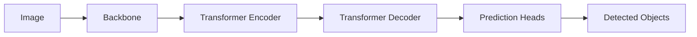

# DETR原理与代码实例讲解

## 1.背景介绍
### 1.1 目标检测的发展历程
#### 1.1.1 传统目标检测方法
#### 1.1.2 基于深度学习的目标检测方法
#### 1.1.3 Transformer在计算机视觉中的应用

### 1.2 DETR的提出
#### 1.2.1 DETR的创新点
#### 1.2.2 DETR相比传统方法的优势

## 2.核心概念与联系
### 2.1 Transformer 
#### 2.1.1 Transformer的基本结构
#### 2.1.2 Self-Attention机制
#### 2.1.3 Transformer在NLP中的成功应用

### 2.2 BiPartite Matching
#### 2.2.1 二分图匹配问题
#### 2.2.2 Hungarian Algorithm

### 2.3 DETR中的关键概念
#### 2.3.1 Object Queries
#### 2.3.2 Encoder-Decoder架构
#### 2.3.3 Bipartite Matching Loss

## 3.核心算法原理具体操作步骤
### 3.1 DETR整体架构
#### 3.1.1 Backbone提取特征
#### 3.1.2 Transformer Encoder编码特征
#### 3.1.3 Transformer Decoder解码Object Queries
#### 3.1.4 Prediction Heads预测box和class

### 3.2 训练过程
#### 3.2.1 Ground Truth和Prediction的匹配
#### 3.2.2 Bipartite Matching Loss计算
#### 3.2.3 Auxiliary Decoding Loss

### 3.3 推理过程
#### 3.3.1 Object Queries的并行解码
#### 3.3.2 Prediction Heads输出检测结果

## 4.数学模型和公式详细讲解举例说明
### 4.1 Transformer Attention的数学表示
#### 4.1.1 Scaled Dot-Product Attention
$Attention(Q,K,V) = softmax(\frac{QK^T}{\sqrt{d_k}})V$
#### 4.1.2 Multi-Head Attention
$MultiHead(Q,K,V) = Concat(head_1,...,head_h)W^O$

### 4.2 Bipartite Matching Loss
#### 4.2.1 匈牙利算法求解二分图匹配
#### 4.2.2 Matching Cost的设计
$\mathcal{L}_{match}(y_i, \hat{y}_{\sigma(i)})$

### 4.3 损失函数
#### 4.3.1 匹配后的Box回归损失和分类损失
$\mathcal{L}_{box}(\sigma) = \sum_{i=1}^N\mathcal{L}_{box}(b_i,\hat{b}_{\sigma(i)})$
$\mathcal{L}_{class}(\sigma) = -\sum_{i=1}^N\log\hat{p}_{\sigma(i)}(c_i)$
#### 4.3.2 总体损失函数
$\mathcal{L} = \lambda_{box}\mathcal{L}_{box}(\sigma) + \lambda_{class}\mathcal{L}_{class}(\sigma)$

## 5.项目实践：代码实例和详细解释说明
### 5.1 环境配置
#### 5.1.1 硬件要求
#### 5.1.2 软件依赖
#### 5.1.3 数据集准备

### 5.2 DETR模型定义
#### 5.2.1 Backbone定义
#### 5.2.2 Transformer Encoder-Decoder定义
#### 5.2.3 Prediction Heads定义

### 5.3 训练流程
#### 5.3.1 数据加载和预处理
#### 5.3.2 优化器和学习率调度器设置 
#### 5.3.3 训练循环和Loss计算

### 5.4 推理和可视化
#### 5.4.1 加载训练好的权重
#### 5.4.2 推理过程
#### 5.4.3 检测结果可视化

## 6.实际应用场景
### 6.1 自动驾驶中的目标检测
### 6.2 智慧城市中的行人/车辆检测
### 6.3 工业视觉中的缺陷检测

## 7.工具和资源推荐
### 7.1 DETR官方实现
### 7.2 MMDetection工具箱
### 7.3 常用数据集：COCO, PASCAL VOC, CityScapes

## 8.总结：未来发展趋势与挑战
### 8.1 DETR的局限性
#### 8.1.1 小目标检测效果不佳
#### 8.1.2 推理速度慢

### 8.2 后续改进工作
#### 8.2.1 Deformable DETR
#### 8.2.2 Conditional DETR
#### 8.2.3 SMCA-DETR

### 8.3 目标检测的未来发展方向
#### 8.3.1 更高效的Backbone设计
#### 8.3.2 更强大的特征融合机制
#### 8.3.3 更灵活的检测头设计

## 9.附录：常见问题与解答
### 9.1 DETR相比RCNN系列方法有何优势？
### 9.2 DETR是否能完全替代传统目标检测方法？
### 9.3 如何进一步提升DETR的检测精度和速度？

作者：禅与计算机程序设计艺术 / Zen and the Art of Computer Programming