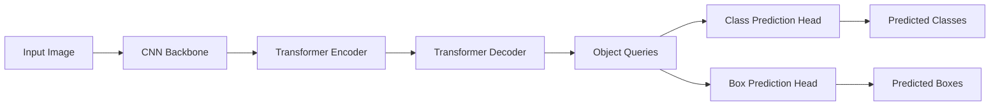

# DETR原理与代码实例讲解

## 1. 背景介绍

### 1.1 目标检测的发展历程

#### 1.1.1 传统目标检测方法

#### 1.1.2 基于深度学习的目标检测

#### 1.1.3 Transformer在计算机视觉中的应用

### 1.2 DETR的提出

#### 1.2.1 DETR的创新点

#### 1.2.2 DETR的优势

## 2. 核心概念与联系

### 2.1 Transformer结构

#### 2.1.1 Self-Attention机制

#### 2.1.2 Encoder-Decoder架构

### 2.2 目标检测中的Bipartite Matching

#### 2.2.1 Hungarian Algorithm

#### 2.2.2 Set Prediction

### 2.3 DETR中的关键概念

#### 2.3.1 Object Queries

#### 2.3.2 Positional Encodings

#### 2.3.3 Feed Forward Networks (FFNs)

## 3. 核心算法原理具体操作步骤

### 3.1 DETR整体架构

#### 3.1.1 Backbone提取特征

#### 3.1.2 Transformer Encoder编码特征

#### 3.1.3 Transformer Decoder解码Object Queries

#### 3.1.4 Prediction Heads预测box和class

### 3.2 训练过程

#### 3.2.1 Bipartite Matching分配预测与GT

#### 3.2.2 Hungarian Loss计算匹配损失

### 3.3 推理过程

#### 3.3.1 解码Object Queries获得预测

#### 3.3.2 后处理去除冗余预测框

## 4. 数学模型和公式详细讲解举例说明 

### 4.1 Transformer的数学表示

#### 4.1.1 Self-Attention计算公式

$Attention(Q,K,V) = softmax(\frac{QK^T}{\sqrt{d_k}})V$

#### 4.1.2 Multi-Head Attention

$$MultiHead(Q,K,V) = Concat(head_1,...,head_h)W^O$$

$$head_i=Attention(QW_i^Q, KW_i^K, VW_i^V)$$

### 4.2 Bipartite Matching中的Hungarian Algorithm

#### 4.2.1 代价矩阵计算

#### 4.2.2 最优匹配求解

### 4.3 损失函数设计

#### 4.3.1 匹配损失 Matching Cost

$L_{Hungarian}(y, \hat{y}) = \sum_{i=1}^{N}[-log\hat{p}_{\hat{\sigma}(i)}(c_i)+ \mathbbm{1}_{c_i\ne\varnothing}L_{box}(b_i,\hat{b}_{\hat{\sigma}(i)})]$

#### 4.3.2 分类与回归损失

## 5. 项目实践：代码实例和详细解释说明

### 5.1 环境配置

#### 5.1.1 硬件要求

#### 5.1.2 软件依赖

### 5.2 DETR模型定义

#### 5.2.1 Backbone选择与特征提取

#### 5.2.2 Transformer Encoder-Decoder实现 

#### 5.2.3 Prediction Heads设计

### 5.3 训练流程

#### 5.3.1 数据加载与预处理

#### 5.3.2 优化器与学习率调度

#### 5.3.3 模型训练主循环

### 5.4 推理测试

#### 5.4.1 加载预训练模型权重

#### 5.4.2 前向推理获得预测结果

#### 5.4.3 后处理与非极大值抑制

### 5.5 实验结果分析

#### 5.5.1 COCO数据集测试指标

#### 5.5.2 可视化分析检测结果

## 6. 实际应用场景

### 6.1 自动驾驶中的目标检测

### 6.2 智慧城市中的行人车辆检测

### 6.3 工业缺陷检测

## 7. 工具和资源推荐

### 7.1 DETR官方代码仓库

### 7.2 MMDetection工具库

### 7.3 训练数据集 

## 8. 总结：未来发展趋势与挑战

### 8.1 Transformer在目标检测中的潜力

### 8.2 端到端检测范式的优势

### 8.3 DETR存在的局限性

### 8.4 未来改进方向

## 9. 附录：常见问题与解答

### 9.1 如何平衡训练速度与精度？

### 9.2 如何处理尺度变化较大的目标？

### 9.3 Transformer的并行计算效率问题

### 9.4 长尾分布问题与数据增强策略

DETR（DEtection TRansformer）是一种基于Transformer的端到端目标检测模型，由Facebook AI Research在2020年提出。与传统的两阶段检测器如Faster R-CNN不同，DETR抛弃了繁琐的区域提议与特征聚合等操作，直接利用Transformer的强大建模能力，通过Encoder-Decoder架构实现了真正的端到端检测。

DETR的核心思想是将目标检测问题建模为一个Set Prediction问题。模型接收图像特征输入，通过Transformer Encoder提取全局语义信息，再由Decoder中的Object Queries去学习每个潜在目标的表征。最后通过两个独立的Prediction Head分别预测目标的类别和边界框坐标。

在训练过程中，DETR利用Bipartite Matching将预测与真实目标一一对应起来，通过优化Hungarian Loss来学习目标的类别与位置。推理时，模型解码Object Queries，直接输出固定数量的Top-k个预测框，经过简单的后处理即可得到最终的检测结果。

DETR的优势在于其简洁高效的端到端架构，以及出色的全局建模能力。实验表明，在COCO等数据集上，DETR取得了与两阶段方法相当甚至更优的性能，同时具有更快的推理速度。此外，由于摆脱了手工设计的先验，DETR展现出了更好的泛化能力，在长尾分布等复杂场景下表现出色。

当然，DETR也存在一些局限性，如训练收敛较慢，对小目标检测效果欠佳等。后续的一些工作如Deformable DETR, Conditional DETR等，通过引入Deformable Attention, Query Anchors等机制，进一步提升了DETR的性能。

总的来说，DETR开创了目标检测领域的新范式，为端到端检测模型指明了发展方向。相信通过进一步的探索与改进，Transformer必将在目标检测乃至整个计算机视觉领域发挥更大的作用。让我们拭目以待这一领域的未来发展吧。

作者：禅与计算机程序设计艺术 / Zen and the Art of Computer Programming