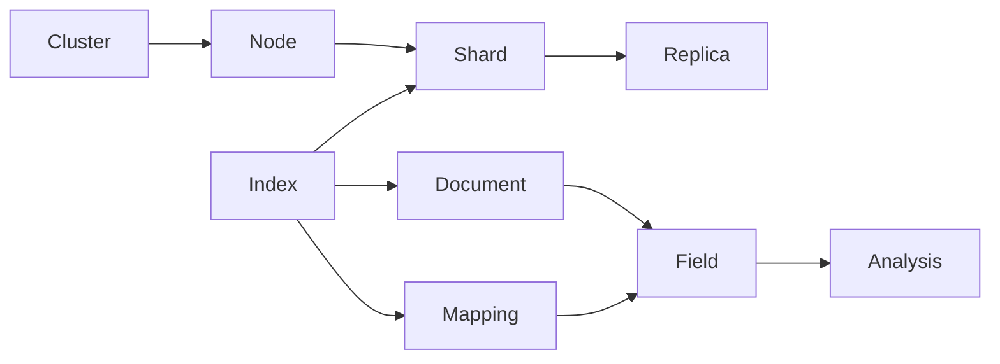
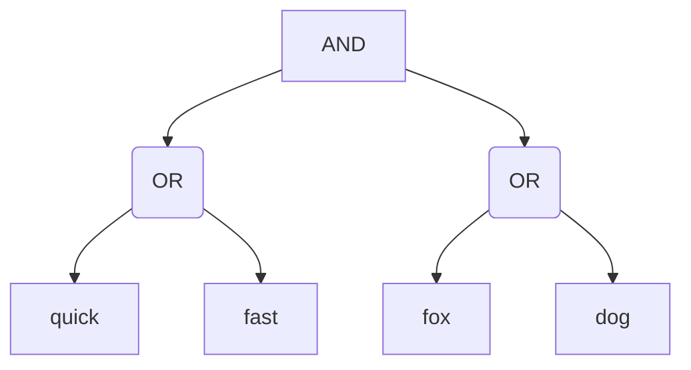

# ElasticSearch原理与代码实例讲解

## 1.背景介绍

### 1.1 搜索引擎的发展历程
#### 1.1.1 早期的文件系统搜索
#### 1.1.2 关系型数据库的全文检索
#### 1.1.3 专门的全文搜索引擎

### 1.2 ElasticSearch的诞生
#### 1.2.1 Lucene搜索库
#### 1.2.2 ElasticSearch对Lucene的封装和增强
#### 1.2.3 ElasticSearch的发展历程

### 1.3 ElasticSearch的应用现状
#### 1.3.1 日志分析领域
#### 1.3.2 站内搜索引擎  
#### 1.3.3 数据分析与可视化

## 2.核心概念与联系

### 2.1 Node与Cluster
#### 2.1.1 Node节点
#### 2.1.2 Cluster集群
#### 2.1.3 Master Node与Data Node

### 2.2 Index、Type与Document
#### 2.2.1 Index索引的概念
#### 2.2.2 Type类型(已废弃)
#### 2.2.3 Document文档

### 2.3 Shard与Replica
#### 2.3.1 Shard分片机制
#### 2.3.2 Replica副本
#### 2.3.3 Shard与Replica的关系

### 2.4 Mapping与Analysis
#### 2.4.1 Mapping映射
#### 2.4.2 Analysis分词
#### 2.4.3 内置分词器与自定义分词器

### 2.5 核心概念之间的关系



## 3.核心算法原理具体操作步骤

### 3.1 倒排索引
#### 3.1.1 正排索引与倒排索引的区别
#### 3.1.2 倒排索引的构建过程
#### 3.1.3 倒排索引的优化

### 3.2 文档搜索
#### 3.2.1 查询DSL
#### 3.2.2 词项查询
#### 3.2.3 布尔查询
#### 3.2.4 短语匹配
#### 3.2.5 模糊查询

### 3.3 相关性评分
#### 3.3.1 TF-IDF算法
#### 3.3.2 BM25算法
#### 3.3.3 自定义相关性评分

### 3.4 索引更新与删除
#### 3.4.1 文档的增删改
#### 3.4.2 索引的更新与合并
#### 3.4.3 索引的删除与关闭

## 4.数学模型和公式详细讲解举例说明

### 4.1 布尔模型
#### 4.1.1 布尔模型的基本概念
#### 4.1.2 布尔查询的表示 
布尔查询可以用查询树来表示，例如查询语句：
```
(quick OR fast) AND (fox OR dog)
```
可以表示为：



#### 4.1.3 布尔查询的计算

### 4.2 向量空间模型
#### 4.2.1 向量空间模型的基本思想
#### 4.2.2 文档向量与查询向量
假设有文档$D_1$和查询$Q$，它们对应的向量可以表示为：

$D_1=\{w_{11},w_{12},\cdots,w_{1n}\}$

$Q=\{q_1,q_2,\cdots,q_n\}$

其中$w_{1i}$表示词项$t_i$在文档$D_1$中的权重，$q_i$表示词项$t_i$在查询$Q$中的权重。

#### 4.2.3 文档相似度计算
可以用余弦相似度来衡量查询向量与文档向量之间的相似程度：

$$
\cos \theta=\frac{\sum_{i=1}^{n} w_{1 i} \cdot q_{i}}{\sqrt{\sum_{i=1}^{n} w_{1 i}^{2}} \cdot \sqrt{\sum_{i=1}^{n} q_{i}^{2}}}
$$

### 4.3 概率模型
#### 4.3.1 概率模型的基本思想
#### 4.3.2 BM25公式
BM25是一种常用的概率检索模型，给出文档$D$与查询$Q$的相关性评分为：

$$
\operatorname{score}(D, Q)=\sum_{i=1}^{n} \operatorname{IDF}\left(q_{i}\right) \cdot \frac{f\left(q_{i}, D\right) \cdot\left(k_{1}+1\right)}{f\left(q_{i}, D\right)+k_{1} \cdot\left(1-b+b \cdot \frac{|D|}{\text { avgdl }}\right)}
$$

其中：
- $\operatorname{IDF}\left(q_{i}\right)$是$q_i$的逆文档频率
- $f(q_i,D)$表示$q_i$在文档$D$中的词频
- $|D|$是文档$D$的长度
- $avgdl$是文档集合的平均长度
- $k_1$和$b$是可调的参数

#### 4.3.3 概率模型的其他变种

## 5.项目实践：代码实例和详细解释说明

### 5.1 环境准备
#### 5.1.1 安装JDK
#### 5.1.2 安装ElasticSearch
#### 5.1.3 安装Kibana

### 5.2 索引管理
#### 5.2.1 创建索引
```json
PUT /my_index
{
  "settings": {
    "number_of_shards": 3,
    "number_of_replicas": 1
  },
  "mappings": {
    "properties": {
      "title": {
        "type": "text"
      },
      "content": {
        "type": "text"
      },
      "publish_date": {
        "type": "date"
      }
    }
  }
}
```

创建了一个名为`my_index`的索引，设置了3个主分片和1个副本分片。定义了`title`、`content`和`publish_date`三个字段。

#### 5.2.2 查看索引
```
GET /my_index
```

#### 5.2.3 删除索引
```
DELETE /my_index
```

### 5.3 文档操作
#### 5.3.1 新增文档
```json
POST /my_index/_doc
{
  "title": "ElasticSearch原理与实践",
  "content": "这是一篇关于ElasticSearch的技术博客",
  "publish_date": "2023-05-30"
}
```

#### 5.3.2 查询文档
```json
GET /my_index/_doc/1
```

#### 5.3.3 更新文档
```json
POST /my_index/_update/1
{
  "doc": {
    "title": "ElasticSearch原理与代码实例讲解"
  }
}  
```

#### 5.3.4 删除文档
```json
DELETE /my_index/_doc/1
```

### 5.4 搜索查询
#### 5.4.1 全文检索
```json
GET /my_index/_search
{
  "query": {
    "match": {
      "content": "ElasticSearch"
    }
  }
}
```

#### 5.4.2 词项查询
```json
GET /my_index/_search
{
  "query": {
    "term": {
      "title": "原理"  
    }
  }
}
```

#### 5.4.3 布尔查询
```json
GET /my_index/_search
{
  "query": {
    "bool": {
      "must": [
        {
          "match": {
            "title": "ElasticSearch"
          }
        },
        {
          "match": {
            "content": "代码实例"
          }
        }
      ]
    }
  }
}
```

## 6.实际应用场景

### 6.1 日志分析
#### 6.1.1 日志收集与处理
#### 6.1.2 异常检测
#### 6.1.3 指标聚合与可视化

### 6.2 电商搜索
#### 6.2.1 商品数据同步
#### 6.2.2 多条件搜索与过滤
#### 6.2.3 搜索结果高亮与排序

### 6.3 数据分析
#### 6.3.1 多维度指标分析
#### 6.3.2 时序数据分析
#### 6.3.3 数据可视化展现

## 7.工具和资源推荐

### 7.1 官方文档
- ElasticSearch官网：https://www.elastic.co
- 官方文档：https://www.elastic.co/guide/index.html

### 7.2 客户端工具
- Kibana：ElasticSearch配套的分析和可视化平台
- Cerebro：一个开源的ElasticSearch Web管理工具
- elasticsearch-head：ElasticSearch的集群管理工具

### 7.3 相关书籍
- 《Elasticsearch: The Definitive Guide》
- 《Mastering Elasticsearch》
- 《Elasticsearch in Action》

### 7.4 社区资源
- ElasticSearch官方论坛：https://discuss.elastic.co
- Stack Overflow上的ElasticSearch问题：https://stackoverflow.com/questions/tagged/elasticsearch

## 8.总结：未来发展趋势与挑战

### 8.1 ElasticSearch的发展趋势
#### 8.1.1 云原生与弹性扩展
#### 8.1.2 机器学习能力增强
#### 8.1.3 数据安全与访问控制

### 8.2 面临的挑战
#### 8.2.1 海量数据的存储与检索效率
#### 8.2.2 实时数据的准确性与时效性
#### 8.2.3 数据源的多样性与异构性

### 8.3 未来展望
#### 8.3.1 与云计算的深度融合
#### 8.3.2 智能化的数据分析与挖掘
#### 8.3.3 行业知识图谱的构建

## 9.附录：常见问题与解答

### 9.1 ElasticSearch与关系型数据库的区别是什么？
### 9.2 ElasticSearch适合哪些场景使用？
### 9.3 ElasticSearch如何实现分布式存储和搜索？
### 9.4 ElasticSearch的分片和副本是如何工作的？
### 9.5 ElasticSearch的查询语法有哪些常见的类型？
### 9.6 ElasticSearch如何实现多字段搜索？
### 9.7 ElasticSearch如何优化索引和查询性能？
### 9.8 使用ElasticSearch应该注意哪些事项？

作者：禅与计算机程序设计艺术 / Zen and the Art of Computer Programming