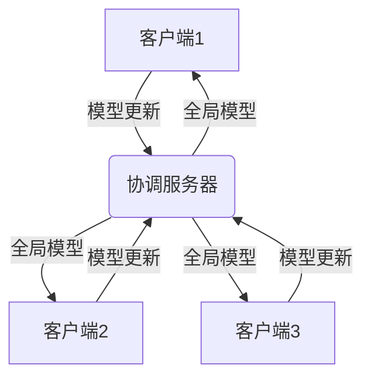
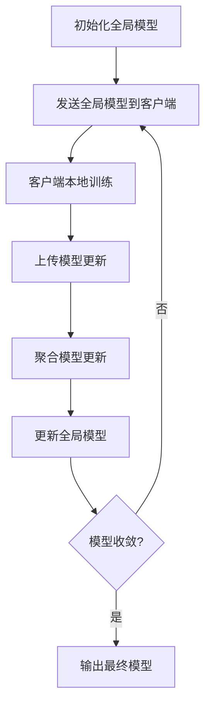

# Federated Learning原理与代码实例讲解

## 1. 背景介绍

随着人工智能和大数据分析的快速发展,数据隐私和安全问题日益受到重视。传统的机器学习模型通常需要将大量数据集中在一个中心服务器上进行训练,这可能会导致隐私泄露和数据滥用的风险。为了解决这一问题,Federated Learning(联邦学习)应运而生。

联邦学习是一种分布式机器学习范式,它允许在保护数据隐私的同时,对多个分散的数据集进行建模。在这种架构中,模型训练过程是在多个客户端设备(如手机、平板电脑等)上进行的,而不是将原始数据发送到中央服务器。相反,每个客户端在本地训练模型,并只将模型更新(如梯度)发送到协调服务器。协调服务器将这些更新聚合在一起,并将全局模型发送回客户端。这种方法可以确保个人数据不会离开设备,从而保护了用户隐私。

## 2. 核心概念与联系

### 2.1 联邦学习系统架构

联邦学习系统通常由三个主要组件组成:

1. **客户端(Client)**: 客户端是拥有本地数据集的设备,如手机、平板电脑或物联网(IoT)设备。每个客户端在本地训练模型,并将模型更新发送到协调服务器。

2. **协调服务器(Coordinating Server)**: 协调服务器负责协调整个联邦学习过程。它从客户端接收模型更新,聚合这些更新,并将全局模型发送回客户端。

3. **联邦学习算法(Federated Learning Algorithm)**: 联邦学习算法定义了客户端如何在本地训练模型,以及协调服务器如何聚合客户端模型更新以获得全局模型。常见的联邦学习算法包括FedAvg、FedSGD等。



### 2.2 隐私保护机制

为了进一步保护隐私,联邦学习系统通常采用以下隐私保护机制:

1. **差分隐私(Differential Privacy)**: 差分隐私是一种数学概念,它通过在模型更新中添加噪声来保护个人隐私。这种噪声可以掩盖个人数据,同时仍然保留模型的整体性能。

2. **安全多方计算(Secure Multi-Party Computation, SMPC)**: SMPC允许多个参与方在不共享原始数据的情况下共同计算函数。在联邦学习中,SMPC可用于在客户端之间安全地聚合模型更新,而不泄露任何个人数据。

3. **同态加密(Homomorphic Encryption)**: 同态加密允许在加密数据上执行计算操作,而无需先解密数据。在联邦学习中,同态加密可用于在不泄露原始数据的情况下,在协调服务器上聚合加密的模型更新。

## 3. 核心算法原理具体操作步骤

联邦学习的核心算法之一是FedAvg(Federated Averaging),它定义了客户端和协调服务器在训练过程中的具体操作步骤。以下是FedAvg算法的基本流程:

1. **初始化**: 协调服务器初始化一个全局模型,并将其发送给所有参与的客户端。

2. **客户端本地训练**: 每个客户端在本地数据集上训练模型,使用随机梯度下降(SGD)或其他优化算法。训练过程通常只进行几个epochs,以减少计算开销。

3. **客户端模型上传**: 客户端将本地训练后的模型权重(或梯度)上传到协调服务器。

4. **聚合模型更新**: 协调服务器收集所有客户端的模型更新,并对它们进行加权平均,以获得新的全局模型。权重通常基于每个客户端的数据集大小。

5. **全局模型下发**: 协调服务器将新的全局模型发送回所有客户端。

6. **重复训练**: 重复步骤2-5,直到模型收敛或达到预定的通信回合数。



需要注意的是,FedAvg算法假设所有客户端都参与每一轮的训练。但在实际应用中,由于客户端可能离线或带宽有限,只有部分客户端参与每一轮训练。为了解决这个问题,提出了一些变体算法,如FedSGD、FedPAQ等。

## 4. 数学模型和公式详细讲解举例说明

### 4.1 FedAvg算法数学表示

FedAvg算法的数学表示如下:

假设有 $N$ 个客户端,第 $t$ 轮通信时,第 $i$ 个客户端的本地数据集为 $\mathcal{D}_i$,本地模型权重为 $w_i^t$。协调服务器的全局模型权重为 $w^t$。

在第 $t$ 轮通信中,每个客户端 $i$ 在本地数据集 $\mathcal{D}_i$ 上进行 $E$ 个epochs的SGD训练,得到新的本地模型权重 $w_i^{t+1}$:

$$w_i^{t+1} = w_i^t - \eta \sum_{\xi \in \mathcal{D}_i} \nabla F(w_i^t; \xi)$$

其中 $\eta$ 是学习率, $F$ 是损失函数, $\nabla F(w_i^t; \xi)$ 是损失函数关于模型权重 $w_i^t$ 和数据样本 $\xi$ 的梯度。

然后,协调服务器将所有客户端的模型权重进行加权平均,得到新的全局模型权重 $w^{t+1}$:

$$w^{t+1} = \sum_{i=1}^N \frac{n_i}{n} w_i^{t+1}$$

其中 $n_i$ 是第 $i$ 个客户端的数据集大小, $n = \sum_{i=1}^N n_i$ 是所有客户端数据集的总大小。

通过重复上述过程,直到模型收敛或达到预定的通信回合数,可以得到最终的联邦学习模型。

### 4.2 示例:逻辑回归在联邦学习中的应用

考虑一个二元逻辑回归问题,其目标是根据特征向量 $\mathbf{x}$ 预测二元标签 $y \in \{0, 1\}$。假设有 $N$ 个客户端,每个客户端 $i$ 拥有本地数据集 $\mathcal{D}_i = \{(\mathbf{x}_j, y_j)\}_{j=1}^{n_i}$。

在联邦学习中,逻辑回归模型的损失函数可以表示为:

$$F(w; \mathbf{x}, y) = -y \log \sigma(w^\top \mathbf{x}) - (1 - y) \log (1 - \sigma(w^\top \mathbf{x}))$$

其中 $w$ 是模型权重向量, $\sigma(z) = 1 / (1 + e^{-z})$ 是sigmoid函数。

在第 $t$ 轮通信中,每个客户端 $i$ 在本地数据集 $\mathcal{D}_i$ 上进行 $E$ 个epochs的SGD训练,更新本地模型权重 $w_i^t$:

$$w_i^{t+1} = w_i^t - \eta \sum_{(\mathbf{x}, y) \in \mathcal{D}_i} \nabla F(w_i^t; \mathbf{x}, y)$$

其中梯度为:

$$\nabla F(w; \mathbf{x}, y) = (\sigma(w^\top \mathbf{x}) - y) \mathbf{x}$$

然后,协调服务器将所有客户端的模型权重进行加权平均,得到新的全局模型权重 $w^{t+1}$:

$$w^{t+1} = \sum_{i=1}^N \frac{n_i}{n} w_i^{t+1}$$

通过重复上述过程,直到模型收敛或达到预定的通信回合数,可以得到最终的联邦学习逻辑回归模型。

## 5. 项目实践:代码实例和详细解释说明

为了更好地理解联邦学习的原理和实现,我们将使用Python和TensorFlow/Keras库构建一个简单的联邦学习系统,并在MNIST手写数字识别任务上进行训练。

### 5.1 环境配置

首先,我们需要安装所需的Python库:

```bash
pip install tensorflow==2.4.1 tensorflowfederated==0.17.0
```

### 5.2 数据准备

我们使用TensorFlow内置的MNIST数据集,并将其划分为多个非均匀大小的数据集,模拟不同客户端的数据分布情况。

```python
import tensorflow as tf
import tensorflow_federated as tff

# 加载MNIST数据集
mnist_train, mnist_test = tf.keras.datasets.mnist.load_data()

# 将数据集划分为多个非均匀大小的数据集,模拟不同客户端
(x_train, y_train), (x_test, y_test) = mnist_train, mnist_test
x_train, y_train = x_train / 255.0, y_train.astype(np.int32)
x_test, y_test = x_test / 255.0, y_test.astype(np.int32)

# 创建客户端数据集
client_data = []
client_data.append(tff.simulation.FromTensorSlicesClientData(
    create_tf_dataset_for_client(x_train[:10000], y_train[:10000])))
client_data.append(tff.simulation.FromTensorSlicesClientData(
    create_tf_dataset_for_client(x_train[10000:20000], y_train[10000:20000])))
client_data.append(tff.simulation.FromTensorSlicesClientData(
    create_tf_dataset_for_client(x_train[20000:], y_train[20000:])))
```

### 5.3 模型构建

我们定义一个简单的卷积神经网络模型用于手写数字识别任务。

```python
def create_keras_model():
    model = tf.keras.models.Sequential([
        tf.keras.layers.Conv2D(32, 3, activation='relu', input_shape=(28, 28, 1)),
        tf.keras.layers.MaxPooling2D(),
        tf.keras.layers.Flatten(),
        tf.keras.layers.Dense(64, activation='relu'),
        tf.keras.layers.Dense(10)
    ])
    return tff.learning.from_keras_model(
        model,
        input_spec=mnist_train.element_spec,
        loss=tf.keras.losses.SparseCategoricalCrossentropy(),
        metrics=[tf.keras.metrics.SparseCategoricalAccuracy()])
```

### 5.4 联邦学习训练

我们使用TensorFlow Federated库中的`tff.learning.build_federated_averaging_process`函数构建FedAvg算法,并进行联邦学习训练。

```python
iterative_process = tff.learning.build_federated_averaging_process(
    model_fn=create_keras_model,
    client_optimizer_fn=lambda: tf.keras.optimizers.SGD(learning_rate=0.02),
    server_optimizer_fn=lambda: tf.keras.optimizers.SGD(learning_rate=1.0))

state = iterative_process.initialize()

for round_num in range(1000):
    state, metrics = iterative_process.next(state, client_data)
    print(f'Round {round_num}: {metrics}')
```

在每一轮通信中,客户端在本地数据集上进行一定次数的SGD训练,并将模型更新发送到协调服务器。协调服务器聚合这些更新,并将新的全局模型发送回客户端。

### 5.5 模型评估

最后,我们可以在测试集上评估联邦学习训练得到的模型性能。

```python
evaluation = tff.learning.build_federated_evaluation(create_keras_model)
test_metrics = evaluation(state.model, [tff.simulation.FromTensorSlicesClientData(create_tf_dataset_for_client(x_test, y_test))])
print(f'Test Metrics: {test_metrics}')
```

通过上述代码示例,我们可以更好地理解联邦学习的实现过程,并在实际任务中应用联邦学习算法。

## 6. 实际应用场景

联邦学习由于其保护数据隐私的优势,在许多领域都有广