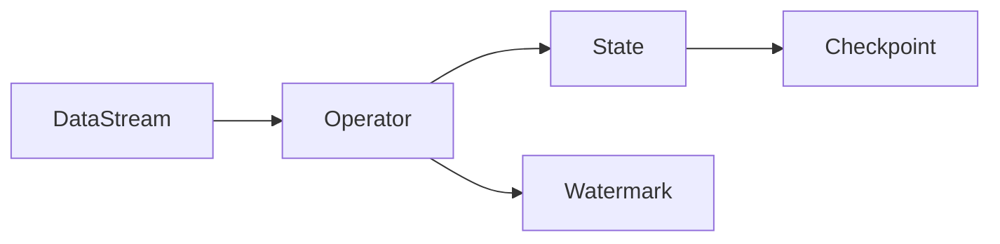

# Flink原理与代码实例讲解

## 1.背景介绍
Apache Flink是一个开源的分布式流处理和批处理框架,由Apache软件基金会开发。Flink以数据并行和流水线方式执行任意流数据程序,程序可以写成Java、Scala、Python、SQL等。Flink的核心是一个提供数据分发、通信以及自动容错的流数据流引擎。

### 1.1 Flink的诞生
Flink最初由柏林工业大学的一个研究性项目开发,后来被Ververica公司(前身为data Artisans)贡献给Apache基金会并成为顶级项目。

### 1.2 Flink的特点
Flink具有以下主要特点:

- 事件驱动(Event-driven)
- 基于流的世界观
- 分层API
- 支持事件时间(event-time)和处理时间(processing-time)语义
- 精确一次(exactly-once)的状态一致性保证
- 低延迟,每秒处理数百万个事件,毫秒级延迟
- 与众多常用存储系统的连接
- 高可用,动态扩展,实现7*24小时全天候运行

## 2.核心概念与联系
要深入理解Flink,需要了解其核心概念,包括:

### 2.1 数据流(DataStream) 
表示一个持续不断的数据流,可以是有界的(bounded)或无界的(unbounded)。

### 2.2 算子(Operator)
算子操作数据流,包括map、filter、aggregate、window、join等。

### 2.3 时间(Time)
Flink支持事件时间(event time)、摄入时间(ingestion time)和处理时间(processing time)。

### 2.4 状态(State)
算子可以维护内部状态,状态可以是原始类型、对象、列表、map等。

### 2.5 检查点(Checkpoint)
Flink周期性地对状态做快照,保证exactly-once语义。

### 2.6 水印(Watermark)
水印是一种衡量事件时间进展的机制,用于处理乱序事件。

下图展示了这些核心概念之间的关系:



## 3.核心算法原理具体操作步骤

### 3.1 有状态流处理
Flink通过算子的状态实现有状态流处理。状态在检查点时被持久化,在故障恢复时被恢复。具体步骤如下:

1. 定义状态
2. 状态更新
3. 检查点存储状态
4. 从检查点恢复状态

### 3.2 窗口算法
Flink支持时间窗口(Time Window)和计数窗口(Count Window)。窗口根据某些特征(如时间)将数据流切分成有限大小的"桶"。窗口可以是滚动的(没有重叠)或滑动的(有重叠)。

窗口的主要步骤:
1. Stream discretization 将流切分成窗口
2. Trigger 触发器判断何时处理窗口中收集的元素
3. Function 对窗口数据进行计算
4. Emit result 输出计算结果

### 3.3 水印和事件时间处理
水印(Watermark)是事件时间处理的核心。水印是一种衡量事件时间进展的机制,它是数据本身的一部分。

生成水印的通用公式:
```
Watermark = max(observed event time) - lag
```

使用水印处理事件时间的步骤:
1. 指定如何生成水印
2. 指定事件时间戳分配器
3. 根据事件时间定义窗口

## 4.数学模型和公式详细讲解举例说明

### 4.1 反压模型(Backpressure Model)
Flink使用基于信用的流控制方法实现反压。每个接收任务授予发送任务一定量的信用 $c$。当发送任务发送数据时,它消耗掉信用。当信用耗尽时,发送任务必须停止发送数据,直到接收任务再次授予信用。

令 $p_i$ 表示生产者 $i$ 的数据生成率, $c_i$ 表示消费者 $i$ 的数据消费率。反压公式:

$$ p_i \leq c_i $$

即生产速率不能超过消费速率,否则系统将积压并最终可能发生反压。

### 4.2 吞吐量估算模型
令 $L$ 表示算子的逻辑延迟, $R$ 表示吞吐量, $C$ 表示并行度。则基于Little's Law,有:

$$ L = \frac{N}{R} $$

其中 $N$ 表示算子的平均积压,由输入累积的速率和输出消费的速率之差决定。

进一步,整个Flink作业的端到端延迟 $L_{e2e}$ 可以估算为所有算子延迟之和:

$$ L_{e2e} = \sum_{i} L_i $$

其中 $L_i$ 是第 $i$ 个算子的延迟。

## 5.项目实践：代码实例和详细解释说明

下面我们通过一个实际的代码例子,演示如何使用Flink进行流处理。该例子从Kafka读取数据,进行一些转换操作,然后将结果写回Kafka。

```java
StreamExecutionEnvironment env = StreamExecutionEnvironment.getExecutionEnvironment();

// 从Kafka读取数据
DataStream<String> inputStream = env.addSource(
    new FlinkKafkaConsumer<>("input-topic", new SimpleStringSchema(), properties));

// 进行转换 
DataStream<String> resultStream = inputStream
    .map(new MapFunction<String, String>() {
        @Override
        public String map(String value) throws Exception {
            return "Processed: " + value;
        }
    });

// 将结果写回Kafka
resultStream.addSink(
    new FlinkKafkaProducer<>("output-topic", new SimpleStringSchema(), properties)); 

env.execute("Flink Kafka Example");
```

详细解释:
1. 首先创建一个`StreamExecutionEnvironment`,它是Flink流处理程序的入口。
2. 使用`addSource`方法从Kafka读取数据,创建一个`DataStream`。
3. 在`DataStream`上应用一个`map`操作,对每个输入字符串进行转换。
4. 使用`addSink`方法将结果`DataStream`写回Kafka。
5. 最后调用`execute`方法,开始执行Flink程序。

## 6.实际应用场景

Flink广泛应用于需要进行流数据处理的场景,例如:

### 6.1 实时数据分析
Flink可以对实时产生的海量数据进行分析,如网站的用户点击流、服务器的日志流等,可以用于异常检测、趋势分析等。

### 6.2 实时数据管道 
Flink可以作为实时数据管道,将不同来源的数据进行清洗、转换、富化,然后供下游的应用使用,如实时数仓、实时报表等。

### 6.3 实时特征工程
Flink可以实时地对原始数据进行特征提取,供机器学习模型使用,实现实时的特征工程。

### 6.4 欺诈检测
金融行业使用Flink进行实时欺诈检测,如实时识别异常交易。

### 6.5 实时推荐
电商等行业使用Flink进行实时推荐,根据用户的实时行为数据更新推荐结果。

## 7.工具和资源推荐
要深入学习和使用Flink,推荐以下资源:

- [Flink官方文档](https://flink.apache.org/docs/stable/)
- [Flink GitHub仓库](https://github.com/apache/flink)
- 《Stream Processing with Apache Flink》O'Reilly出版的Flink专著
- Ververica的 [Flink训练课程](https://training.ververica.com/)
- Flink Forward大会,由Ververica举办的Flink年度会议

## 8.总结：未来发展趋势与挑战

### 8.1 Flink的未来发展趋势
- 与机器学习和AI技术的结合将更加紧密
- SQL成为流处理的标准API
- Flink社区将持续增长,生态系统更加丰富
- Flink将在云原生架构中扮演重要角色

### 8.2 Flink面临的挑战
- 流批一体的弹性处理
- 流式机器学习的高效实现  
- 高效的存储和状态管理
- 更易用的API和开发体验

## 9.附录：常见问题与解答

### 9.1 Flink与Spark Streaming的区别是什么?
Flink是一个真正的流处理引擎,而Spark Streaming是一个微批处理引擎。Flink提供了更低的延迟和更好的性能。

### 9.2 Flink支持exactly-once语义吗?
是的,Flink通过检查点和WAL机制实现端到端的exactly-once语义。

### 9.3 Flink的状态存储在哪里?
Flink支持多种状态后端,包括内存、文件系统、RocksDB等。生产环境通常使用RocksDB作为状态后端。

### 9.4 Flink如何处理反压?
Flink使用基于信用的流控制方法实现反压。慢的算子会反馈给上游,使得上游减缓发送数据的速度。

### 9.5 Flink支持事务性更新状态吗?
Flink提供了状态的原子性和隔离性,可以实现事务性的状态更新。

作者：禅与计算机程序设计艺术 / Zen and the Art of Computer Programming