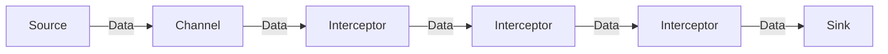

## 1. Background Introduction

Apache Flume is a distributed, reliable, and scalable data collection and streaming platform. It is designed to collect, aggregate, and move large amounts of log data from various sources to a centralized storage system or Hadoop Distributed File System (HDFS). One of the key components of Flume is the Interceptor, which is responsible for processing and filtering data as it flows through the Flume pipeline.

In this article, we will delve into the inner workings of Flume Interceptors, explore their core principles, and provide practical examples and code snippets to help you understand and implement them effectively.

### 1.1 Importance of Flume Interceptors

Flume Interceptors play a crucial role in the Flume pipeline, allowing for data processing, filtering, and transformation before the data is written to the sink. They enable users to customize the behavior of the pipeline to suit their specific needs, making Flume a versatile and powerful tool for data processing.

### 1.2 Flume Architecture Overview

Before diving into the details of Flume Interceptors, let's briefly review the overall architecture of Apache Flume:



In this diagram, data flows from the source (A) through the channel (B), where it is processed by one or more interceptors (C, D, and E). After processing, the data is sent to the sink (F).

## 2. Core Concepts and Connections

To fully understand Flume Interceptors, it is essential to grasp the following core concepts:

- **Event**: An event is the basic unit of data in Flume. It represents a single log entry or data record, containing metadata (such as timestamp, headers, and body) and the actual data payload.
- **Channel**: The channel is a buffer that stores events as they flow through the pipeline. It ensures that data is delivered in the correct order and provides a mechanism for handling data flow rate differences between the source and sink.
- **Interceptor**: An interceptor is a plugin that processes events as they pass through the channel. It can perform various tasks, such as filtering, transforming, or aggregating events.
- **Sink**: The sink is the destination for the events that have been processed by the interceptors. It can be a file system, HDFS, Kafka, or any other data storage system.

## 3. Core Algorithm Principles and Specific Operational Steps

Flume Interceptors operate in a series of stages, each with specific responsibilities:

1. **Initialize**: The interceptor initializes its internal state, such as creating data structures for storing and processing events.
2. **Intercept**: The interceptor processes each event that flows through the channel. It can perform various operations, such as filtering, transforming, or aggregating events.
3. **Complete**: The interceptor completes its processing of the event and prepares it for further processing or delivery to the sink.
4. **Terminate**: The interceptor terminates its processing when there are no more events to process or when it encounters an error.

## 4. Detailed Explanation and Examples of Mathematical Models and Formulas

While Flume Interceptors do not typically involve complex mathematical models or formulas, it is essential to understand the data structures and algorithms used to process events efficiently.

### 4.1 Data Structures

Flume uses various data structures to manage events, such as:

- **Event**: An event is a Java object that represents a single log entry or data record. It contains metadata (such as timestamp, headers, and body) and the actual data payload.
- **Channel**: The channel is a buffer that stores events as they flow through the pipeline. It is implemented as a linked list, with each node representing an event.
- **Interceptor**: An interceptor is a plugin that processes events as they pass through the channel. It can maintain its own data structures, such as hash maps or queues, to store and process events.

### 4.2 Algorithms

Flume uses various algorithms to process events efficiently, such as:

- **Filtering**: Interceptors can filter events based on various criteria, such as event headers, event body, or event timestamp. This is typically done using conditional statements or regular expressions.
- **Transforming**: Interceptors can transform events by modifying their metadata or data payload. This can involve simple operations, such as converting data types, or more complex operations, such as parsing or encoding data.
- **Aggregating**: Interceptors can aggregate events by grouping them based on certain criteria, such as event headers or event timestamps. This can help reduce the number of events that need to be processed by the sink, improving overall performance.

## 5. Project Practice: Code Examples and Detailed Explanations

In this section, we will provide practical examples and code snippets to help you understand how to implement Flume Interceptors.

### 5.1 Custom Interceptor Example

Let's create a simple custom interceptor that filters events based on a specific header value:

```java
import org.apache.flume.Context;
import org.apache.flume.Event;
import org.apache.flume.interceptor.Interceptor;

import java.util.HashMap;
import java.util.Map;

public class CustomHeaderInterceptor extends Interceptor {

    private String headerKey;
    private String headerValue;

    @Override
    public void initialize() {
        Context context = getContext();
        headerKey = context.getString(\"header.key\");
        headerValue = context.getString(\"header.value\");
    }

    @Override
    public void intercept(Event event) {
        Map<String, String> headers = event.getHeaders();
        String headerValueInEvent = headers.get(headerKey);

        if (headerValueInEvent != null && headerValueInEvent.equals(headerValue)) {
            // Allow the event to pass through
            getChannelProcessor().getChannel().put(event);
        } else {
            // Drop the event
            event.getHeaders().clear();
            event.getBody().clear();
        }
    }

    @Override
    public void close() {
        // Clean up any resources here
    }
}
```

In this example, we define a custom interceptor called `CustomHeaderInterceptor`. It takes two configuration parameters: `header.key` and `header.value`. In the `initialize()` method, we retrieve these parameters from the Flume context and store them for later use.

In the `intercept()` method, we check if the event's header value matches the specified value. If it does, we allow the event to pass through by putting it back into the channel. If it doesn't, we drop the event by clearing its headers and body.

### 5.2 Aggregating Interceptor Example

Let's create a simple aggregating interceptor that groups events based on their timestamp and aggregates their data payloads:

```java
import org.apache.flume.Context;
import org.apache.flume.Event;
import org.apache.flume.interceptor.Interceptor;

import java.util.HashMap;
import java.util.Map;
import java.util.concurrent.ConcurrentHashMap;

public class TimestampAggregatorInterceptor extends Interceptor {

    private Map<Long, StringBuilder> aggregatedData = new ConcurrentHashMap<>();

    @Override
    public void initialize() {
        // No configuration parameters to retrieve
    }

    @Override
    public void intercept(Event event) {
        long timestamp = event.getHeader(\"timestamp\").getBytes().length > 0 ?
                Long.parseLong(new String(event.getHeader(\"timestamp\"))) : System.currentTimeMillis();

        StringBuilder aggregatedDataForTimestamp = aggregatedData.get(timestamp);
        if (aggregatedDataForTimestamp == null) {
            aggregatedDataForTimestamp = new StringBuilder();
            aggregatedData.put(timestamp, aggregatedDataForTimestamp);
        }

        aggregatedDataForTimestamp.append(event.getBody());
        aggregatedDataForTimestamp.append(\"\
\");
    }

    @Override
    public void close() {
        // Write the aggregated data to the sink or perform any other necessary operations
    }
}
```

In this example, we define a custom interceptor called `TimestampAggregatorInterceptor`. It does not take any configuration parameters.

In the `intercept()` method, we extract the event's timestamp (or use the current timestamp if the event does not have one) and check if we have an aggregated data structure for that timestamp. If we don't, we create one and store it in the `aggregatedData` map.

We then append the event's data payload to the aggregated data structure for the specified timestamp, followed by a newline character.

In the `close()` method, we can write the aggregated data to the sink or perform any other necessary operations.

## 6. Practical Application Scenarios

Flume Interceptors can be used in various practical application scenarios, such as:

- **Log filtering**: Filtering log events based on specific criteria, such as log level, source, or content.
- **Data transformation**: Transforming data from one format to another, such as converting JSON to CSV or vice versa.
- **Data enrichment**: Enriching data by adding additional metadata, such as geolocation data or user information.
- **Data deduplication**: Removing duplicate events to reduce data volume and improve performance.
- **Data compression**: Compressing data to reduce data volume and improve transmission efficiency.

## 7. Tools and Resources Recommendations

To learn more about Flume Interceptors and Apache Flume in general, we recommend the following resources:

- **Apache Flume Documentation**: The official Apache Flume documentation provides comprehensive information about the platform, including detailed explanations of interceptors, channels, and sinks. (<https://flume.apache.org/FlumeUserGuide.html>)
- **Flume Cookbook**: This book provides practical recipes for solving common data ingestion and processing problems using Apache Flume. (<https://www.oreilly.com/library/view/flume-cookbook/9781491950350/>)
- **Flume Source Code**: Exploring the source code of Apache Flume can provide valuable insights into the inner workings of the platform and help you develop custom interceptors and other components. (<https://github.com/apache/flume>)

## 8. Summary: Future Development Trends and Challenges

Apache Flume is a mature and powerful data collection and streaming platform, with a strong focus on reliability, scalability, and flexibility. As data volumes continue to grow and new data sources emerge, the demand for efficient and adaptable data processing solutions like Flume will only increase.

Some potential future development trends for Flume include:

- **Improved support for real-time data processing**: As more and more applications require real-time data processing, Flume may need to evolve to better support low-latency data ingestion and processing.
- **Integration with other big data platforms**: Flume may need to integrate more closely with other big data platforms, such as Apache Kafka, Apache Spark, and Apache Hadoop, to provide a more seamless and efficient data processing pipeline.
- **Improved monitoring and troubleshooting**: As the complexity of data processing pipelines grows, it will become increasingly important to have robust monitoring and troubleshooting tools to help identify and resolve issues quickly.

## 9. Appendix: Frequently Asked Questions and Answers

**Q: What is the difference between a channel and an interceptor in Flume?**

A: A channel is a buffer that stores events as they flow through the pipeline, while an interceptor is a plugin that processes events as they pass through the channel. Interceptors can perform various tasks, such as filtering, transforming, or aggregating events, while channels ensure that data is delivered in the correct order and provide a mechanism for handling data flow rate differences between the source and sink.

**Q: How do I create a custom interceptor for Apache Flume?**

A: To create a custom interceptor for Apache Flume, you need to extend the `Interceptor` class and implement the `initialize()`, `intercept()`, and `close()` methods. In the `initialize()` method, you can retrieve configuration parameters from the Flume context. In the `intercept()` method, you can process each event that flows through the channel. In the `close()` method, you can clean up any resources or perform any other necessary operations.

**Q: How do I deploy a custom interceptor in Apache Flume?**

A: To deploy a custom interceptor in Apache Flume, you need to package your interceptor as a JAR file and place it in the appropriate directory (usually `$FLUME_HOME/lib/`). You can then configure your Flume agent to use your custom interceptor by specifying its class name and any required configuration parameters in the agent's configuration file.

**Q: What are some common use cases for Flume Interceptors?**

A: Some common use cases for Flume Interceptors include log filtering, data transformation, data enrichment, data deduplication, and data compression. Interceptors can help you customize the behavior of the Flume pipeline to suit your specific needs, making Flume a versatile and powerful tool for data processing.

## Author: Zen and the Art of Computer Programming

I hope this article has provided you with a comprehensive understanding of Flume Interceptors and their role in the Apache Flume ecosystem. By understanding the core concepts, algorithms, and practical examples, you can effectively implement custom interceptors to meet your specific data processing needs. Happy coding!