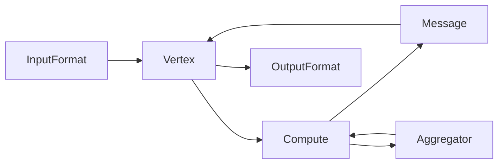

# Giraph原理与代码实例讲解

## 1.背景介绍

### 1.1 大数据时代的图计算需求

在当今大数据时代,图计算在许多领域扮演着越来越重要的角色。从社交网络分析、推荐系统、金融风控到生物信息学,图计算被广泛应用于解决复杂网络问题。然而,随着图规模的不断增长,传统的单机算法已经无法满足实际应用的需求。因此,分布式图计算框架应运而生。

### 1.2 Giraph的诞生

Giraph是Apache软件基金会的一个开源项目,旨在为大规模图计算提供高效、可扩展的分布式解决方案。它最初由Yahoo!工程师Avery Ching等人开发,后来成为Apache顶级项目。Giraph基于Valiant的Bulk Synchronous Parallel (BSP)模型,利用Hadoop的MapReduce框架实现分布式图计算。

### 1.3 Giraph的优势

与其他分布式图计算框架相比,Giraph具有以下优势:

- 易用性:Giraph提供了简单易用的编程接口,用户只需关注图算法的实现,无需了解底层分布式细节。
- 可扩展性:Giraph可以处理数十亿顶点和数万亿边的超大规模图,并能够平滑地扩展到数千台服务器。  
- 高性能:Giraph采用内存计算和消息聚合等优化技术,大幅提升了图计算的性能。
- 生态集成:Giraph与Hadoop生态系统无缝集成,可以利用HDFS、Yarn等组件,降低了部署和维护成本。

## 2.核心概念与联系

### 2.1 图的基本概念

在深入探讨Giraph原理之前,我们先回顾一下图的基本概念:

- 顶点(Vertex):图中的基本单元,通常表示实体对象,如人、物品等。
- 边(Edge):连接顶点的有向或无向线段,表示顶点之间的关系。
- 权重(Weight):边上的数值,表示顶点之间关系的强度。

### 2.2 BSP模型

BSP是一种并行计算模型,将计算过程划分为多个超步(Superstep)。在每个超步中,所有顶点并行执行以下三个阶段:

1. 计算:每个顶点根据当前状态和收到的消息,更新自身的状态。
2. 通信:顶点将消息发送给其他顶点。
3. 同步:所有顶点完成计算和通信后,进入下一个超步。

BSP模型简化了并行编程,适用于迭代式图算法的实现。

### 2.3 Giraph的核心组件

Giraph的核心组件包括:

- 顶点(Vertex):继承自Writable接口,包含顶点ID、值、边等信息。用户可以自定义顶点类。
- 边(Edge):存储目标顶点ID和权重。
- 消息(Message):顶点之间传递的数据,可以是任意类型。
- 聚合器(Aggregator):用于全局数据聚合和统计,支持多种聚合操作。
- 输入/输出格式:Giraph支持多种图数据输入输出格式,如TextInputFormat、SequenceFileInputFormat等。

下图展示了Giraph的核心组件之间的关系:



## 3.核心算法原理与具体操作步骤

### 3.1 单源最短路径算法(SSSP)

SSSP是图论中的经典算法,旨在找到从源顶点到图中所有其他顶点的最短路径。Giraph中的SSSP实现基于Bellman-Ford算法,具体步骤如下:

1. 初始化:将源顶点的距离设为0,其他顶点的距离设为无穷大。
2. 迭代计算:每个超步中,每个顶点检查收到的消息,更新自己的距离,并将新距离发送给邻居顶点。
3. 收敛条件:如果一个超步中没有顶点更新距离,则算法收敛,得到最短路径。

### 3.2 PageRank算法

PageRank是Google用于评估网页重要性的算法,也可以用于社交网络影响力分析等场景。Giraph中的PageRank实现步骤如下:

1. 初始化:为每个顶点赋予相等的初始PageRank值。
2. 迭代计算:每个超步中,每个顶点将其PageRank值平均分配给出边连接的顶点,并从入边邻居收集新的PageRank值。
3. 阻尼因子:为了避免等级泄露和等级沉没问题,引入阻尼因子进行平滑。
4. 收敛条件:当PageRank值的变化小于预设阈值时,算法收敛。

### 3.3 连通分量算法(CC)

CC算法用于找到图中的连通分量,即最大的连通子图。Giraph中的CC实现基于HashMin算法,步骤如下:

1. 初始化:每个顶点将自己的ID作为初始连通分量ID。
2. 迭代计算:每个超步中,每个顶点将其连通分量ID发送给邻居,并更新自己的连通分量ID为收到的最小ID。
3. 收敛条件:当没有顶点更新连通分量ID时,算法收敛。

## 4.数学模型和公式详细讲解举例说明

### 4.1 SSSP的Bellman-Ford公式

在SSSP算法中,Bellman-Ford公式用于更新顶点的距离:

$$
dist(v) = min(dist(v), dist(u) + weight(u, v))
$$

其中,$dist(v)$表示顶点$v$的距离,$dist(u)$表示邻居顶点$u$的距离,$weight(u, v)$表示边$(u, v)$的权重。

举例说明:假设顶点$A$的距离为10,顶点$B$的距离为5,边$(B, A)$的权重为2。根据Bellman-Ford公式,顶点$A$的新距离为:

$$
dist(A) = min(10, 5 + 2) = 7
$$

### 4.2 PageRank的迭代公式

PageRank算法使用以下迭代公式计算顶点的PageRank值:

$$
PR(v) = \frac{1-d}{N} + d \sum_{u \in IN(v)} \frac{PR(u)}{OUT(u)}
$$

其中,$PR(v)$表示顶点$v$的PageRank值,$N$为顶点总数,$d$为阻尼因子(通常取0.85),$IN(v)$为指向$v$的顶点集合,$OUT(u)$为$u$的出度。

举例说明:假设一个有3个顶点的图,顶点$A$有2个入边,来自$B$和$C$,顶点$B$和$C$的PageRank值分别为0.4和0.6,它们的出度都为1。根据PageRank公式,顶点$A$的新PageRank值为:

$$
PR(A) = \frac{1-0.85}{3} + 0.85 \times (\frac{0.4}{1} + \frac{0.6}{1}) = 0.90
$$

## 5.项目实践:代码实例和详细解释说明

下面以SSSP算法为例,展示如何使用Giraph实现单源最短路径计算。

### 5.1 定义顶点类

首先,定义一个继承自Vertex的自定义顶点类`SSSPVertex`:

```java
public class SSSPVertex extends Vertex<LongWritable, DoubleWritable, FloatWritable, DoubleWritable> {
    @Override
    public void compute(Iterable<DoubleWritable> messages) {
        if (getSuperstep() == 0) {
            setValue(new DoubleWritable(Double.MAX_VALUE));
        }
        double minDist = isSource() ? 0d : Double.MAX_VALUE;
        for (DoubleWritable message : messages) {
            minDist = Math.min(minDist, message.get());
        }
        if (minDist < getValue().get()) {
            setValue(new DoubleWritable(minDist));
            for (Edge<LongWritable, FloatWritable> edge : getEdges()) {
                double distance = minDist + edge.getValue().get();
                sendMessage(edge.getTargetVertexId(), new DoubleWritable(distance));
            }
        }
        voteToHalt();
    }
}
```

- compute方法:根据收到的消息更新顶点距离,并将新距离发送给邻居。
- isSource方法:判断当前顶点是否为源顶点。
- voteToHalt方法:表示当前顶点已经完成计算。

### 5.2 配置和运行作业

接下来,配置并运行Giraph作业:

```java
public class SSSPRunner {
    public static void main(String[] args) throws Exception {
        GiraphConfiguration conf = new GiraphConfiguration();
        conf.setVertexClass(SSSPVertex.class);
        conf.setVertexInputFormatClass(TextVertexInputFormat.class);
        conf.setVertexOutputFormatClass(TextVertexOutputFormat.class);
        conf.set("giraph.SSSPVertex.sourceId", "1");
        GiraphRunner.run(conf, args);
    }
}
```

- 设置顶点类、输入输出格式等配置项。
- 指定源顶点ID。
- 使用GiraphRunner运行作业。

### 5.3 输入输出格式

Giraph支持多种输入输出格式,这里使用`TextVertexInputFormat`和`TextVertexOutputFormat`。输入文件格式如下:

```
vertexId<tab>vertexValue<tab>[[targetVertexId,edgeValue],...]
```

每行表示一个顶点,包含顶点ID、顶点值和出边列表。输出文件格式与输入格式类似,但只包含最短路径距离。

## 6.实际应用场景

Giraph在许多实际场景中得到了广泛应用,例如:

- 社交网络分析:使用Giraph进行社区发现、影响力分析、好友推荐等。
- 推荐系统:利用Giraph构建基于图的协同过滤推荐模型。
- 金融风控:通过Giraph分析交易网络,识别欺诈行为。
- 生物信息学:用Giraph分析蛋白质相互作用网络,预测基因功能。

## 7.工具和资源推荐

- Giraph官网:http://giraph.apache.org/
- Giraph源码:https://github.com/apache/giraph
- Giraph用户邮件列表:user@giraph.apache.org
- Giraph开发者邮件列表:dev@giraph.apache.org
- Giraph JIRA:https://issues.apache.org/jira/browse/GIRAPH
- Giraph Wiki:https://cwiki.apache.org/confluence/display/GIRAPH
- 《Giraph实战》一书:https://www.manning.com/books/giraph-in-action

## 8.总结:未来发展趋势与挑战

Giraph作为领先的分布式图计算框架,已经在学术界和工业界取得了广泛的成功。未来,Giraph将在以下方面持续发展和创新:

- 性能优化:通过引入新的图划分算法、通信机制等,进一步提升Giraph的计算性能。
- 易用性改进:简化Giraph的配置和部署流程,为用户提供更友好的开发体验。
- 算法库扩充:集成更多常用图算法,如社区发现、图神经网络等,丰富Giraph的算法库。
- 与新兴技术结合:探索Giraph与流处理、机器学习等新兴技术的结合,拓展图计算的应用边界。

同时,Giraph也面临着一些挑战:

- 图数据规模持续增长:需要Giraph不断突破计算和存储瓶颈,支持更大规模的图数据处理。
- 动态图处理:现实世界中的图往往是动态变化的,如何高效处理动态图是一大挑战。
- 异构计算资源利用:如何充分利用CPU、GPU、FPGA等异构计算资源,优化图计算性能。

相信通过Giraph社区的共同努力,这些挑战都将一一得到解决,Giraph必将在图计算领域发挥更大的作用。

## 9.附录:常见问题与解答

### 9.1 Giraph支持哪些图算法?

Giraph提供了多种内置图算法,如单源最短路径、PageRank、连通分量等。同时,用户也可以基于Giraph API自定义图算法。

### 9.2 Giraph的可扩展性如何?

Giraph具有良好的可扩展性,可以处理数十亿顶点和数万亿边的大规模图。它采用分布式计算架构,可以平滑地扩展到数千台服务器。

### 9.3 Giraph与GraphX的区别是什么?

Giraph是基于BSP