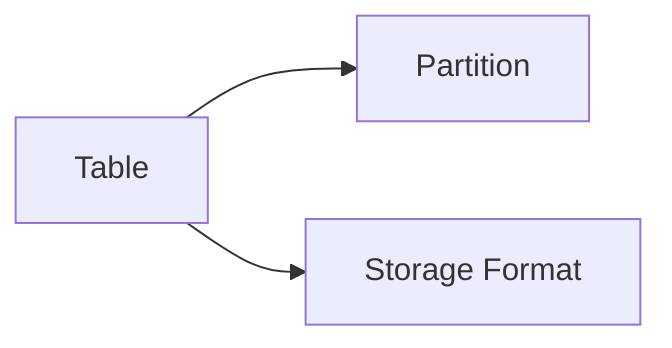

# HCatalogTable进阶技巧：深入理解高级特性

## 1. 背景介绍
### 1.1 HCatalog概述
#### 1.1.1 HCatalog的定义与功能
HCatalog是Apache Hive的一个子项目,为Hadoop生态系统中的各种数据处理工具提供了一个统一的元数据管理和表抽象机制。它允许用户以一种与底层数据存储格式和位置无关的方式来读写数据。
#### 1.1.2 HCatalog在Hadoop生态系统中的地位
HCatalog充当了Hadoop生态系统中不同数据处理组件之间的桥梁,使得这些组件可以方便地共享元数据信息,减少了数据冗余和不一致性。
### 1.2 为什么要深入理解HCatalogTable的高级特性
#### 1.2.1 提升数据处理效率
通过深入理解和灵活运用HCatalogTable的高级特性,可以优化数据存储方式,提升数据读写性能,从而加快整个数据处理流程。
#### 1.2.2 实现更复杂的数据处理逻辑
HCatalogTable的高级特性为实现更加复杂、个性化的数据处理需求提供了支持,使得用户能够更好地挖掘和利用数据的价值。

## 2. 核心概念与联系
### 2.1 HCatalogTable的核心概念
#### 2.1.1 表(Table)
HCatalog中的表是对HDFS上数据文件的一种抽象,定义了数据的模式(Schema)信息。一个表可以跨越多个HDFS目录和文件。
#### 2.1.2 分区(Partition)
分区是将表按照某些列的值进行水平切分,每个分区对应表下的一个子目录。分区可以加快数据的查询速度。
#### 2.1.3 存储格式(Storage Format)  
存储格式定义了表中数据在HDFS上的存储方式,常见的格式有TextFile、SequenceFile、RCFile、ORC、Parquet等。
### 2.2 核心概念之间的关系


## 3. 核心算法原理与具体操作步骤
### 3.1 数据压缩
#### 3.1.1 压缩算法原理
数据压缩采用特定的编码方式,通过去除数据中的冗余信息来减小数据体积。常用的压缩算法有gzip、bzip2、snappy、lzo等。
#### 3.1.2 在HCatalogTable中启用压缩
1. 设置表属性"hcat.output.compress"为true
2. 设置表属性"hcat.output.compression.codec"为具体的压缩编解码器类
3. 创建或修改表,使压缩配置生效
### 3.2 数据存储格式优化
#### 3.2.1 常用存储格式比较
- TextFile:默认格式,可读性好,但是数据密度低
- SequenceFile:支持压缩和分割,可使用Hadoop API读写
- RCFile:行列存储相结合,查询和压缩效率高
- ORC:优化的RCFile,进一步提升存储和查询性能 
- Parquet:面向分析型业务的列式存储,可以高效解析嵌套数据
#### 3.2.2 选择合适的存储格式
1. 分析表的数据特点和查询模式
2. 对比不同存储格式在数据密度、查询速度、压缩率等方面的表现
3. 选择最匹配的存储格式,在创建表时进行指定
### 3.3 分区优化
#### 3.3.1 分区的作用与代价
合理的分区可以裁剪查询读取的数据量,加快查询速度。但是过多的分区会导致大量的元数据开销和mapreduce任务调度成本。
#### 3.3.2 分区粒度选择
1. 确定数据的分布特点和用户的查询习惯
2. 评估不同分区粒度下的数据均衡性和查询性能
3. 选择最佳的分区方案,避免出现数据倾斜或过多小文件

## 4. 数学模型和公式详细讲解举例说明
### 4.1 文件大小估算模型
为了优化HCatalogTable的存储,需要对文件大小进行合理规划。可以用以下公式估算一个表或分区的文件总大小:
$$ Size = \sum_{i=1}^{n} AvgRowSize * RowCount_i $$
其中,$AvgRowSize$表示平均每行数据的大小,$RowCount_i$表示第$i$个文件的行数,$n$为文件总数。

例如,一个表有10亿行数据,每行平均100字节,如果划分为1000个文件,则每个文件大小约为:
$$ FileSize = 100B * 10^9 / 1000 = 100MB $$

### 4.2 数据块大小优化模型
HDFS的数据块大小(Blocksize)是影响HCatalogTable读写性能的重要参数。可以用以下公式估算最优数据块大小:
$$ Blocksize = \max(\sqrt{AverageFileSize * ExpectedConcurrency}, MinBlockSize) $$

其中,$AverageFileSize$为表中文件的平均大小,$ExpectedConcurrency$为期望的并发mapreduce任务数,$MinBlockSize$为HDFS允许的最小块大小(默认128MB)。

例如,一个表的文件平均为1GB,期望同时运行100个mapper,则最优数据块大小估计为:
$$ Blocksize = \sqrt{1GB * 100} \approx 316MB $$

## 5. 项目实践：代码实例和详细解释说明
下面通过一个具体的代码实例,演示如何用HCatalog API优化表的存储。
```java
// 创建一个HCatalog表
HCatCreateTableDesc tableDesc = HCatCreateTableDesc.create(dbName, tableName, cols)
    .fileFormat("orcfile")  // 指定存储格式为ORC
    .compressed()  // 启用压缩
    .compressionType("snappy")  // 指定压缩算法为snappy
    .partCol(partition)  // 指定分区列
    .prop("orc.compress.size", "1024")  // 设置ORC压缩块大小
    .prop("orc.stripe.size", "268435456")  // 设置ORC stripe大小
    .build();
client.createTable(tableDesc);  // 提交建表操作
```
代码解释:
- fileFormat("orcfile"): 将表的存储格式设为ORC,ORC是一种优化的行列混合存储格式,压缩率高,支持复杂数据类型。
- compressed()和compressionType("snappy"): 对表启用snappy压缩。Snappy是一种高速压缩算法,压缩和解压缩速度都很快。 
- partCol(partition): 指定表的分区列,对数据进行水平切分,加快查询。
- orc.compress.size: 设置ORC文件的压缩块大小,默认256KB,增大可提升压缩率,但会降低读取速度。
- orc.stripe.size: 设置ORC文件的stripe大小,默认64MB,增大可减少文件数量和元数据开销,但会消耗更多内存。

## 6. 实际应用场景
### 6.1 日志数据分析
互联网公司每天会收集大量的用户行为日志,如网页浏览、广告点击等。这些日志可以存储在HCatalogTable中,通过合理的分区(如按天分区)和存储优化,实现高效的数据分析和挖掘。
### 6.2 交易数据管理
银行、证券等金融机构的交易数据具有数据量大、实时性高、安全性要求高等特点。利用HCatalogTable可以构建一个统一的交易数据管理平台,并通过分区、压缩等手段优化存储和查询性能,满足业务需求。
### 6.3 传感器数据处理
工业互联网场景中,各种传感器会持续不断地产生海量的监测数据。将这些数据接入HCatalogTable,可以方便地与Hadoop生态的各种工具进行集成,实现数据的清洗、分析、可视化等处理。

## 7. 工具和资源推荐
### 7.1 HCatalog官方文档
Apache HCatalog官网提供了详尽的用户和开发文档,是学习和使用HCatalog的权威资料。
### 7.2 Hive和Pig
HCatalog经常与Hive和Pig配合使用,充分发挥三者的协同效应。Hive提供了类SQL的数据查询和分析能力,Pig提供了灵活的数据处理流水线。
### 7.3 Ambari
Ambari是Hadoop生态的部署和管理工具,提供了图形化的界面,可以很方便地创建和维护HCatalog表。

## 8. 总结：未来发展趋势与挑战
### 8.1 与云存储的集成
越来越多的数据存储在公有云或私有云上,如何无缝地将HCatalog与云存储进行集成,是一个值得关注的发展方向。
### 8.2 实时数据处理
HCatalog目前主要用于离线批处理,对于实时数据流的支持还不够完善。如何利用HCatalog实现流批一体的数据处理架构,是一个挑战。
### 8.3 数据安全与权限管理
随着数据规模的增长和数据价值的提升,HCatalog需要提供更加完善的数据加密、权限控制等安全机制,确保数据不被非法访问和篡改。

## 9. 附录：常见问题与解答
### 9.1 HCatalog与Hive Metastore的关系是什么?
HCatalog利用了Hive Metastore存储元数据,但提供了更加通用的元数据服务。Hive、Pig等工具都可以通过HCatalog读写Metastore中注册的表。
### 9.2 HCatalog支持更新和删除数据吗?
HCatalog目前主要支持数据的追加写入,对更新和删除的支持还比较有限,需要借助ACID表等机制。
### 9.3 HCatalog可以作为独立的元数据服务器使用吗?
HCatalog需要运行在Hadoop集群中,利用HDFS存储数据,一般不会脱离Hadoop环境独立使用。

作者：禅与计算机程序设计艺术 / Zen and the Art of Computer Programming