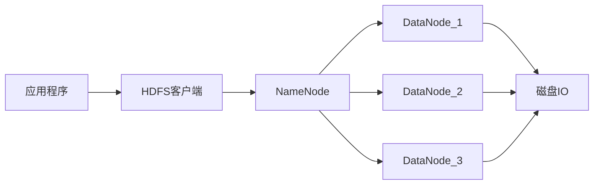

# HDFSDataNode磁盘IO优化：提升数据读写效率

## 1.背景介绍
### 1.1 HDFS简介
HDFS(Hadoop Distributed File System)是Hadoop框架的核心组件之一,是一个高度容错的分布式文件系统。HDFS采用主从(Master/Slave)架构,由一个NameNode(NN)和多个DataNode(DN)组成。NameNode负责管理文件系统的元数据,DataNode负责存储实际数据。
### 1.2 DataNode在HDFS中的作用
DataNode是HDFS中的工作节点,负责存储实际的数据块。当客户端或应用程序需要读取或写入HDFS中的数据时,实际的IO操作是由DataNode来完成的。因此,优化DataNode的磁盘IO性能对提升HDFS整体的数据读写效率至关重要。
### 1.3 优化DataNode磁盘IO的意义
DataNode磁盘IO是HDFS性能的瓶颈之一。优化DataNode的磁盘IO,可以提高HDFS的数据读写速度,减少IO等待时间,从而提升整个集群的吞吐量和性能。这对于大数据处理、机器学习等IO密集型应用尤为重要。

## 2.核心概念与联系
### 2.1 磁盘IO
磁盘IO指的是在磁盘存储设备上进行数据读写的操作。它涉及到磁盘控制器、磁盘缓存、磁头寻道等多个环节,每个环节的性能都会影响到整体的IO效率。
### 2.2 顺序读写与随机读写
顺序读写是指按照地址连续的方式访问磁盘数据,而随机读写则是以非连续的方式访问。通常情况下,顺序读写的性能要优于随机读写。
### 2.3 IO调度算法
IO调度算法决定了IO请求的处理顺序,常见的有CFQ、Deadline、Noop等。不同的调度算法适用于不同的应用场景,选择合适的IO调度算法可以提升磁盘IO性能。
### 2.4 缓存与缓冲区 
缓存和缓冲区可以减少磁盘IO次数,提高数据访问速度。恰当地设置缓存和缓冲区的大小,可以显著改善IO性能。
### 2.5 Mermaid流程图


## 3.核心算法原理具体操作步骤
### 3.1 数据本地化
HDFS在调度任务时,尽量将计算任务分配到存储有所需数据的节点上,这样可以减少网络传输,提高IO效率。具体步骤如下:

1. 客户端提交任务到YARN ResourceManager
2. ResourceManager查询NameNode,获取任务所需数据的位置信息
3. ResourceManager将任务优先分配给存储数据的节点
4. 如果本地节点资源不足,再考虑将任务分配给距离数据最近的节点

### 3.2 数据块复制
为了提高数据可靠性和可用性,HDFS默认会为每个数据块创建3个副本。复制算法的基本步骤如下:

1. Client将数据块写入本地磁盘,同时通知NameNode
2. NameNode选择距离Client最近的DataNode A作为第一个副本
3. DataNode A收到数据后,将数据发送给管线中的下一个节点DataNode B
4. DataNode B收到数据后,将数据发送给管线中的下一个节点DataNode C
5. 所有DataNode收到数据并写入本地磁盘后,向NameNode发送确认

### 3.3 磁盘IO调度
Linux内核提供了多种IO调度算法,如CFQ、Deadline等。对于HDFS这类顺序读写较多的应用,Deadline调度算法通常能提供更好的性能。设置IO调度算法的步骤如下:

1. 查看当前IO调度算法:`cat /sys/block/sda/queue/scheduler`
2. 设置IO调度算法为Deadline:`echo deadline > /sys/block/sda/queue/scheduler` 
3. 在Hadoop配置文件中指定IO调度器:`dfs.datanode.hdfs-blocks-metadata.enabled=true`

## 4.数学模型和公式详细讲解举例说明
### 4.1 磁盘IO模型
磁盘IO可以用服务时间(Service Time)来衡量,它由寻道时间、旋转延迟和数据传输时间三部分组成:

$T_{I/O} = T_{seek} + T_{rotation} + T_{transfer}$

其中:
- $T_{seek}$: 寻道时间,即磁头移动到指定磁道所需的时间。
- $T_{rotation}$:旋转延迟,即磁盘旋转将指定扇区移至磁头下方所需的时间。
- $T_{transfer}$:数据传输时间,即完成数据读写所需的时间。

假设一次IO请求需要读取500KB数据,磁盘平均寻道时间为3ms,旋转速度为7200rpm,传输速率为100MB/s,则完成该次IO请求的时间为:

$$T_{seek} = 3 ms$$

$$T_{rotation} = \frac{60s}{7200rpm} / 2 = 4.17 ms$$  

$$T_{transfer} = \frac{500KB}{100MB/s} = 5 ms$$

$$T_{I/O} = 3 ms + 4.17 ms + 5 ms = 12.17 ms$$

可见,寻道时间和旋转延迟占据了IO时间的大部分,因此优化磁盘IO的关键是尽量减少寻道次数和旋转延迟。

### 4.2 数据吞吐量
数据吞吐量是指单位时间内可以传输的数据量,它决定了HDFS的整体IO性能。吞吐量可以用以下公式表示:

$Throughput = \frac{Data\_Size}{T_{I/O}}$

假设HDFS中有1000个128MB的数据块,每个数据块被切分成若干个64KB的IO请求,磁盘IO时间为12.17ms,则总的数据吞吐量为:

$$Data\_Size = 1000 * 128 MB = 128000 MB = 128 GB$$

$$IO\_Requests = \frac{128 MB}{64 KB} * 1000 = 2048000$$

$$T_{I/O\_Total} = 12.17 ms * 2048000 = 24924.16 s = 6.92 h$$  

$$Throughput = \frac{128 GB}{6.92 h} = 18.50 GB/h$$

通过优化磁盘IO,例如使用SSD、RAID等技术,可以大幅度提升IO速度,进而提高HDFS的整体吞吐量。

## 5.项目实践：代码实例和详细解释说明
下面通过一个简单的WordCount例子,演示如何在HDFS上进行数据读写。

### 5.1 写入数据
```java
public class HDFSWriter {
    public static void main(String[] args) throws Exception {
        Configuration conf = new Configuration();
        FileSystem fs = FileSystem.get(conf);
        
        Path inputPath = new Path("/input/data.txt");
        FSDataOutputStream outputStream = fs.create(inputPath);
        
        String data = "Hello HDFS! Hello Hadoop!";
        outputStream.writeBytes(data);
        
        outputStream.close();
        fs.close();
    }
}
```

代码说明:
1. 创建HDFS配置对象Configuration,用于获取HDFS客户端对象FileSystem
2. 指定要写入的HDFS文件路径"/input/data.txt" 
3. 调用FileSystem的create方法,创建输出流FSDataOutputStream
4. 将字符串数据写入输出流
5. 关闭输出流和FileSystem

### 5.2 读取数据
```java
public class HDFSReader {
    public static void main(String[] args) throws Exception {
        Configuration conf = new Configuration();
        FileSystem fs = FileSystem.get(conf);
        
        Path inputPath = new Path("/input/data.txt");
        FSDataInputStream inputStream = fs.open(inputPath);
        
        BufferedReader reader = new BufferedReader(new InputStreamReader(inputStream));
        String line;
        while ((line = reader.readLine()) != null) {
            System.out.println(line);
        }
        
        reader.close();
        inputStream.close();
        fs.close();
    }
}
```

代码说明:
1. 创建HDFS配置对象Configuration,用于获取HDFS客户端对象FileSystem 
2. 指定要读取的HDFS文件路径"/input/data.txt"
3. 调用FileSystem的open方法,创建输入流FSDataInputStream
4. 将输入流包装成BufferedReader,便于按行读取数据
5. 通过while循环逐行读取并打印数据
6. 关闭BufferedReader、输入流和FileSystem

### 5.3 WordCount
```java
public class HDFSWordCount {
    public static void main(String[] args) throws Exception {
        Configuration conf = new Configuration();
        FileSystem fs = FileSystem.get(conf);
        
        Path inputPath = new Path("/input/data.txt");
        Path outputPath = new Path("/output/wordcount");
        
        Job job = Job.getInstance(conf, "WordCount");
        job.setJarByClass(HDFSWordCount.class);
        
        job.setMapperClass(TokenizerMapper.class);
        job.setReducerClass(IntSumReducer.class);
        
        job.setOutputKeyClass(Text.class);
        job.setOutputValueClass(IntWritable.class);
        
        FileInputFormat.addInputPath(job, inputPath);
        FileOutputFormat.setOutputPath(job, outputPath);
        
        System.exit(job.waitForCompletion(true) ? 0 : 1);
    }
    
    public static class TokenizerMapper extends Mapper<Object, Text, Text, IntWritable> {
        private final static IntWritable one = new IntWritable(1);
        private Text word = new Text();
        
        public void map(Object key, Text value, Context context) throws IOException, InterruptedException {
            StringTokenizer itr = new StringTokenizer(value.toString());
            while (itr.hasMoreTokens()) {
                word.set(itr.nextToken());
                context.write(word, one);
            }
        }
    }
    
    public static class IntSumReducer extends Reducer<Text,IntWritable,Text,IntWritable> {
        private IntWritable result = new IntWritable();
        
        public void reduce(Text key, Iterable<IntWritable> values, Context context) throws IOException, InterruptedException {
            int sum = 0;
            for (IntWritable val : values) {
                sum += val.get();
            }
            result.set(sum);
            context.write(key, result);
        }
    }
}
```

代码说明:
1. 创建HDFS配置对象Configuration,用于获取HDFS客户端对象FileSystem
2. 指定MapReduce作业的输入路径"/input/data.txt"和输出路径"/output/wordcount"
3. 创建Job对象,配置作业的Mapper、Reducer等信息
4. 在Mapper中,使用StringTokenizer对文本进行分词,并输出<word, 1>键值对
5. 在Reducer中,对相同单词的计数值进行累加,得到每个单词的出现次数
6. 调用job.waitForCompletion方法提交作业并等待执行完成

通过以上MapReduce程序,可以实现对HDFS中的文本数据进行单词计数。在执行过程中,大量的数据读写操作均由HDFS的DataNode来完成,因此优化DataNode的磁盘IO性能,对于提升WordCount的速度至关重要。

## 6.实际应用场景
HDFS广泛应用于各种大数据处理场景,下面列举几个典型的应用案例。

### 6.1 日志存储与分析
互联网公司每天会产生海量的用户访问日志,这些日志蕴含了用户行为模式、系统性能瓶颈等重要信息。将日志数据存储在HDFS上,可以充分利用Hadoop的计算能力进行大规模的日志分析,挖掘用户特征,优化系统性能。

### 6.2 数据仓库与BI
传统的数据仓库使用昂贵的商业软件和专有硬件,扩展成本高,难以应对数据量的快速增长。使用HDFS构建数据仓库,可以显著降低存储成本,提供PB级的海量数据存储能力。再通过Hive、Impala等工具进行联机分析,即可实现对HDFS数据的实时查询和自助BI。

### 6.3 机器学习与数据挖掘
机器学习算法通常需要迭代处理大量训练数据,对IO性能要求很高。将训练数据集存储在HDFS上,可以实现高速的数据读取,加快模型训练速度。同时,HDFS良好的扩展性还能支持TB/PB级的超大规模数据集,为算法优化和模型调优提供了更多可能。

## 7.工具和资源推荐
### 7.1 HDFS常用工具
- HDFS命令行工具:提供了上传、下载、删除等文件操作命令,以及查看HDFS状态的命令。
- HDFS Java API:提供了创