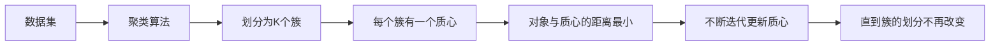
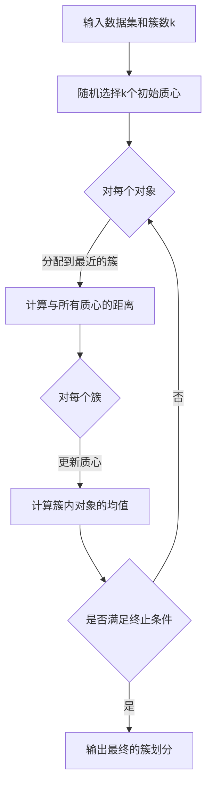

# K-Means - 原理与代码实例讲解

## 1.背景介绍

### 1.1 聚类分析概述
聚类分析是一种无监督学习方法,旨在将相似的对象归为一组,形成不同的簇。它在数据挖掘、模式识别、图像分析等领域有广泛应用。

### 1.2 K-Means算法的重要性
K-Means是最常用、最经典的聚类算法之一。它简单高效,易于实现,适用于处理大规模数据集。深入理解K-Means的原理,对于掌握聚类分析技术至关重要。

### 1.3 本文的目标与结构
本文将详细阐述K-Means算法的基本原理,推导其数学模型,并给出Python代码实现。同时,探讨算法的应用场景、局限性以及改进方向。通过理论与实践相结合,帮助读者全面掌握这一算法。

## 2.核心概念与联系

### 2.1 聚类(Clustering)
聚类就是将物理或抽象对象的集合分组为由类似的对象组成的多个类的过程。聚类不需要预先定义类别,属于无监督学习。

### 2.2 质心(Centroid)  
质心是一个簇的中心点,通常用该簇所有点的均值表示。K-Means算法不断更新质心,使得簇内对象与质心的距离最小化。

### 2.3 距离度量(Distance Metric)
K-Means使用距离度量来衡量对象之间的相似性。最常用的是欧氏距离,即两点之间的直线距离。距离度量的选择会影响聚类结果。

### 2.4 概念之间的联系


## 3.核心算法原理具体操作步骤

### 3.1 输入与初始化
- 输入:包含n个对象的数据集,事先指定的簇数k。  
- 初始化:从数据集中随机选择k个对象作为初始质心。

### 3.2 对象分配
计算每个对象与所有质心的距离,将其分配到距离最近的簇。公式如下:
$$c^{(i)} := \arg\min_{j} \lVert x^{(i)}-\mu_j \rVert^2$$
其中$c^{(i)}$是第$i$个对象的簇标记,$\mu_j$是第$j$个簇的质心。

### 3.3 质心更新
根据新的簇分配,重新计算每个簇的质心。公式如下:  
$$\mu_j := \frac{1}{|C_j|} \sum_{i \in C_j} x^{(i)}$$
其中$C_j$表示第$j$个簇内的对象集合。

### 3.4 迭代求解
重复步骤3.2和3.3,直到满足终止条件:
- 簇的划分不再改变
- 达到最大迭代次数
- 质心更新幅度小于给定阈值

### 3.5 算法流程图


## 4.数学模型和公式详细讲解举例说明

### 4.1 目标函数
K-Means的目标是最小化所有对象与其所属簇质心之间的平方距离之和。用数学语言表述为:
$$\min_{\{C_j\}_{j=1}^k} \sum_{j=1}^k \sum_{i \in C_j} \lVert x^{(i)}-\mu_j \rVert^2$$

其中$\{C_j\}_{j=1}^k$表示对数据集的一个划分,$\mu_j$是第$j$个簇的质心。

### 4.2 求解过程
K-Means通过迭代优化来求解上述目标函数:
1. 固定$\{C_j\}_{j=1}^k$,求$\{\mu_j\}_{j=1}^k$使目标函数最小化。  
$$\mu_j = \frac{1}{|C_j|} \sum_{i \in C_j} x^{(i)}$$

2. 固定$\{\mu_j\}_{j=1}^k$,求$\{C_j\}_{j=1}^k$使目标函数最小化。
$$C_j = \{i: \lVert x^{(i)}-\mu_j \rVert^2 \leq \lVert x^{(i)}-\mu_{j'} \rVert^2, \forall j' \neq j\}$$

3. 重复步骤1和2,直到收敛。

### 4.3 举例说明
考虑一个包含6个二维点的数据集$\{(1,1),(1.5,2),(3,4),(5,7),(3.5,5),(4.5,5)\}$,令$k=2$。

初始化:随机选择(1,1)和(5,7)作为初始质心。

迭代过程:
- 第1次迭代:
    - 对象分配:$C_1=\{(1,1),(1.5,2)\}, C_2=\{(3,4),(5,7),(3.5,5),(4.5,5)\}$
    - 质心更新:$\mu_1=(1.25,1.5), \mu_2=(4,5.25)$
- 第2次迭代:
    - 对象分配:$C_1=\{(1,1),(1.5,2),(3,4)\}, C_2=\{(5,7),(3.5,5),(4.5,5)\}$ 
    - 质心更新:$\mu_1=(1.83,2.33), \mu_2=(4.33,5.67)$
- 第3次迭代:划分不再改变,算法收敛。

最终得到的簇划分为$C_1=\{(1,1),(1.5,2),(3,4)\}, C_2=\{(5,7),(3.5,5),(4.5,5)\}$。

## 5.项目实践：代码实例和详细解释说明

下面给出了使用Python实现K-Means算法的代码:

```python
import numpy as np

class KMeans:
    def __init__(self, n_clusters=2, max_iter=300):
        self.n_clusters = n_clusters
        self.max_iter = max_iter
        self.centroids = None
        
    def fit(self, X):
        # 随机选择初始质心
        idx = np.random.choice(X.shape[0], self.n_clusters, replace=False)
        self.centroids = X[idx, :]
        
        for _ in range(self.max_iter):
            # 对象分配
            clusters = self._create_clusters(X)
            
            prev_centroids = self.centroids
            # 质心更新
            self.centroids = self._get_centroids(X, clusters)
            
            # 检查收敛性
            if np.all(prev_centroids == self.centroids):
                break
        
        return self._create_clusters(X)
    
    def _create_clusters(self, X):
        clusters = [[] for _ in range(self.n_clusters)]
        for idx, sample in enumerate(X):
            centroid_idx = self._closest_centroid(sample)
            clusters[centroid_idx].append(idx)
        return clusters
    
    def _closest_centroid(self, sample):
        distances = [np.linalg.norm(sample - centroid) for centroid in self.centroids]
        closest_idx = np.argmin(distances)
        return closest_idx
    
    def _get_centroids(self, X, clusters):
        centroids = np.zeros((self.n_clusters, X.shape[1]))
        for cluster_idx, cluster in enumerate(clusters):
            cluster_mean = np.mean(X[cluster], axis=0)
            centroids[cluster_idx] = cluster_mean
        return centroids
```

代码解释:
- `__init__`方法初始化模型参数,包括簇数`n_clusters`和最大迭代次数`max_iter`。
- `fit`方法对数据集`X`进行聚类,返回最终的簇划分。它首先随机选择初始质心,然后迭代执行对象分配和质心更新,直到收敛。
- `_create_clusters`方法根据当前质心对对象进行分配。
- `_closest_centroid`方法找到与给定对象最近的质心。
- `_get_centroids`方法根据当前簇划分计算新的质心。

使用该实现进行聚类:
```python
from sklearn.datasets import make_blobs

# 生成示例数据
X, _ = make_blobs(n_samples=100, centers=3, random_state=42)

# 创建模型并拟合
kmeans = KMeans(n_clusters=3)
clusters = kmeans.fit(X)

# 输出结果
print(clusters)
```

## 6.实际应用场景

K-Means算法在许多领域都有广泛应用,例如:

### 6.1 客户细分
将客户按照消费行为、人口统计学特征等进行分组,以制定针对性营销策略。

### 6.2 图像分割
将图像划分为不同的区域,如前景和背景。K-Means可用于对像素进行聚类。

### 6.3 文档聚类
根据文档的内容将其分组,发现潜在的主题或类别。

### 6.4 异常检测
通过聚类识别数据中的异常点或离群点,用于欺诈检测、故障诊断等。  

### 6.5 推荐系统
利用聚类将用户或物品分组,基于组内的相似性提供推荐。

## 7.工具和资源推荐

### 7.1 scikit-learn
scikit-learn是Python机器学习的重要库,提供了易用的K-Means接口。官网: https://scikit-learn.org/

### 7.2 ELKI
ELKI是一个用Java编写的开源数据挖掘软件,包含多种聚类算法的实现。官网: https://elki-project.github.io/

### 7.3 Weka
Weka是一款基于Java的机器学习与数据挖掘工具,其中也包括K-Means的实现。官网: https://www.cs.waikato.ac.nz/ml/weka/

### 7.4 聚类分析相关书籍
- 《统计学习方法》李航 
- 《机器学习》周志华
- 《Pattern Recognition and Machine Learning》Christopher Bishop

## 8.总结：未来发展趋势与挑战

### 8.1 K-Means的局限性
- 需要预先指定簇数$k$
- 对初始质心敏感,容易陷入局部最优
- 假设数据服从球形分布,对非凸形的簇效果不佳
- 离群点或噪声数据会影响聚类质量

### 8.2 算法改进与变种
- K-Means++:优化初始质心的选择
- Kernel K-Means:引入核函数,可处理非线性可分数据
- Mini-Batch K-Means:每次迭代使用小批量样本,提高收敛速度
- X-Means:自动确定最优簇数

### 8.3 聚类分析的发展趋势
- 大规模聚类:处理海量、高维数据,提高聚类效率
- 多视图聚类:整合多个数据视图,挖掘更全面的信息
- 深度聚类:利用深度学习方法学习更好的数据表示进行聚类
- 交互式聚类:引入人工反馈,实现半监督聚类

### 8.4 面临的挑战
- 聚类有效性评估:缺乏统一的聚类质量度量标准
- 高维数据聚类:受维度灾难影响,聚类性能下降
- 复杂类型数据聚类:对图、时间序列等结构化数据聚类
- 聚类结果的可解释性:使聚类过程和结果更易于理解

## 9.附录：常见问题与解答

### 9.1 如何确定最优的簇数?
可以使用手肘法、轮廓系数等方法,通过可视化等手段选择一个合适的$k$值。

### 9.2 K-Means对离群点敏感怎么办?
可以先用其他算法如DBSCAN检测并去除离群点,再进行K-Means聚类。

### 9.3 K-Means能否发现非球形的簇?
单独使用K-Means很难发现非球形簇,可以考虑引入核函数或先进行降维处理。

### 9.4 K-Means的时间复杂度如何?
单次迭代的时间复杂度为$O(nkd)$,其中$n$为对象数,$k$为簇数,$d$为数据维度。通常在少数迭代后即