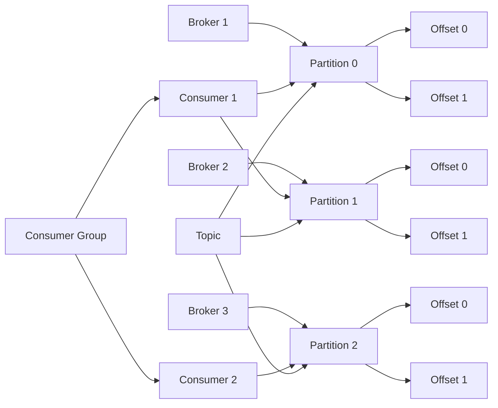

# Kafka Partition原理与代码实例讲解

## 1. 背景介绍

### 1.1 消息队列的重要性
在现代分布式系统中,消息队列扮演着至关重要的角色。它能够实现系统之间的解耦,提高系统的可扩展性,同时也能保证消息的可靠传递。在众多的消息队列中,Kafka以其高吞吐量、高可用性和可扩展性等特点脱颖而出,成为了很多公司首选的消息中间件。

### 1.2 Partition的必要性
Kafka中一个非常重要的概念就是Partition(分区)。Partition是Kafka实现水平扩展、高吞吐的核心所在。本文将深入探讨Kafka Partition的原理,并结合代码实例进行讲解,帮助读者更好地理解和应用Kafka。

## 2. 核心概念与联系

### 2.1 Topic、Partition和Offset
在Kafka中,消息以Topic(主题)的形式进行管理。每个Topic可以被分为多个Partition,每个Partition中的消息是有序的,并且被赋予了一个唯一的Offset(偏移量)作为ID。

### 2.2 Partition与消费者的关系
每个Partition只能被同一个Consumer Group中的一个Consumer消费,但是一个Consumer可以消费多个Partition。这种机制既提高了消费的并行度,又能保证消息的有序性。

### 2.3 Partition与Broker的关系
Kafka集群中的每个Broker都可以存储Topic的Partition。Partition可以在Broker之间进行复制,提高了数据的可靠性。Partition Leader负责处理读写请求,其他Replica作为Follower从Leader同步数据。

### 2.4 Partition核心概念关系图


## 3. 核心算法原理具体操作步骤

### 3.1 生产者发送消息的过程
1. 生产者先将消息发送到Broker的一个Partition上
2. Broker收到消息后,将其追加到Partition的最后,并分配一个Offset
3. Broker返回一个确认给生产者,表明消息已写入

### 3.2 消费者消费消息的过程
1. 消费者在消费时,先加入一个Consumer Group
2. 消费者定期向Broker发送心跳,Broker根据心跳感知Consumer是否存活
3. Broker根据Partition和Consumer的对应关系,将Partition的消息推送给对应的Consumer
4. Consumer收到消息后进行消费,并定期提交Offset,表明消息已消费

### 3.3 Partition Rebalance过程
当Consumer Group中有Consumer加入或退出时,会触发Partition Rebalance:
1. 所有Consumer停止消费,并提交当前的Offset
2. Broker根据Consumer Group的最新情况重新分配Partition
3. 分配完成后,Consumer重新开始消费

## 4. 数学模型和公式详细讲解举例说明

### 4.1 Partition的数量计算
Kafka中Partition的数量需要根据具体的场景和需求来决定。一般可以参考以下公式:

$Partition数量 = max(吞吐量 / Partition吞吐量, 消费者数量)$

例如,如果期望的吞吐量是100MB/s,单个Partition的吞吐量是10MB/s,Consumer数量是3个,那么Partition数量应该是:

$Partition数量 = max(100MB/s / 10MB/s, 3) = 10$

### 4.2 Partition Leader选举
Partition Leader的选举是基于Controller和ISR(In-Sync Replica)来实现的。具体的选举算法如下:

1. Controller从ISR中选择第一个Replica作为新的Leader
2. Controller将新的Leader信息通知给所有的Broker
3. Broker更新自己的Partition元数据信息
4. 新的Leader开始处理读写请求

这个过程可以用以下公式表示:

$$
NewLeader = ISR[0]
$$

## 5. 项目实践：代码实例和详细解释说明

下面我们通过一个简单的Java代码实例,来演示如何使用Kafka的Producer和Consumer API进行消息的发送和消费。

### 5.1 Producer代码实例
```java
Properties props = new Properties();
props.put("bootstrap.servers", "localhost:9092");
props.put("key.serializer", "org.apache.kafka.common.serialization.StringSerializer");
props.put("value.serializer", "org.apache.kafka.common.serialization.StringSerializer");

Producer<String, String> producer = new KafkaProducer<>(props);

for (int i = 0; i < 10; i++) {
    ProducerRecord<String, String> record = new ProducerRecord<>("my-topic", "key-" + i, "value-" + i);
    producer.send(record);
}

producer.close();
```

这段代码创建了一个Kafka Producer,并向名为"my-topic"的Topic发送了10条消息。每条消息都有一个Key和一个Value,分别代表消息的唯一标识和具体内容。

### 5.2 Consumer代码实例
```java
Properties props = new Properties();
props.put("bootstrap.servers", "localhost:9092");
props.put("group.id", "my-group");
props.put("key.deserializer", "org.apache.kafka.common.serialization.StringDeserializer");
props.put("value.deserializer", "org.apache.kafka.common.serialization.StringDeserializer");

KafkaConsumer<String, String> consumer = new KafkaConsumer<>(props);
consumer.subscribe(Arrays.asList("my-topic"));

while (true) {
    ConsumerRecords<String, String> records = consumer.poll(Duration.ofMillis(100));
    for (ConsumerRecord<String, String> record : records) {
        System.out.printf("offset = %d, key = %s, value = %s%n", record.offset(), record.key(), record.value());
    }
}
```

这段代码创建了一个Kafka Consumer,并订阅了名为"my-topic"的Topic。Consumer会不断地从Topic中拉取消息,并打印出每条消息的Offset、Key和Value。

## 6. 实际应用场景

Kafka凭借其优秀的性能和可靠性,在很多场景中得到了广泛应用,例如:

### 6.1 日志收集
Kafka可以作为日志收集的中间件,将分布在不同服务器上的日志统一收集起来,方便进行集中处理和分析。

### 6.2 消息系统
Kafka可以作为消息系统,实现系统之间的解耦。例如在电商场景中,订单系统可以将订单信息发送到Kafka,其他系统如物流系统、推荐系统可以从Kafka中消费订单信息。

### 6.3 流式处理
Kafka可以作为流式处理的数据源,为Spark Streaming、Flink等流式处理框架提供高吞吐、低延迟的数据流。

## 7. 工具和资源推荐

### 7.1 Kafka官方文档
Kafka的官方文档是学习和使用Kafka的最权威资料,建议仔细阅读。
https://kafka.apache.org/documentation/

### 7.2 Kafka Tool
Kafka Tool是一个Kafka的GUI管理工具,可以方便地查看Topic、Partition、Consumer Group等信息。
https://www.kafkatool.com/

### 7.3 Kafka Manager
Kafka Manager是Yahoo开源的Kafka管理工具,提供了Topic创建、Partition管理、Broker监控等功能。
https://github.com/yahoo/CMAK

## 8. 总结：未来发展趋势与挑战

### 8.1 云原生化
随着云计算的发展,Kafka也在向云原生化的方向发展。如何更好地与Kubernetes等云平台集成,如何实现自动扩缩容,将是Kafka未来的一个重要方向。

### 8.2 流批一体化
Kafka既可以处理实时的流式数据,也可以处理离线的批量数据。如何更好地实现流批一体化,简化数据处理的架构和流程,是Kafka需要解决的一个问题。

### 8.3 数据治理与安全
随着数据规模的增长和数据价值的提升,如何对Kafka中的数据进行有效的治理和安全保护,也将成为Kafka发展的一个重要课题。

## 9. 附录：常见问题与解答

### 9.1 Kafka的Partition数量应该设置多少?
Partition的数量需要根据期望的吞吐量、Consumer的数量等因素综合考虑。一般建议Partition的数量大于等于Consumer的数量,并且要预留一定的扩展空间。

### 9.2 Kafka如何保证消息的顺序?
Kafka只能保证同一个Partition内的消息是有序的。如果需要全局有序,可以将所有消息发送到同一个Partition,或者在应用层面进行排序。

### 9.3 Kafka如何实现高可用?
Kafka通过Partition的Replica机制实现高可用。每个Partition可以配置多个Replica,分布在不同的Broker上。当Leader失效时,Follower可以快速接管,保证服务的连续性。

作者：禅与计算机程序设计艺术 / Zen and the Art of Computer Programming