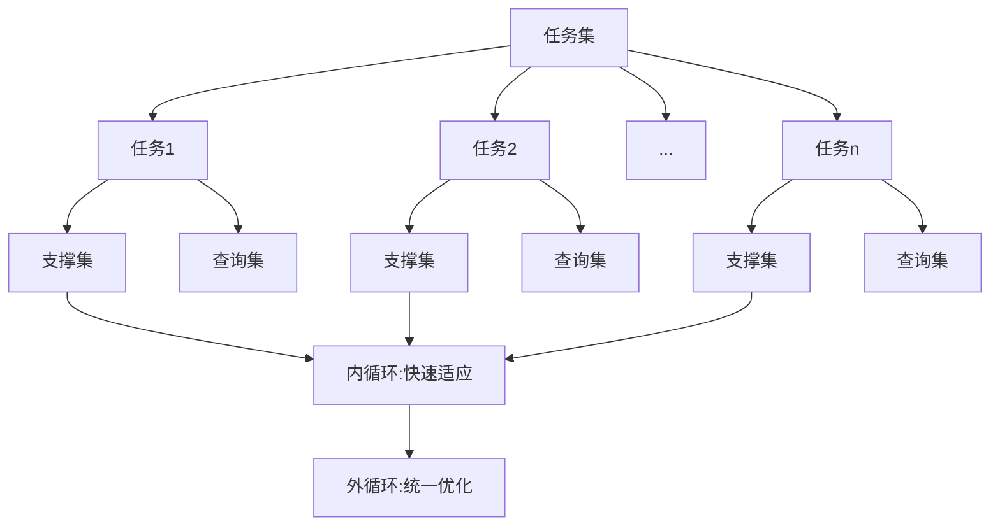

# MAML原理与代码实例讲解

## 1.背景介绍

在机器学习领域,元学习(Meta Learning)是一个热门的研究方向。元学习旨在让机器学习模型能够快速适应新的任务,从而实现"学会学习"的能力。Model-Agnostic Meta-Learning(MAML)是元学习领域的代表性算法之一,由Finn等人于2017年提出。MAML算法可以让模型在面对新任务时,仅需很少的梯度下降步数就能快速适应,展现出优秀的泛化能力。

### 1.1 元学习的兴起

传统的机器学习方法通常需要大量标注数据来训练模型,而现实世界中很多任务的标注数据非常有限。元学习通过在一系列相关任务上训练模型,让模型掌握任务之间的共性,从而能在新任务上快速学习,即使新任务的标注数据很少。

### 1.2 MAML的优势

MAML相比其他元学习算法的优势在于:  
- 模型无关性:适用于各种可以求梯度的模型
- 结构简单:没有引入复杂的网络结构
- 训练高效:内循环仅需要求一次或少量梯度

### 1.3 MAML的应用前景

MAML在few-shot learning、强化学习、机器人控制等领域都有广泛应用。通过MAML,模型可以在新环境下快速适应,agent可以根据几次尝试就掌握新技能,大大提高了学习效率。未来MAML有望进一步扩展到在线学习、持续学习等更多场景。

## 2.核心概念与联系

要理解MAML,首先需要掌握以下几个核心概念:  

### 2.1 任务(Task)

元学习是在一系列任务上进行学习,每个任务可以看作是一个独立的学习问题。以few-shot分类为例,每个任务对应一个N-way K-shot的分类问题。MAML通过在这些任务上训练,提取它们之间的共性。

### 2.2 支撑集(Support Set)与查询集(Query Set)  

每个任务包含一个支撑集和查询集。支撑集是模型用来快速适应的少量标注数据,对应K-shot中的K个样本。查询集用来评估模型适应后的性能,需要预测其标签。

### 2.3 内循环(Inner Loop)与外循环(Outer Loop)

MAML分为内循环和外循环两个阶段。内循环是模型在支撑集上快速适应的过程,通过一次或几次梯度下降来调整参数。外循环是统一优化整个任务集的过程,通过元梯度下降更新初始参数。

下图展示了这些概念之间的关系:



## 3.核心算法原理具体操作步骤

MAML的核心思想是学习一个对新任务有良好初始化效果的参数,使其能通过少量步梯度下降快速适应新任务。算法主要分为以下步骤:

### 3.1 初始化

首先随机初始化一个模型参数$\theta$,作为所有任务共享的初始参数。

### 3.2 采样任务

从任务分布$p(\mathcal{T})$中采样一个batch的任务$\{\mathcal{T}_i\}$,每个任务包含支撑集$\mathcal{D}_i^{tr}$和查询集$\mathcal{D}_i^{ts}$。

### 3.3 内循环

对每个采样的任务$\mathcal{T}_i$,在支撑集$\mathcal{D}_i^{tr}$上通过一次或多次梯度下降找到适应后的参数$\phi_i$:

$$
\phi_i=\theta-\alpha\nabla_\theta\mathcal{L}_{\mathcal{T}_i}(f_\theta)
$$

其中$\alpha$是内循环学习率,$\mathcal{L}$是任务的损失函数,$f$是参数为$\theta$的模型。

### 3.4 外循环

用查询集$\mathcal{D}_i^{ts}$评估每个任务适应后的损失,并对所有任务求平均:

$$
\mathcal{L}(\theta)=\sum_{\mathcal{T}_i \sim p(\mathcal{T})}\mathcal{L}_{\mathcal{T}_i}(f_{\phi_i})
$$

然后计算元梯度$\nabla_\theta\mathcal{L}(\theta)$,并用它更新初始参数$\theta$:

$$
\theta \leftarrow \theta-\beta\nabla_\theta\mathcal{L}(\theta)
$$

其中$\beta$是外循环学习率。这个过程重复多次直到收敛。

### 3.5 测试阶段

对于新任务,用学习到的初始参数$\theta$在其支撑集上通过少量步梯度下降得到适应后参数,并用其进行预测。

## 4.数学模型和公式详细讲解举例说明

这里以few-shot分类任务为例,详细说明MAML的数学模型。假设我们要学习一个N-way K-shot的分类器,即每个任务有N个类别,每个类别有K个标注样本。

### 4.1 任务采样

首先从任务分布$p(\mathcal{T})$中采样一个任务$\mathcal{T}_i$,其支撑集为$\mathcal{D}_i^{tr}=\{(x_j,y_j)\}_{j=1}^{N\times K}$,查询集为$\mathcal{D}_i^{ts}=\{(x_j,y_j)\}_{j=1}^{Q}$,其中$Q$为查询集样本数。

### 4.2 内循环

在支撑集$\mathcal{D}_i^{tr}$上,用交叉熵损失函数计算梯度:

$$
\nabla_\theta\mathcal{L}_{\mathcal{T}_i}(f_\theta)=\nabla_\theta\left[-\frac{1}{NK}\sum_{j=1}^{NK}\sum_{c=1}^{N}\mathbf{1}_{y_j=c}\log f_\theta(y=c|x_j)\right]
$$

然后更新参数得到$\phi_i$:

$$
\phi_i=\theta-\alpha\nabla_\theta\mathcal{L}_{\mathcal{T}_i}(f_\theta)
$$

### 4.3 外循环

用查询集$\mathcal{D}_i^{ts}$计算适应后的损失:

$$
\mathcal{L}_{\mathcal{T}_i}(f_{\phi_i})=-\frac{1}{Q}\sum_{j=1}^{Q}\sum_{c=1}^{N}\mathbf{1}_{y_j=c}\log f_{\phi_i}(y=c|x_j)
$$

对所有采样任务的损失求平均并计算元梯度:

$$
\nabla_\theta\mathcal{L}(\theta)=\nabla_\theta\sum_{\mathcal{T}_i \sim p(\mathcal{T})}\mathcal{L}_{\mathcal{T}_i}(f_{\phi_i})
$$

最后用元梯度更新初始参数$\theta$:

$$
\theta \leftarrow \theta-\beta\nabla_\theta\mathcal{L}(\theta)
$$

以上过程重复多次,即可得到对新任务具有良好初始化效果的参数$\theta$。

## 5.项目实践：代码实例和详细解释说明

下面用PyTorch实现一个简单的MAML代码示例,应用于Omniglot数据集的few-shot字符分类任务。

### 5.1 库导入与超参数设置

```python
import torch
import torch.nn as nn
import torch.optim as optim
import numpy as np
from omniglot import Omniglot

device = torch.device("cuda" if torch.cuda.is_available() else "cpu")
num_classes = 5 
num_shots = 1
meta_batchsiz = 32
num_epochs = 100
```

### 5.2 模型定义

定义一个简单的4层卷积网络作为分类器:

```python
class CNN(nn.Module):
    def __init__(self, num_classes):
        super(CNN, self).__init__()
        self.conv1 = nn.Conv2d(1, 64, 3)
        self.conv2 = nn.Conv2d(64, 64, 3)
        self.conv3 = nn.Conv2d(64, 64, 3)
        self.conv4 = nn.Conv2d(64, 64, 3)
        self.out = nn.Linear(64, num_classes)

    def forward(self, x):
        x = F.relu(self.conv1(x))
        x = F.relu(self.conv2(x))
        x = F.relu(self.conv3(x)) 
        x = F.relu(self.conv4(x))
        x = x.view(x.size(0), -1)
        return self.out(x)
```

### 5.3 数据加载

用Omniglot数据集构建N-way K-shot分类任务:

```python
db = Omniglot(num_classes, num_shots)
```

### 5.4 MAML训练

实现MAML的内循环和外循环:

```python
model = CNN(num_classes).to(device)
meta_optimizer = optim.Adam(model.parameters(), lr=1e-3)

for epoch in range(num_epochs):
    # 采样一批任务
    batch = db.sample_tasks(meta_batchsiz)
    loss_sum = 0
    for task in batch:
        # 内循环
        support_x, support_y = task['train']
        support_x, support_y = support_x.to(device), support_y.to(device)
        fast_weights = OrderedDict(model.named_parameters())
        for inner_step in range(num_inner_steps):
            logits = model.functional_forward(support_x, fast_weights)
            loss = F.cross_entropy(logits, support_y)
            grads = torch.autograd.grad(loss, fast_weights.values())
            fast_weights = OrderedDict((name, param - alpha * grad)
                                  for ((name, param), grad) in zip(fast_weights.items(), grads))
        
        # 外循环 
        query_x, query_y = task['test']
        query_x, query_y = query_x.to(device), query_y.to(device)
        logits = model.functional_forward(query_x, fast_weights)
        loss_q = F.cross_entropy(logits, query_y)
        loss_sum += loss_q
        
    # 元更新    
    loss_avg = loss_sum / meta_batchsiz 
    meta_optimizer.zero_grad()
    loss_avg.backward()
    meta_optimizer.step()
```

其中`functional_forward`是用给定参数进行前向传播的函数:

```python
def functional_forward(self, x, weights):
    x = F.relu(F.conv2d(x, weights['conv1.weight'], weights['conv1.bias']))
    x = F.relu(F.conv2d(x, weights['conv2.weight'], weights['conv2.bias']))  
    x = F.relu(F.conv2d(x, weights['conv3.weight'], weights['conv3.bias']))
    x = F.relu(F.conv2d(x, weights['conv4.weight'], weights['conv4.bias']))
    x = x.view(x.size(0), -1)
    x = F.linear(x, weights['out.weight'], weights['out.bias'])
    return x
```

以上代码实现了MAML在Omniglot上的few-shot字符分类。通过内外循环的训练,模型可以学习到一个对新字符具有良好初始化效果的参数,从而实现快速适应的能力。

## 6.实际应用场景

MAML 在以下场景中有广泛的应用前景:

### 6.1 Few-Shot Learning

Few-shot learning 旨在让模型通过极少量的标注样本就能对新类别进行分类。MAML 通过在一系列分类任务上元学习,得到对新类别具有良好初始化效果的参数,从而能在新类别上快速适应。应用包括:
- 人脸识别:仅需几张照片就能认识新的人脸
- 医学图像分类:标注数据稀缺,需要快速适应新的疾病类型
- 语音识别:不同人的语音存在差异,需要根据少量语音快速适应

### 6.2 Reinforcement Learning

MAML 还可以用于强化学习,让 agent 快速适应新的环境。通过在一系列相似环境上元学习策略网络的初始参数,使其能在新环境下以很少的交互步数找到最优策略。应用包括:
- 机器人控制:根据几次尝试就能掌握新的操作技能
- 游戏 AI:通过元学习在新游戏关卡上快速提升
- 自动驾驶:让车辆能适应不同的路况和天气条件

### 6.3