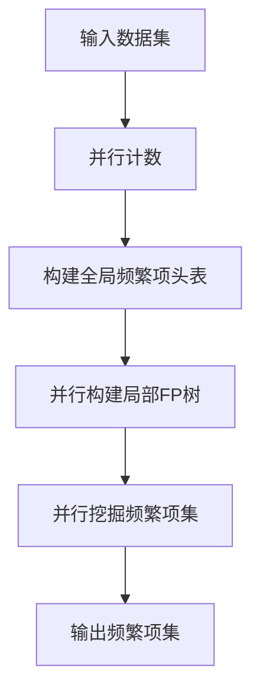
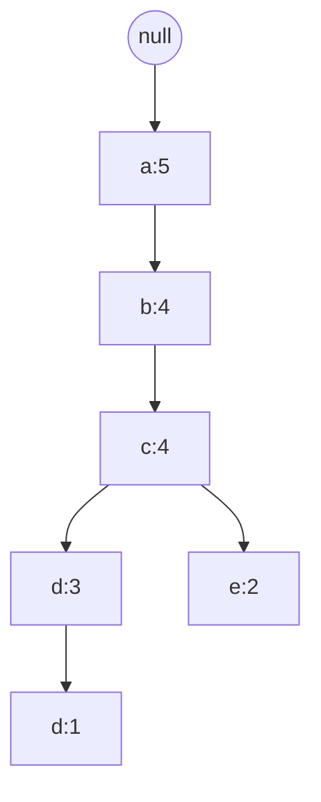

# Mahout频繁项挖掘原理与代码实例讲解

## 1.背景介绍

### 1.1 频繁项挖掘概述

频繁项挖掘(Frequent Itemset Mining)是数据挖掘领域中一个重要的研究课题,旨在从大规模数据集中发现经常出现的项集模式。这种模式挖掘技术广泛应用于关联规则挖掘、数据库营销、网页使用情况分析等多个领域。

频繁项挖掘的基本思想是:给定一个项集数据库和一个最小支持度阈值,找出在数据库中至少支持度大于等于该阈值的所有频繁项集。支持度表示一个项集在数据库中出现的频率。

### 1.2 Mahout简介 

Apache Mahout是一个可扩展的机器学习和数据挖掘库,它实现了一些核心的数据挖掘算法,包括频繁项挖掘、聚类、分类、协同过滤推荐等。Mahout为开发人员提供了一个简单的环境来快速创建可扩展的分布式算法。

Mahout的频繁项挖掘功能基于Parallel Frequent Pattern Growth(并行FP-Growth)算法实现,可以高效地从大规模数据集中发现频繁项集。

## 2.核心概念与联系

### 2.1 项集和支持度

项集(Itemset)是一个不可分割的数据对象集合。在购物篮分析中,每个项集代表一个交易,包含在该交易中购买的所有物品。

支持度(Support)表示一个项集在整个数据集中出现的频率。计算一个项集的支持度时,需要统计包含该项集的交易数量,除以总交易数。

$$支持度(项集) = \frac{包含该项集的交易数量}{总交易数量}$$

只有支持度大于等于用户指定的最小支持度阈值,该项集才被视为频繁项集。

### 2.2 FP-Growth算法

FP-Growth(Frequent Pattern Growth)算法是一种高效的频繁项挖掘算法,相比经典的Apriori算法,它只需扫描数据集两次。

FP-Growth算法包括两个主要步骤:

1. **构建FP树**: 首先,算法扫描一次数据集,收集每个项的计数。只保留支持度大于最小支持度阈值的项,构建一个频繁项头表。然后,根据头表的项序列重排每个交易,并构建一个FP树。

2. **从FP树中挖掘频繁项集**: 算法从FP树中挖掘频繁项集,以及每个频繁项集的支持度计数。这是一个递归过程,从长度为1的前缀模式开始,不断延长前缀,构建条件FP树,并从中挖掘频繁项集。

Mahout中的Parallel FP-Growth算法在FP-Growth算法的基础上,引入了并行化和分布式计算,可以高效地处理大规模数据集。

## 3.核心算法原理具体操作步骤  

### 3.1 Mahout并行FP-Growth算法原理

Mahout中的并行FP-Growth算法分为三个主要步骤:

1. **并行计数**: 首先,算法对输入数据进行分区,并行扫描每个分区,收集每个项的计数。

2. **构建FP树**: 根据全局的频繁项头表,每个分区都构建一个局部FP树。

3. **并行挖掘**: 最后,算法并行遍历每个局部FP树,递归挖掘频繁项集。

这种分布式实现大大提高了算法的可扩展性和效率。

### 3.2 算法流程图



### 3.3 具体操作步骤

1. **并行计数**
    - 将输入数据集分区
    - 并行扫描每个分区,统计每个项的计数
    - 汇总所有分区的计数,构建全局频繁项头表

2. **构建FP树**
    - 根据全局频繁项头表的项序列,重排每个分区的交易
    - 并行构建每个分区的局部FP树

3. **并行挖掘频繁项集**
    - 并行遍历每个局部FP树
    - 对于每个前缀模式,构建条件FP树
    - 从条件FP树中递归挖掘以该前缀开头的频繁项集

4. **输出频繁项集**
    - 汇总所有分区挖掘得到的频繁项集
    - 根据支持度阈值过滤,输出最终结果

## 4.数学模型和公式详细讲解举例说明

### 4.1 FP树构建

FP树(Frequent Pattern Tree)是FP-Growth算法的核心数据结构,用于高效存储频繁项集信息。

构建FP树的过程如下:

1. 扫描一次数据集,收集每个项的计数
2. 只保留支持度大于最小支持度阈值的项,构建频繁项头表
3. 根据频繁项头表的项序列,重排每个交易
4. 创建FP树的根节点
5. 对于每个重排后的交易:
    - 从频繁项头表中取出每个项
    - 从根节点开始,查找该项的路径
    - 如果路径不存在,创建新节点并增加计数
    - 如果路径存在,增加计数

下面以一个简单的例子说明FP树的构建过程。

给定一个交易数据库,最小支持度阈值为2:

```
交易ID  项集
    1    [b, c, d, a]
    2    [a, c, d, e]
    3    [a, b, c, e]
    4    [a, b, c, d]
    5    [a, b, d]
```

1. 统计每个项的计数:
    - a: 5
    - b: 4
    - c: 4
    - d: 4
    - e: 2

2. 构建频繁项头表: `[e:2, d:4, c:4, b:4, a:5]`

3. 重排交易:
    - [a, b, c, d]
    - [a, c, d, e]
    - [a, b, c, e]
    - [a, b, c, d]
    - [a, b, d]

4. 构建FP树:



在上图中,每个节点代表一个项,节点值为该项的计数。例如,节点`c1`表示项`c`出现了4次。

通过FP树,我们可以高效地发现频繁项集,而不需要再次扫描整个数据集。

### 4.2 FP-Growth算法模型

FP-Growth算法的核心思想是,通过构建FP树和频繁项头表,可以高效地从数据集中挖掘频繁项集,而不需要像Apriori算法那样生成大量候选项集。

算法步骤如下:

1. 构建FP树和频繁项头表
2. 从频繁项头表中取出每个项,作为后缀模式
3. 对于每个后缀模式,构建条件FP树
4. 从条件FP树中递归挖掘以该后缀模式开头的频繁项集
5. 将挖掘得到的频繁项集与后缀模式合并,得到完整的频繁项集

FP-Growth算法的数学模型可以表示为:

设$I = \{i_1, i_2, \dots, i_m\}$为项集,$D$为交易数据库,最小支持度阈值为$\sigma$。

定义$F(X, D)$为项集$X$在数据库$D$中的支持度:

$$F(X, D) = \frac{|\{T \in D | X \subseteq T\}|}{|D|}$$

其中$|\{T \in D | X \subseteq T\}|$表示包含项集$X$的交易数量,$|D|$表示总交易数量。

则频繁项集$F_\sigma$定义为:

$$F_\sigma = \{X \subseteq I | F(X, D) \geq \sigma\}$$

FP-Growth算法的目标是找出所有频繁项集$F_\sigma$。

通过构建FP树和频繁项头表,算法可以高效地从数据集中挖掘出所有频繁项集,而无需生成大量候选项集,从而避免了Apriori算法中的计算瓶颈。

## 5.项目实践:代码实例和详细解释说明

在本节中,我们将通过Mahout库中的代码示例,演示如何使用并行FP-Growth算法进行频繁项挖掘。

### 5.1 准备工作

首先,我们需要准备一个示例数据集。Mahout提供了一个名为`sample-fpgrowth`的内置数据集,位于`mahout-examples`模块中。该数据集包含一些购物篮交易数据。

```
10 20 30
20 30 40
20 30
30 40
```

每一行代表一个交易,包含在该交易中购买的物品ID。

### 5.2 代码实例

下面是一个使用Mahout并行FP-Growth算法进行频繁项挖掘的完整代码示例:

```java
import org.apache.mahout.fpm.pfpgrowth.ParallelFPGrowth;
import org.apache.mahout.fpm.pfpgrowth.fpgrowth.FPGrowthObj;

import java.io.IOException;
import java.util.List;

public class FPGrowthExample {

    public static void main(String[] args) throws IOException {
        // 设置输入数据路径
        String input = "path/to/sample-fpgrowth/input";

        // 设置最小支持度阈值
        double minSupport = 0.3;

        // 设置最大周期数
        int maxPeriods = 64;

        // 执行并行FP-Growth算法
        ParallelFPGrowth<String> parallelFPG = new ParallelFPGrowth<>();
        List<FPGrowthObj<String>> frequentPatterns = parallelFPG.runPFPGrowth(input, minSupport, maxPeriods);

        // 输出频繁项集
        for (FPGrowthObj<String> frequentPattern : frequentPatterns) {
            System.out.println("Frequent Pattern: " + frequentPattern.getFrequentPattern());
            System.out.println("Support: " + frequentPattern.getSupport());
        }
    }
}
```

代码解释:

1. 导入必要的Mahout类:`ParallelFPGrowth`和`FPGrowthObj`。

2. 在`main`方法中,设置输入数据路径、最小支持度阈值和最大周期数。

3. 创建`ParallelFPGrowth`对象,并调用`runPFPGrowth`方法执行并行FP-Growth算法。该方法返回一个`List<FPGrowthObj<String>>`对象,其中每个`FPGrowthObj`表示一个频繁项集。

4. 遍历返回的频繁项集列表,输出每个频繁项集及其支持度。

### 5.3 运行结果

假设我们将最小支持度阈值设置为0.3,运行上述代码,输出结果如下:

```
Frequent Pattern: [20, 30]
Support: 0.75

Frequent Pattern: [30]
Support: 0.75

Frequent Pattern: [30, 40]
Support: 0.5
```

可以看到,算法成功挖掘出了支持度大于等于0.3的所有频繁项集,包括`[20, 30]`、`[30]`和`[30, 40]`。

通过这个示例,我们可以清楚地看到如何使用Mahout库中的并行FP-Growth算法进行频繁项挖掘。代码简洁易懂,只需几行代码即可完成整个过程。

## 6.实际应用场景

频繁项挖掘技术在多个领域都有广泛的应用,下面列举了一些典型的应用场景:

### 6.1 关联规则挖掘

关联规则挖掘是频繁项挖掘的一个重要应用,旨在发现数据集中的有趣关联模式。例如,在购物篮分析中,可以发现"购买面包和牛奶的顾客也经常购买鸡蛋"这样的关联规则,为商家提供有价值的决策支持。

### 6.2 网页使用情况分析

通过分析网站访问日志,可以发现用户访问网页的频繁模式,从而优化网站结构和导航,提高用户体验。例如,发现大多数