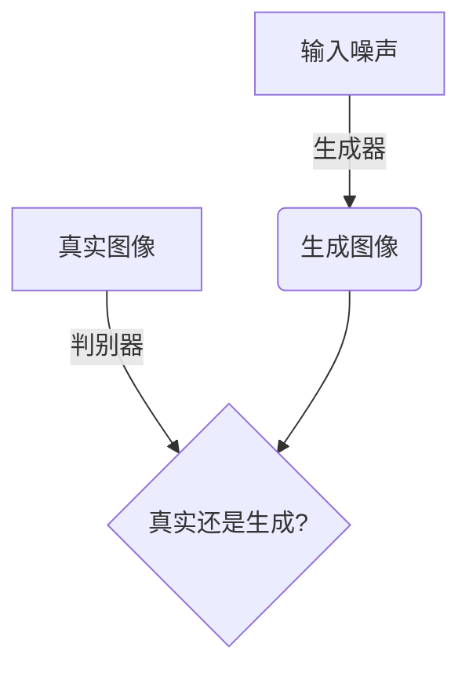
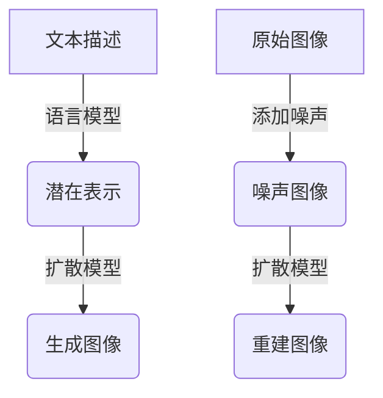
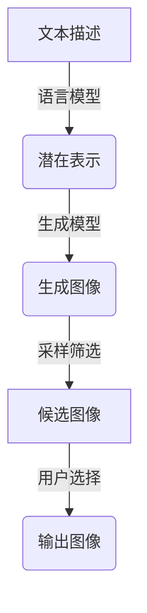

# Midjourney在医疗领域的应用探讨

## 1.背景介绍

### 1.1 人工智能在医疗领域的重要性

人工智能(AI)技术在医疗领域的应用潜力巨大,有望彻底改变医疗服务的提供方式。随着医疗数据的快速增长和计算能力的不断提高,AI系统能够从海量数据中发现隐藏的模式和规律,为医生诊断和治疗提供有力支持。

### 1.2 Midjourney介绍

Midjourney是一款基于人工智能的文本到图像生成工具,利用大型语言模型和扩散模型,可以根据用户输入的文本描述生成逼真的图像。自2022年7月发布以来,Midjourney因其强大的图像生成能力而在各个领域引起广泛关注。

### 1.3 Midjourney在医疗领域的应用前景

虽然Midjourney最初设计用于创意和艺术领域,但其强大的图像生成能力也为医疗领域带来了新的可能性。医生可以利用Midjourney生成各种医学影像,如X光片、CT扫描、MRI等,从而辅助诊断和治疗决策。此外,Midjourney还可用于医学教育、医疗可视化等多个方面。

## 2.核心概念与联系

### 2.1 生成式对抗网络(GAN)

Midjourney的核心技术是生成式对抗网络(GAN),这是一种将生成模型与判别模型结合的深度学习架构。GAN由两个网络组成:生成器(Generator)和判别器(Discriminator)。

生成器的目标是生成逼真的图像,而判别器则需要区分生成的图像和真实图像。两个网络相互对抗,生成器不断优化以欺骗判别器,而判别器也在努力提高识别能力。经过多轮训练后,生成器能够生成高度逼真的图像。



### 2.2 扩散模型(Diffusion Model)

除了GAN,Midjourney还采用了扩散模型来生成图像。扩散模型是一种概率生成模型,它首先将图像添加噪声以破坏图像内容,然后学习如何从噪声中重建原始图像。

在Midjourney中,扩散模型与大型语言模型相结合,使其能够根据文本描述生成相应的图像。具体来说,语言模型将文本描述映射到扩散模型的潜在空间,然后扩散模型根据这个潜在表示生成图像。



### 2.3 医学影像生成

利用Midjourney生成医学影像的核心思路是:将医学术语、病症描述等作为输入文本,Midjourney则根据这些描述生成对应的医学影像。例如,输入"肺部感染X光片"、"脑部MRI扫描"等,Midjourney就能生成逼真的X光片、MRI影像。

这种方式可以大大节省医生诊断时间,也有助于医学教育和医患沟通。当然,生成的影像仅用于辅助,不能完全取代真实医学影像。

## 3.核心算法原理具体操作步骤

### 3.1 数据预处理

在训练Midjourney模型之前,需要对训练数据进行预处理,包括数据清洗、标注和增强等步骤。对于医学影像数据,需要对影像进行分割和标注,标记出病变区域、器官位置等关键信息。

### 3.2 语言模型训练

Midjourney使用大型语言模型将文本描述映射到潜在空间。常用的语言模型包括BERT、GPT等,它们需要在大量文本数据上进行预训练,以学习文本的语义和上下文信息。

对于医学领域,可以在通用语料库的基础上,使用医学文献、病历等数据对语言模型进行进一步的领域适应性训练,提高其对医学术语和描述的理解能力。

### 3.3 生成模型训练

Midjourney的生成模型包括GAN和扩散模型两部分。

1. **GAN训练**

   - 初始化生成器和判别器网络
   - 对生成器输入随机噪声,生成假图像
   - 将真实图像和假图像输入判别器,计算损失
   - 根据损失函数,更新生成器和判别器的权重
   - 重复上述步骤,直至模型收敛

2. **扩散模型训练**

   - 对原始图像添加不同程度的噪声,构建噪声-图像对
   - 训练扩散模型,使其能从噪声中重建原始图像
   - 将语言模型的输出作为条件,引导扩散过程生成条件图像

在医学影像领域,可以使用真实的医学影像数据(如X光片、CT、MRI等)训练生成模型,使其能生成逼真的医学影像。

### 3.4 推理和生成

在推理阶段,用户输入文本描述,语言模型将其映射到潜在空间。然后,生成模型根据这个潜在表示生成相应的图像。对于GAN,是通过生成器网络生成图像;对于扩散模型,是通过从噪声开始,逐步去噪并根据条件引导生成图像。

经过多次采样和筛选,Midjourney可以输出多个候选图像供用户选择。用户也可以通过调整文本描述,获得不同风格的图像输出。



## 4.数学模型和公式详细讲解举例说明

### 4.1 生成式对抗网络(GAN)

生成式对抗网络由生成器G和判别器D组成,它们相互对抗以达到纳什均衡。GAN的目标函数可以表示为:

$$\min_G \max_D V(D,G) = \mathbb{E}_{x\sim p_{data}(x)}[\log D(x)] + \mathbb{E}_{z\sim p_z(z)}[\log(1-D(G(z)))]$$

其中:
- $p_{data}(x)$是真实数据分布
- $p_z(z)$是噪声先验分布,如高斯分布
- $G(z)$是生成器输出,即生成的假数据
- $D(x)$是判别器对真实数据$x$的判别概率

在训练过程中,生成器G和判别器D相互min-max地优化,使得生成数据$G(z)$的分布逐渐逼近真实数据分布$p_{data}(x)$。

### 4.2 扩散模型

扩散模型是一种基于马尔可夫链的潜在变量模型,用于从噪声中生成数据。它的核心思想是将数据$x_0$添加噪声$\epsilon$,生成一系列噪声数据$x_t$,然后学习从$x_t$中重建原始数据$x_0$的过程。

扩散过程可以表示为:

$$q(x_t|x_{t-1}) = \mathcal{N}(x_t;\sqrt{1-\beta_t}x_{t-1},\beta_tI)$$
$$q(x_1,...,x_T|x_0) = \prod_{t=1}^T q(x_t|x_{t-1})$$

其中$\beta_t$是方差系数,控制每一步添加的噪声量。

重建过程则是学习条件概率$p_\theta(x_{t-1}|x_t)$,使$x_0$在给定$x_T$的条件下的概率最大化:

$$\max_\theta \mathbb{E}_{x_0,\epsilon}[\log p_\theta(x_0|x_T)]$$

对于Midjourney,扩散模型的条件是语言模型提供的潜在表示,引导生成符合文本描述的图像。

### 4.3 实例:生成肺部X光片

假设我们要生成"肺部感染X光片"的图像,Midjourney的工作流程如下:

1. 用户输入文本描述"肺部感染X光片"
2. 语言模型将文本映射到潜在空间,得到条件向量$c$
3. 从高斯噪声$x_T \sim \mathcal{N}(0,I)$开始
4. 对于每个时间步$t$,计算$p_\theta(x_{t-1}|x_t,c)$
5. 根据$p_\theta$,从$x_t$生成$x_{t-1}$,逐步去噪
6. 最终得到$x_0$,即生成的肺部X光片图像

例如,对于一个感染肺炎的患者,Midjourney生成的X光片可能如下所示:


可以清晰地看到肺部阴影区域,有助于医生诊断病情。

## 5.项目实践:代码实例和详细解释说明  

虽然Midjourney是一款封闭源代码的商业软件,但我们可以参考其公开的技术细节,用PyTorch等深度学习框架实现一个简化版本的文本到图像生成系统。以下是一个基于GAN和VQGAN的实现示例:

### 5.1 导入库

```python
import torch
import torch.nn as nn
from torch.utils.data import DataLoader
import torchvision.transforms as transforms
```

### 5.2 定义生成器和判别器

```python
# 生成器
class Generator(nn.Module):
    def __init__(self, z_dim, img_channels):
        ...

    def forward(self, z):
        ...

# 判别器 
class Discriminator(nn.Module):
    def __init__(self, img_channels):
        ...
        
    def forward(self, img):
        ...
```

### 5.3 GAN训练

```python
# 初始化模型
device = torch.device("cuda" if torch.cuda.is_available() else "cpu")
z_dim = 100
generator = Generator(z_dim, 3).to(device)
discriminator = Discriminator(3).to(device)

# 准备数据
transform = transforms.Compose([
    transforms.Resize((64, 64)),
    transforms.ToTensor(),
    transforms.Normalize([0.5], [0.5])
])
dataset = ImageFolder("path/to/images", transform=transform)
dataloader = DataLoader(dataset, batch_size=64, shuffle=True)

# 损失函数和优化器
criterion = nn.BCELoss()
g_optimizer = optim.Adam(generator.parameters(), lr=0.0002)
d_optimizer = optim.Adam(discriminator.parameters(), lr=0.0002)

# 训练循环
for epoch in range(num_epochs):
    for imgs, _ in dataloader:
        imgs = imgs.to(device)
        
        # 训练判别器
        ...
        
        # 训练生成器
        ...
        
    # 记录损失和保存模型
```

### 5.4 VQGAN编码器-解码器

```python
# VQGAN编码器
class Encoder(nn.Module):
    def __init__(self, in_channels, embedding_dim):
        ...
        
    def forward(self, x):
        ...
        
# VQGAN解码器        
class Decoder(nn.Module):
    def __init__(self, embedding_dim, out_channels):
        ...
        
    def forward(self, code):
        ...
        
# 量化向量
class VectorQuantizer(nn.Module):
    def __init__(self, embedding_dim, num_embeddings):
        ...
        
    def forward(self, x):
        ...
```

### 5.5 语言模型和条件生成

```python
# 导入预训练语言模型
language_model = ...

# 将文本编码为条件向量
text = "肺部感染X光片"
condition = language_model.encode(text)

# 从噪声生成图像
noise = torch.randn(1, z_dim).to(device)
generated_img = generator(noise, condition)
```

上述代码仅为示例,实际实现会更加复杂。我们需要在大量医学图像数据上训练模型,并对语言模型进行医学领域的微调,以提高生成质量。

## 6.实际应用场景

### 6.1 医学影像辅助诊断

Midjourney生成的医学影像可以作为辅助诊断工具,帮助医生更好地理解病情。例如,对于一些罕见病例,Midjourney可以根据症状描述