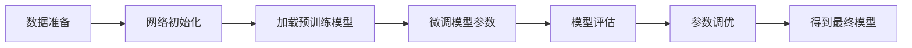

# OCRNet与迁移学习：快速构建高效模型，节省时间成本

## 1.背景介绍

### 1.1 OCR技术概述
- 1.1.1 OCR的定义与发展历程
- 1.1.2 OCR的应用场景
- 1.1.3 OCR技术的挑战

### 1.2 深度学习在OCR中的应用  
- 1.2.1 传统OCR方法的局限性
- 1.2.2 深度学习的优势
- 1.2.3 主流的深度学习OCR架构

### 1.3 迁移学习简介
- 1.3.1 迁移学习的概念
- 1.3.2 迁移学习的优点
- 1.3.3 迁移学习在OCR中的应用价值

## 2.核心概念与联系

### 2.1 OCRNet
- 2.1.1 OCRNet的网络结构
- 2.1.2 OCRNet的特点与优势
- 2.1.3 OCRNet与其他OCR模型的比较

### 2.2 迁移学习
- 2.2.1 迁移学习的分类
- 2.2.2 迁移学习的核心思想
- 2.2.3 迁移学习的实现方法

### 2.3 OCRNet与迁移学习的结合
- 2.3.1 迁移学习在OCRNet中的应用
- 2.3.2 结合迁移学习的OCRNet模型架构
- 2.3.3 迁移学习提升OCRNet性能的原理

## 3.核心算法原理具体操作步骤

### 3.1 OCRNet的训练流程
- 3.1.1 数据准备与预处理
- 3.1.2 网络初始化与超参数设置  
- 3.1.3 模型训练与优化

### 3.2 迁移学习的实现步骤
- 3.2.1 源域与目标域的选择
- 3.2.2 预训练模型的加载与微调
- 3.2.3 模型评估与参数调优

### 3.3 基于迁移学习的OCRNet训练
- 3.3.1 迁移学习在OCRNet中的应用流程
- 3.3.2 选择合适的预训练模型
- 3.3.3 微调OCRNet模型参数



## 4.数学模型和公式详细讲解举例说明

### 4.1 OCRNet的损失函数
- 4.1.1 交叉熵损失
  $L_{cls}=-\sum_{i=1}^{N}y_i\log(p_i)$
- 4.1.2 IoU损失  
  $L_{iou}=1-\frac{|A\cap B|}{|A\cup B|}$
- 4.1.3 总损失函数
  $L=\lambda_1L_{cls}+\lambda_2L_{iou}$

### 4.2 迁移学习的数学原理
- 4.2.1 域自适应
  $\min_{\theta}\mathcal{L}(X_s,Y_s;\theta)+\lambda d(X_s,X_t)$
- 4.2.2 参数迁移
  $\theta_t=\arg\min_{\theta}\mathcal{L}(X_t,Y_t;\theta)+\lambda\Omega(\theta,\theta_s)$

### 4.3 基于迁移学习的OCRNet优化
- 4.3.1 源域与目标域的损失权衡
  $L=\alpha L_{src}+(1-\alpha)L_{tgt}$  
- 4.3.2 知识蒸馏
  $L_{kd}=\sum_{i=1}^{N}KL(p_i^s||p_i^t)$

## 5.项目实践：代码实例和详细解释说明

### 5.1 环境配置
- 5.1.1 硬件要求
- 5.1.2 软件依赖
- 5.1.3 数据集准备

### 5.2 OCRNet模型实现
- 5.2.1 模型定义
```python
class OCRNet(nn.Module):
    def __init__(self):
        super().__init__()
        # 定义网络结构
        ...
    
    def forward(self, x):
        # 前向传播
        ...
        return output
```
- 5.2.2 损失函数与优化器
```python  
criterion_cls = nn.CrossEntropyLoss()
criterion_iou = IoULoss()
optimizer = optim.Adam(model.parameters(), lr=1e-3)
```
- 5.2.3 训练与评估
```python
for epoch in range(num_epochs):
    for batch in dataloader:
        # 训练过程
        ...
    # 在验证集上评估模型性能
    evaluate(model, val_loader) 
```

### 5.3 迁移学习的实现
- 5.3.1 加载预训练模型
```python
pretrained_model = torchvision.models.resnet50(pretrained=True)
model.backbone.load_state_dict(pretrained_model.state_dict())
```  
- 5.3.2 微调模型参数
```python
for param in model.backbone.parameters():
    param.requires_grad = False
    
# 仅微调最后几层
model.head.apply(init_weights)
```
- 5.3.3 训练与评估
```python
# 与5.2.3类似，略
```

## 6.实际应用场景

### 6.1 文档扫描与识别
- 6.1.1 票据识别
- 6.1.2 合同识别
- 6.1.3 身份证识别

### 6.2 交通场景文字检测
- 6.2.1 车牌识别
- 6.2.2 道路标识识别
- 6.2.3 驾驶证识别  

### 6.3 移动设备上的OCR应用
- 6.3.1 翻译软件中的文字识别
- 6.3.2 拍照搜题
- 6.3.3 盲人辅助应用

## 7.工具和资源推荐

### 7.1 OCR工具库
- 7.1.1 Tesseract
- 7.1.2 EasyOCR
- 7.1.3 PaddleOCR

### 7.2 公开数据集
- 7.2.1 ICDAR系列数据集
- 7.2.2 COCO-Text
- 7.2.3 SynthText

### 7.3 预训练模型
- 7.3.1 CRNN
- 7.3.2 EAST
- 7.3.3 DB

## 8.总结：未来发展趋势与挑战

### 8.1 OCR技术的发展趋势  
- 8.1.1 端到端的OCR系统
- 8.1.2 小样本学习与无监督学习
- 8.1.3 多语言与多场景OCR

### 8.2 迁移学习的研究方向
- 8.2.1 异构迁移学习
- 8.2.2 元学习与迁移学习的结合
- 8.2.3 负迁移与迁移学习的鲁棒性

### 8.3 OCR领域面临的挑战
- 8.3.1 复杂背景与不规则文本
- 8.3.2 低质量图像的文字识别
- 8.3.3 实时性与计算效率

## 9.附录：常见问题与解答

### 9.1 OCRNet与CRNN、CTPN等模型有何区别？
OCRNet是一种基于卷积神经网络的端到端OCR模型，相比CRNN、CTPN等模型，它集成了文本检测与识别的功能，可以直接从图像中同时完成文本定位与识别，具有更高的效率与准确性。

### 9.2 如何选择合适的预训练模型进行迁移学习？  
选择预训练模型时，需要考虑以下因素：
1. 预训练模型的任务与目标任务的相似性，相似度越高，迁移效果越好；
2. 预训练模型的性能，在源任务上表现优异的模型，迁移到目标任务上往往也能取得不错的效果；
3. 预训练模型的复杂度，过于复杂的模型可能带来过拟合的风险，需要权衡模型性能与计算效率。

### 9.3 迁移学习是否适用于所有OCR场景？
迁移学习在大多数OCR任务中都能带来性能提升，尤其是在小样本、难样本等数据稀缺的场景下。但是，当源域与目标域差异过大时，迁移学习的效果可能不够理想，此时需要谨慎选择预训练模型，或者考虑采用其他方法，如数据增强、主动学习等。

作者：禅与计算机程序设计艺术 / Zen and the Art of Computer Programming