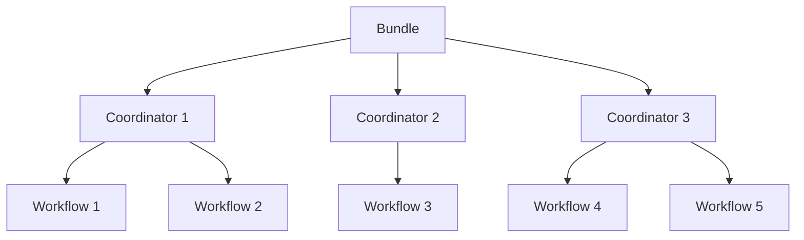

# Oozie Bundle原理与代码实例讲解

## 1.背景介绍

在大数据时代,数据处理工作日益复杂,往往需要多个作业协同工作才能完成一个完整的数据处理流程。Apache Oozie作为一种工作流调度引擎,可以有效管理这些复杂的数据处理作业。Oozie Bundle是Oozie工作流调度的一个重要概念,它允许将多个Oozie协调器作业组合在一起,并有条件地执行它们。

Oozie Bundle为大数据处理提供了一种强大而灵活的解决方案,可以简化复杂工作流的管理和协调。它支持并行执行、有条件执行、错误处理等高级功能,使得数据处理过程更加高效和可靠。

## 2.核心概念与联系

### 2.1 Oozie工作流

Oozie工作流是Oozie调度的基本单元,由一系列有向无环的动作(Action)组成。每个动作代表一个特定的任务,如Hadoop MapReduce作业、Pig作业、Hive作业等。动作之间存在控制依赖关系,后续动作必须等待前置动作完成才能执行。

### 2.2 Oozie协调器

Oozie协调器用于调度基于时间和数据可用性触发的工作流。它定义了工作流的执行计划,包括开始时间、结束时间、频率等。协调器可以监视数据目录,在满足特定条件时触发工作流执行。

### 2.3 Oozie Bundle

Oozie Bundle将多个协调器作业组合在一起,形成一个更大的处理单元。Bundle中的协调器作业可以并行执行,也可以根据条件有选择地执行。Bundle为复杂的数据处理流程提供了一种高度可配置和可扩展的解决方案。

Bundle、协调器和工作流之间的关系如下所示:



## 3.核心算法原理具体操作步骤

Oozie Bundle的核心算法原理包括以下几个主要步骤:

### 3.1 定义Bundle

首先需要定义Bundle的XML配置文件,指定Bundle中包含的协调器作业及其执行条件。Bundle配置文件的主要元素包括:

- `<bundle-app>`：Bundle应用程序的根元素。
- `<coordinator>`：指定Bundle中包含的协调器作业。
- `<conditions>`：定义协调器作业的执行条件,如并行执行、有条件执行等。

### 3.2 提交Bundle

使用Oozie命令行工具或API将Bundle配置文件提交到Oozie服务器。Oozie会解析Bundle配置,创建相应的作业实例。

### 3.3 Bundle生命周期管理

Oozie会根据Bundle配置中定义的条件,控制协调器作业的执行顺序和条件。Bundle的生命周期包括以下几个主要阶段:

1. **PREP**:准备阶段,Oozie解析Bundle配置并创建协调器作业实例。
2. **BUNDLESTARTED**:Bundle开始执行。
3. **RUNNING**:Bundle正在运行,协调器作业按照配置执行。
4. **SUCCEEDED**:Bundle执行成功,所有协调器作业均成功完成。
5. **KILLED**:Bundle被终止。
6. **FAILED**:Bundle执行失败。

在执行过程中,Oozie会持续监控Bundle的状态,并根据配置的条件控制协调器作业的执行。

### 3.4 错误处理

Oozie Bundle支持多种错误处理策略,包括:

- **重试**:如果协调器作业失败,可以配置重试次数和间隔时间。
- **恢复**:如果协调器作业部分失败,可以从上次检查点恢复执行。
- **终止**:如果协调器作业失败且无法恢复,则终止Bundle执行。

通过合理配置错误处理策略,可以提高Bundle的可靠性和容错能力。

## 4.数学模型和公式详细讲解举例说明

在Oozie Bundle中,协调器作业的执行计划通常由一系列时间和数据条件控制。这些条件可以用数学模型和公式来表示。

### 4.1 时间条件模型

协调器作业的执行时间通常由以下几个参数控制:

- 开始时间 $t_s$
- 结束时间 $t_e$
- 频率 $f$

协调器作业在 $[t_s, t_e]$ 时间范围内,每隔 $f$ 时间执行一次。可以用下面的公式表示:

$$
t_n = t_s + n \times f, \quad n = 0, 1, 2, \ldots, \left\lfloor\frac{t_e - t_s}{f}\right\rfloor
$$

其中 $t_n$ 表示第 $n$ 次执行的时间点。

### 4.2 数据条件模型

协调器作业的执行还可能依赖于数据的可用性。假设有一个输入数据目录 $D$,包含多个数据文件 $\{f_1, f_2, \ldots, f_m\}$。我们可以定义一个数据可用性函数 $A(D, t)$,表示在时间 $t$ 时,目录 $D$ 中可用的数据文件集合。

协调器作业的执行条件可以用下面的公式表示:

$$
E(t) = \begin{cases}
    \text{True}, & \text{if } A(D, t) \supseteq R \\
    \text{False}, & \text{otherwise}
\end{cases}
$$

其中 $R$ 是协调器作业所需的最小数据文件集合。只有当 $A(D, t)$ 包含 $R$ 时,协调器作业才能执行。

通过组合时间条件和数据条件,我们可以精确控制协调器作业的执行时机,从而优化整个数据处理流程。

## 5.项目实践:代码实例和详细解释说明

下面是一个使用Oozie Bundle的实际项目示例,展示了如何定义和运行一个Bundle作业。

### 5.1 定义Bundle

首先,创建一个XML文件`bundle.xml`,定义Bundle配置:

```xml
<bundle-app name="my-bundle-app" xmlns="uri:oozie:bundle:0.2">
  <coordinator>
    <app-path>${nameNode}/user/${user.name}/coordinators/coord1</app-path>
    <configuration>
      <property>
        <name>oozie.coord.application.path</name>
        <value>${nameNode}/user/${user.name}/apps/coord1</value>
      </property>
    </configuration>
  </coordinator>

  <coordinator>
    <app-path>${nameNode}/user/${user.name}/coordinators/coord2</app-path>
    <configuration>
      <property>
        <name>oozie.coord.application.path</name>
        <value>${nameNode}/user/${user.name}/apps/coord2</value>
      </property>
    </configuration>
  </coordinator>

  <conditions>
    <if>
      <and>
        <coord-job-status-eq>SUCCEEDED</coord-job-status-eq>
        <coord-job-status-eq>SUCCEEDED</coord-job-status-eq>
      </and>
      <then>
        <coordinator>
          <app-path>${nameNode}/user/${user.name}/coordinators/coord3</app-path>
          <configuration>
            <property>
              <name>oozie.coord.application.path</name>
              <value>${nameNode}/user/${user.name}/apps/coord3</value>
            </property>
          </configuration>
        </coordinator>
      </then>
    </if>
  </conditions>
</bundle-app>
```

这个Bundle包含三个协调器作业:

- `coord1`和`coord2`并行执行。
- 如果`coord1`和`coord2`都成功执行,则执行`coord3`。

### 5.2 提交Bundle

使用Oozie命令行工具提交Bundle作业:

```bash
oozie job -config ~/bundle.xml -run
```

Oozie会解析Bundle配置,创建相应的协调器作业实例,并执行它们。

### 5.3 监控Bundle执行

可以使用Oozie Web UI或命令行工具查看Bundle的执行状态和日志。例如:

```bash
oozie job -info <bundle-id>
```

这将显示Bundle的详细信息,包括协调器作业的状态、开始时间、结束时间等。

### 5.4 错误处理示例

假设`coord1`执行失败,我们可以配置重试策略:

```xml
<coordinator>
  <app-path>${nameNode}/user/${user.name}/coordinators/coord1</app-path>
  <configuration>
    <property>
      <name>oozie.coord.application.path</name>
      <value>${nameNode}/user/${user.name}/apps/coord1</value>
    </property>
    <property>
      <name>oozie.coord.job.retry.count</name>
      <value>3</value>
    </property>
    <property>
      <name>oozie.coord.job.retry.interval</name>
      <value>1800</value>
    </property>
  </configuration>
</coordinator>
```

这将指示Oozie在`coord1`失败时,每隔30分钟(1800秒)重试一次,最多重试3次。

## 6.实际应用场景

Oozie Bundle在许多大数据处理场景中发挥着重要作用,例如:

### 6.1 ETL流程

ETL(提取、转换、加载)是数据仓库中的一个关键流程。Oozie Bundle可以用于协调ETL流程中的多个步骤,如数据提取、数据清洗、数据加载等。每个步骤可以作为一个协调器作业,Bundle则控制它们的执行顺序和条件。

### 6.2 机器学习流程

在机器学习领域,数据处理和模型训练往往需要多个步骤,如数据收集、数据预处理、特征工程、模型训练、模型评估等。Oozie Bundle可以将这些步骤组织成一个完整的工作流,确保每个步骤按照正确的顺序执行。

### 6.3 数据备份和归档

定期备份和归档数据是大数据系统中的一项重要任务。Oozie Bundle可以用于协调备份和归档流程中的多个步骤,如数据复制、压缩、传输等,并根据条件执行相应的操作。

### 6.4 报告生成

在企业级大数据系统中,定期生成报告是一项常见需求。Oozie Bundle可以协调报告生成流程中的各个步骤,如数据提取、数据处理、报告渲染等,确保报告按时生成并分发给相关人员。

## 7.工具和资源推荐

### 7.1 Oozie Web UI

Oozie Web UI是一个基于Web的图形界面,可以方便地管理和监控Oozie作业。它支持查看作业状态、日志、配置等信息,并提供作业操作功能,如暂停、恢复、终止等。

### 7.2 Oozie命令行工具

Oozie命令行工具提供了一系列命令,用于提交、管理和监控Oozie作业。它支持多种操作,如作业提交、状态查询、日志查看等,是管理Oozie作业的有效方式之一。

### 7.3 Oozie Java API

Oozie提供了一套Java API,允许开发人员在应用程序中直接与Oozie服务器交互。使用Java API,可以编写自定义代码来提交、监控和控制Oozie作业,实现更高级的自动化和集成。

### 7.4 Oozie文档和社区

Apache Oozie项目维护了详细的官方文档,涵盖了安装、配置、使用等多个方面。此外,Oozie还拥有一个活跃的社区,用户可以在邮件列表、论坛等渠道获取帮助和支持。

## 8.总结:未来发展趋势与挑战

### 8.1 发展趋势

#### 8.1.1 云原生支持

随着云计算的不断发展,Oozie需要提供更好的云原生支持,以便在云环境中无缝运行和管理工作流。这可能包括对Kubernetes等容器编排系统的集成,以及对各种云服务的支持。

#### 8.1.2 机器学习工作流

随着机器学习和人工智能的快速发展,Oozie需要提供更好的支持,以协调复杂的机器学习工作流。这可能需要对特定机器学习框架和工具的集成,以及对分布式训练和推理的支持。

#### 8.1.3 可视化和低代码开发

为了降低工作流开发和管理的复杂性,Oozie可能会提供更好的可视化工具和低代码开发环境。这将使非技术人员更容易定义和管理工作流,从而提高生产力。

### 8.2 挑战