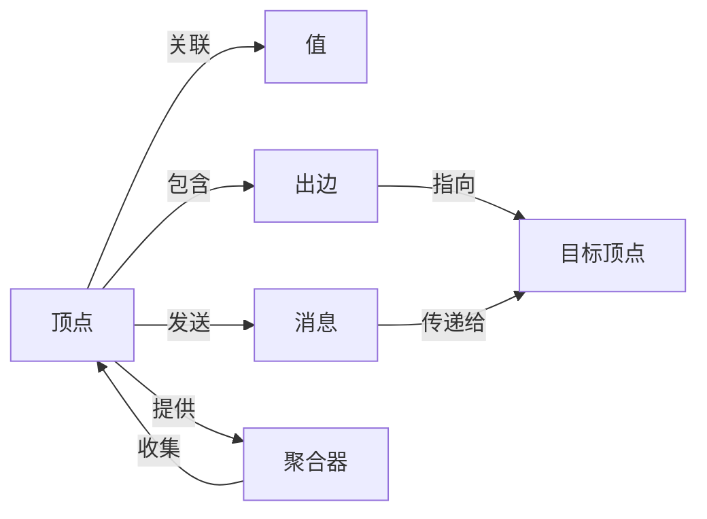

# Pregel原理与代码实例讲解

## 1. 背景介绍
### 1.1 图计算的重要性
在现代大数据时代,图计算扮演着越来越重要的角色。从社交网络到推荐系统,从金融风控到生物信息学,图数据无处不在。高效地处理和分析海量图数据,成为了众多行业和领域的迫切需求。

### 1.2 图计算框架的发展历程
为了应对图计算的挑战,学术界和工业界都投入了大量精力,研发出一系列图计算框架。其中比较著名的有Google的Pregel、Apache Giraph、GraphLab、PowerGraph等。这些框架为大规模图计算提供了强大的支撑。

### 1.3 Pregel的诞生与影响力
2010年,Google发表了一篇论文《Pregel: A System for Large-Scale Graph Processing》,正式提出了Pregel模型。Pregel是一个专门为大规模图计算设计的分布式计算框架,以其简洁高效的编程模型和优异的性能,迅速成为学术界和工业界的研究热点。Pregel启发了一大批图计算框架的设计与实现,对图计算领域产生了深远影响。

## 2. 核心概念与联系
### 2.1 顶点(Vertex)
在Pregel中,图被建模为由顶点(Vertex)和有向边(Edge)组成。每个顶点包含唯一的id、状态(active/inactive)、关联的值以及出边(outgoing edges)。顶点是Pregel编程的基本单元,用户通过定义顶点类来实现图算法。

### 2.2 边(Edge)
边代表顶点之间的关系,在Pregel中是有向的。每条边包含源顶点id、目标顶点id和可选的边值。边决定了消息在顶点之间的传递方向和内容。

### 2.3 消息(Message)
消息是顶点之间通信的基本方式。在每个迭代(superstep)中,活跃(active)的顶点可以向其他顶点发送消息。消息包含目标顶点id和消息内容。Pregel运行时负责在迭代之间传递消息。

### 2.4 迭代(Superstep)
Pregel采用批同步并行(Bulk Synchronous Parallel, BSP)模型,将计算过程组织为一系列迭代(superstep)。在每个迭代中,所有活跃顶点并行执行用户定义的计算逻辑,可以修改自身状态、发送消息给其他顶点。当一个迭代中所有顶点都处于非活跃状态时,计算终止。

### 2.5 聚合器(Aggregator)
聚合器提供了一种在迭代间全局通信的机制。每个顶点可以向聚合器提供值,Pregel会自动在所有顶点和所有计算节点上对这些值进行聚合(如求和、求最大值等),供下一个迭代使用。聚合器简化了全局状态的收集和共享。

### 2.6 拓扑结构
下图展示了Pregel核心概念之间的关系:



## 3. 核心算法原理与具体操作步骤
### 3.1 顶点计算
Pregel的核心是顶点计算。用户通过继承Vertex类并重写compute方法来定义顶点的计算逻辑。典型的compute方法包含以下步骤:

1. 处理接收到的消息,更新顶点状态
2. 根据顶点状态和算法需求,执行计算
3. 将计算结果发送给其他顶点或写回顶点状态
4. 决定顶点的活跃状态(是否参与下一轮迭代)

### 3.2 消息传递
消息传递是顶点之间通信的关键。在compute方法中,顶点可以使用sendMessageTo方法向其他顶点发送消息。Pregel框架负责在迭代之间传递消息,确保每个顶点在下一轮迭代开始时能收到发给它的消息。

### 3.3 迭代同步
Pregel采用BSP模型,将计算划分为一系列迭代(superstep)。每个迭代包含如下步骤:

1. 所有活跃顶点并行执行compute方法
2. Pregel框架传递消息
3. 所有顶点同步,进入下一轮迭代

当没有活跃顶点时,计算自动终止。这种同步迭代的方式简化了并行编程,避免了复杂的消息传递和同步控制。

### 3.4 全局聚合
Pregel提供了聚合器(Aggregator)机制来实现全局通信。聚合器的工作流程如下:

1. 在每个迭代中,顶点通过aggregate方法向聚合器提供值
2. Pregel框架自动跨所有计算节点对聚合器的值进行归约
3. 归约后的全局结果可在下一轮迭代的compute方法中通过getAggregatedValue获取

聚合器大大简化了全局状态的收集和共享,使得实现诸如全局统计、终止条件判断等任务变得更加容易。

## 4. 数学模型和公式详解
### 4.1 图的数学表示
Pregel采用了经典的图论数学模型。一个图$G$可以表示为二元组:
$$G = (V, E)$$
其中$V$表示顶点集合,$E$表示有向边集合。对于边$(u, v) \in E$,$u$称为源顶点,$v$称为目标顶点。

### 4.2 顶点状态转移
假设第$i$个迭代时,顶点$v$的状态为$S_v^{(i)}$,接收到的消息集合为$M_v^{(i)}$。那么顶点$v$在第$i+1$个迭代的状态转移可以表示为:
$$S_v^{(i+1)} = compute(S_v^{(i)}, M_v^{(i)})$$

其中$compute$函数由用户定义,根据当前状态和收到的消息,计算出新的顶点状态。

### 4.3 消息传递
在第$i$个迭代中,如果顶点$u$需要给顶点$v$发送消息$m$,可以表示为:
$$(u, v, m) \in E_m^{(i)}$$

其中$E_m^{(i)}$为第$i$个迭代的消息边集合。Pregel框架负责将这些消息传递给目标顶点,即:
$$M_v^{(i+1)} = \{m | (u, v, m) \in E_m^{(i)}\}$$

### 4.4 全局聚合
设$f$为用户定义的聚合函数,在第$i$个迭代中,顶点$v$向聚合器提供的值为$a_v^{(i)}$。则第$i$个迭代的全局聚合结果$A^{(i)}$为:
$$A^{(i)} = f(\{a_v^{(i)} | v \in V\})$$

顶点可以在第$i+1$个迭代中获取并使用$A^{(i)}$的值。

## 5. 项目实践:代码实例与详解
下面以单源最短路径(Single Source Shortest Path, SSSP)算法为例,展示如何使用Pregel实现。

### 5.1 顶点类定义
```java
public class SSSPVertex extends Vertex<Long, Integer, Integer> {
    @Override
    public void compute(Iterable<Integer> messages) {
        // 初始化最短距离
        if (getSuperstep() == 0) {
            if (getId().equals(sourceId)) {
                setValue(0);
            } else {
                setValue(Integer.MAX_VALUE);
            }
        }
        
        // 更新最短距离
        int minDist = getValue();
        for (int msg : messages) {
            minDist = Math.min(minDist, msg);
        }
        if (minDist < getValue()) {
            setValue(minDist);
            // 将新距离发送给邻居顶点
            for (Edge<Long, Integer> edge : getEdges()) {
                sendMessage(edge.getTargetVertexId(), minDist + edge.getValue());
            }
        }
        
        // 如果距离无变化,则不再参与后续计算
        if (minDist == getValue()) {
            voteToHalt();
        }
    }
}
```

### 5.2 代码解析
- compute方法接收上一轮迭代发送给当前顶点的消息
- 第0轮迭代时,初始化源顶点距离为0,其他顶点距离为无穷大
- 遍历收到的消息,更新自身距离为当前距离和消息值中的最小值
- 如果距离有更新,将新距离加上边权重发送给所有邻居顶点
- 如果距离无变化,调用voteToHalt方法,不再参与后续计算

### 5.3 任务提交
```java
public class SSSPJob {
    public static void main(String[] args) throws Exception {
        // 配置Pregel作业
        PregelJob job = new PregelJob(SSSPVertex.class.getName());
        job.setVertexInputFormatClass(TextVertexInputFormat.class);
        job.setVertexOutputFormatClass(TextVertexOutputFormat.class);
        TextVertexInputFormat.addVertexInput(job, new Path(inputPath));
        TextVertexOutputFormat.setOutputPath(job, new Path(outputPath));
        
        // 设置源顶点ID
        job.getConfiguration().setLong(SSSPVertex.SOURCE_ID, sourceId);
        
        // 提交作业并等待完成
        job.run(true);
    }
}
```

### 5.4 代码解析
- 创建PregelJob对象,指定顶点类
- 设置作业的输入输出格式和路径
- 通过配置项传递源顶点ID给顶点类
- 提交作业并等待完成

## 6. 实际应用场景
Pregel及其变种被广泛应用于各种实际场景中,下面列举几个典型应用:

### 6.1 社交网络分析
利用Pregel可以高效实现社交网络中的好友推荐、社区发现、影响力分析等任务。例如,Twitter利用Pregel进行follower推荐,显著提升了推荐质量和效率。

### 6.2 网页排序
Google利用Pregel实现了著名的PageRank算法,用于评估网页的重要性和权威性。Pregel让PageRank的计算速度得到大幅提升,支撑了万亿规模网页的实时排序。

### 6.3 交通路径规划
Pregel可用于计算交通网络中的最短路径、最小生成树等,为实时路径规划和导航提供高性能的后端支持。例如,某知名地图服务商利用Pregel优化了路径计算,使查询响应时间缩短了10倍。

### 6.4 金融风险分析
在金融领域,Pregel被用于评估金融网络中的系统性风险、预测客户违约概率等。某大型银行利用Pregel构建了客户关系网络模型,大幅提升了信贷风险的预测准确率。

## 7. 工具和资源推荐
### 7.1 开源实现
- Apache Giraph: 基于Hadoop的开源Pregel实现,拥有活跃的社区和广泛的应用。
- GPS: 斯坦福大学开发的Pregel实现,支持容错、动态负载均衡等特性。
- Pregel+: 香港科技大学开源的Pregel增强实现,提供了同步/异步计算、消息合并等优化机制。

### 7.2 论文资源
- Pregel: A System for Large-Scale Graph Processing
- Distributed GraphLab: A Framework for Machine Learning and Data Mining in the Cloud
- GoFFish: A Sub-Graph Centric Framework for Large-Scale Graph Analytics

### 7.3 学习资料
- 《分布式图计算:原理、算法与实践》
- Coursera公开课:《Cloud Computing Concepts》
- 斯坦福大学公开课:《Mining Massive Datasets》

## 8. 总结:未来发展趋势与挑战
### 8.1 异构计算支持
未来Pregel框架将进一步拥抱异构计算,充分利用CPU、GPU、FPGA等不同处理器的优势,应对日益增长的图计算需求。异构Pregel将成为主流趋势。

### 8.2 流式图计算
面对实时性要求高的场景,支持流式计算的Pregel变种(例如Differential Dataflow)将得到更多关注。流式Pregel能够在数据到达时立即处理,大幅提升图分析的实时性。 

### 8.3 机器学习集成
Pregel与机器学习的结合将释放更大潜力。一方面,Pregel可作为高效的图嵌入和特征提取工具,为图神经网络等模型提供输