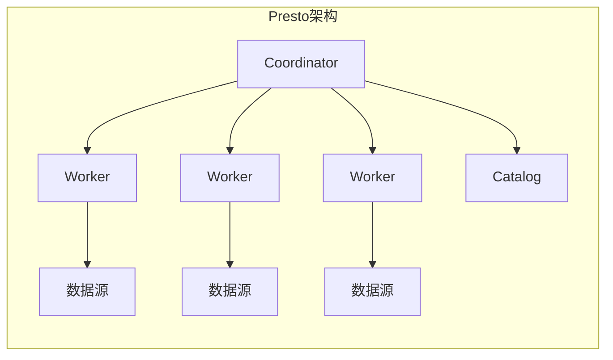
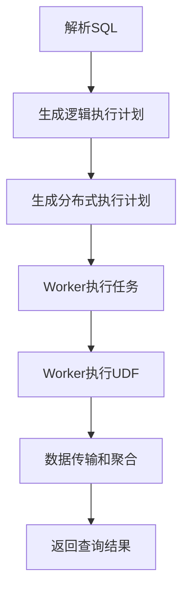

# Presto UDF原理与代码实例讲解

## 1.背景介绍

在现代数据处理和分析领域,Presto已经成为一个广泛使用的开源分布式SQL查询引擎。它被设计用于交互式分析查询,能够快速高效地处理大规模数据集。作为一个分析型查询引擎,Presto的核心目标是提供低延迟的交互式查询响应,支持标准的ANSI SQL语法,并具有高度的可扩展性和容错能力。

Presto的查询引擎本身提供了丰富的内置函数,涵盖了常见的数学、字符串、日期时间等操作。但在实际应用场景中,往往需要自定义函数来满足特定的业务需求。用户定义函数(User-Defined Function,简称UDF)就是为了解决这一需求而提出的扩展机制。通过UDF,开发人员可以使用Java、Scala等语言编写自定义代码,将其打包并部署到Presto集群中,在SQL查询中像调用内置函数一样使用自定义函数。

## 2.核心概念与联系

在探讨Presto UDF的具体实现之前,我们需要先了解一些核心概念:

### 2.1 Presto架构概览

Presto采用主从(Master/Worker)架构,由以下几个主要组件构成:



- **Coordinator(协调器)**: 负责解析SQL语句,生成分布式执行计划,协调和管理查询的整个生命周期。
- **Worker(工作节点)**: 执行实际的数据处理和计算任务,将中间结果传递给其他Worker或Coordinator。
- **Catalog(目录服务)**: 管理数据源元数据,如表、视图等定义信息。
- **数据源**: Presto可以连接各种数据源,如Hive、MySQL、Kafka等,并通过Connector插件访问其中的数据。

### 2.2 Presto插件体系

Presto的可扩展性主要来自于其插件体系。通过插件,Presto可以与各种数据源集成,支持自定义函数、类型、优化器规则等功能扩展。Presto中主要有以下几类插件:

- **Connector插件**: 用于连接和访问外部数据源,如Hive、MySQL、Kafka等。
- **函数名称空间插件(Function Namespace)**: 定义函数名称空间,用于组织和管理函数。
- **函数插件(Function)**: 实现自定义函数的逻辑。
- **类型插件(Type)**: 定义自定义数据类型。
- **密码管理插件(Password Manager)**: 管理访问数据源的凭据。
- **事件监听器插件(Event Listener)**: 监听和处理Presto的事件。

其中,**函数插件**正是实现UDF的关键所在。

## 3.核心算法原理具体操作步骤  

### 3.1 UDF执行流程

当Presto执行涉及UDF的SQL查询时,会经历以下几个主要步骤:



1. **解析SQL**: Coordinator接收SQL查询,并使用内置的SQL解析器将其解析为抽象语法树(AST)。
2. **生成逻辑执行计划**: 基于AST,Coordinator生成逻辑执行计划,其中包括对UDF的引用。
3. **生成分布式执行计划**: 将逻辑执行计划转换为分布式执行计划,分发给各个Worker节点。
4. **Worker执行任务**: Worker节点执行分配的任务,包括调用UDF进行计算。
5. **Worker执行UDF**: Worker加载并执行UDF代码,对数据进行转换或计算。
6. **数据传输和聚合**: Worker将中间结果传输给其他Worker或Coordinator进行聚合。
7. **返回查询结果**: Coordinator汇总所有结果,并将最终结果返回给客户端。

### 3.2 UDF代码执行

在Worker节点上,UDF代码的执行过程如下:

1. **加载UDF代码**: Worker从部署目录加载UDF的JAR包,并使用独立的类加载器实例化UDF类。
2. **实例化UDF对象**: 根据UDF的函数签名,Worker创建一个或多个UDF对象实例。
3. **调用UDF方法**: 在处理每一行数据时,Worker调用UDF对象的`eval`方法,传入输入参数,并获取返回结果。
4. **内存管理**: Worker管理UDF对象的内存使用,在查询完成后释放相关资源。

### 3.3 UDF开发流程

要开发一个新的UDF,需要遵循以下步骤:

1. **定义函数签名**: 确定函数名称、参数类型和返回类型。
2. **实现UDF逻辑**: 编写Java或Scala代码,实现UDF的核心逻辑。
3. **编译打包**: 将UDF代码编译成JAR包。
4. **部署UDF**: 将JAR包复制到Presto Worker节点的插件目录。
5. **创建函数**: 在Presto中创建函数定义,关联UDF代码。
6. **使用UDF**: 在SQL查询中像调用内置函数一样使用自定义函数。

## 4.数学模型和公式详细讲解举例说明

在某些情况下,UDF可能需要执行复杂的数学计算或应用数学模型。以下是一个示例,展示如何在UDF中使用数学公式和模型。

假设我们需要实现一个函数,用于计算给定数据集的标准差。标准差是描述数据分散程度的重要统计量,其计算公式如下:

$$\sigma = \sqrt{\frac{1}{N}\sum_{i=1}^{N}(x_i - \mu)^2}$$

其中:
- $\sigma$ 表示标准差
- $N$ 表示数据集大小
- $x_i$ 表示数据集中的第i个数值
- $\mu$ 表示数据集的均值,计算公式为 $\mu = \frac{1}{N}\sum_{i=1}^{N}x_i$

我们可以按照以下步骤实现一个名为`stddev`的UDF:

1. 定义函数签名:

```sql
CREATE FUNCTION stddev
(
    data ARRAY<DOUBLE>
)
RETURNS DOUBLE
COMMENT 'Calculates the standard deviation of a dataset'
```

2. 实现UDF逻辑:

```java
import io.airlift.slice.Slice;
import io.prestosql.spi.function.Description;
import io.prestosql.spi.function.ScalarFunction;
import io.prestosql.spi.function.SqlType;
import io.prestosql.spi.type.StandardTypes;

import static java.lang.Math.sqrt;

public class StdDevFunction
{
    @ScalarFunction("stddev")
    @Description("Calculates the standard deviation of a dataset")
    @SqlType(StandardTypes.DOUBLE)
    public static double stddev(@SqlType("array(double)") Slice slice)
    {
        double sum = 0.0;
        double squareSum = 0.0;
        int count = 0;

        for (double value : slice.getValues()) {
            count++;
            double delta = value - sum / count;
            sum += delta;
            squareSum += delta * (value - sum / count);
        }

        return sqrt(squareSum / count);
    }
}
```

在上述代码中,我们使用了一种高效的单遍历算法来计算标准差,避免了两次遍历数据集。该算法的核心思想是在遍历数据集的同时,逐步更新均值和平方差的累加和。最终,标准差可以通过平方差的累加和除以数据集大小,再开平方得到。

该UDF接受一个`ARRAY<DOUBLE>`类型的参数,即一个双精度浮点数数组,表示待计算标准差的数据集。在函数体内,我们首先初始化几个变量:

- `sum`: 数据集元素的累加和,用于计算均值。
- `squareSum`: 数据与均值差值的平方和的累加和,用于计算平方差。
- `count`: 数据集元素个数。

然后,我们遍历输入数组,对每个元素执行以下操作:

1. 增加`count`计数器。
2. 计算当前元素与当前均值的差值`delta`。
3. 更新`sum`为新的累加和。
4. 计算`delta`与新均值的差值,并将其平方后累加到`squareSum`中。

遍历完成后,我们将`squareSum`除以`count`得到平方差,再对其开平方,即可得到标准差的最终结果。

使用该UDF,我们可以在SQL查询中方便地计算数据集的标准差,例如:

```sql
SELECT stddev(ARRAY[1.0, 2.0, 3.0, 4.0, 5.0]);
-- 输出: 1.4142135623730951
```

## 5.项目实践:代码实例和详细解释说明

为了更好地理解Presto UDF的实现和使用,我们将通过一个实际项目案例来进行讲解。假设我们需要开发一个UDF,用于计算两个字符串之间的编辑距离(Levenshtein Distance)。编辑距离是一种衡量两个字符串相似程度的指标,广泛应用于拼写检查、基因序列比对等领域。

### 5.1 定义函数签名

首先,我们需要定义UDF的函数签名,包括函数名称、参数类型和返回类型。在Presto中,我们可以使用SQL语句来创建函数定义:

```sql
CREATE FUNCTION levenshtein_distance
(
    str1 VARCHAR,
    str2 VARCHAR
)
RETURNS BIGINT
COMMENT 'Calculates the Levenshtein distance between two strings'
```

这里,我们定义了一个名为`levenshtein_distance`的函数,接受两个`VARCHAR`类型的字符串参数,并返回一个`BIGINT`类型的整数,表示两个字符串之间的编辑距离。

### 5.2 实现UDF逻辑

接下来,我们需要编写Java代码来实现UDF的核心逻辑。Presto UDF需要继承`ScalarFunction`接口,并使用相应的注解进行配置。

```java
import io.airlift.slice.Slice;
import io.prestosql.spi.function.Description;
import io.prestosql.spi.function.ScalarFunction;
import io.prestosql.spi.function.SqlType;
import io.prestosql.spi.type.StandardTypes;

public class LevenshteinDistance
{
    private static int minimum(int a, int b, int c)
    {
        return Math.min(Math.min(a, b), c);
    }

    @ScalarFunction("levenshtein_distance")
    @Description("Calculates the Levenshtein distance between two strings")
    @SqlType(StandardTypes.BIGINT)
    public static long levenshteinDistance(
            @SqlType(StandardTypes.VARCHAR) Slice str1,
            @SqlType(StandardTypes.VARCHAR) Slice str2)
    {
        int[][] distance = new int[str1.length() + 1][str2.length() + 1];

        for (int i = 0; i <= str1.length(); i++) {
            distance[i][0] = i;
        }

        for (int j = 0; j <= str2.length(); j++) {
            distance[0][j] = j;
        }

        for (int i = 1; i <= str1.length(); i++) {
            for (int j = 1; j <= str2.length(); j++) {
                distance[i][j] = minimum(
                        distance[i - 1][j] + 1,
                        distance[i][j - 1] + 1,
                        distance[i - 1][j - 1] + ((str1.getByte(i - 1) == str2.getByte(j - 1)) ? 0 : 1));
            }
        }

        return distance[str1.length()][str2.length()];
    }
}
```

在上述代码中,我们实现了一个名为`levenshteinDistance`的静态方法,用于计算两个字符串之间的编辑距离。该方法使用了经典的动态规划算法,通过构建一个二维数组来记录两个字符串的部分编辑距离,从而求解最终的编辑距离。

算法的核心思想是,对于两个字符串`str1`和`str2`,我们构建一个`(len(str1) + 1) x (len(str2) + 1)`的二维数组`distance`。其中,`distance[i][j]`表示`str1`的前`i`个字符与`str2`的前`j`个字符之间的编辑距离。

我们首先初始化边界条件:

- `distance[i][0] = i`表示将一个空字符串转换为`str1`的前`i`