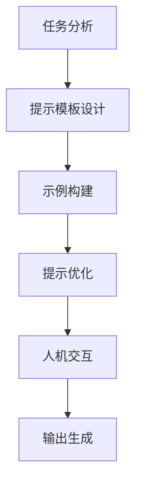

# PromptEngineering实战：文本生成任务

## 1.背景介绍

在当今的人工智能时代,大型语言模型(LLM)已经成为各大科技公司和研究机构的核心技术之一。这些模型通过从海量文本数据中学习,获得了对自然语言的深刻理解和生成能力。然而,简单地将文本输入给LLM并不足以充分发挥其潜力。为了真正利用LLM的强大功能,我们需要精心设计提示(Prompt),这就是所谓的Prompt Engineering。

Prompt Engineering是一门新兴的学科,旨在探索如何通过巧妙构建提示来指导LLM完成特定任务。良好的提示设计可以显著提高LLM的性能,使其生成更加准确、相关和上下文一致的输出。文本生成是Prompt Engineering的一个重要应用领域,包括内容创作、问答系统、机器翻译等多种场景。

## 2.核心概念与联系

### 2.1 提示(Prompt)

提示是输入给LLM的一段指令性文本,用于指导模型生成所需的输出。提示可以包含任务描述、上下文信息、示例输入输出对等内容。高质量的提示对于获得理想的生成结果至关重要。

### 2.2 提示工程(Prompt Engineering)

提示工程是一个系统性的过程,包括分析任务需求、设计提示模板、优化提示内容等步骤。它结合了自然语言处理、人机交互设计等多个领域的知识,旨在构建高效的人机协作模式。

### 2.3 文本生成任务

文本生成是指根据给定的提示或上下文,生成连贯、流畅、符合语义逻辑的自然语言文本。常见的文本生成任务包括新闻报道、故事创作、对话生成、文案写作等。

## 3.核心算法原理具体操作步骤

Prompt Engineering的核心算法原理可以概括为以下几个步骤:



### 3.1 任务分析

首先需要明确文本生成任务的目标、约束条件和评估指标。例如,对于新闻报道任务,目标可能是生成客观中立、信息丰富的报道;约束条件可能包括字数限制、事实准确性等;评估指标可能是相关性分数、语法流畅度等。

### 3.2 提示模板设计

根据任务需求,设计合适的提示模板。模板通常包含任务说明、上下文信息和示例输入输出对。示例对可以直接给出,也可以留空让模型自行生成。

### 3.3 示例构建

为提示模板中的示例输入输出对提供高质量的内容。示例应该覆盖任务的各种情况,并且输出部分要符合预期目标。优秀的示例对可以大幅提高模型的学习效果。

### 3.4 提示优化

通过迭代优化提示的内容和格式,以获得更好的生成效果。优化方法包括但不限于:

- 修改提示模板结构
- 增减示例数量
- 调整示例难度
- 添加约束条件
- 引入规则校正

### 3.5 人机交互

LLM生成的初始输出通常需要人工审查和修正。人机交互环节允许人类对模型输出提出反馈,并将反馈结果输入回模型,指导模型进行进一步的生成和优化。

### 3.6 输出生成

经过多轮迭代,模型最终生成符合要求的文本输出。输出可以作为最终结果使用,也可以作为人工创作的辅助材料。

## 4.数学模型和公式详细讲解举例说明

在Prompt Engineering中,数学模型和公式主要用于量化评估生成文本的质量,并将评估结果反馈到提示优化的过程中。常用的评估指标包括:

### 4.1 困惑度(Perplexity)

困惑度是衡量语言模型在给定语料上的预测性能的指标。其数学定义为:

$$\text{Perplexity}(W) = \sqrt[N]{\prod_{i=1}^{N}\frac{1}{P(w_i|w_1,...,w_{i-1})}}$$

其中$W=w_1,w_2,...,w_N$是长度为$N$的词序列,$P(w_i|w_1,...,w_{i-1})$是模型给出的生成第$i$个词$w_i$的条件概率。

困惑度的值越小,表明模型对语料的建模能力越强。在Prompt Engineering中,我们可以将生成文本的困惑度作为优化目标之一,不断调整提示以降低困惑度。

### 4.2 BLEU分数

BLEU(Bilingual Evaluation Understudy)是机器翻译领域中常用的自动评估指标,也可应用于文本生成任务。BLEU分数通过计算生成文本与参考文本之间的$n$元语言模型的重叠程度来衡量生成质量。具体计算公式为:

$$\text{BLEU} = BP \cdot \exp\left(\sum_{n=1}^N w_n\log p_n\right)$$

其中:
- $BP$是brevity penalty,用于惩罚过短的生成文本
- $N$是选取的最大$n$元语言模型的$n$值
- $w_n$是每个$n$元语言模型的权重
- $p_n$是生成文本与参考文本在$n$元语言模型上的精确度(precision)

BLEU分数在0到1之间,值越高表示生成质量越好。在Prompt Engineering中,我们可以将BLEU分数作为评估指标之一,并在优化过程中努力提高该分数。

### 4.3 其他指标

除了困惑度和BLEU分数外,Prompt Engineering中还可以使用其他评估指标,如:

- Rouge分数:基于n-gram的文本摘要评估指标
- BERTScore:利用预训练语言模型计算句子级别的相似性分数
- 人工评分:由人类专家对生成文本进行主观评分

不同的任务场景可以选择合适的评估指标,并将其纳入到提示优化的目标函数中。

## 5.项目实践:代码实例和详细解释说明

为了更好地理解Prompt Engineering在文本生成任务中的应用,我们将通过一个实际项目案例来进行说明。该项目旨在生成高质量的新闻报道摘要。

我们将使用HuggingFace的Transformers库和OpenAI的GPT-2模型。以下是项目的主要代码流程:

### 5.1 导入必要的库

```python
from transformers import GPT2LMHeadModel, GPT2Tokenizer
```

### 5.2 加载预训练模型和分词器

```python
model = GPT2LMHeadModel.from_pretrained('gpt2')
tokenizer = GPT2Tokenizer.from_pretrained('gpt2')
```

### 5.3 定义提示模板和示例

```python
prompt_template = """
### 新闻标题: {news_title}

### 新闻正文:
{news_body}

### 新闻摘要:
"""

examples = [
    {
        "news_title": "特斯拉首款电动皮卡Cybertruck正式亮相",
        "news_body": "......" # 新闻正文内容
        "target_summary": "特斯拉在洛杉矶设计工作室举行的一场活动上,正式推出了其首款电动皮卡Cybertruck。这款未来感十足的皮卡采用不锈钢车身,具有出色的耐用性和强度。Cybertruck的入门版续航里程可达400多公里,而顶配的三电机版本则可达800多公里。" 
    },
    # 其他示例...
]
```

### 5.4 构建提示

```python
def build_prompt(example):
    prompt = prompt_template.format(
        news_title=example["news_title"],
        news_body=example["news_body"]
    )
    return prompt

prompts = [build_prompt(ex) for ex in examples]
```

### 5.5 生成摘要

```python
import torch

for prompt in prompts:
    input_ids = tokenizer.encode(prompt, return_tensors='pt')
    output = model.generate(input_ids, max_length=150, num_beams=5, early_stopping=True)
    summary = tokenizer.decode(output[0], skip_special_tokens=True)
    print(f"Generated Summary: {summary}")
```

上述代码将为每个示例新闻生成一个摘要。您可以根据需要对提示模板、示例内容和生成参数进行调整,以优化摘要质量。

### 5.6 评估和优化

评估生成摘要的质量,例如使用ROUGE分数:

```python
from rouge import Rouge

rouge = Rouge()

for ex, summary in zip(examples, summaries):
    target = ex["target_summary"]
    score = rouge.get_scores(summary, target)
    print(f"ROUGE Score: {score}")
```

根据评估结果,您可以对提示模板、示例内容等进行优化,以提高生成质量。例如,增加更多覆盖不同情况的示例,或者在提示中添加更多约束条件等。

通过不断迭代优化,您可以获得更加准确、流畅、信息丰富的新闻报道摘要。

## 6.实际应用场景

Prompt Engineering在文本生成领域有着广泛的应用前景,包括但不限于:

### 6.1 内容创作

利用Prompt Engineering技术,我们可以为LLM提供高质量的提示,从而生成优秀的文学作品、新闻报道、营销文案等内容。这不仅可以提高内容创作的效率,还能为创作者提供灵感和素材。

### 6.2 对话系统

在构建对话系统时,Prompt Engineering可以用于设计上下文相关的提示,指导LLM生成自然、连贯的对话响应。这对于提升对话系统的交互体验至关重要。

### 6.3 机器翻译

Prompt Engineering在机器翻译领域也有重要应用。通过精心设计的提示,我们可以指导LLM生成更加准确、地道的翻译结果,同时考虑语义、语境和风格等多个方面。

### 6.4 知识提取

LLM不仅能生成文本,还可以从文本中提取关键信息和知识。Prompt Engineering可以用于设计提取任务的提示,从而获得高质量的知识图谱、实体关系等结构化数据。

### 6.5 其他应用

除了上述场景外,Prompt Engineering还可以应用于文本摘要、问答系统、数据增广等多个领域,为人工智能系统提供强大的文本生成能力。

## 7.工具和资源推荐

为了更好地学习和实践Prompt Engineering,以下是一些推荐的工具和资源:

### 7.1 HuggingFace Transformers

HuggingFace Transformers是一个流行的自然语言处理库,提供了各种预训练语言模型和相关工具。它支持多种编程语言,并有丰富的文档和示例代码。

### 7.2 OpenAI GPT系列模型

OpenAI开发的GPT系列模型是目前最先进的大型语言模型之一。GPT-2和GPT-3在多个文本生成任务上表现出色,是Prompt Engineering研究的理想选择。

### 7.3 Anthropic Constitutional AI

Anthropic是一家专注于Prompt Engineering的初创公司,他们开发了Constitutional AI框架,旨在通过提示设计来控制和调节LLM的行为。该框架提供了丰富的工具和资源。

### 7.4 Prompt Engineering指南

一些公司和研究机构发布了Prompt Engineering的最佳实践指南,如OpenAI的"Prompt Engineering Guide"和Anthropic的"Constitutional AI: Harmless Open-ended Conversations"。这些指南对于入门和深入学习Prompt Engineering都很有帮助。

### 7.5 在线社区和论坛

一些在线社区和论坛,如HuggingFace论坛、Reddit的r/PromptEngineering等,聚集了Prompt Engineering的从业者和爱好者。在这些平台上,您可以获取最新资讯、分享经验和解决疑难。

## 8.总结:未来发展趋势与挑战

Prompt Engineering作为一门新兴学科,未来的发展前景广阔。随着LLM技术的不断进步,Prompt Engineering将在更多领域发挥关键作用。同时,它也面临着一些挑战和问题:

### 8.1 提示质量评估

目前缺乏统一的标准来评估提示的质量。我们需要建立更加完善的评估体系,将多种指标综合考虑,以指导提示的优化过程。

### 8.2 提示安全性