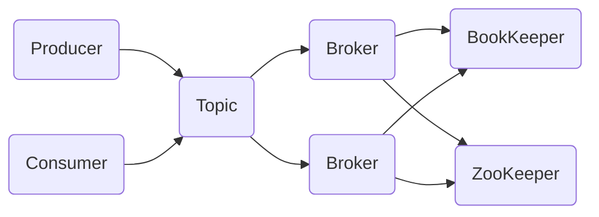

# Pulsar跨云及混合云消息队列方案

## 1. 背景介绍
### 1.1 消息队列的重要性
在现代分布式系统中,消息队列扮演着至关重要的角色。它能够实现系统解耦、异步通信、流量削峰、数据持久化等关键功能,提升系统的可扩展性、可靠性和性能。

### 1.2 跨云和混合云环境下的挑战
随着云计算的快速发展,越来越多的企业开始采用跨云和混合云的部署方式。在这种复杂的环境下,如何构建一个高可用、高性能、安全可靠的消息队列系统成为了一大挑战。不同云平台之间的网络延迟、数据同步、安全策略等差异,给消息队列的设计和实现带来了诸多难题。

### 1.3 Apache Pulsar 的优势
Apache Pulsar 是一个云原生、高性能、多租户的分布式消息流平台。相比于传统的消息队列如 Kafka、RabbitMQ 等,Pulsar 在跨云和混合云场景下具有独特的优势:
- 原生支持跨地域、跨云的 Geo 复制,保证数据的高可用和一致性
- 采用计算存储分离架构,支持独立扩容,提升系统灵活性
- 内置分层存储机制,可将数据从内存、本地磁盘、对象存储等多级存储自动流转
- 支持多种语言的 SDK,开发集成更加便捷

## 2. 核心概念与联系
### 2.1 Producer 生产者
生产者是消息的发送方,负责将消息发布到指定的 Topic 主题。一个 Topic 可以有多个生产者同时发送消息。

### 2.2 Consumer 消费者 
消费者是消息的接收方,通过订阅 Topic 来消费其中的消息。支持 Exclusive、Failover、Shared 和 Key_Shared 四种订阅模式。

### 2.3 Topic 主题
Topic 是发布和订阅消息的中心概念,生产者发送到主题,消费者从主题订阅。Topic 支持多种配置如分区、TTL、Schema等。

### 2.4 Broker 服务代理
Broker 是 Pulsar 的核心组件,负责接收和存储消息、处理生产者和消费者的请求。可以部署多个 Broker 组成集群,提供高可用服务。

### 2.5 BookKeeper 存储
BookKeeper 是 Pulsar 的默认存储引擎,采用预写式日志确保数据的持久性和一致性。支持横向扩展,存储容量可弹性伸缩。

### 2.6 ZooKeeper 元数据
ZooKeeper 用于存储 Pulsar 的关键元数据如 Namespace、Tenant、Topic 等,并协调 Broker 之间的状态同步。

### 2.7 概念关系图


## 3. 核心算法原理具体操作步骤
### 3.1 消息发布流程
1. 生产者连接任意 Broker,获取 Topic 的元数据信息
2. 生产者将消息序列化,添加到本地的发送缓冲区
3. 生产者选择 Topic 分区,将消息批量发送给所在的 Broker
4. Broker 接收消息,追加到 BookKeeper 的预写日志
5. Broker 确认消息写入,返回 ack 给生产者

### 3.2 消息订阅流程
1. 消费者连接任意 Broker,获取 Topic 的元数据信息
2. 消费者根据订阅模式,加入或创建消费组
3. 消费组协调分配 Topic 分区,每个消费者负责消费一个或多个分区
4. 消费者定期向 Broker 拉取分区的最新消息
5. 消费者处理消息,更新消费进度,定期向 Broker 发送 ack

### 3.3 Geo 复制原理
1. 配置 Topic 的复制集群和策略,如同步、异步模式
2. 生产者正常发送消息到本地集群
3. 本地 Broker 将消息转发给复制集群的 Broker
4. 复制集群 Broker 将消息持久化到 BookKeeper,并返回 ack
5. 两地消费者可以分别订阅本地 Topic,实现就近消费

## 4. 数学模型和公式详细讲解举例说明
### 4.1 生产者发送吞吐量估算
假设单个生产者的发送缓冲区大小为 $B$,单条消息的平均大小为 $M$,网络带宽为 $N$,则理论最大发送吞吐量 $T_p$ 为:

$$ T_p = \min(\frac{B}{M}, \frac{N}{M}) $$

例如,若 $B=32MB$,$M=1KB$,$N=100MB/s$,则 $T_p = \min(32000, 100000) = 32000$ 条/秒。

### 4.2 消费者消费延迟估算
假设消费者的拉取间隔为 $t$,每次拉取的消息数为 $n$,消息处理耗时为 $m$,则平均消费延迟 $L_c$ 为:

$$ L_c = t + \frac{m \times n}{2} $$

例如,若 $t=100ms$,$n=1000$,$m=1ms$,则 $L_c = 100 + \frac{1 \times 1000}{2} = 600ms$。

### 4.3 Topic 分区数估算
假设 Topic 的目标生产速率为 $R$,单个分区的最大生产速率为 $r$,则需要的最小分区数 $P$ 为:

$$ P = \lceil \frac{R}{r} \rceil $$

例如,若 $R=100000$ 条/秒,$r=5000$ 条/秒,则 $P = \lceil \frac{100000}{5000} \rceil = 20$ 个分区。

## 5. 项目实践：代码实例和详细解释说明
### 5.1 搭建 Pulsar 集群
使用 Docker Compose 可以快速搭建一个单机版的 Pulsar 集群用于开发测试:

```yaml
version: '3'
services:
  zookeeper:
    image: apachepulsar/pulsar:2.8.0
    command: >
      bin/pulsar zookeeper
  bookeeper:
    image: apachepulsar/pulsar:2.8.0  
    command: >
      bin/pulsar bookie
  broker:
    image: apachepulsar/pulsar:2.8.0
    command: >
      bin/pulsar broker
```
执行 `docker-compose up -d` 即可启动 Pulsar 各个组件。

### 5.2 使用 Java 客户端发送消息
```java
PulsarClient client = PulsarClient.builder()
        .serviceUrl("pulsar://localhost:6650")
        .build();
Producer<String> producer = client.newProducer(Schema.STRING)
        .topic("my-topic")
        .create();
for (int i = 0; i < 10; i++) {
    producer.send("my-message-" + i);
}
producer.close();
client.close();
```
以上代码创建了一个 Pulsar 客户端,连接到本地的 Broker,并创建了一个 String 类型的生产者,发送10条消息到 `my-topic` 主题。

### 5.3 使用 Java 客户端消费消息
```java
PulsarClient client = PulsarClient.builder()
        .serviceUrl("pulsar://localhost:6650")
        .build();
Consumer consumer = client.newConsumer()
        .topic("my-topic")
        .subscriptionName("my-subscription")
        .subscribe();
while (true) {
    Message msg = consumer.receive();
    System.out.printf("Message received: %s", new String(msg.getData()));
    consumer.acknowledge(msg);
}
consumer.close();
client.close();
```
以上代码创建了一个 Pulsar 消费者,订阅 `my-topic` 主题,并持续拉取消息进行处理,通过 `acknowledge` 确认消息已消费。

## 6. 实际应用场景
### 6.1 金融行情实时推送
某证券公司需要将交易所的行情数据实时推送给各个业务系统和客户终端,并且保证数据的准确性和时效性。采用 Pulsar 作为消息中间件,交易所的行情源通过生产者角色发送原始数据到 Pulsar,后端各个业务系统通过消费者角色订阅不同 Topic 的行情数据。同时,利用 Pulsar 的 Geo 复制功能,在多个机房间进行数据同步,保证了业务的连续性和数据的一致性。

### 6.2 车联网数据采集与处理
某整车厂商需要从车辆的各个 ECU 采集实时的行驶数据,如车速、油耗、故障码等,并进行大数据分析和远程监控。车载网关通过 MQTT 协议将采集的数据发送到云端的 Pulsar 集群,不同的数据类型对应不同的 Topic。云端的流处理引擎如 Flink、Spark 通过订阅相关 Topic,进行实时的数据清洗、转换和分析,并将结果写回另外的 Topic 供其他应用订阅使用。Pulsar 提供了多语言的 SDK,方便车载终端、云端服务进行灵活的集成。

### 6.3 物联网设备状态同步
某智能家居平台需要实现海量设备的状态数据同步,并支持设备和 App 之间的双向通信。设备通过 MQTT 协议连接到 Pulsar 的 IoT 协议网关,发送状态数据到指定 Topic,App 端可以订阅设备的状态变更。反之,App 也可以发送控制指令到 Topic,设备端通过订阅 Topic 来接收处理。Pulsar 提供了企业级的特性,如多租户隔离、细粒度权限控制等,保障了设备数据的安全性。

## 7. 工具和资源推荐
- [Pulsar 官方网站](https://pulsar.apache.org/) - Pulsar 的官方网站,提供了详尽的文档、教程、博客等资源
- [Pulsar Summit](https://pulsar-summit.org/) - Pulsar 的技术大会,分享业界最佳实践和使用案例
- [Pulsar Manager](https://github.com/apache/pulsar-manager) - Pulsar 的 Web 管理工具,支持集群配置、主题管理、监控告警等
- [Pulsar Flink Connector](https://github.com/streamnative/pulsar-flink) - 将 Pulsar 和 Flink 无缝连接,实现端到端的流处理
- [Pulsar MQTT Proxy](https://github.com/apache/pulsar/tree/master/pulsar-proxy/src/main/java/org/apache/pulsar/proxy/server/plugin/mqtt) - Pulsar 的 MQTT 协议代理,实现物联网设备的接入

## 8. 总结：未来发展趋势与挑战
Pulsar 作为下一代云原生消息流平台,在跨云和混合云环境下具有诸多优势。但同时也有一些挑战需要克服:
- 生态建设有待加强,如何吸引更多开发者加入社区,贡献更多的插件、工具和最佳实践
- 多语言客户端的易用性有待提高,尤其是在弱类型语言中,如何简化 API 设计
- 大规模集群的运维挑战,如何实现集群的自动化运维、问题诊断和性能优化
- 与云平台的进一步集成,如何与各个云厂商的存储、网络实现更紧密的集成

未来,Pulsar 有望在云原生领域占据重要地位,成为连接云边端的统一数据总线,为实时数据处理提供坚实的基础设施。

## 9. 附录：常见问题与解答
### 9.1 Pulsar 与 Kafka 的区别是什么？
相比于 Kafka,Pulsar 的主要优势在于:
- 采用计算存储分离架构,支持独立扩容,更加灵活
- 原生支持跨地域复制,适合跨云场景
- 支持多种存储引擎,如 BookKeeper、S3 等
- 支持多租户和细粒度权限控制,安全性更高

### 9.2 Pulsar 的单个集群可以支持多大规模？
Pulsar 单集群可以支持数千个 Topic,数百万 QPS,数 PB 的存储容量。具体规模取决于机器配置和业务特征,需要进行压测和调优。

### 9.3 Pulsar 如何保证消息的顺序性？
Pulsar 的消息顺序性是以 Topic 分区为粒度的,同一个分区内的消息可以保证有序。生产者可