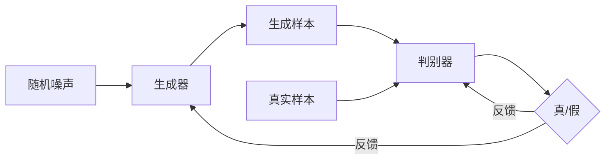

# Python机器学习实战：生成对抗网络(GAN)的原理与应用

## 1. 背景介绍

### 1.1 人工智能与机器学习的发展历程
#### 1.1.1 人工智能的起源与发展
#### 1.1.2 机器学习的兴起
#### 1.1.3 深度学习的崛起

### 1.2 生成对抗网络(GAN)的诞生
#### 1.2.1 Ian Goodfellow的开创性工作
#### 1.2.2 GAN的核心思想
#### 1.2.3 GAN的发展历程

## 2. 核心概念与联系

### 2.1 生成模型与判别模型
#### 2.1.1 生成模型的定义与特点
#### 2.1.2 判别模型的定义与特点 
#### 2.1.3 两种模型的区别与联系

### 2.2 GAN的核心组成部分
#### 2.2.1 生成器(Generator)
#### 2.2.2 判别器(Discriminator)
#### 2.2.3 损失函数(Loss Function)

### 2.3 GAN的训练过程
#### 2.3.1 生成器与判别器的博弈
#### 2.3.2 纳什均衡(Nash Equilibrium)
#### 2.3.3 训练的收敛性与稳定性



## 3. 核心算法原理具体操作步骤

### 3.1 GAN的数学表达
#### 3.1.1 生成器的数学表示
#### 3.1.2 判别器的数学表示
#### 3.1.3 目标函数的定义

### 3.2 GAN的训练算法
#### 3.2.1 生成器的训练
#### 3.2.2 判别器的训练
#### 3.2.3 交替训练的过程

### 3.3 GAN的评估指标
#### 3.3.1 Inception Score
#### 3.3.2 Frechet Inception Distance
#### 3.3.3 其他评估指标

## 4. 数学模型和公式详细讲解举例说明

### 4.1 生成器的数学模型
#### 4.1.1 生成器的结构与参数
#### 4.1.2 生成器的前向传播过程
#### 4.1.3 生成器的损失函数

生成器的目标是最小化以下损失函数：

$$\min_{G} \mathbb{E}_{z \sim p_z(z)}[log(1 - D(G(z)))]$$

其中，$G$表示生成器，$D$表示判别器，$z$是从先验分布$p_z(z)$中采样的随机噪声。

### 4.2 判别器的数学模型
#### 4.2.1 判别器的结构与参数
#### 4.2.2 判别器的前向传播过程
#### 4.2.3 判别器的损失函数

判别器的目标是最大化以下损失函数：

$$\max_{D} \mathbb{E}_{x \sim p_{data}(x)}[logD(x)] + \mathbb{E}_{z \sim p_z(z)}[log(1 - D(G(z)))]$$

其中，$x$表示来自真实数据分布$p_{data}(x)$的样本。

### 4.3 GAN的目标函数
#### 4.3.1 生成器与判别器的博弈
#### 4.3.2 纳什均衡的数学解释
#### 4.3.3 目标函数的优化过程

GAN的整体目标函数可以表示为：

$$\min_{G} \max_{D} V(D, G) = \mathbb{E}_{x \sim p_{data}(x)}[logD(x)] + \mathbb{E}_{z \sim p_z(z)}[log(1 - D(G(z)))]$$

这个目标函数描述了生成器和判别器之间的博弈过程，最终目标是达到纳什均衡。

## 5. 项目实践：代码实例和详细解释说明

### 5.1 环境配置与数据准备
#### 5.1.1 Python环境搭建
#### 5.1.2 TensorFlow/PyTorch等深度学习框架的安装
#### 5.1.3 数据集的选择与预处理

### 5.2 GAN的代码实现
#### 5.2.1 生成器的代码实现
```python
class Generator(nn.Module):
    def __init__(self, latent_dim, img_shape):
        super(Generator, self).__init__()
        self.img_shape = img_shape
        
        def block(in_feat, out_feat, normalize=True):
            layers = [nn.Linear(in_feat, out_feat)]
            if normalize:
                layers.append(nn.BatchNorm1d(out_feat, 0.8))
            layers.append(nn.LeakyReLU(0.2, inplace=True))
            return layers

        self.model = nn.Sequential(
            *block(latent_dim, 128, normalize=False),
            *block(128, 256),
            *block(256, 512),
            *block(512, 1024),
            nn.Linear(1024, int(np.prod(img_shape))),
            nn.Tanh()
        )

    def forward(self, z):
        img = self.model(z)
        img = img.view(img.size(0), *self.img_shape)
        return img
```

#### 5.2.2 判别器的代码实现
```python
class Discriminator(nn.Module):
    def __init__(self, img_shape):
        super(Discriminator, self).__init__()
        self.model = nn.Sequential(
            nn.Linear(int(np.prod(img_shape)), 512),
            nn.LeakyReLU(0.2, inplace=True),
            nn.Linear(512, 256),
            nn.LeakyReLU(0.2, inplace=True),
            nn.Linear(256, 1),
            nn.Sigmoid()
        )

    def forward(self, img):
        img_flat = img.view(img.size(0), -1)
        validity = self.model(img_flat)
        return validity
```

#### 5.2.3 训练过程的代码实现
```python
# 初始化生成器和判别器
generator = Generator(opt.latent_dim, img_shape)
discriminator = Discriminator(img_shape)

# 定义损失函数和优化器
adversarial_loss = torch.nn.BCELoss()
optimizer_G = torch.optim.Adam(generator.parameters(), lr=opt.lr, betas=(opt.b1, opt.b2))
optimizer_D = torch.optim.Adam(discriminator.parameters(), lr=opt.lr, betas=(opt.b1, opt.b2))

for epoch in range(opt.n_epochs):
    for i, (imgs, _) in enumerate(dataloader):
        
        # 训练判别器
        optimizer_D.zero_grad()
        
        real_imgs = imgs.to(device)
        real_validity = discriminator(real_imgs)
        real_label = torch.ones(real_imgs.size(0), 1, device=device)
        real_loss = adversarial_loss(real_validity, real_label)
        
        z = torch.randn(imgs.shape[0], opt.latent_dim, device=device)
        fake_imgs = generator(z)
        fake_validity = discriminator(fake_imgs.detach())
        fake_label = torch.zeros(fake_imgs.size(0), 1, device=device)
        fake_loss = adversarial_loss(fake_validity, fake_label)
        
        d_loss = real_loss + fake_loss
        d_loss.backward()
        optimizer_D.step()
        
        # 训练生成器
        optimizer_G.zero_grad()
        
        fake_validity = discriminator(fake_imgs)
        g_loss = adversarial_loss(fake_validity, real_label)
        g_loss.backward()
        optimizer_G.step()
```

### 5.3 实验结果与分析
#### 5.3.1 生成样本的可视化
#### 5.3.2 训练过程中损失函数的变化
#### 5.3.3 不同超参数设置下的实验结果比较

## 6. 实际应用场景

### 6.1 图像生成
#### 6.1.1 人脸生成
#### 6.1.2 风景生成
#### 6.1.3 动漫人物生成

### 6.2 图像翻译
#### 6.2.1 风格迁移
#### 6.2.2 图像去噪
#### 6.2.3 低分辨率图像超分辨率重建

### 6.3 其他应用
#### 6.3.1 文本生成
#### 6.3.2 音频生成
#### 6.3.3 视频生成

## 7. 工具和资源推荐

### 7.1 开源框架与库
#### 7.1.1 TensorFlow
#### 7.1.2 PyTorch
#### 7.1.3 Keras

### 7.2 预训练模型与数据集
#### 7.2.1 DCGAN
#### 7.2.2 CycleGAN
#### 7.2.3 StyleGAN

### 7.3 学习资源
#### 7.3.1 在线课程
#### 7.3.2 书籍推荐
#### 7.3.3 研究论文

## 8. 总结：未来发展趋势与挑战

### 8.1 GAN的优势与局限性
#### 8.1.1 GAN的优势
#### 8.1.2 GAN面临的挑战
#### 8.1.3 GAN的改进方向

### 8.2 GAN的未来发展趋势
#### 8.2.1 更稳定的训练方法
#### 8.2.2 更多样化的应用场景
#### 8.2.3 与其他技术的结合

### 8.3 GAN研究的开放问题
#### 8.3.1 训练过程的理论分析
#### 8.3.2 评估指标的改进
#### 8.3.3 可解释性与可控性

## 9. 附录：常见问题与解答

### 9.1 GAN训练不稳定的原因与解决方法
### 9.2 如何选择合适的GAN架构与超参数
### 9.3 GAN生成的样本多样性不足的问题
### 9.4 GAN在实际应用中的注意事项

作者：禅与计算机程序设计艺术 / Zen and the Art of Computer Programming