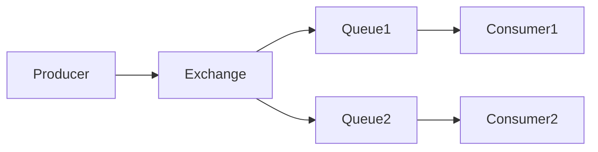

# RabbitMQ实战：构建可靠的异步消息系统

## 1. 背景介绍
### 1.1 异步消息系统的重要性
在现代软件系统中,各个组件和服务之间通常需要进行大量的通信和数据交换。同步通信会导致系统耦合度高,可扩展性差。异步消息系统应运而生,通过将消息发送者和接收者解耦,提高了系统的灵活性、可靠性和性能。
### 1.2 RabbitMQ的优势
RabbitMQ是一个开源的消息队列系统,基于AMQP(Advanced Message Queuing Protocol)协议。相比其他消息队列,RabbitMQ具有以下优势:

1. 可靠性:RabbitMQ支持消息持久化、消息确认等机制,保证消息不会丢失。
2. 灵活的路由:通过Exchange和Binding,实现了多样化的消息路由方式。  
3. 集群与高可用:RabbitMQ支持集群部署,通过镜像队列实现高可用。
4. 管理与监控:提供了管理界面和API,方便运维和监控。
5. 多语言支持:官方支持多种编程语言,社区生态活跃。

### 1.3 RabbitMQ的应用场景
RabbitMQ广泛应用于以下场景:

1. 系统解耦:将复杂系统拆分为独立的服务,通过消息传递协作。
2. 异步处理:将耗时操作异步化,提高系统响应速度。
3. 流量削峰:应对流量高峰,缓存并逐步处理消息。
4. 分布式事务:利用消息的事务机制,实现分布式事务。
5. 日志收集:将分散的日志通过消息汇总处理。

## 2. 核心概念与联系
### 2.1 Producer与Consumer
Producer是消息的发送者,负责将消息投递到RabbitMQ的Exchange。Consumer是消息的接收者,从Queue中获取消息并进行处理。多个Producer和Consumer可以同时与RabbitMQ交互。
### 2.2 Exchange与Queue
Exchange接收来自Producer的消息,并根据Binding将消息路由到对应的Queue。常见的Exchange类型有:

- Direct Exchange:根据消息的Routing Key精确匹配Queue。
- Fanout Exchange:广播消息到所有绑定的Queue。
- Topic Exchange:根据Routing Key的模式匹配Queue。
- Headers Exchange:根据消息的Header属性匹配Queue。

Queue是存储消息的缓冲区,Consumer从Queue中获取消息进行消费。
### 2.3 Binding
Binding定义了Exchange和Queue之间的关联关系,指定了消息的路由规则。不同类型的Exchange有不同的Binding规则。
### 2.4 消息流转流程
下图展示了RabbitMQ中消息的流转流程:



1. Producer将消息发送到Exchange。
2. Exchange根据Binding将消息路由到对应的Queue。
3. Consumer从Queue中获取消息并进行处理。

## 3. 核心算法原理具体操作步骤
### 3.1 消息的可靠投递
为了保证消息的可靠投递,RabbitMQ提供了以下机制:

1. 消息持久化:将消息存储到磁盘,即使服务器重启也不会丢失。
2. 发布确认:Producer在投递消息后等待RabbitMQ的确认,确保消息已被正确接收。
3. 消费确认:Consumer在处理完消息后向RabbitMQ发送ACK,确认消息已被正确消费。

具体操作步骤如下:

1. 创建持久化的Exchange和Queue。
2. Producer开启Confirm模式,投递消息并等待确认。
3. Consumer在处理完消息后发送ACK。
4. 对于失败的消息,可以重新投递或记录日志。

### 3.2 消息的分发策略
RabbitMQ支持多种消息分发策略,常见的有:

1. Round-robin:轮询分发,依次将消息发送给各个Consumer。
2. Fair dispatch:公平分发,根据Consumer的处理能力动态分配消息。
3. 消息优先级:为消息设置优先级,高优先级的消息优先分发。

具体操作步骤如下:

1. 为Queue设置合适的分发策略。
2. 对于Fair dispatch,需要将prefetch count设置为1。
3. 对于消息优先级,需要将Queue的x-max-priority参数设置为最大优先级。

### 3.3 消息的限流与削峰
为了防止Consumer被大量消息淹没,RabbitMQ提供了限流机制:

1. 设置prefetch count,限制每个Consumer同时处理的消息数量。
2. 使用QoS(Quality of Service)参数,控制Consumer的消费速率。

具体操作步骤如下:

1. 在Consumer端设置prefetch count。
2. 在Consumer端设置QoS参数,如auto-delete和expires。
3. 监控Consumer的处理能力,动态调整限流参数。

## 4. 数学模型和公式详细讲解举例说明
### 4.1 消息吞吐量估算
假设有$n$个Consumer,每个Consumer的处理能力为$c$条/秒,消息的平均大小为$s$字节,网络带宽为$b$字节/秒,则理论最大吞吐量$T$为:

$$T = \min(\frac{b}{s}, n \times c)$$

例如,有4个Consumer,每个Consumer的处理能力为1000条/秒,消息大小为1KB,网络带宽为100MB/s,则:

$$T = \min(\frac{100 \times 1024 \times 1024}{1 \times 1024}, 4 \times 1000) = 4000 (条/秒)$$

### 4.2 消息堆积估算
假设消息的到达率为$\lambda$条/秒,Consumer的处理能力为$\mu$条/秒,则根据排队论(Queueing Theory),消息的平均堆积量$L$为:

$$L = \frac{\lambda}{\mu - \lambda} \quad (\mu > \lambda)$$

例如,消息的到达率为5000条/秒,Consumer的处理能力为6000条/秒,则:

$$L = \frac{5000}{6000 - 5000} = 5000 (条)$$

## 5. 项目实践：代码实例和详细解释说明
下面以Java为例,演示如何使用RabbitMQ实现可靠的消息投递。
### 5.1 生产者(Producer)
```java
public class Producer {
    private final static String EXCHANGE_NAME = "my_exchange";
    private final static String ROUTING_KEY = "my_routing_key";

    public static void main(String[] args) throws Exception {
        ConnectionFactory factory = new ConnectionFactory();
        factory.setHost("localhost");
        try (Connection connection = factory.newConnection();
             Channel channel = connection.createChannel()) {
            channel.exchangeDeclare(EXCHANGE_NAME, BuiltinExchangeType.DIRECT, true);
            
            // 开启发布确认
            channel.confirmSelect();
            
            String message = "Hello, RabbitMQ!";
            channel.basicPublish(EXCHANGE_NAME, ROUTING_KEY,
                    MessageProperties.PERSISTENT_TEXT_PLAIN,
                    message.getBytes());
            
            // 等待发布确认
            if (channel.waitForConfirms()) {
                System.out.println("消息发送成功");
            } else {
                System.out.println("消息发送失败");
            }
        }
    }
}
```

说明:

1. 创建连接和Channel。
2. 声明一个持久化的Direct Exchange。
3. 开启发布确认模式。
4. 发送持久化消息。
5. 等待发布确认,根据结果进行处理。

### 5.2 消费者(Consumer)
```java
public class Consumer {
    private final static String QUEUE_NAME = "my_queue";

    public static void main(String[] args) throws Exception {
        ConnectionFactory factory = new ConnectionFactory();
        factory.setHost("localhost");
        Connection connection = factory.newConnection();
        Channel channel = connection.createChannel();

        channel.queueDeclare(QUEUE_NAME, true, false, false, null);
        // 设置prefetch count为1
        channel.basicQos(1);

        DefaultConsumer consumer = new DefaultConsumer(channel) {
            @Override
            public void handleDelivery(String consumerTag, Envelope envelope, AMQP.BasicProperties properties, byte[] body) throws IOException {
                String message = new String(body, StandardCharsets.UTF_8);
                System.out.println("收到消息: " + message);
                
                // 模拟消息处理
                try {
                    Thread.sleep(1000);
                } catch (InterruptedException e) {
                    e.printStackTrace();
                }
                
                // 发送ACK
                channel.basicAck(envelope.getDeliveryTag(), false);
            }
        };

        // 开启消费
        channel.basicConsume(QUEUE_NAME, false, consumer);
    }
}
```

说明:

1. 创建连接和Channel。
2. 声明一个持久化的Queue。
3. 设置prefetch count为1,实现公平分发。
4. 定义Consumer,在handleDelivery方法中处理消息。
5. 处理完消息后发送ACK。
6. 开启消费,等待接收消息。

## 6. 实际应用场景
### 6.1 订单系统
在电商系统中,下单后需要进行一系列的处理,如减库存、生成发票、发送短信等。使用RabbitMQ可以将这些任务异步化,提高系统的响应速度和稳定性。

1. 下单后,将订单信息发送到RabbitMQ。
2. 库存服务从RabbitMQ获取消息,减少对应商品的库存。
3. 发票服务从RabbitMQ获取消息,生成电子发票。
4. 短信服务从RabbitMQ获取消息,发送订单确认短信。

### 6.2 日志收集
在分布式系统中,日志分散在各个服务器上,难以集中管理和分析。使用RabbitMQ可以将日志统一收集和处理。

1. 各个服务将日志发送到RabbitMQ。
2. 日志处理服务从RabbitMQ获取日志,进行解析和存储。
3. 日志分析服务从RabbitMQ获取日志,生成报表和图表。

### 6.3 秒杀系统
在秒杀活动中,短时间内会产生大量的请求,直接处理可能会导致系统崩溃。使用RabbitMQ可以缓存请求,平滑处理压力。

1. 用户请求秒杀商品,请求被发送到RabbitMQ。
2. 秒杀服务从RabbitMQ获取请求,判断库存和下单。
3. 库存不足的请求直接返回,减轻系统压力。

## 7. 工具和资源推荐
1. RabbitMQ官网:https://www.rabbitmq.com/
2. RabbitMQ Github:https://github.com/rabbitmq
3. RabbitMQ教程:https://www.rabbitmq.com/getstarted.html
4. RabbitMQ管理界面:http://localhost:15672/
5. RabbitMQ性能测试工具:https://github.com/rabbitmq/rabbitmq-perf-test
6. AMQP协议文档:https://www.amqp.org/resources/download

## 8. 总结：未来发展趋势与挑战
随着分布式系统的普及,异步消息系统已成为架构设计中不可或缺的一部分。RabbitMQ作为成熟的消息中间件,在可靠性、性能和易用性方面都有出色的表现。未来,RabbitMQ将在以下方面持续发展:

1. 云原生支持:提供更方便的部署和管理方式,适应云环境。
2. 多协议支持:除了AMQP,支持更多标准协议,如MQTT、STOMP等。
3. 消息流处理:结合流处理引擎,实现实时数据处理和分析。
4. 全球化支持:提供多地域部署和消息同步,支持全球化应用。

同时,RabbitMQ也面临着一些挑战:

1. 性能瓶颈:在超大规模场景下,如何进一步提升吞吐量和降低延迟。
2. 运维复杂:集群部署和管理相对复杂,需要专业的运维技能。
3. 数据一致性:在分布式环境下,如何保证消息的一致性和事务性。

相信通过社区的不断努力,RabbitMQ将会在未来的异步消息领域继续发挥重要作用。

## 9. 附录：常见问题与解答
### 9.1 RabbitMQ的集群模式有哪些?
RabbitMQ有三种集群模式:

1. 普通集群:各节点都有自己的队列和消息,不共享数据。
2. 镜像队列:将队列镜像到多个节点,提高可用性。
3. 联邦队列:跨集群共享队列,实现地域间的消息同步。

### 9.2 RabbitMQ如何保证消息的顺序性?
RabbitMQ本身不保